# 2.06 Cálculos aplicados à farmácia hospitalar

> **Eixo 2 — Farmacotécnica e Manipulação Hospitalar**

## Dados do edital e das provas

| Campo | Valor |
| :---- | :---- |
| Exigido em | 2013, 2017, 2023, 2024 |
| Nº de editais | 4 de 4 |
| Questões nas provas | 5 |
| Incidência | Alta incidência |

Exigido nos editais de 2013, 2017, 2023 e 2024 — 4 de 4 editais. Gerou 5 questões no conjunto das provas de 2013, 2017, 2023 e 2024.

Prioridade máxima: tópico de alta incidência, com presença recorrente nas provas. Vale dominar enunciados, exceções e números.

*Fonte dos números: planilha `QOS_PMMG_Analise_Estatistica`, aba «6. Cobertura do edital» (editais e provas de 2013, 2017, 2023 e 2024).*

## Resumo do tópico

Cálculo aplicado à farmácia hospitalar é aritmética de concentração, volume e tempo a serviço da dose certa. A banca não cobra álgebra abstrata: cobra conferir prescrição, reconstituição, diluição e dispensação para 24 horas, usando o que está na bula (volume de deslocamento do pó, estabilidade, velocidade máxima e concentração máxima).

O encadeamento é o do Ansel (*Pharmaceutical Calculations* / *Cálculos Farmacêuticos*):

1. ler a concentração no sistema certo (% p/v, mg/mL, UI/mL, razão 1:N);
2. achar o volume que contém a dose (incluindo o volume que o pó ocupa na reconstituição);
3. diluir até a concentração de administração, em uma ou mais etapas;
4. converter o gotejamento em volume de 24 h e em número de apresentações comerciais;
5. checar, em paralelo, tempo mínimo de infusão (mg/min) e concentração final (mg/mL).

As cinco questões do tópico ([#Q2023-26](../QOS_PMMG_Banco_de_Questoes.md#2023--q26--conhecimentos-específicos), [#Q2023-27](../QOS_PMMG_Banco_de_Questoes.md#2023--q27--conhecimentos-específicos), [#Q2024-25](../QOS_PMMG_Banco_de_Questoes.md#2024--q25--conhecimentos-específicos), [#Q2024-26](../QOS_PMMG_Banco_de_Questoes.md#2024--q26--conhecimentos-específicos), [#Q2024-34](../QOS_PMMG_Banco_de_Questoes.md#2024--q34--conhecimentos-específicos)) cobrem exatamente esses cinco passos. O [básico](#teoria-básica) continua sendo o mapa da prova; as transcrições do Ansel estão no [capítulo 6](#transcrição--ansel-13ª-ed-capítulo-6), no [capítulo 9](#transcrição--ansel-13ª-ed-capítulo-9-unidades-de-atividade-e-outras-medidas-de-potência), no [capítulo 13](#transcrição--ansel-13ª-ed-capítulo-13), no [capítulo 15](#transcrição--ansel-13ª-ed-capítulo-15) e no [capítulo 17](#transcrição--ansel-13ª-ed-capítulo-17-páginas-287309).

## Pontos-chave

- **Volume de deslocamento do pó.** Concentração = conteúdo do frasco ÷ volume *final*, não ÷ volume de diluente. Se a bula diz “reconstituir com 20 mL, volume final 23 mL”, metade da dose é 11,5 mL, não 10 mL. “Volume de soluto: 2 mL” + “diluente 10 mL” = 12 mL finais.
- **Diluição em série.** Fator total = produto dos fatores. 1:100 seguida de 1:2 = 1:200. Serve quando a alíquota direta do concentrado seria imensurável (alto erro percentual).
- **Gotejamento → volume de 24 h.** Use o fator do enunciado (na prova: 20 gotas = 1 mL). Arredonde *para cima* o número de bolsas/ampolas: fração de apresentação não se dispensa, e faltar volume interrompe a infusão antes de 24 h.
- **Dois limites independentes na infusão.** Velocidade (mg/min) e concentração (mg/mL) não se substituem. Vancomicina: ≤ 10 mg/min; ≤ 5 mg/mL em regra e até 10 mg/mL se restrição hídrica. Inclua o volume da reconstituição no denominador da concentração.
- **Estabilidade vem da bula, não do “bom senso”.** Refrigerado 48 h × ambiente 24 h muda o número de frascos e o plano de produção da dose unitária.
- **Pegadinha de apresentação combinada.** Piperacilina/tazobactam 4,5 g = 4,0 g + 0,5 g; a metade do frasco é 2,25 g (4,0 + 0,25), retirada como metade do volume reconstituído.
- A aritmética **não envelhece** entre edições do Ansel. O que muda é o número do capítulo e os fármacos dos exemplos. Números clínicos (concentração máxima, tempo de infusão, estabilidade, equivalência UI/mg) vêm da **bula vigente** e da farmacopeia vigente, não do livro de 2010.
- **Unidades de atividade não são intercambiáveis.** 1 unidade de penicilina ≠ 1 unidade de heparina ≠ 1 unidade de insulina. A relação UI ↔ mg é própria de cada produto (Tabela 9.1 do cap. 9). Na prova, a penicilina G entra em UI na mesma proporção que miligramas: UI dadas / UI por mL = mL.
- **Não escreva “U” nem “UI”.** O livro já alerta; no Brasil o Protocolo MS/ANVISA de 2013 *proíbe* as duas abreviaturas na lista institucional. Escreva “unidades” / “unidades internacionais”.

## Onde isso está no Ansel

Referência de estudo: ANSEL, H. C. *Pharmaceutical Calculations* (edição brasileira: *Cálculos Farmacêuticos*, Artmed/Grupo A). A numeração abaixo é a da 13ª edição em inglês (2010), que permanece reconhecível nas 15ª/16ª (*Stoklosa and Ansel's*). Se o seu exemplar for mais antigo, busque pelo *título da seção*, não pelo número.

| Assunto cobrado na prova | Seção do Ansel |
| :--- | :--- |
| % p/v, % v/v, % p/p; conversão para mg/mL; razão 1:N | Cap. 6 — [transcrito](#transcrição--ansel-13ª-ed-capítulo-6) |
| Penicilina em unidades internacionais | Cap. 9 — [transcrito](#transcrição--ansel-13ª-ed-capítulo-9-unidades-de-atividade-e-outras-medidas-de-potência) |
| Infusão IV, aditivos na bolsa, gotejamento (gotas/min, mL/min) | Cap. 13 — [transcrito](#transcrição--ansel-13ª-ed-capítulo-13) |
| Diluição, solução-estoque, Q₁C₁ = Q₂C₂ | Cap. 15 — [transcrito](#transcrição--ansel-13ª-ed-capítulo-15) |
| Constituição de pós secos; volume que o pó ocupa | Cap. 17 — [transcrito](#transcrição--ansel-13ª-ed-capítulo-17-páginas-287309) |

Método de resolução que o próprio Ansel recomenda no início do livro: (1) o que se pede, (2) o que se tem, (3) converter para a mesma unidade, (4) montar a proporção ou a análise dimensional, (5) conferir se a ordem de grandeza faz sentido.

## Teoria básica

### 1. Expressões de concentração

Três convenções da USP, usadas o tempo todo em bula e em prova:

| Expressão | Significado | Uso típico |
| :--- | :--- | :--- |
| **% p/v** (w/v) | gramas de soluto em 100 mL de preparação | soluções e suspensões de sólido em líquido; é o “%” default nesses casos |
| **% v/v** (v/v) | mililitros de soluto em 100 mL | líquido em líquido (álcool, glicerina) |
| **% p/p** (w/w) | gramas de soluto em 100 g | sólidos e semissólidos (pomadas) |

Conversão rápida, que a banca espera de cabeça:

- 1% p/v = 1 g/100 mL = **10 mg/mL**
- 0,9% p/v (SF) = 9 mg/mL de NaCl
- 10% p/v de KCl = 100 mg/mL
- 0,005% p/v = 0,05 mg/mL
- razão **1:N** p/v = 1 g em N mL; 1:100 = 1%; 1:200 = 0,5%

A vancomicina da prova traz o lembrete explícito: *p/v = concentração em peso/volume*. 5 mg/mL = 0,5% p/v; 10 mg/mL = 1% p/v.

### 2. Diluição: a quantidade de fármaco não muda

Se a quantidade de princípio ativo é constante, volume e concentração são inversamente proporcionais:

\[
Q_1 \times C_1 = Q_2 \times C_2
\]

Três jeitos equivalentes (Ansel, cap. 15): proporção inversa, a equação acima, ou “quanto de soluto existe → quanto de preparação isso rende”.

**Solução-estoque** é o concentrado do qual se tira uma alíquota para obter a diluição de uso. O fator de diluição é \(C_{\text{estoque}} / C_{\text{final}}\). Uma diluição **1:200** significa 1 parte de estoque em 200 partes de preparação final (1 + 199 de veículo, na prática hospitalar muitas vezes aproximada pelo volume total). Não confundir com a *razão de concentração* do § 1: lá, 1:200 p/v = 0,5%; aqui, 1:200 é quantas vezes o estoque foi diluído. A mesma notação, dois papéis — a prova de 2024 usa o segundo.

**Diluição em série** (duas ou mais etapas) quando o fator é grande e a alíquota direta cairia abaixo do volume mensurável com erro aceitável. O fator total é o *produto* dos fatores parciais:

\[
1{:}100 \;\text{depois}\; 1{:}2 \;=\; 1{:}200
\]

1:10 depois 1:2 = 1:20 (dez vezes mais concentrado do que 1:200). 1:100 sozinha deixa o produto duas vezes mais forte do que o pedido a 0,005% a partir de 1%.

#### Exemplo — azul de metileno 1% → 0,005% (formato da [#Q2024-25](../QOS_PMMG_Banco_de_Questoes.md#2024--q25--conhecimentos-específicos))

Estoque 1% p/v; deseja-se 20 mL a 0,005% p/v, fracionados em 2 mL.

Fator = 1 / 0,005 = **200** → diluição 1:200.

Alíquota direta: \(1 \times V_1 = 0{,}005 \times 20 \Rightarrow V_1 = 0{,}1\,\text{mL}\) do estoque — volume pequeno demais para pipetar com segurança. Por isso a banca pede etapa intermediária:

1. **1:100** → 0,01% (por exemplo 0,2 mL de 1% → 20 mL, ou 2 mL de ampola → 200 mL);
2. **1:2** dessa intermediária → 0,005%.

Gabarito: 1:100 seguida de 1:2. As alternativas 1:100, 1:50 e 1:10+1:2 deixam a solução 2×, 4× ou 10× mais concentrada.

### 3. Reconstituição e volume de deslocamento do pó

Pós para injeção (antibióticos, em especial) são reconstituídos na hora porque a forma líquida perde potência. O pó **ocupa volume**. Duas grandezas que a prova *não* deixa misturar:

| Grandeza | O que é |
| :--- | :--- |
| Volume de diluente | o que se *adiciona* (água bidestilada, SF 0,9%) |
| Volume de soluto / deslocamento | o que o pó *ocupa* depois de dissolvido |
| Volume final | diluente + deslocamento — é o denominador da concentração |

\[
C = \frac{\text{conteúdo do frasco}}{\text{volume final}} \qquad
V_{\text{dose}} = \frac{\text{dose prescrita}}{C}
\]

Quando o pó é pouco, o deslocamento é desprezível e diluente ≈ volume final. Quando a bula ou o enunciado informa o deslocamento, **ignorá-lo é o erro que a alternativa distratora foi escrita para cobrar**.

O Ansel (cap. 17, pós parenterais) usa exatamente penicilina G potássica 5.000.000 UI com ~2 mL de deslocamento, e piperacilina cujo pó “conta” 1 mL no volume final. São os mesmos fármacos da prova.

#### Exemplo — penicilina G 1.000.000 UI a partir do frasco de 5.000.000 UI ([#Q2023-27](../QOS_PMMG_Banco_de_Questoes.md#2023--q27--conhecimentos-específicos))

- Conteúdo: 5.000.000 UI
- Diluente: 10 mL de ABD
- Volume de soluto: 2 mL
- Volume final: 12 mL
- Concentração: \(5.000.000 / 12 = 416.667\,\text{UI/mL}\)
- Volume da dose de 1.000.000 UI: \(1.000.000 / 416.667 = \mathbf{2,4\,mL}\)

Distratores clássicos:

| Se você… | Obtém | Por quê está errado |
| :--- | :--- | :--- |
| divide 5.000.000 por 10 mL de diluente | 2,0 mL | ignora os 2 mL do pó |
| trata 5.000.000 UI como se estivessem só nos 2 mL de soluto | 0,4 mL | inverte o papel do diluente |
| administra o frasco inteiro | 10 mL | dose 5× maior |

Unidades internacionais (Ansel, cap. 9) entram na mesma proporção que miligramas: UI dadas / UI por mL = mL. A relação UI ↔ mg é própria de cada produto e vem da bula; não invente fator.

#### Exemplo — piperacilina/tazobactam em dose unitária para 24 h ([#Q2024-26](../QOS_PMMG_Banco_de_Questoes.md#2024--q26--conhecimentos-específicos))

Prescrição a cada 6 h → **4 doses/24 h**. Frasco Tazocin® 4,5 g (piperacilina 4,0 g + tazobactam 0,5 g). Bula: reconstituir com **20 mL**, volume final **23 mL** (deslocamento = 3 mL). Estabilidade: 24 h à temperatura ambiente ou **48 h refrigerado**.

A banca tomou a dose como **metade do frasco = 2,25 g** (piperacilina 2,0 g + tazobactam 0,25 g), retirada como metade do reconstituído:

- 2,25 g / 4,5 g × 23 mL = **11,5 mL** (não 10 mL)
- 4 doses × 2,25 g = 9 g → **2 frascos** de 4,5 g
- ABD: 20 mL/frasco × 2 = 40 mL → **4 ampolas** de 10 mL
- **4 frascos** de SF 0,9% 100 mL
- armazenar refrigerado até 48 h

Transferir 10 mL (“metade dos 20 mL de diluente”) subdosifica ~13%. Um único frasco não cobre 9 g. Reconstituir com 10 mL ignora a bula.

### 4. Infusão intravenosa: volume, gotas e 24 horas

Infusão contínua ou intermitente. O prescritor informa o fluxo em mL/h, gotas/min, mg/h ou duração da bolsa. Equação do gotejamento (Ansel, cap. 13):

\[
\text{gotas/min} = \frac{V_{\text{mL}} \times \text{fator do equipo (gotas/mL)}}{t_{\text{min}}}
\]

Equipos usuais: macrogotejamento 10, 15 ou **20 gotas/mL**; microgotejamento **60 gotas/mL**. Em prova, o fator vem no enunciado — na [#Q2023-26](../QOS_PMMG_Banco_de_Questoes.md#2023--q26--conhecimentos-específicos), “20 gotas equivalente a 1 mL”.

Caminho inverso, que é o da dispensação:

\[
\text{mL/min} = \frac{\text{gotas/min}}{\text{gotas/mL}} \qquad
V_{24\text{h}} = \text{mL/min} \times 60 \times 24
\]

Depois: quantas apresentações comerciais cabem nesse volume, **arredondando para cima**.

Aditivos (KCl, NaCl hipertônico, glicose 50%) entram no volume total da bolsa. A farmácia que dispensa de forma individualizada para 24 h calcula o consumo de *cada item* da fórmula, não só da bolsa-base.

#### Exemplo — reposição hidroeletrolítica a 40 gotas/min ([#Q2023-26](../QOS_PMMG_Banco_de_Questoes.md#2023--q26--conhecimentos-específicos))

Fórmula de uma preparação:

| Item | Apresentação | Volume na fórmula |
| :--- | :--- | :--- |
| 1 | SF 0,9% bolsa 500 mL | 400 mL |
| 2 | Glicose 50% amp. 20 mL | 40 mL |
| 3 | KCl 10% amp. 10 mL | 20 mL |
| 4 | NaCl 10% amp. 10 mL | 40 mL |
| | **Volume da preparação** | **500 mL** |

40 gotas/min ÷ 20 gotas/mL = **2 mL/min**.

Em 24 h: \(2 \times 60 \times 24 = 2880\,\text{mL}\).

Número de preparações: \(2880 / 500 = 5{,}76\) → **6** (cinco preparações dariam 2500 mL = 20 h 50 min).

Unidades a dispensar:

| Item | Por preparação | × 6 |
| :--- | :--- | :--- |
| Bolsa SF 500 mL | 1 (usa 400 mL) | **6** |
| Amp. glicose 20 mL | 40/20 = 2 | **12** |
| Amp. KCl 10 mL | 20/10 = 2 | **12** |
| Amp. NaCl 10% 10 mL | 40/10 = 4 | **24** |

Gabarito: 6, 12, 12, 24. A alternativa que replica a fórmula uma vez (1, 2, 2, 4) esquece as 24 h. As que usam 24 em tudo tratam “24 horas” como se fosse “24 unidades de cada item”.

O Protocolo de Segurança na Prescrição, Uso e Administração de Medicamentos (MS/ANVISA) pede conferência da dose e da quantidade dispensada para o período; o cálculo acima *é* essa conferência.

### 5. Velocidade de infusão × concentração de infusão

Dois parâmetros, duas contas, dois riscos:

| Parâmetro | Fórmula | Risco se estourar |
| :--- | :--- | :--- |
| Velocidade | dose (mg) ÷ tempo (min) | reação infusional (na vancomicina, síndrome do homem vermelho) |
| Concentração | dose (mg) ÷ volume *final* (mL) | flebite; em restrição hídrica, sobrecarga de volume se diluir demais |

Tempo mínimo = dose ÷ velocidade máxima.

Volume mínimo = dose ÷ concentração máxima. Volume *máximo* entra quando há restrição hídrica: usa-se a concentração mais alta ainda aceita pela bula.

O volume final inclui o que saiu da reconstituição, se ele for acrescentado à bolsa (e não desprezado). Omitir 50 mL de reconstituição em 200 mL de SF infla a concentração de 10 para 12,5 mg/mL e empurra a resposta para “trocar a diluição” — distrator da prova.

#### Exemplo — vancomicina 2,5 g, restrição hídrica ([#Q2024-34](../QOS_PMMG_Banco_de_Questoes.md#2024--q34--conhecimentos-específicos))

- 5 frascos de 500 mg = **2500 mg**
- Reconstituição: 10 mL ABD/frasco → 50 mL
- Diluição prescrita: esses 50 mL em 200 mL de SF 0,9% → volume final **250 mL**
- Infusão prescrita: 120 min
- Bula: máx. **10 mg/min**; máx. **5 mg/mL**, ou **10 mg/mL** se restrição hídrica (o caso)

Velocidade prescrita: \(2500 / 120 = 20{,}8\,\text{mg/min}\) → acima do teto. Tempo mínimo: \(2500 / 10 = \mathbf{250\,min}\).

Concentração: \(2500 / 250 = \mathbf{10\,mg/mL}\) → no teto permitido pela restrição hídrica. Diluir para 500 mL baixaria a concentração (melhor para flebite) mas contradiz a “máxima restrição hídrica”.

Gabarito: alterar o tempo para no mínimo 250 min; **manter** a diluição.

### 6. Roteiro único para qualquer questão desse tópico

1. **Unidades iguais.** g ↔ mg; % ↔ mg/mL; UI; gotas ↔ mL.
2. **O pó ocupa volume?** Se o enunciado deu deslocamento ou volume final, use-o.
3. **Quantas doses em 24 h?** 4/4 h = 6; 6/6 h = 4. Multiplique frascos, ampolas e bolsas; arredonde para cima.
4. **Diluição em uma ou duas etapas?** Se \(C_1/C_2\) for da ordem de 10², espere diluição intermediária; o fator total é o produto.
5. **Infusão:** calcule mg/min *e* mg/mL. Restrição hídrica empurra para a concentração mais alta ainda segura; ausência de restrição empurra para a mais diluída.
6. **Estabilidade.** Produzir 24 h de doses só é lícito se a bula cobrir o armazenamento (ex.: 48 h refrigerado).
7. **Teste de sanidade.** Volume de dose entre 0,4 e 10 mL para um frasco de 12 mL? Número de bolsas compatível com 2 mL/min × 24 h? Se a alternativa “redonda” (tudo 24, ou alíquota 10 mL em vez de 11,5 mL) ignorou um dado da bula, está errada.

## Transcrição — Ansel, 13ª ed., capítulo 6

> [!IMPORTANT]
> Transcrição *ipsis litteris* de **Ansel, *Pharmaceutical Calculations*, 13ª edição (2010),
> capítulo 6** (p. 81–101). Migrada em 05/09/2026 a partir do PDF enviado. O texto corrido
> não foi traduzido nem atualizado; apenas a quebra de linha do PDF foi recomposta em
> parágrafos Markdown, os títulos viraram cabeçalhos, as prescrições e as contas foram
> remontadas (o OCR misturava `=`, `×` e `÷`) e a lista de *Practice Problems* foi
> recomposta a partir do layout em duas colunas. Figuras do original não foram transcritas.
>
> Texto em **inglês**, como no PDF. A atualização (notas, bula, prova) fica no
> [básico](#teoria-básica), não aqui.

**Fonte:** ANSEL, Howard C. *Pharmaceutical Calculations*. 13. ed. Philadelphia: Lippincott
Williams & Wilkins, 2010. Capítulo 6 — Percentage, Ratio Strength, and Other Expressions of
Concentration, p. 81–101.

### Sumário do capítulo 6

- [Objectives](#objectives)
- [Percentage](#percentage)
- [Percentage Preparations](#percentage-preparations)
- [Special Considerations in Percentage Calculations](#special-considerations-in-percentage-calculations)
- [Percentage Weight-in-Volume](#percentage-weight-in-volume)
- [Percentage Volume-in-Volume](#percentage-volume-in-volume)
- [Percentage Weight-in-Weight](#percentage-weight-in-weight)
- [Use of Percent in Compendial Standards](#use-of-percent-in-compendial-standards)
- [Calculations Capsule — Percentage Concentration](#calculations-capsule--percentage-concentration)
- [Case in Point 6.1](#case-in-point-61)
- [Case in Point 6.2](#case-in-point-62)
- [Ratio Strength](#ratio-strength)
- [Simple Conversions of Concentration to mg/mL](#simple-conversions-of-concentration-to-mgml)
- [Milligrams Percent](#milligrams-percent)
- [Parts per Million (PPM) and Parts per Billion (PPB)](#parts-per-million-ppm-and-parts-per-billion-ppb)
- [Practice Problems](#practice-problems)
- [Answers to Case in Point and Practice Problems](#answers-to-case-in-point-and-practice-problems)
- [References (capítulo 6)](#references-capítulo-6)

---

### 6 Percentage, Ratio Strength, and Other Expressions of Concentration

#### Objectives

Upon successful completion of this chapter, the student will be able to:

- Define the expressions percent weight-in-volume, percent volume-in-volume, and percent weight-in-weight.
- Define the expression ratio strength.
- Convert percent strength to ratio strength and ratio strength to percent strength.
- Calculate the percentage strength and ratio strength of a pharmaceutical preparation.
- Apply percent strength and ratio strength to calculate the quantity of an ingredient present in a pharmaceutical preparation.
- Apply percent strength and ratio strength to calculate the quantity of an ingredient to use in compounding a pharmaceutical preparation.

#### Percentage

The term percent and its corresponding sign (%) mean “by the hundred” or “in a hundred,” and percentage means “rate per hundred”; so 50 percent (or 50%) and a percentage of 50 are equivalent expressions. A percent may also be expressed as a ratio, represented as a common or decimal fraction. For example, 50% means 50 parts in 100 of the same kind, and may be expressed as 50/100 or 0.50. Percent, therefore, is simply another fraction of such frequent and familiar use that its numerator is expressed but its denominator is left understood. It should be noted that percent is always an abstract quantity and that, as such, it may be applied to anything.

For the purposes of computation, percents are usually changed to equivalent decimal fractions. This change is made by dropping the percent sign (%) and dividing the expressed numerator by 100. Thus, 12.5% = 12.5/100, or 0.125; and 0.05% = 0.05/100, or 0.0005. We must not forget that in the reverse process (changing a decimal to a percent), the decimal is multiplied by 100 and the percent sign (%) is affixed.

Percentage is an essential part of pharmaceutical calculations. The pharmacist encounters it frequently and uses it as a convenient means of expressing the concentration of an active or inactive material in a pharmaceutical preparation.

#### Percentage Preparations

The percentage concentrations of active and inactive constituents in various types of pharmaceutical preparations are defined as follows by the United States Pharmacopeia¹:

**Percent weight-in-volume (w/v)** expresses the number of grams of a constituent in 100 mL of solution or liquid preparation and is used regardless of whether water or another liquid is the solvent or vehicle. Expressed as: % w/v.

**Percent volume-in-volume (v/v)** expresses the number of milliliters of a constituent in 100 mL of solution or liquid preparation. Expressed as: % v/v.

**Percent weight-in-weight (w/w)** expresses the number of grams of a constituent in 100 g of solution or preparation. Expressed as: % w/w.

The term percent, or the symbol %, when used without qualification means:

- for solutions or suspensions of solids in liquids, percent weight-in-volume;
- for solutions of liquids in liquids, percent volume-in-volume;
- for mixtures of solids or semisolids, percent weight-in-weight; and
- for solutions of gases in liquids, percent weight-in-volume.

#### Special Considerations in Percentage Calculations

In general, the nature of the ingredients in a pharmaceutical preparation determines the basis of the calculation. That is, a powdered substance dissolved or suspended in a liquid vehicle would generally be calculated on a weight-in-volume basis; and a powdered substance mixed with a solid or semisolid, such as an ointment base, would generally be calculated on a weight-in-weight basis; and, a liquid component in a liquid preparation would be calculated on a volume-in-volume basis. Based on these considerations, if the designation of the term of a calculation (e.g., w/v, w/w, or v/v) is not included in a problem, the appropriate assumption must be made. Table 6.1 presents examples of the usual basis for calculations of concentration for some dosage forms.

In most instances, use of percentage concentrations in the manufacture and labeling of pharmaceutical preparations is restricted to instances in which the dose of the active therapeutic ingredient (ATI) is not specific. For example, the ATIs in ointments, lotions, external solutions, and similar products may commonly be expressed in percent strength (e.g., a 1% hydrocortisone ointment). However, in most dosage forms, such as tablets, capsules, injections, oral solutions, and syrups, among others, the amounts of ATIs are expressed in definitive units of measure, such as milligrams per capsule, milligrams per milliliter, or other terms. On the other hand, in many pharmaceutical formulations, pharmaceutical components such as flavoring agents, solvents, excipients, preservatives, and so on, may be expressed in terms of their percentage concentration.

Specific gravity may be a factor in a number of calculations involving percentage concentration. Many formulations are presented on the basis of weight, even though some of the ingredients are liquids. Depending on the desired method of measurement, it may be necessary to convert weight to liquid or, in some instances, vice versa. Thus, the student should recall the equations from the previous chapter, namely:

\[
\mathrm{g} = \mathrm{mL} \times \mathrm{sp\ gr}
\]

\[
\mathrm{mL} = \frac{\mathrm{g}}{\mathrm{sp\ gr}}
\]

**TABLE 6.1** EXAMPLES OF PHARMACEUTICAL DOSAGE FORMS IN WHICH THE ACTIVE INGREDIENT IS OFTEN CALCULATED AND EXPRESSED ON A PERCENTAGE BASIS

| PERCENTAGE BASIS | EXAMPLES OF APPLICABLE DOSAGE FORMS |
| :--- | :--- |
| Weight-in-volume | Solutions (e.g., ophthalmic, nasal, otic, topical, large-volume parenterals), and lotions |
| Volume-in-volume | Aromatic waters, topical solutions, and emulsions |
| Weight-in-weight | Ointments, creams, and gels |

#### Percentage Weight-in-Volume

In a true expression of percentage (i.e., parts per 100 parts), the percentage of a liquid preparation (e.g., solution, suspension, lotion) would represent the grams of solute or constituent in 100 g of the liquid preparation. However, in practice, the pharmacist most frequently uses a different definition of percentage for solutions and for other liquid preparations, one in which the parts of the percentage represent grams of a solute or constituent in 100 mL of solution or liquid preparation.

Indeed, in weight-in-volume expressions, the “correct” strength of a 1% (w/v) solution or other liquid preparation is defined as containing 1 g of constituent in 100 mL of product. This variance to the definition of true percentage is based on an assumption that the solution/liquid preparation has a specific gravity of 1, as if it were water. It is on this assumption that each 100 mL of solution/liquid preparation is presumed to weigh 100 g and thus is used as the basis for calculating percentage weight-in-volume (e.g., 1% w/v = 1% of [100 mL taken to be] 100 g = 1 g in 100 mL).

Taking water to represent any solvent or vehicle, we may prepare weight-in-volume percentage solutions or liquid preparations by the SI metric system if we use the following rule.

Multiply the required number of milliliters by the percentage strength, expressed as a decimal, to obtain the number of grams of solute or constituent in the solution or liquid preparation. The volume, in milliliters, represents the weight in grams of the solution or liquid preparation as if it were pure water.

\[
\text{Volume (mL, representing grams)} \times \% \text{ (expressed as a decimal)} = \text{grams (g) of solute or constituent}
\]

##### Examples of Weight-in-Volume Calculations

How many grams of dextrose are required to prepare 4000 mL of a 5% solution?

4000 mL represents 4000 g of solution

5% = 0.05

4000 g × 0.05 = 200 g, answer.

Or, solving by dimensional analysis:

(5 g / 100 mL) × 4000 mL = 200 g, answer.

How many grams of potassium permanganate should be used in compounding the following prescription?

```
℞  Potassium Permanganate     0.02%
   Purified Water ad          250 mL
   Sig. as directed.
```

250 mL represents 250 g of solution

0.02% = 0.0002

250 g × 0.0002 = 0.05 g, answer.

How many grams of aminobenzoic acid should be used in preparing 8 fluidounces of a 5% solution in 70% alcohol?

8 fl. oz. = 8 × 29.57 mL = 236.56 mL

236.56 mL represents 236.56 g of solution

5% = 0.05

236.56 g × 0.05 = 11.83 g, answer.

To calculate the percentage weight-in-volume of a solution or liquid preparation, given the weight of the solute or constituent and the volume of the solution or liquid preparation, it should be remembered that the volume, in milliliters, of the solution represents the weight, in grams, of the solution or liquid preparation as if it were pure water.

What is the percentage strength (w/v) of a solution of urea, if 80 mL contains 12 g?

80 mL of water weighs 80 g

\[
\frac{80\ \mathrm{g}}{12\ \mathrm{g}} = \frac{100\%}{x\%} \quad \Rightarrow \quad x = 15\%,\ \text{answer.}
\]

Calculating the volume of a solution or liquid preparation, given its percentage strength weight-in-volume and the weight of the solute or constituent, involves the following:

How many milliliters of a 3% solution can be made from 27 g of ephedrine sulfate?

\[
\frac{3\%}{100\%} = \frac{27\ \mathrm{g}}{x\ \mathrm{g}} \quad \Rightarrow \quad x = 900\ \mathrm{g},\ \text{weight of the solution if it were water}
\]

Volume (in mL) = 900 mL, answer.

#### Percentage Volume-in-Volume

Liquids are usually measured by volume, and the percentage strength indicates the number of parts by volume of an ingredient contained in the total volume of the solution or liquid preparation considered as 100 parts by volume. If there is any possibility of misinterpretation, this kind of percentage should be specified: e.g., 10% v/v.

##### Examples of Volume-in-Volume Calculations

How many milliliters of liquefied phenol should be used in compounding the following prescription?

```
℞  Liquefied Phenol           2.5%
   Calamine Lotion ad         240 mL
   Sig. For external use.
```

Volume (mL) × % (expressed as a decimal) = milliliters of active ingredient

240 mL × 0.025 = 6 mL, answer.

Or, solving by dimensional analysis:

(2.5 mL / 100 mL) × 240 mL = 6 mL, answer.

In preparing 250 mL of a certain lotion, a pharmacist used 4 mL of liquefied phenol. What was the percentage (v/v) of liquefied phenol in the lotion?

\[
\frac{250\ \mathrm{mL}}{4\ \mathrm{mL}} = \frac{100\%}{x\%} \quad \Rightarrow \quad x = 1.6\%,\ \text{answer.}
\]

What is the percentage strength v/v of a solution of 800 g of a liquid with a specific gravity of 0.800 in enough water to make 4000 mL?

800 g of water measures 800 mL

800 mL ÷ 0.800 = 1000 mL of active ingredient

\[
\frac{4000\ \mathrm{mL}}{1000\ \mathrm{mL}} = \frac{100\%}{x\%} \quad \Rightarrow \quad x = 25\%,\ \text{answer.}
\]

Or, solving by dimensional analysis:

(800 mL / 0.800) × (1 / 4000 mL) × 100% = 25%, answer.

The volume of a solution or liquid preparation, given the volume of the active ingredient and its percentage strength (v/v), may require first determining the volume of the active ingredient from its weight and specific gravity.

Peppermint spirit contains 10% v/v of peppermint oil. What volume of the spirit will contain 75 mL of peppermint oil?

\[
\frac{10\%}{100\%} = \frac{75\ \mathrm{mL}}{x\ \mathrm{mL}} \quad \Rightarrow \quad x = 750\ \mathrm{mL},\ \text{answer.}
\]

If a veterinary liniment contains 30% v/v of dimethyl sulfoxide, how many milliliters of the liniment can be prepared from 1 lb of dimethyl sulfoxide (sp gr 1.10)?

1 lb = 454 g

454 g of water measures 454 mL

454 mL ÷ 1.10 = 412.7 mL of dimethyl sulfoxide

\[
\frac{30\%}{100\%} = \frac{412.7\ \mathrm{mL}}{x\ \mathrm{mL}} \quad \Rightarrow \quad x = 1375.7\ \text{or}\ 1376\ \mathrm{mL},\ \text{answer.}
\]

#### Percentage Weight-in-Weight

Percentage weight-in-weight (true percentage or percentage by weight) indicates the number of parts by weight of active ingredient contained in the total weight of the solution or mixture considered as 100 parts by weight.

##### Examples of Weight-in-Weight Calculations

How many grams of phenol should be used to prepare 240 g of a 5% (w/w) solution in water?

Weight of solution (g) × % (expressed as a decimal) = g of solute

240 g × 0.05 = 12 g, answer.

How many grams of a drug substance are required to make 120 mL of a 20% (w/w) solution having a specific gravity of 1.15?

120 mL of water weighs 120 g

120 g × 1.15 = 138 g, weight of 120 mL of solution

138 g × 0.20 = 27.6 g plus enough water to make 120 mL, answer.

Sometimes in a weight-in-weight calculation, the weight of one component is known but not the total weight of the intended preparation. This type of calculation is performed as demonstrated by the following example.

How many grams of a drug substance should be added to 240 mL of water to make a 4% (w/w) solution?

100% − 4% = 96% (by weight) of water

240 mL of water weighs 240 g

\[
\frac{96\%}{4\%} = \frac{240\ \mathrm{g}}{x\ \mathrm{g}} \quad \Rightarrow \quad x = 10\ \mathrm{g},\ \text{answer.}
\]

It is usually impossible to prepare a specified volume of a solution or liquid preparation of given weight-in-weight percentage strength because the volume displaced by the active ingredient cannot be known in advance. If an excess is acceptable, we may make a volume somewhat more than that specified by taking the given volume to refer to the solvent or vehicle and from this quantity calculating the weight of the solvent or vehicle (the specific gravity of the solvent or vehicle must be known). Using this weight, we may follow the method just described to calculate the corresponding weight of the active ingredient needed.

How should you prepare 100 mL of a 2% (w/w) solution of a drug substance in a solvent having a specific gravity of 1.25?

100 mL of water weighs 100 g

100 g × 1.25 = 125 g, weight of 100 mL of solvent

100% − 2% = 98% (by weight) of solvent

\[
\frac{98\%}{2\%} = \frac{125\ \mathrm{g}}{x\ \mathrm{g}} \quad \Rightarrow \quad x = 2.55\ \mathrm{g}
\]

Therefore, dissolve 2.55 g of drug substance in 125 g (or 100 mL) of solvent, answer.

##### Calculating Percentage Strength Weight-in-Weight

If the weight of the finished solution or liquid preparation is not given when calculating its percentage strength, other data must be supplied from which it may be calculated: the weights of both ingredients, for instance, or the volume and specific gravity of the solution or liquid preparation.

If 1500 g of a solution contains 75 g of a drug substance, what is the percentage strength (w/w) of the solution?

\[
\frac{1500\ \mathrm{g}}{75\ \mathrm{g}} = \frac{100\%}{x\%} \quad \Rightarrow \quad x = 5\%,\ \text{answer.}
\]

Or, solving by dimensional analysis:

(75 g / 1500 g) × 100% = 5%, answer.

If 5 g of boric acid is added to 100 mL of water, what is the percentage strength (w/w) of the solution?

100 mL of water weighs 100 g

100 g + 5 g = 105 g, weight of solution

\[
\frac{105\ \mathrm{g}}{5\ \mathrm{g}} = \frac{100\%}{x\%} \quad \Rightarrow \quad x = 4.76\%,\ \text{answer.}
\]

If 1000 mL of syrup with a specific gravity of 1.313 contains 850 g of sucrose, what is its percentage strength (w/w)?

1000 mL of water weighs 1000 g

1000 g × 1.313 = 1313 g, weight of 1000 mL of syrup

\[
\frac{1313\ \mathrm{g}}{850\ \mathrm{g}} = \frac{100\%}{x\%} \quad \Rightarrow \quad x = 64.7\%,\ \text{answer.}
\]

##### Weight-in-Weight Calculations in Compounding

Weight-in-weight calculations are used in the following types of manufacturing and compounding problems.

What weight of a 5% (w/w) solution can be prepared from 2 g of active ingredient?

\[
\frac{5\%}{100\%} = \frac{2\ \mathrm{g}}{x\ \mathrm{g}} \quad \Rightarrow \quad x = 40\ \mathrm{g},\ \text{answer.}
\]

How many milligrams of hydrocortisone should be used in compounding the following prescription?

```
℞  Hydrocortisone             1/8%
   Hydrophilic Ointment ad    10 g
   Sig. Apply.
```

1/8% = 0.125%

10 g × 0.00125 = 0.0125 g or 12.5 mg, answer.

How many grams of benzocaine should be used in compounding the following prescription?

```
℞  Benzocaine                 2%
   Polyethylene Glycol Base ad  2
   Make 24 such suppositories
   Sig. Insert one as directed.
```

2 g × 24 = 48 g, total weight of mixture

48 g × 0.02 = 0.96 g, answer.

Or, solving by dimensional analysis:

24 supp. × (2 g / 1 supp.) × (2% / 100%) = 0.96 g, answer.

#### Use of Percent in Compendial Standards

Percent is used in the United States Pharmacopeia to express the degree of tolerance permitted in the purity of single-chemical entities and in the labeled quantities of ingredients in dosage forms. For instance, according to the United States Pharmacopeia,² “Aspirin contains not less than 99.5% and not more than 100.5% of C₉H₈O₄ (pure chemical aspirin) calculated on the dried basis.” Further, “Aspirin Tablets contain not less than 90.0% and not more than 110.0% of the labeled amount of C₉H₈O₄.” Although dosage forms are formulated with the intent to provide 100% of the quantity of each ingredient declared on the label, some tolerance is permitted to allow for analytic error, unavoidable variations in manufacturing and compounding, and for deterioration to an extent considered insignificant under practical conditions.

The following problem demonstrates calculations involving percent in compendial standards.

If ibuprofen tablets are permitted to contain not less than 90% and not more than 110% of the labeled amount of ibuprofen, what would be the permissible range in content of the drug, expressed in milligrams, for ibuprofen tablets labeled 200 mg each?

90% of 200 mg = 180 mg

110% of 200 mg = 220 mg

Range = 180 mg to 220 mg, answer.

#### CALCULATIONS CAPSULE — Percentage Concentration

The amounts of therapeutically active and/or inactive ingredients in certain types of pharmaceutical preparations are expressed in terms of their percentage concentrations.

Unless otherwise indicated:

**(a)** Liquid components in liquid preparations have volume-in-volume relationships with calculations following the equation:

mL of preparation × % concentration<sup>a</sup> = mL of component

**(b)** Solid components in liquid preparations have weight-in-volume relationships with calculations following the equation:

mL of preparation × % concentration<sup>a</sup> = g of component

The terms of this equation are valid due to the assumption that the specific gravity of the preparation is 1, as if it were water, and thus each milliliter represents the weight of one gram.

**(c)** Solid or semisolid components in solid or semisolid preparations have weight-in-weight relationships with calculations following the equation:

g of preparation × % concentration<sup>a</sup> = g of component

<sup>a</sup> In these equations, “% concentration” is expressed decimally (e.g., 0.05, not 5%).

#### CASE IN POINT 6.1

A patient with myasthenia gravis has undergone treatment to separate and remove certain abnormal antibodies and other unwanted elements from the blood (plasmapheresis). The desired red blood cell component is then returned back to the blood, but the patient has lost protein and blood volume.

The patient’s physician orders 2000 mL of a 5% w/v solution of albumin in 0.9% w/v sodium chloride injection to replace lost protein and fluid.

In filling the order, the pharmacist decides to use a piece of automated equipment to compound the mixture. The equipment must be programmed with the specific gravities of the solutions being mixed. The pharmacist selects to use a 25% w/v albumin solution as the source of the albumin plus a 0.9% sodium chloride injection.

From the literature, the pharmacist finds that 0.9% sodium chloride has a specific gravity of 1.05. Using a precise 25-mL pycnometer with a tare weight of 28 g, the pharmacist fills it with the 25% w/v albumin solution and determines the weight of the flask and its content to be 58 g.

(a) What is the specific gravity of the albumin solution?

(b) How many milliliters of the 25% w/v albumin solution are needed to make 2000 mL containing 5% w/v albumin?

(c) What is the weight of the 25% albumin solution needed to fill the order?

(d) If the pharmacist mixed the required number of milliliters of the 25% albumin solution with a sufficient 0.9% w/v sodium chloride injection to make the required 2000 mL mixture, what would be the specific gravity of the resultant solution?

#### CASE IN POINT 6.2

A pharmacist receives the following prescription but does not have hydrocortisone powder on hand. However, the pharmacist does have an injection containing 100 mg of hydrocortisone per milliliter of injection. A search of the literature indicates that the injection has a specific gravity of 1.5.

```
℞  Hydrocortisone             1.5%
   Cold Cream qs              30 g
```

(a) How many grams of hydrocortisone are needed to fill the prescription?

(b) How many milliliters of the hydrocortisone injection would provide the correct amount of hydrocortisone?

(c) How many grams of cold cream are required?

#### Ratio Strength

The concentrations of weak solutions are frequently expressed in terms of ratio strength. Because all percentages are a ratio of parts per hundred, ratio strength is merely another way of expressing the percentage strength of solutions or liquid preparations (and, less frequently, of mixtures of solids). For example, 5% means 5 parts per 100 or 5:100. Although 5 parts per 100 designates a ratio strength, it is customary to translate this designation into a ratio, the first figure of which is 1; thus, 5:100 = 1:20.

When a ratio strength, for example, 1:1000, is used to designate a concentration, it is to be interpreted as follows:

- For solids in liquids = 1 g of solute or constituent in 1000 mL of solution or liquid preparation.
- For liquids in liquids = 1 mL of constituent in 1000 mL of solution or liquid preparation.
- For solids in solids = 1 g of constituent in 1000 g of mixture.

The ratio and percentage strengths of any solution or mixture of solids are proportional, and either is easily converted to the other by the use of proportion.

##### Example Calculations Using Ratio Strength

Express 0.02% as a ratio strength.

\[
\frac{0.02\%}{100\%} = \frac{1\ \mathrm{part}}{x\ \mathrm{parts}} \quad \Rightarrow \quad x = 5000
\]

Ratio strength = 1:5000, answer.

Express 1:4000 as a percentage strength.

\[
\frac{4000\ \mathrm{parts}}{1\ \mathrm{part}} = \frac{100\%}{x\%} \quad \Rightarrow \quad x = 0.025\%,\ \text{answer.}
\]

Note: To change ratio strength to percentage strength, it is sometimes convenient to “convert” the last two zeros in a ratio strength to a percent sign (%) and change the remaining ratio first to a common fraction and then to a decimal fraction in expressing percent:

| Ratio | Shortcut | Percent |
| :--- | :--- | :--- |
| 1:100 | 1/1 % | 1% |
| 1:200 | 1/2 % | 0.5% |
| 3:500 | 3/5 % | 0.6% |
| 1:2500 | 1/25 % | 0.04% |
| 1:10,000 | 1/100 % | 0.01% |

Calculating the ratio strength of a solution or liquid preparation, given the weight of solute or constituent in a specified volume of solution or liquid preparation involves the following.

A certain injectable contains 2 mg of a drug per milliliter of solution. What is the ratio strength (w/v) of the solution?

2 mg = 0.002 g

\[
\frac{0.002\ \mathrm{g}}{1\ \mathrm{g}} = \frac{1\ \mathrm{mL}}{x\ \mathrm{mL}} \quad \Rightarrow \quad x = 500\ \mathrm{mL}
\]

Ratio strength = 1:500, answer.

What is the ratio strength (w/v) of a solution made by dissolving five tablets, each containing 2.25 g of sodium chloride, in enough water to make 1800 mL?

2.25 g × 5 = 11.25 g of sodium chloride

\[
\frac{11.25\ \mathrm{g}}{1\ \mathrm{g}} = \frac{1800\ \mathrm{mL}}{x\ \mathrm{mL}} \quad \Rightarrow \quad x = 160\ \mathrm{mL}
\]

Ratio strength = 1:160, answer.

In solving problems in which the calculations are based on ratio strength, it is sometimes convenient to translate the problem into one based on percentage strength and to solve it according to the rules and methods discussed under percentage preparations.

How many grams of potassium permanganate should be used in preparing 500 mL of a 1:2500 solution?

1:2500 = 0.04%

500 g × 0.0004 = 0.2 g, answer.

Or,

1:2500 means 1 g in 2500 mL of solution

\[
\frac{2500\ \mathrm{mL}}{500\ \mathrm{mL}} = \frac{1\ \mathrm{g}}{x\ \mathrm{g}} \quad \Rightarrow \quad x = 0.2\ \mathrm{g},\ \text{answer.}
\]

How many milligrams of gentian violet should be used in preparing the following solution?

```
℞  Gentian Violet Solution    500 mL
   1:10,000
   Sig. Instill as directed.
```

1:10,000 = 0.01%

500 g × 0.0001 = 0.050 g or 50 mg, answer.

How many milligrams of hexachlorophene should be used in compounding the following prescription?

```
℞  Hexachlorophene            1:400
   Hydrophilic Ointment ad    10 g
   Sig. Apply.
```

1:400 = 0.25%

10 g × 0.0025 = 0.025 g or 25 mg, answer.

#### CALCULATIONS CAPSULE — Ratio Strength

The concentrations of very weak pharmaceutical preparations (usually weight-in-volume solutions) often are expressed in terms of their ratio strengths.

Ratio strength is another way of expressing percentage strength. For example, a 1% w/v solution and a ratio strength of 1:100 w/v are equivalent.

The preferable style of a ratio strength is to have the numeric value of the solute as 1. This is accomplished when calculating a ratio strength, by setting up a proportion from the data as:

g (given solute) / mL (given solution) = 1 / x; then, 1:value of x, answer.

In using a ratio strength in a calculations problem, there are two options: (a) convert it to a percentage strength and perform calculations in the usual manner, or (b) use the ratio strength directly in a problem-solving proportion.

**(a)** To convert a ratio strength to a percentage strength; for example, 1:10,000 w/v:

(1 g / 10,000 mL) = (x g / 100 mL)

Solving for x yields percent, by definition (parts per hundred).

**(b)** Problem-solving proportion, for example:

(1 g / 10,000 mL) = (x g / given quantity, mL); x = g in given mL

#### Simple Conversions of Concentration to mg/mL

Occasionally, pharmacists, particularly those practicing in patient care settings, need to convert rapidly product concentrations expressed as percentage strength, ratio strength, or as grams per liter (as in IV infusions) to milligrams per milliliter (mg/mL). These conversions may be made quickly by using simple techniques. Some suggestions follow.

To convert product percentage strengths to mg/mL, multiply the percentage strength, expressed as a whole number, by 10.

Example: Convert 4% (w/v) to mg/mL.

4 × 10 = 40 mg/mL, answer.

Proof or alternate method: 4% (w/v) = 4 g/100 mL = 4000 mg/100 mL = 40 mg/mL

To convert product ratio strengths to mg/mL, divide the ratio strength by 1000.

Example: Convert 1:10,000 (w/v) to mg/mL.

10,000 ÷ 1000 = 1 mg/10 mL, answer.

Proof or alternate method: 1:10,000 (w/v) = 1 g/10,000 mL = 1000 mg/10,000 mL = 1 mg/10 mL

To convert product strengths expressed as grams per liter (g/L) to mg/mL, convert the numerator to milligrams and divide by the number of milliliters in the denominator.

Example: Convert a product concentration of 1 g per 250 mL to mg/mL.

1000 ÷ 250 = 4 mg/mL, answer.

Proof or alternate method: 1 g/250 mL = 1000 mg/250 mL = 4 mg/mL

#### Milligrams Percent

The term milligrams percent (mg%) expresses the number of milligrams of substance in 100 mL of liquid. It is used frequently to denote the concentration of a drug or natural substance in a biologic fluid, as in the blood. Thus, the statement that the concentration of nonprotein nitrogen in the blood is 30 mg% means that each 100 mL of blood contains 30 mg of nonprotein nitrogen. As discussed in Chapter 10, quantities of substances present in biologic fluids also commonly are stated in terms of milligrams per deciliter (mg/dL) of fluid.

#### Parts per Million (PPM) and Parts per Billion (PPB)

The strengths of very dilute solutions are commonly expressed in terms of parts per million (ppm) or parts per billion (ppb), i.e., the number of parts of the agent per 1 million or 1 billion parts of the whole. For example, we are all familiar with fluoridated drinking water in which fluoride has been added at levels of between 1 to 4 parts per million (1:1,000,000 to 4:1,000,000) for the purpose of reducing dental caries.

We also are aware of and concerned with the presence of trace amounts of contaminants in our drinking water and food which can pose a risk to our health and safety. Many persons have food allergies, immune system disorders, and other conditions that render them more at risk than the general population. Potential contaminants include micro-organisms, inorganic and organic chemical contaminants (some arising from the careless disposal of prescribed and over-the-counter medications, e.g., flushing), pesticides and herbicides, and radioactive compounds.

Many pharmacists serve on community committees and boards which address environmental issues. Although they may not refer to themselves as environmental pharmacists, their backgrounds and interest in public health make them invaluable members of such bodies. Among the concerns are the levels of contaminants found in sources of drinking water and how those levels compare with the standards set by the United States Environmental Protection Agency (EPA). The EPA has established maximum contaminant levels (MCLs) which quantify the highest level of a contaminant that is allowed in drinking water below which there is no known or expected risk to a person’s health or safety. Such levels are established for copper, lead, fluoride, chlorine, total organic compounds, and other trace constituents. These levels generally are expressed either in parts per million or parts per billion.

##### Example Calculations of Parts per Million and Parts per Billion

Express 5 ppm of iron in water in percentage strength and ratio strength.

5 ppm = 5 parts in 1,000,000 parts = 1:200,000, ratio strength, and

= 0.0005%, percentage strength, answers.

The concentration of a drug additive in an animal feed is 12.5 ppm. How many milligrams of the drug should be used in preparing 5.2 kg of feed?

12.5 ppm = 12.5 g (drug) in 1,000,000 g (feed)

\[
\frac{1{,}000{,}000\ \mathrm{g}}{12.5\ \mathrm{g}} = \frac{5{,}200\ \mathrm{g}}{x\ \mathrm{g}} \quad \Rightarrow \quad x = 0.065\ \mathrm{g} = 65\ \mathrm{mg},\ \text{answer.}
\]

The drinking water in a community has detected lead in its drinking water at a level of 2.5 ppb. The EPA’s MCL is set at 15 ppb. Express the difference between these two values as a ratio strength.

15 ppb − 2.5 ppb = 12.5 ppb = 12.5:1,000,000,000 = 1:80,000,000, answer.

#### PRACTICE PROBLEMS

##### Weight-in-Volume Calculations

1. ℞ Antipyrine 5%; Glycerin ad 60 mL. Sig: Five drops in right ear. How many grams of antipyrine should be used in preparing the prescription?

2. ℞ Ofloxacin Ophthalmic Solution 0.3%. Disp. 10 mL. Sig: 2 drops into eyes q 4 hours × 2 days; then 2 drops q 6 hours × 4 days. A pharmacist filled the prescription with OCUFLOX. How many milligrams of ofloxacin are contained in the dispensed prescription?

3. ℞ Dexamethasone Sodium Phosphate 100 mg; Sterile Water for Injection ad 100 mL. Sig: 2 drops into eyes q 4 hours × 2 days; then 2 drops q 6 hours × 4 days. Calculate the percent strength of dexamethasone sodium phosphate in the prescription.

4. If 100 mL of a pharmaceutical preparation contains 20 μL of a 50% w/v solution of benzalkonium chloride, what is the percentage strength of that agent in the solution?

5. A tissue plasminogen activator (TPA) ophthalmic solution is prepared to contain 25 μg/100 μL. (a) Calculate the percentage concentration of TPA in the solution. (b) What volume of a solution containing TPA, 50 mg/50 mL, should be used to prepare each 100 μL of the ophthalmic solution?

6. How many milligrams of methylparaben are needed to prepare 8 fluidounces of a solution containing 0.12% (w/v) of methylparaben?

7. If a pharmacist dissolved the contents of eight capsules, each containing 300 mg of clindamycin phosphate, into a sufficient amount of an astringent liquid base to prepare 60 mL of topical solution, what would be the percentage strength (w/v) of clindamycin phosphate in the prescription?

8. ℞ ACULAR (ketorolac tromethamine) Ophthalmic Solution 0.5%. Disp. 5 mL. Sig: One drop q.i.d. prn allergic conjunctivitis. How many milligrams of the active constituent would be present in each drop of the ophthalmic solution if the dropper service delivers 20 drops per milliliter? (a) 0.25 mg (b) 25 mg (c) 0.025 mg (d) 1.25 mg

9. A formula for an antifungal shampoo contains 2% w/v ketoconazole. How many grams of ketoconazole would be needed to prepare 25 liters of the shampoo?

10. The biotechnology drug interferon gamma-1b (ACTIMMUNE) contains 100 mcg/0.5 mL. Calculate the percentage strength of the solution.

11. NEUPOGEN (filgrastim) prefilled syringes contain 480 mcg of active constituent in each 0.8 mL. The equivalent concentration is: (a) 0.6% (b) 0.384 mg/mL (c) 0.06% (d) 0.6 g/mL

12. LEVAQUIN (levofloxacin) injection contains 5 mg/mL of levofloxacin and 5% of dextrose. How much of each would be delivered to a patient upon the administration of a 100-mL injection? (a) 5 g levofloxacin and 5 g dextrose (b) 50 mg levofloxacin and 5 g dextrose (c) 500 mg levofloxacin and 500 mg dextrose (d) 0.5 g levofloxacin and 5 g dextrose

13. An ear drop formula contains 54 mg of antipyrine and 14 mg of benzocaine in each milliliter of solution. Calculate the percentage strength (w/v) of each ingredient in the formula.

14. An injection of adalimumab (HUMIRA) contains 40 mg/0.8 mL. Calculate the percentage concentration of the injection.

15. ℞ Erythromycin Lactobionate 500 mg; Dexamethasone Sodium Phosphate 100 mg; Glycerin 2.5 mL; Sterile Water for Injection ad 100 mL. M. ft. Ophthalmic Solution. (a) What is the percentage strength of erythromycin lactobionate in the prescription? (b) If glycerin has a specific gravity of 1.25, what is its concentration (w/v) in the prescription?

16. How many milliliters of a 0.9% (w/v) solution of sodium chloride can be prepared from 50 tablets, each containing 2.25 g of sodium chloride?

17. If an intravenous injection contains 20% (w/v) of mannitol, how many milliliters of the injection should be administered to provide a patient with 100 g of mannitol?

18. A prefilled syringe contains 50 mg of lidocaine hydrochloride per 5 mL of injection. Express the percentage concentration of lidocaine hydrochloride in the injection.

19. A blood volume expansion solution contains 6% (w/v) of hetastarch and 0.9% (w/v) of sodium chloride. How many grams of each agent would be present in 250 mL of the solution?

20. A pharmacist adds 10 mL of a 20% (w/v) solution of a drug to 500 mL of D5W for parenteral infusion. What is the percentage strength of the drug in the infusion solution? (a) 2% v/v (b) 2% w/v (c) 1.96% w/v (d) 0.39% w/v

21. Calculate the percentage strength of an injection that contains 2 mg of hydromorphone hydrochloride in each milliliter of injection.

22. VIRAMUNE Oral Suspension contains 1% w/v of nevirapine. Calculate the milligrams of nevirapine present in a 240 mL bottle of the suspension.

23. ℞ Misoprostol 200-μg tablets, 12 tablets; Lidocaine Hydrochloride 1 g; Glycerin qs ad 100 mL. Calculate the strength of misoprostol in the prescription. (a) 2.4% w/v misoprostol (b) 0.0002% w/v misoprostol (c) 0.024 mg/mL misoprostol (d) 2.4 mcg/mL misoprostol

24. ℞ Fentanyl Citrate 20 μg/mL; Bupivacaine Hydrochloride 0.125%; Sodium Chloride (0.9%) Injection ad 100 mL. Calculate the percentage concentration of fentanyl citrate in the prescription.

25. ATROVENT Nasal Spray contains 0.03% of ipratropium bromide in a 30-mL metered dose container. If the container is calibrated to deliver 345 sprays, calculate the volume of each spray, in microliters, and the medication content of each spray, in micrograms.

26. If 100 mL of a solution for patient-controlled anesthesia contains 200 mg of morphine sulfate and 8 mg of droperidol, calculate the percentage strength of each of these ingredients in the solution.

27. Oxycodone hydrochloride oral concentrate solution (OXYFAST) contains 20 mg/1 mL. If a dose of 0.75 mL is added to 30 mL of juice prior to administration, calculate (a) the milligrams of oxycodone hydrochloride administered, and (b) the percentage concentration (w/v) of oxycodone hydrochloride in the drink.

28. A morphine sulfate extended-release liposome injection (DEPODUR) contains morphine sulfate 10 mg/mL of injection. Calculate the percentage strength of morphine sulfate in the injection.

29. A topical solution contains 3% w/v hydroquinone. How many liters of the solution can be prepared from 30 g of hydroquinone?

##### Volume-in-Volume Calculations

30. What is the percentage strength (v/v) if 225 g of a liquid having a specific gravity of 0.8 is added to enough water to make 1.5 liters of the solution?

31. How many liters of a mouthwash can be prepared from 100 mL of cinnamon flavor if its concentration is to be 0.5% (v/v)?

32. A lotion vehicle contains 15% (v/v) of glycerin. How much glycerin should be used in preparing 5 gallons of the lotion? (a) 2271 g glycerin (b) 3339.7 mL glycerin (c) 2671.8 g glycerin (d) 3548.4 g glycerin

33. The formula for 1 liter of an elixir contains 0.25 mL of a flavoring oil. What is the percentage (v/v) of the flavoring oil in the elixir?

34. A dermatologic lotion contains 1.25 mL of liquefied phenol in 500 mL. Calculate the percentage (v/v) of liquefied phenol in the lotion.

##### Weight-in-Weight Calculations

35. How many grams of sucrose must be added to 475 mL of water to make a 65% (w/w) solution?

36. How many grams of a drug substance should be added to 1800 mL of water to make a 10% (w/w) solution?

37. What is the percentage strength (w/w) of a solution made by dissolving 62.5 g of potassium chloride in 187.5 mL of water?

38. If 500 g of dextrose are dissolved in 600 mL of water with a resultant final volume of 1 liter, what is the percentage strength of dextrose in the solution on a w/w basis?

39. Hydromorphone hydrochloride suppositories contain 3 mg of active ingredient and weigh approximately 2 grams each. What is the equivalent percentage strength? (a) 1.5% (b) 0.15% (c) 0.015% (d) none of the above

40. A metronidazole vaginal gel contains 0.75% of drug in 70-g tubes. An applicator will hold 5 g of gel for each administration. How much drug will be contained in each application? (a) 0.0375 mg metronidazole (b) 3.75 mg metronidazole (c) 37.5 mg metronidazole (d) 375 mg metronidazole

41. ℞ ZOVIRAX (acyclovir) 5% Cream; Lidocaine 4% Cream aa. 15 g. The percent of acyclovir and quantity of lidocaine in the filled prescription are: (a) 3.75% acyclovir, 0.3 g lidocaine (b) 5% acyclovir, 1.2 g lidocaine (c) 2.5% acyclovir, 0.6 g lidocaine (d) 2.5% acyclovir, 1.2 g lidocaine

42. How many grams of hydrocortisone should be used in preparing 120 suppositories, each weighing 2 g and containing 1% of hydrocortisone?

43. If a topical cream contains 1.8% (w/w) of hydrocortisone, which of the following strengths is equivalent? (a) 2.7 mg hydrocortisone in 15 g of cream (b) 27 mg hydrocortisone in 15 g of cream (c) 0.54 g hydrocortisone in 30 g of cream (d) 54 mg hydrocortisone in 30 g of cream

44. ℞ Benzoin Tincture 18 mL; Peru Balsam 10 g; Cold Cream 70 g. Sig: cold sore ointment. If benzoin tincture has a specific gravity of 0.88, calculate its percentage strength (w/w) in the mixture. (a) 1.26% w/w (b) 25.7% w/w (c) 22.5% w/w (d) 16.5% w/w

45. Alclometasone dipropionate (ACLOVATE) ointment contains 0.05% w/w of the drug in 15-g and 45-g tubes. Calculate the difference in the quantity of drug between the two tube sizes.

46. How many grams of azelaic acid (FINACEA) are contained in 30-g tubes of the 15% w/w ointment?

47. Tretinoin gel (RETIN-A MICRO) is available in two strengths: 0.1% w/w and 0.04% w/w. Which of these represents equivalent concentrations of the two strengths? (a) 15 mg/15 g and 30 mg/30 g (b) 5 mg/5 g and 0.06 g/15 g (c) 15 mg/15 g and 60 mg/15 g (d) 30 mg/30 g and 6 mg/15 g

##### Mixed Percent Calculations

48. ℞ Progesterone, micronized 4 g; Glycerin 5 mL; Methylcellulose (1%) Solution 50 mL; Cherry Syrup ad 100 mL. (a) What is the percentage concentration (w/v) of progesterone in the prescription? (b) What is the percentage concentration (w/v) of methylcellulose in the prescription? (c) What is the percentage concentration (v/v and w/v) of glycerin (sp gr 1.25) in the prescription?

49. ℞ Lactic Acid 4 g; Salicylic Acid 5 g; Trichloroacetic Acid 2 g; Flexible Collodion q.s. ad 100 g. Sig: wart remover. Use as directed. (a) Flexible collodion contains 20% w/w camphor and 30% w/w castor oil. How many grams of each would be contained in 30 g of the mixture? (b) The specific gravity of castor oil is 0.955. How many milliliters of the oil are contained in 30 g of the mixture? (c) If the specific gravity of the mixture is 0.781, what are the w/v concentrations of lactic acid, salicylic acid, and trichloroacetic acid in the mixture?

##### Ratio Strength Calculations

50. Express each of the following as a percentage strength: (a) 1:1500 (b) 1:10,000 (c) 1:250 (d) 1:400 (e) 1:3300 (f) 1:4000

51. Express each of the following as a ratio strength: (a) 0.125% (b) 2.5% (c) 0.80% (d) 0.6% (e) 1/3% (f) 1/20%

52. Express each of the following concentrations as a ratio strength: (a) 2 mg of active ingredient in 2 mL of solution (b) 0.275 mg of active ingredient in 5 mL of solution (c) 2 g of active ingredient in 250 mL of solution (d) 1 mg of active ingredient in 0.5 mL of solution

53. A vaginal cream contains 0.01% (w/v) of dienestrol. Express this concentration as a ratio strength.

54. A doxycycline calcium syrup is preserved with 0.08% (w/v) of methylparaben, 0.02% (w/v) of propylparaben, and 0.10% (w/v) of sodium metabisulfite. Express these concentrations as ratio strengths.

55. An ophthalmic solution is preserved with 0.0008% (w/v) of an antibacterial. Express this concentration as a ratio strength.

56. An injection contains 0.50% (w/v) of lidocaine hydrochloride and 1:200,000 (w/v) of epinephrine. Express the concentration of lidocaine hydrochloride as a ratio strength and that of epinephrine as a percentage.

57. A sample of white petrolatum contains 10 mg of tocopherol per kilogram as a preservative. Express the amount of tocopherol as a ratio strength.

58. Calcium hydroxide topical solution contains 170 mg of calcium hydroxide per 100 mL at 15°C. Express this concentration as a ratio strength.

59. An assay for ergocalciferol calls for the dissolution of 0.5 mg of ergocalciferol with chloroform up to 5 mL, and the addition of 0.3 mL of acetic anhydride and 0.2 mL of sulfuric acid. Calculate the ratio strength of ergocalciferol in the mixture.

60. ℞ Potassium Permanganate Tablets 0.2 g. Disp. #100. Sig: two tablets in 4 pt of water and use as directed. Express the concentration, as a ratio strength, of the solution prepared according to the directions given in the prescription.

61. Hepatitis B virus vaccine inactivated is inactivated with 1:4000 (w/v) of formalin. Express this ratio strength as a percentage strength.

62. VERSED Injection contains 5 mg of midazolam per milliliter of injection. Calculate the ratio strength of midazolam in the injection.

63. If a liquid vitamin preparation contains 0.16 μg of vitamin B₁₂ per 5 mL, what is the ratio strength of the preparation?

64. A skin test for fire ant allergy involves the intradermal skin prick of 0.05 mL of a 1:1,000,000 (w/v) dilution of fire ant extract. How many micrograms of extract would be administered in this manner?

65. In acute hypersensitivity reactions, 0.5 mL of a 1:1000 (w/v) solution of epinephrine may be administered subcutaneously or intramuscularly. Calculate the milligrams of epinephrine given.

66. ℞ Tetracaine Hydrochloride 0.75%; Epinephrine Hydrochloride 1:4000; Cocaine Hydrochloride 3%; Sodium Chloride, qs; Sterile Water ad 30 mL. How many milligrams each of tetracaine hydrochloride, epinephrine hydrochloride, and cocaine hydrochloride are needed to fill the prescription?

##### Parts per Million Calculations

67. Purified water contains not more than 10 ppm of total solids. Express this concentration as a percentage.

68. How many grams of sodium fluoride should be added to 100,000 liters of drinking water containing 0.6 ppm of sodium fluoride to provide a recommended concentration of 1.75 ppm?

69. If a city water supply has a limit of 250 ppm of nitrate ion, what is the maximum amount of nitrate ion, in grams, that may be present in a 10,000-gallon reservoir?

70. If a commercially available insulin preparation contains 1 ppm of proinsulin, how many micrograms of proinsulin would be contained in a 10-mL vial of insulin?

#### ANSWERS TO “CASE IN POINT” AND PRACTICE PROBLEMS

##### Case in Point 6.1

(a) 58 g (weight of filled pycnometer) − 28 g (weight of pycnometer) = 30 g (weight of 25 mL of albumin solution); 30 g ÷ 25 mL = 1.2, specific gravity of albumin solution, answer.

(b) 2000 mL × 0.05 (5%) = 100 g of albumin needed; (25 g / 100 mL) = (100 g / x mL); x = 400 mL, albumin solution needed, answer.

(c) 400 mL × 1.2 (specific gravity) = 480 g, albumin solution needed, answer.

(d) 2000 mL (total solution) − 400 mL (albumin solution) = 1600 mL (0.9% sodium chloride solution); 1600 mL × 1.05 (specific gravity) = 1680 g (weight of 0.9% sodium chloride solution); 1680 g + 480 g = 2160 g (total weight of the 2000 mL); 2160 g ÷ 2000 mL = 1.08, specific gravity of the mixture, answer.

##### Case in Point 6.2

(a) 30 g × 0.015 (1.5% w/w) = 0.45 g hydrocortisone needed, answer.

(b) (0.1 g / 1 mL) = (0.45 g / x mL); x = 4.5 mL hydrocortisone injection, answer.

(c) 4.5 mL × 1.5 (specific gravity) = 6.75 g (weight of hydrocortisone injection); 30 g − 6.75 g = 23.25 g cold cream needed, answer.

##### Practice Problems

1. 3 g antipyrine
2. 30 mg ofloxacin
3. 0.1% w/v dexamethasone sodium phosphate
4. 0.01% w/v benzalkonium chloride
5. (a) 0.025% w/v TPA (b) 0.025 mL
6. 283.9 mg methylparaben
7. 4% w/v clindamycin phosphate
8. (a) 0.25 mg ketorolac tromethamine
9. 500 g ketoconazole
10. 0.02% w/v interferon gamma-1b
11. (c) 0.06%
12. (d) 0.5 g levofloxacin and 5 g dextrose
13. (a) 5.4% w/v antipyrine (b) 1.4% w/v benzocaine
14. 5% w/v adalimumab
15. (a) 0.5% w/v erythromycin lactobionate (b) 3.125% w/v glycerin
16. 12,500 mL
17. 500 mL
18. 1% w/v lidocaine hydrochloride
19. 15 g hetastarch; 2.25 g sodium chloride
20. (d) 0.39% w/v
21. 0.2% w/v hydromorphone
22. 2400 mg nevirapine
23. (c) 0.024 mg/mL misoprostol
24. 0.002% w/v fentanyl citrate
25. 86.96 μL/spray and 26.09 μg ipratropium
26. 0.2% w/v morphine sulfate and 0.008% w/v droperidol
27. (a) 15 mg oxycodone hydrochloride (b) 0.049% w/v oxycodone hydrochloride
28. 1% w/v morphine sulfate
29. 1 liter
30. 18.75% v/v
31. 20 liters
32. (d) 3548.4 g glycerin
33. 0.025% v/v flavoring oil
34. 0.25% v/v liquefied phenol
35. 882.14 g sucrose
36. 200 g
37. 25% w/w potassium chloride
38. 45.45% w/w dextrose
39. (b) 0.15%
40. (c) 37.5 mg metronidazole
41. (c) 2.5% acyclovir, 0.6 g lidocaine
42. 2.4 g hydrocortisone
43. (c) 0.54 g hydrocortisone in 30 g of cream
44. (d) 16.5% w/w
45. 15 mg alclometasone dipropionate
46. 4.5 g azelaic acid
47. (d) 30 mg/30 g and 6 mg/15 g
48. (a) 4% w/v progesterone (b) 0.5% w/v methylcellulose (c) 5% v/v and 6.25% w/v glycerin
49. (a) 5.34 g camphor and 8.01 g castor oil (b) 8.39 mL castor oil (c) 3.12% w/v lactic acid, 3.91% w/v salicylic acid, and 1.56% w/v trichloroacetic acid
50. (a) 0.067% (b) 0.01% (c) 0.4% (d) 0.25% (e) 0.03% (f) 0.025%
51. (a) 1:800 (b) 1:40 (c) 1:125 (d) 1:166.67 or 1:167 (e) 1:300 (f) 1:2000
52. (a) 1:1000 (b) 1:18,182 (c) 1:125 (d) 1:500
53. 1:10,000 w/v
54. 1:1250 w/v methylparaben; 1:5000 w/v propylparaben; 1:1000 w/v sodium metabisulfite
55. 1:125,000 w/v
56. 1:200 w/v lidocaine hydrochloride; 0.0005% w/v epinephrine
57. 1:100,000 w/w tocopherol
58. 1:588 w/v calcium hydroxide
59. 1:11,000 w/v ergocalciferol
60. 1:4730 w/v potassium permanganate
61. 0.025% w/v formalin
62. 1:200 w/v midazolam
63. 1:31,250,000 w/v vitamin B₁₂
64. 0.05 μg fire ant extract
65. 0.5 mg epinephrine
66. 225 mg tetracaine hydrochloride; 7.5 mg epinephrine hydrochloride; 900 mg cocaine hydrochloride
67. 0.001% w/v
68. 115 g sodium fluoride
69. 9462.5 g nitrate ion
70. 10 μg proinsulin

#### References (capítulo 6)

1. United States Pharmacopeia 31st Rev. National Formulary 26. Rockville, MD: United States Pharmacopeial Convention, 2008;1:13.
2. United States Pharmacopeia 31st Rev. National Formulary 26. Rockville, MD: United States Pharmacopeial Convention, 2008;2:1447.
3. Warren F. Athens, GA: College of Pharmacy, University of Georgia. 2004.
4. International Journal of Pharmaceutical Compounding 1998;2:147.
5. International Journal of Pharmaceutical Compounding 2002;6:452.
6. Ford P. International Journal of Pharmaceutical Compounding 1999;3:48.
7. International Journal of Pharmaceutical Compounding 1997;1:178.
8. International Journal of Pharmaceutical Compounding 2002;6:127.
9. International Journal of Pharmaceutical Compounding 1998;2:57.
10. Prince S. International Journal of Pharmaceutical Compounding 2003;7:46.
11. Prince SJ. Calculations. International Journal of Pharmaceutical Compounding 2000;4:221.

## Atualizações desde a 13ª edição (2010) — capítulo 9

A transcrição abaixo é da 13ª edição em inglês (2010; referências da USP 31/NF 26, 2008). A 15ª (2017) e a 16ª (*Stoklosa and Ansel's*, 2021/2022) mantêm o mesmo capítulo 9 e **ainda descrevem a insulina comercial só como U-100 ou U-500** — o que já não é o quadro de 2015 em diante. A aritmética (proporção e análise dimensional) não mudou; mudaram concentrações de insulina, o ensaio da heparina, o alvo da epoetina, a vacina de zoster e o enquadramento brasileiro da vacinação pelo farmacêutico.

Levantamento fechado em **setembro de 2026**. Oito notas ao longo da transcrição deste capítulo. Onde o trecho de 2010 ficou incorreto, a nota registra o que o original dizia, o que vale hoje e a fonte.

### O que mudou de fato

1. **Insulina não é mais só U-100 e U-500.** Existem U-200 (lispro, degludeca) e U-300 (glargina Toujeo). No Brasil: Toujeo 300 U/mL (bula ANVISA 07/12/2015) e Tresiba 200 U/mL. A conta continua “unidades pedidas ÷ unidades por mL = mL”, mas o denominador agora pode ser 100, 200, 300 ou 500. Seringa U-100 **não** mede U-200/U-300/U-500.
2. **Heparina: NLT 140 → NLT 180 USP Heparin Units/mg.** A monografia USP passou a valer em **01/10/2009** (ensaio cromogênico anti-IIa, alinhado à UI da OMS). A Tabela 9.1 ainda cita a USP 31 (2008). O FDA documentou ~10% a menos de atividade anticoagulante no produto “novo” versus o “antigo”.
3. **Epoetina: o alvo não é mais hematócrito 30–36%.** Desde **24/06/2011** a bula do FDA manda iniciar com Hb < 10 g/dL e reduzir/interromper se a Hb se aproxima ou ultrapassa **11 g/dL** (em diálise); não há “faixa-alvo”. A 16ª edição já reescreveu o *Case in Point* em Hb, não em HCT.
4. **Zostavax saiu de cena.** Venda encerrada nos EUA em **18/11/2020**. No Brasil a vacina viva também foi descontinuada; a ANVISA registrou a recombinante **Shingrix** (publicação no DOU em **02/08/2021**) — potência em µg de gE, não em PFU; duas doses; **não está no SUS**.
5. **Vacinação pelo farmacêutico no Brasil tem norma própria.** RDC/ANVISA nº 197, de 26/12/2017 (serviço de vacinação humana, inclusive farmácias) e Resolução CFF nº 654, de 22/02/2018 (requisitos do farmacêutico vacinador; vigente — TRF1 manteve em 12/06/2026).
6. **O *Jordan Report* parou em 2012.** Calendários e vacinas licenciadas: CDC e, no Brasil, PNI/Ministério da Saúde.

### O que não mudou (e a banca continua cobrando)

- Unidade de um fármaco **não** se compara à de outro.
- Penicilina G, heparina e insulina continuam prescritas em unidades; a proporção UI/mL = mL é a da [#Q2023-27](../QOS_PMMG_Banco_de_Questoes.md#2023--q27--conhecimentos-específicos).
- 1 USP Vitamin A Unit = 0,3 µg de retinol *all-trans*.
- Havrix adulto: 1440 EL.U. por dose de 1 mL.
- Sarampo vivo: NLT 1000 TCID<sub>50</sub> por 0,5 mL.
- Escrever “units/unidades” por extenso — no Brasil, **proibido** U e UI na lista institucional (Protocolo MS/ANVISA 2013).

<details>
<summary><strong>Referências das atualizações</strong> — clique para abrir</summary>

- United States Pharmacopeial Convention. Heparin Sodium: potency NLT 180 USP Heparin Units/mg (Stage-2, oficial 01/10/2009). <https://www.uspnf.com/sites/default/files/usp_pdf/EN/USPNF/usp-nf-notices/hep_sodium_pf38-6.pdf>
- FDA. *Drug Safety Communication: Update: Follow up to the Public Health Alert about Changes to the Heparin Sodium USP Monograph* (07/04/2010). <https://web.archive.org/web/20201025133534/https://www.fda.gov/drugs/postmarket-drug-safety-information-patients-and-providers/fda-drug-safety-communication-update-follow-public-health-alert-about-changes-heparin-sodium-usp>
- FDA. Alteração de bula dos AES (epoetina alfa / darbepoetina): 24/06/2011. Rótulo Epogen. <https://www.accessdata.fda.gov/drugsatfda_docs/nda/2011/103234Orig1s5166LBL.pdf>
- CDC. Arquivo *About Herpes Zoster Zostavax Vaccine* — descontinuação em 18/11/2020. <https://archive.cdc.gov/www_cdc_gov/vaccines/vpd/shingles/hcp/zostavax/about-vaccine.html>
- ANVISA. Shingrix — novo registro; publicação no DOU 02/08/2021. <https://www.gov.br/anvisa/pt-br/assuntos/medicamentos/novos-medicamentos-e-indicacoes/shingrix-novo-registro>
- ANVISA. Resolução-RDC nº 197, de 26/12/2017. <https://bvsms.saude.gov.br/bvs/saudelegis/anvisa/2017/rdc0197_26_12_2017.pdf>
- CFF. Resolução nº 654, de 22/02/2018 (DOU 27/02/2018). <https://www.normasbrasil.com.br/norma/resolucao-654-2018_357003.html>
- CFF. Justiça mantém a Resolução nº 654/2018 (12/06/2026). <https://site.cff.org.br/noticia/noticias-do-cff/12/06/2026/justica-mantem-resolucao-do-cff-sobre-vacinacao-por-farmaceuticos-e-rejeita-recurso-do-cofen>
- BRASIL. Ministério da Saúde / ANVISA. Protocolo de Segurança na Prescrição, Uso e Administração de Medicamentos (2013) — abolição de U e UI. <https://www.gov.br/anvisa/pt-br/centraisdeconteudo/publicacoes/servicosdesaude/publicacoes/protocolo-de-seguranca-na-prescricao-uso-e-administracao-de-medicamentos>
- ISMP. *List of Error-Prone Abbreviations, Symbols, and Dose Designations* (2024). <https://www.ismp.org/system/files/resources/2024-04/ISMP_ErrorProneAbbreviation_List.pdf>
- NIAID. *The Jordan Report: Accelerated Development of Vaccines 2012* (NIH Publication No. 11-7778, janeiro/2012). <https://www.niaid.nih.gov/sites/default/files/jordanreport2012.pdf>
- FDA. Bula Toujeo® (glargina 300 units/mL), 25/02/2015. <https://www.accessdata.fda.gov/drugsatfda_docs/label/2015/206538s000lbl.pdf>
- FDA. Bula Humalog® U-200, 26/05/2015. <https://www.accessdata.fda.gov/drugsatfda_docs/label/2015/020563s164lbl.pdf>
- Bula Toujeo® (insulina glargina 300 U/mL), ANVISA 07/12/2015.

</details>

## Transcrição — Ansel, 13ª ed., capítulo 9 (unidades de atividade e outras medidas de potência)

> [!IMPORTANT]
> Transcrição *ipsis litteris* do **Chapter 9** de ANSEL, H. C. *Pharmaceutical Calculations*, 13th ed. (2010), páginas 143–151, a partir do PDF enviado em 05/09/2026. O original está em inglês e foi mantido em inglês. As quebras de sílaba e as duas colunas dos *Practice Problems* foram reunidas na ordem 1–29; o glifo corrompido da extração foi restaurado como µg. Nenhuma palavra foi trocada. As figuras 9.1 e 9.2 estão em `recursos/ansel13-cap9/`. Notas de atualização (05/09/2026) não são do livro — o panorama está em [Atualizações desde a 13ª edição](#atualizações-desde-a-13ª-edição-2010--capítulo-9).

**Fonte:** ANSEL, Howard C. *Pharmaceutical Calculations*. 13th ed. Philadelphia: Lippincott Williams & Wilkins, 2010. Chapter 9: Some Calculations Involving “Units,” “µg/mg,” and Other Measures of Potency, p. 143–151.

### Sumário do capítulo

- [Objectives](#objectives)
- [Units of Activity (capsule)](#calculations-capsule--units-of-activity)
- [Table 9.1 — Examples of Drug Potency Equivalents](#table-91-examples-of-drug-potency-equivalents)
- [Biologics and vaccines](#biologics)
- [Pharmacy-Based Immunizations](#pharmacy-based-immunizations)
- [Example Calculations](#example-calculations-of-measures-of-activity-or-potency)
- [Case in Point 9.1](#case-in-point-91)
- [Practice Problems](#practice-problems)
- [Answers](#answers-to-case-in-point-and-practice-problems)
- [References](#references-do-capítulo-9)
- [Notas da transcrição](#notas-da-transcrição-capítulo-9)

### 9 — Some Calculations Involving “Units,” “µg/mg,” and Other Measures of Potency

#### Objectives

Upon successful completion of this chapter, the student will be able to:

- Demonstrate an understanding of *units of activity* and other standardized measures of potency.
- Perform calculations of pharmaceutical products, prescriptions, and medication orders involving units of activity and other measures of potency.

The potencies of some antibiotics, endocrine products, vitamins, products derived through biotechnology, and biologics (e.g., vaccines) are based on their *activity* and are expressed in terms of *units* (of activity), in *micrograms per milligram* (µg/mg), or in other standardized terms of measurement. These measures of potency meet standards approved by the Food and Drug Administration and are set forth in the *United States Pharmacopeia* (USP).¹ In general, they conform also to international standards defined by the World Health Organization and termed *International Units* (IU).

Degrees of activity are determined by comparison against a suitable working standard, generally a USP Reference Standard. Reference standards are authentic specimens used as comparison standards in compendial tests and assays. The number of USP Units of an antibiotic, for example, is based on a comparison of activity of a sample of that antibiotic on a milligram basis to the corresponding USP Reference Standard. For instance, there are 1590 USP Units of penicillin G sodium per milligram of the USP Reference Standard of the antibiotic. Pharmaceutical products and preparations are allowed specific variances in potency; for example, the USP monograph for sterile penicillin G sodium specifies a potency of not less than 1500 Penicillin G Units and not more than 1750 Penicillin G Units per milligram.² The activity or potency of antibiotics is determined by their inhibitory effect on microorganisms. No relationship exists between the unit of potency of one drug and the unit of potency of another drug.

The potency of antibiotics may also be designated in terms of µg (micrograms) of activity. This concept originated at a time when reference standards for antibiotics were thought to consist entirely of single chemical entities and were therefore assigned potencies of 1000 µg/mg. As newer methods of antibiotic manufacture and purification were developed, however, it was determined that some highly purified antibiotics had greater than 1000 µg of activity per milligram compared with the original reference standard. Differences in potency were also found when comparing the chemical base versus the salt form. For example, ampicillin sodium has a potency equivalent to between 845 and 988 µg/mg of its parent compound ampicillin.

A comparison of units and micrograms of potency of some official drugs and their respective weight equivalents is given in Table 9.1.

Just as potencies of certain drugs are designated in units, so too the doses of these drugs and of their preparations are measured in units. Of the drugs for which potency is expressed in units, insulin is perhaps the most commonly used. In the case of insulin, although the commercially available types vary according to time of onset of action, time of peak action, and duration of action, all products are standardized to contain either 100 or 500 insulin units per milliliter of solution or suspension. These strengths are designated as U-100 and U-500 as shown in Figure 9.1.

> **Nota de atualização — 05/09/2026.** Trecho desatualizado, não reescrito. O original diz que *all products are standardized to contain either 100 or 500 insulin units per milliliter*. Desde 2015 existem também **U-200** (insulina lispro Humalog® U-200, FDA 26/05/2015; insulina degludeca Tresiba® U-200, FDA 25/09/2015) e **U-300** (insulina glargina Toujeo®, FDA 25/02/2015). A 16ª edição do próprio Ansel (2021/2022) **ainda** escreve só U-100 e U-500. No Brasil: Toujeo® 300 U/mL (bula ANVISA 07/12/2015; 10,91 mg de glargina ≡ 300 U de insulina humana por mL) e Tresiba® 200 U/mL. A conta não muda (unidades ÷ U/mL = mL), mas o denominador precisa ser o da apresentação *na mão* — seringa U-100 não serve para U-200/U-300/U-500. A bula do Toujeo veta expressamente retirar a insulina da caneta com seringa.
> **Fontes:** FDA, bula Toujeo® (glargina 300 units/mL), 25/02/2015 <https://www.accessdata.fda.gov/drugsatfda_docs/label/2015/206538s000lbl.pdf>; FDA, bula Humalog® U-200, 26/05/2015 <https://www.accessdata.fda.gov/drugsatfda_docs/label/2015/020563s164lbl.pdf>; bula Toujeo® (ANVISA, 07/12/2015) — 300 U/mL, 10,91 mg de glargina/mL.

As noted earlier in this text, dispensing errors can occur when a medication order abbreviates the term *units* with a *U* and places it *after* the number of units, since a poorly written *U* can be mistaken for a zero; for example, “100U” could be mistaken for 1000 units. Thus, it is good practice to spell out the term *units* when used following the designated number; for example, 100 units or 100 Units. Special syringes are available for measuring units of insulin, and the required dosage is then measured in milliliters, or directly in units, depending on the calibration of the syringe. Figure 9.2 shows an example of an insulin syringe calibrated in units.

> **Nota de atualização — 05/09/2026.** O alerta do livro permanece correto e, no Brasil, virou regra de protocolo. O Protocolo de Segurança na Prescrição, Uso e Administração de Medicamentos (MS/ANVISA, 2013) classifica **U** e **UI** como *as abreviaturas mais perigosas de todas* (dose 10 ou 100 vezes maior) e manda: a lista institucional **não deve conter** essas duas; escrever “unidade” / “unidade internacional”. A lista ISMP 2024 segue no mesmo sentido (U/u confundido com 0, 4 ou cc; IU confundido com IV ou 10). Texto integral no tópico [4.01](../4.%20Seguran%C3%A7a%20do%20Paciente%20e%20Controle%20de%20Infec%C3%A7%C3%A3o/4.01%20Seguran%C3%A7a%20do%20paciente%2C%20erros%20de%20medica%C3%A7%C3%A3o%20e%20protocolos%20b%C3%A1sicos.md).
> **Fontes:** BRASIL. MS/ANVISA. Protocolo de Segurança na Prescrição, Uso e Administração de Medicamentos (2013) <https://www.gov.br/anvisa/pt-br/centraisdeconteudo/publicacoes/servicosdesaude/publicacoes/protocolo-de-seguranca-na-prescricao-uso-e-administracao-de-medicamentos>; ISMP List of Error-Prone Abbreviations (2024) <https://www.ismp.org/system/files/resources/2024-04/ISMP_ErrorProneAbbreviation_List.pdf>

Blood or blood serum levels of certain drugs may be expressed in the literature as mU/mL, meaning “milliunits of the agent per milliliter of blood or blood serum.”

#### CALCULATIONS CAPSULE — Units of Activity

The potency of many pharmaceutical products derived from biological sources is based on *units of activity*. Units of activity are determined against specific biologic standards and vary between products. Generally, there is an established relationship between a product’s units of activity and a measurable quantity (e.g., units per milligram; units per milliliter). This relationship may be used in a ratio and proportion to determine either the number of units of activity or the weight or volume containing a specified number of units:

\[
\frac{\text{Units of activity (given)}}{\text{Weight or volume (given)}} = \frac{\text{Units of activity (given or desired)}}{\text{Weight or volume (given or desired)}}
\]

#### Biologics

*Biologics* are preparations produced from a living source. They include vaccines, toxoids, and immune sera, used for the development of *immunity*, or resistance to disease; certain antitoxins and antivenins, used as treatment against specific antigens; and, toxins and skin antigens, used as diagnostic aids. Biologics are prepared from human serum (e.g., immune globulin), horse serum (e.g., tetanus antitoxin), chick cell culture (e.g., measles virus vaccine), and other such animate media.

The strengths of the various biologic products are expressed in a number of ways. The strength of a bacterial vaccine commonly is expressed in terms of micrograms (µg) or units of antigen per milliliter. The strength of a viral vaccine is expressed most commonly in terms of the *tissue culture infectious dose* (TCID<sub>50</sub>), which is the quantity of virus estimated to infect 50% of inoculated cultures. Viral vaccines may also be described in terms of units, micrograms of antigen, or number or organisms per milliliter. The strength of a toxoid is generally expressed in terms of *flocculating units* (Lf Unit), with 1 Lf Unit having the capacity to flocculate or precipitate one unit of standard antitoxin. Units of activity are generally used to characterize the strengths of many immune sera and diagnostic antigens.

The Food and Drug Administration (FDA) through its Center for Biologics Evaluation and Research (CBER)<sup>a</sup> is responsible for ensuring the safety and efficacy of blood and blood products, vaccines, allergenics, biotechnology products, somatic cell therapy, gene therapy, and cellular and tissue-based products.³

<sup>a</sup> CBER is one of the major subdivisions of the FDA; the others are: The Center for Food Safety and Applied Nutrition (CFSAN), The Center for Drug Evaluation and Research (CDER), The Center for Devices and Radiological Health (CDRH), The Center for Veterinary Medicine (CVM), The National Center for Toxicological Research (NCTR), and The Office of Regulatory Affairs (ORA).

#### Table 9.1 EXAMPLES OF DRUG POTENCY EQUIVALENTS

| DRUG | UNITS OR µg OF POTENCY PER WEIGHT EQUIVALENT* |
| :--- | :--- |
| Alteplase | 580,000 USP Alteplase Units per mg of protein |
| Ampicillin Sodium | NLT (not less than) 845 µg and NMT (not more than) 988 µg of ampicillin per mg |
| Antihemophilic Factor | NLT 100 Antihemophilic Factor Units per g of protein |
| Bacitracin | NLT 40 Bacitracin Units per mg |
| Bacitracin Zinc | NLT 40 Bacitracin Units per mg |
| Cephalothin Sodium | NLT 850 µg of cephalothin per mg |
| Chymotrypsin | NLT 1000 USP Chymotrypsin Units per mg |
| Clindamycin Hydrochloride | NLT 800 µg of clindamycin per mg |
| Cod Liver Oil | In each gram: NLT 180 µg (600 USP Units) and NMT 750 µg (2500 USP Units) of Vitamin A and NLT 1.5 µg (60 USP Units) and NMT 6.25 µg (250 USP Units) of Vitamin D |
| Colistimethate Sodium | 390 µg colistin per mg |
| Digitalis | NLT 1 USP Digitalis Unit per 100 mg |
| Erythromycin Estolate | NLT 600 µg of erythromycin per mg |
| Gentamicin Sulfate | NLT 590 µg of gentamicin per mg |
| Heparin Calcium | NLT 140 USP Heparin Units per mg |
| Heparin Sodium | NLT 140 USP Heparin Units per mg |
| Insulin | NLT 26.5 USP Insulin Units per mg |
| Insulin Human | NLT 27.5 USP Insulin Human Units per mg |
| Insulin Lispro | NLT 27 USP Insulin Lispro Units per mg |
| Kanamycin Sulfate | NLT 750 µg of kanamycin per mg |
| Menotropins | NLT 40 USP Follicle-Stimulating Hormone Units and NLT 40 USP Luteinizing Hormone Units per mg |
| Minocycline Hydrochloride | NLT 890 µg and NMT 950 µg minocycline per mg |
| Mitomycin | NLT 970 µg mitomycin per mg |
| Neomycin Sulfate | NLT 600 µg of neomycin per mg |
| Nystatin | NLT 4400 USP Nystatin Units per mg |
| Pancreatin | NLT 25 USP Units of amylase activity, NLT 2 USP Units of lipase activity, and NLT 25 USP Units of protease activity per mg |
| Penicillin G Benzathine | NLT 1090 and NMT 1272 Penicillin G Units per mg |
| Penicillin G Potassium | NLT 1440 and NMT 1680 Penicillin G Units per mg |
| Penicillin G Sodium | NLT 1500 and NMT 1750 Penicillin G Units per mg |
| Penicillin V | NLT 1525 and NMT 1780 Penicillin V Units per mg |
| Penicillin V Potassium | NLT 1380 and NMT 1610 Penicillin V Units per mg |
| Polymyxin B Sulfate | NLT 6000 Polymyxin B Units per mg |
| Sargramostim | 5.6 million Sargramostim Units per mg of protein |
| Streptomycin Sulfate | NLT 650 µg and NMT 850 µg of streptomycin per mg |
| Thiostrepton | 900 Thiostrepton Units per mg |
| Tobramycin | NLT 900 µg of tobramycin per mg |
| Trypsin, crystalized | NLT 2500 USP Trypsin Units per mg |
| Vancomycin | NLT 950 µg vancomycin per mg |
| Vasopressin | NLT 300 Vasopressin Units per mg |
| Vitamin A | 1 USP Vitamin A Unit equals the biologic activity of 0.3 µg of the all-*trans* isomer of retinol |

\* Examples taken from the United States Pharmacopeia 31st Rev. National Formulary 26. Rockville, MD: United States Pharmacopeial Convention, 2008; 2,3.

> **Nota de atualização — 05/09/2026.** Trecho alterado na prática, não na transcrição. O original, citando a USP 31 (2008), dá heparina sódica e cálcica como **NLT 140 USP Heparin Units per mg**. A revisão Stage-2 da monografia USP, **oficial em 01/10/2009**, trocou o ensaio de coagulação em plasma de carneiro pelo cromogênico anti-fator IIa, alinhou a unidade USP à UI da OMS e passou a exigir **NLT 180 USP Heparin Units in each mg** (base seca). O FDA (alerta de 07/04/2010) mediu cerca de **10% a menos** de atividade anticoagulante no produto feito pela monografia nova. A Tabela 9.1 do livro saiu *depois* dessa data oficial, mas com os números da USP 31. Para prova: a conta em unidades rotuladas não muda; o que mudou é a equivalência unidade/mg e o ensaio.
> **Fontes:** USP Heparin Sodium briefing (NLT 180) <https://www.uspnf.com/sites/default/files/usp_pdf/EN/USPNF/usp-nf-notices/hep_sodium_pf38-6.pdf>; FDA. *Drug Safety Communication* sobre a monografia da heparina USP, 07/04/2010 (arquivo) <https://web.archive.org/web/20201025133534/https://www.fda.gov/drugs/postmarket-drug-safety-information-patients-and-providers/fda-drug-safety-communication-update-follow-public-health-alert-about-changes-heparin-sodium-usp>; Keeling D. *Heparin Revisions*. P T. 2009. <https://pmc.ncbi.nlm.nih.gov/articles/PMC2810166/>

Vaccines are available for a large number of diseases, including cervical cancer (human papillomavirus), hepatitis A and B, influenza, measles, mumps, pneumococcal, shingles (herpes zoster), smallpox, and tuberculosis. In addition, many additional vaccines are in various stages of development. The *Jordan Report*, a publication of the National Institute of Allergy and Infectious Diseases (NIAID) of the National Institutes of Health (NIH), lists all vaccines licensed for use in the United States as well as the status of vaccines in current research and development.⁴ The Centers for Disease Control and Prevention (CDC) offers guidelines for vaccine use in different population groups, as infants, children, adults, and pregnant women.⁵

> **Nota de atualização — 05/09/2026.** O original aponta o *Jordan Report* (edição 2007, no livro) como lista de vacinas licenciadas e em P&D. A última edição da série é a de **janeiro de 2012** (NIH Publication No. 11-7778); não houve continuação sob esse nome. Calendários e vacinas licenciadas: CDC (*Immunization Schedules*) e, no Brasil, o PNI. A 16ª edição do Ansel já deixou de citar o *Jordan Report* e manda o leitor ao NIAID/CDC.
> **Fonte:** NIAID. *The Jordan Report: Accelerated Development of Vaccines 2012*. <https://www.niaid.nih.gov/sites/default/files/jordanreport2012.pdf>

Specific examples of the *potency* of vaccines expressed in terms other than weight are:

- Hepatitis A Vaccine, Inactivated, 1440 EL.U (ELISA units) per 1-mL dose
- Influenza Virus Vaccine, Live (intranasal), 10<sup>6.5–7.5</sup> FFU (fluorescent focus units per 0.2 mL dose
- Measles Virus Vaccine, Live NLT 1000 TCID<sub>50</sub> (50% tissue culture infectious dose) in each 0.5-mL dose
- Zoster Vaccine, Live, 19,400 PFU (plaque-forming units) per 0.65-mL dose

> **Nota de atualização — 05/09/2026.** Trecho desatualizado no item do zoster, não reescrito. O original dá a vacina viva **Zostavax®** (mínimo 19.400 PFU / 0,65 mL). A Merck encerrou a venda nos EUA em **18/11/2020**; no Brasil a viva também saiu de linha. A ANVISA registrou a recombinante **Shingrix®** (publicação no DOU **02/08/2021**): glicoproteína E + adjuvante AS01<sub>B</sub>, potência em **µg de antígeno**, não em PFU; esquema de **duas doses** IM (intervalo 2–6 meses); indicada a partir de 50 anos ou a partir de 18 anos com risco aumentado. **Não está no SUS.** Havrix adulto (1440 EL.U./1 mL) e sarampo (NLT 1000 TCID<sub>50</sub>/0,5 mL) seguem válidos.
> **Fontes:** CDC, arquivo Zostavax (descontinuação 18/11/2020) <https://archive.cdc.gov/www_cdc_gov/vaccines/vpd/shingles/hcp/zostavax/about-vaccine.html>; ANVISA, Shingrix — novo registro (DOU 02/08/2021) <https://www.gov.br/anvisa/pt-br/assuntos/medicamentos/novos-medicamentos-e-indicacoes/shingrix-novo-registro>

> **Figure 9.1 — Example of a pharmaceutical product standardized in units of activity.**
>
> 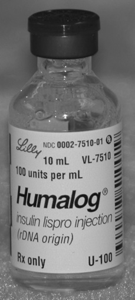

> **Figure 9.2 — Example of an insulin syringe calibrated in Units.** (Courtesy of Becton, Dickinson and Company.)
>
> 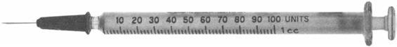

#### Pharmacy-Based Immunizations

The American Pharmacists Association (APhA), in coordination with other national professional organizations, has included *the administration of immunizations* among the professional activities of pharmacists.⁶ Many colleges of pharmacy and pharmacy organizations have developed pharmacy immunization training programs and states permit pharmacists to administer immunizations under established guidelines and protocols.⁷

> **Nota de atualização — 05/09/2026.** No Brasil o paralelo normativo — ausente no livro americano de 2010 — é a **RDC/ANVISA nº 197, de 26/12/2017** (requisitos mínimos do *serviço* de vacinação humana, aplicável a farmácias) e a **Resolução CFF nº 654, de 22/02/2018** (DOU 27/02/2018; revogou a 574/2013): o farmacêutico vacinador precisa de curso complementar (anexo da 654), averbação no CRF e presença durante todo o horário do serviço. A 13ª Turma do TRF1 manteve a 654/2018 em **12/06/2026** (processo 1006655-58.2018.4.01.3400), rejeitando recurso do COFEN.
> **Fontes:** RDC nº 197, de 26/12/2017 <https://bvsms.saude.gov.br/bvs/saudelegis/anvisa/2017/rdc0197_26_12_2017.pdf>; Resolução CFF nº 654, de 22/02/2018 <https://www.normasbrasil.com.br/norma/resolucao-654-2018_357003.html>; CFF, notícia de 12/06/2026 <https://site.cff.org.br/noticia/noticias-do-cff/12/06/2026/justica-mantem-resolucao-do-cff-sobre-vacinacao-por-farmaceuticos-e-rejeita-recurso-do-cofen>

#### Example Calculations of Measures of Activity or Potency

Determinations of the activity or potency of a biologic material considered in this chapter may be performed through the use of ratio and proportion or dimensional analysis, as demonstrated by the following examples.

**Units of Activity.** Calculations involving units of activity are exemplified as follows.

*How many milliliters of U-100 insulin should be used to obtain 40 units of insulin?*

U-100 insulin contains 100 units/mL.

\[
\frac{100 \text{ (units)}}{40 \text{ (units)}} = \frac{1 \text{ (mL)}}{x \text{ (mL)}}
\]

\[x = 0.4 \text{ mL, \textit{answer}}\]

Or, solving by dimensional analysis:

\[
40 \text{ units} \times \frac{1 \text{ mL}}{100 \text{ units}} = 0.4 \text{ mL, \textit{answer.}}
\]

*A physician prescribed 100 units of insulin to be added to 500 mL of D5W in treating a patient with severe diabetic acidosis. How many milliliters of insulin injection concentrate, U-500, should be used?*

U-500 insulin contains 500 units/mL.

\[
\frac{500 \text{ (units)}}{100 \text{ (units)}} = \frac{1 \text{ (mL)}}{x \text{ (mL)}}
\]

\[x = 0.2 \text{ mL, \textit{answer.}}\]

Or, solving by dimensional analysis:

\[
100 \text{ units} \times \frac{1 \text{ mL}}{500 \text{ units}} = 0.2 \text{ mL, \textit{answer.}}
\]

*How many milliliters of a heparin sodium injection containing 200,000 units in 10 mL should be used to obtain 5,000 Heparin Sodium Units that are to be added to an intravenous dextrose solution?*

\[
\frac{200{,}000 \text{ (units)}}{5{,}000 \text{ (units)}} = \frac{10 \text{ (mL)}}{x \text{ (mL)}}
\]

\[x = 0.25 \text{ mL, \textit{answer.}}\]

**Activity Based on Weight.** Calculations involving the determination of activity per unit of weight are exemplified as follows.

*If neomycin sulfate has a potency of 600 µg of neomycin per milligram, how many milligrams of neomycin sulfate would be equivalent in potency to 1 mg of neomycin?*

\[
\frac{600 \text{ (µg of neomycin)}}{1{,}000 \text{ (µg of neomycin)}} = \frac{1 \text{ (mg of neomycin sulfate)}}{x \text{ (mg of neomycin sulfate)}}
\]

\[x = 1.67 \text{ mg, \textit{answer.}}\]

**Dose or Antigen Content of a Biologic Based on Potency.** Calculations of the dose or the antigen content of a biologic product are exemplified as follows.

*A biologic contains 50 Lf Units of diphtheria toxoid in each 2.5 mL of product. If a pediatric patient is to receive 10 Lf Units, how many milliliters of product should be administered?*

\[
\frac{50 \text{ (Lf Units)}}{10 \text{ (Lf Units)}} = \frac{2.5 \text{ (mL)}}{x \text{ (mL)}}
\]

\[x = 0.5 \text{ mL, \textit{answer.}}\]

#### CASE IN POINT 9.1

A hospital pharmacist has been asked to calculate the dose of the biotechnology-derived drug epoetin alpha (EPOGEN, PROCRIT) for a 146.7-lb. patient. The drug is indicated in the treatment of anemia associated with chronic renal failure at a starting dose of 50 to 100 units/kg. The patient’s hematocrit (HCT) is taken initially and twice weekly to avoid exceeding or reaching the target range (HCT 30% to 36%) too rapidly. Once the HCT target is reached, the dose is reduced to a titrated maintenance dose. The physician prescribes an initial dose of 75 units/kg subcutaneously, three times a week, with the dose reduced by half when the HCT approaches 33%. The patient’s initial HCT is 29%.

The drug is available in 1-mL vials containing 2000, 3000, 4000, 10,000, and 40,000 units/mL. Calculate the:

(a) initial dose, in units;

(b) weekly dose, in units;

(c) maintenance dose, in units; and

(d) most convenient vial size and mL to administer for each therapeutic daily dose.

> **Nota de atualização — 05/09/2026.** Trecho clinicamente incorreto, não reescrito. O original usa **faixa-alvo de hematócrito 30–36%** e reduz a dose pela metade quando o HCT se aproxima de 33%. Em **24/06/2011** o FDA reescreveu a tarja preta dos agentes estimuladores da eritropoiese: maior risco de morte, AVC e eventos cardiovasculares quando se visa Hb > 11 g/dL; **não há faixa-alvo**. Em diálise: iniciar se Hb < 10 g/dL; reduzir ou interromper se a Hb se aproxima ou ultrapassa **11 g/dL**. Fora de diálise o teto de interrupção é **10 g/dL**. A 16ª edição do Ansel já enunciou o *Case in Point* em hemoglobina (9,2 g/dL) e redução de 25% se a Hb sobe > 1 g/dL em 2 semanas — alinhada à bula atual. A aritmética 75 units/kg × kg = units continua válida; o critério de titulação do livro, não.
> **Fontes:** FDA / Amgen, alteração de bula dos AES, 24/06/2011 <https://www.accessdata.fda.gov/drugsatfda_docs/nda/2011/103234Orig1s5166LBL.pdf>; FDA, *FDA Modifies Dosing Recommendations for Erythropoiesis-Stimulating Agents* (24/06/2011).

*Measles Virus Vaccine Live is prepared to contain 1000 TCID<sub>50</sub> per 0.5-mL dose. What is the TCID<sub>50</sub> content of a 50-mL multiple dose vial of the vaccine?*

\[
\frac{1000 \text{ (TCID}_{50}\text{)}}{x \text{ (TCID}_{50}\text{)}} = \frac{0.5 \text{ (mL)}}{50 \text{ (mL)}}
\]

\[x = 100{,}000 \text{ TCID}_{50}\text{, \textit{answer.}}\]

#### PRACTICE PROBLEMS

**Units of Activity Calculations**

1. How many milliliters of U-100 insulin zinc suspension should be used to obtain 18 units of insulin?

2. If a diabetic patient injects 20 Units of insulin twice daily, how many days will a 10-mL vial of the U-100 product last the patient?

3. The biotechnology-derived product interferon beta-1b contains 32 million international units per milligram. Calculate the number of international units present in a vial containing 0.3 mg of interferon beta-1b.

4. ALFERON N injection contains 5 million IU of interferon alpha-n3 per milliliter. How many units will an injection of 0.05 mL deliver?

5. Insulin glargine (LANTUS) injection is available in 10-mL vials containing 100 units/mL. How many milliliters would a patient administer for (a) a starting dose of 10 units and (b) a maintenance dose of 4 units?

6. The content of a vial of penicillin G potassium weighs 600 mg and represents 1 million units. How many milligrams are needed to prepare 15 g of an ointment that is to contain 15,000 units of penicillin G potassium per gram?

7. HUMALOG contains 100 units of insulin lispro (rDNA origin) per milliliter. How many complete days will a 3-mL HUMALOG PEN last a patient whose dose is 35 units b.i.d?

8. A physician prescribes 2.5 million units of penicillin G potassium daily for 1 week. If 1 unit of penicillin G potassium equals 0.6 µg, how many tablets, each containing 250 mg, will provide the prescribed dosage regimen?

9. ℞ Penicillin G Potassium 5000 units per mL
   Isotonic Sodium Chloride Solution ad 15 mL
   Sig. Nose drops.

   Using soluble penicillin tablets, each containing 200,000 units of crystalline penicillin G potassium, explain how you would obtain the penicillin G potassium needed in compounding the prescription.

10. FOSAMAX PLUS D contains 70 mg alendronate and 140 mcg of vitamin D<sub>3</sub>, the latter equivalent to 5600 international units of vitamin D. At a once-a-week dose, calculate the daily intake of vitamin D<sub>3</sub> in milligrams and units.

11. A vial for preparation of 100 mL of injection of the drug alteplase (ACTIVASE) contains 100 mg of drug equivalent to 58 million international units to be administered by intravenous infusion. Calculate (a) the units administered to a 176-lb. patient at a dose of 0.9 mg/kg and (b) the milliliters of injection to use.

12. Calcitonin is available as an injection containing 200 international units per milliliter. Adult doses of up to 32 units per kilogram have produced no adverse effects. On this basis, if a 120-lb. patient were administered 0.75 mL of injection, would adverse effects be anticipated?

13. A physician’s hospital medication order calls for a patient to receive 1 unit of insulin injection subcutaneously for every 10 mg/dL of blood sugar over 175 mg/dL, with blood sugar levels and injections performed twice daily in the morning and evening. The patient’s blood sugar was 200 mg/dL in the morning and 320 mg/dL in the evening. How many total units of insulin injection were administered?

14. A physician’s hospital medication order calls for isophane insulin suspension to be administered to a 136-lb. patient on the basis of 1 unit/kg per 24 hours. How many units of isophane insulin suspension should be administered daily?

15. A physician’s hospital medication order calls for 0.5 mL of U-500 insulin injection to be placed in a 500-mL bottle of 5% dextrose injection for infusion into a patient. If the rate of infusion was set to run for 8 hours, how many units of insulin did the patient receive in the first 90 minutes of infusion?

16. Somatropin (NUTROPIN) contains 5 mg of drug equivalent to approximately 15 international units of drug in a vial to prepare 10 mL of injection. If the starting adult dose is 0.006 mg/kg, calculate the dose (a) in units and (b) in milliliters for a 132-lb. patient.

17. For children, heparin sodium is administered by intermittent intravenous infusion in a range of 50 to 100 units/kg body weight every 4 hours. For a 50-lb. child, calculate the range, in milliliters, of a heparin sodium injection containing 5000 units/mL to be administered daily.

18. The maintenance dose of heparin sodium in children has been recommended as 20,000 units/m<sup>2</sup>/24 hr. Using the nomogram in Chapter 8 and a heparin sodium injection containing 1000 units/mL, calculate the daily volume to be administered to a child measuring 22 in. in height and weighing 25 lb.

19. Penicillin G potassium is available as a dry powder in a vial containing 1 million units, which when constituted with 9.6 mL of solvent, results in a 10-mL solution for injection. At a potency of 1560 units/mg, calculate the amount, in milligrams, of penicillin G potassium in each milliliter of injection.

20. Cod liver oil is available in capsules containing 0.6 mL per capsule. Using Table 9.1, calculate the amounts, in units, each of vitamins A and D in each capsule. The specific gravity of cod liver oil is 0.92.

21. A hepatitis B immune globulin contains 312 international units per milliliter. If the dose is 0.06 mL/kg for certain at-risk persons, calculate the dose (a) in units and (b) in milliliters for a 132-lb. person.

22. If a 5-mL vial of HUMATROPE, a biosynthetic somatotropin of rDNA origin, contains 5 mg of somatotropin equivalent to 13 international units, how many milligrams of somatotropin and how many international units would be administered in a 0.6-mL dose?

23. EPOGEN injection is available containing in each milliliter, 2000, 3000, 4000, or 10,000 units of epoetin alfa. If the staring dose for a 160-lb. patient is prescribed at 50 units/kg, which of the following would provide that dose?

    (a) 4 mL of 2000 units/mL

    (b) 1 mL of 3000 units/mL

    (c) 0.9 mL of 4000 units/mL

    (d) 0.8 mL of 10,000 units/mL

24. The prophylactic dose of tetanus antitoxin is 1500 units for persons weighing less than 65 lb. and 3000 to 5000 units for persons weighing more than 65 lb. The antitoxin is available in dose vials of 1500 units, 3000 units, 5000 units, and 20,000 units. Which vial should a pharmacist provide for administration to a patient weighing 25 kg?

**Additional Calculations of Potency**

25. Using Table 9.1, calculate the clindamycin potency equivalence, in milligrams per milliliter, of a solution containing 1 g of clindamycin hydrochloride in 10 mL of solution.

26. Each 1-mL adult dose of hepatitis A vaccine contains 1440 EL.U. of viral antigen. What would be the pediatric dose of this vaccine if 360 EL.U. of viral antigen are to be administered?

    (a) 0.8 mL

    (b) 0.25 mL

    (c) 4 mL

    (d) 0.4 mL

27. Each 0.01 mL of a mumps vaccine contains 400 TCID<sub>50</sub> of the mumps virus. If the usual dose contains 20,000 TCID<sub>50</sub>, how many milliliters of vaccine should be administered?

28. If a biologic product contains 7.5 Lf Units of diphtheria toxoid per 0.5 mL, how many flocculating units would be present in a 7.5-mL multiple dose vial?

29. Zoster Vaccine Live (ZOSTAVAX) contains about 29,850 plaque-forming units (PFU) of attenuated virus per 0.1 cL. Approximately how many PFUs would be contained in each 0.65-mL dose?

    (a) 45,900 PFU

    (b) 4590 PFU

    (c) 1940 PFU

    (d) 19,400 PFU

> **Nota de atualização — 05/09/2026.** O problema 29 continua sendo um exercício de conversão (0,1 cL = 1 mL → 29.850 PFU/mL × 0,65 mL ≈ 19.400 PFU). O produto Zostavax®, porém, não está mais no mercado (ver nota junto aos exemplos de vacina). A 16ª edição trocou o enunciado para “19,400 PFU per 0.65 mL; what is the concentration in PFU/mL?”, sem o truque do cL.
> **Fonte:** CDC, descontinuação do Zostavax em 18/11/2020 <https://archive.cdc.gov/www_cdc_gov/vaccines/vpd/shingles/hcp/zostavax/about-vaccine.html>

#### ANSWERS TO “CASE IN POINT” AND PRACTICE PROBLEMS

**Case in Point 9.1**

(a)

\[
1 \text{ kg} = 2.2 \text{ lb}
\]

\[
\frac{75 \text{ units}}{2.2 \text{ lb.}} = \frac{x \text{ units}}{146.7 \text{ lb.}}
\]

\[x = 5001 \text{ or } 5000 \text{ units, initial dose, \textit{answer.}}\]

(b) \(5{,}000 \text{ units} \times 3 = 15{,}000 \text{ units}\), weekly dose, *answer*.

(c) \(5{,}000 \text{ units} \div 2 = 2{,}500 \text{ units}\), maintenance dose, *answer*.

(d) 10,000 units/mL vial, and

\[
\frac{10{,}000 \text{ units}}{1 \text{ mL}} = \frac{5000 \text{ units}}{x \text{ mL}}
\]

\[x = 0.5 \text{ mL, \textit{answers.}}\]

**Practice Problems**

1. 0.18 mL U-100 insulin zinc suspension
2. 25 days
3. 9,600,000 units interferon beta 1-b
4. 250,000 international units
5. (a) 0.1 mL insulin glargine  (b) 0.04 mL insulin glargine
6. 135 mg penicillin G potassium
7. 4 days
8. 42 penicillin G potassium tablets
9. Dissolve 1 tablet in enough isotonic sodium chloride solution to make 8 mL, and take 3 mL of the dilution.
10. 800 units and 0.02 mg/day
11. (a) 41.76 million units alteplase  (b) 72 mL alteplase injection
12. No
13. 17 units insulin
14. 61.82 units isophane insulin
15. 46.88 units insulin
16. (a) 1.08 units somatropin  (b) 0.72 mL somatropin injection
17. 1.36 to 2.73 mL heparin sodium injection
18. 7.44 mL heparin sodium injection
19. 64.1 mg penicillin G potassium
20. 331.2 to 1380 units of vitamin A; 33.12 to 138 units of vitamin D
21. (a) 1123.2 IU hepatitis B immune globulin  (b) 3.6 mL hepatitis B immune globulin
22. 0.6 mg, and 1.56 or 1.6 IU somatropin
23. (c) 0.9 mL of 4000 units/mL
24. 1500-unit vial
25. 80 mg/mL clindamycin
26. (b) 0.25 mL
27. 0.5 mL mumps vaccine
28. 112.5 Lf Units diphtheria toxoid
29. (d) 19,400 PFU

#### References do capítulo 9

1. United States Pharmacopeia 31st Rev. National Formulary 26. Rockville, MD: The United States Pharmacopeial Convention, 2008;(1041)1:5402.
2. United States Pharmacopeia 31st Rev. National Formulary 26. Rockville, MD: The United States Pharmacopeial Convention, 2008;3:2942–2943.
3. http://www.fda.gov.cber. Accessed September 6, 2008.
4. The Jordan Report: Accelerated development of vaccines 2007. Available at: http://www.niaid.gov. Accessed November 17, 2007.
5. http://www.cdc.gov/vaccines. Accessed September 6, 2008.
6. “Pharmacy Practice Activity Classification,” American Pharmacists Association. Available at: http://www.pharmacist.com. Accessed October 9, 2007.
7. Goad JA. Collaborative practice for pharmacy-based immunization. *Pharmacy Today* 2007;13:77.

#### Notas da transcrição (capítulo 9)

- As **figuras 9.1** (frasco Humalog U-100) e **9.2** (seringa calibrada em Units) foram extraídas do PDF e gravadas em `recursos/ansel13-cap9/`.
- Grafia do original preservada, inclusive “Trypsin, crystalized”, “number or organisms”, o parêntese não fechado em “fluorescent focus units per 0.2 mL dose” e “staring dose” no problema 23.
- Os *Practice Problems* no livro vêm em duas colunas; aqui estão na ordem numérica 1–29.
- **Notas de atualização (05/09/2026):** oito blocos iniciados por *Nota de atualização*. O texto do livro não foi reescrito. O panorama está em [Atualizações desde a 13ª edição](#atualizações-desde-a-13ª-edição-2010--capítulo-9).

## Transcrição — Ansel, 13ª ed., capítulo 13

> [!IMPORTANT]
> Transcrição *ipsis litteris* de **Ansel, *Pharmaceutical Calculations*, 13ª edição (2010),
> capítulo 13** (p. 205–226). Migrada em 05/09/2026 a partir do PDF enviado. O texto corrido
> não foi traduzido nem atualizado; apenas a quebra de linha do PDF foi recomposta em
> parágrafos Markdown, os títulos viraram cabeçalhos, as contas foram remontadas e a lista
> de *Practice Problems* foi recomposta a partir do layout em duas colunas. Figuras (13.1 a
> 13.5, inclusive o nomograma) não foram transcritas: cada uma está marcada com placeholder.
>
> Texto em **inglês**, como no PDF. A atualização (notas, bula, prova) fica no
> [básico](#teoria-básica), não aqui. Este capítulo é o núcleo das
> [#Q2023-26](../QOS_PMMG_Banco_de_Questoes.md#2023--q26--conhecimentos-específicos) e
> [#Q2024-34](../QOS_PMMG_Banco_de_Questoes.md#2024--q34--conhecimentos-específicos).

**Fonte:** ANSEL, Howard C. *Pharmaceutical Calculations*. 13. ed. Philadelphia: Lippincott
Williams & Wilkins, 2010. Capítulo 13 — Intravenous Infusions, Parenteral Admixtures, and
Rate-of-Flow Calculations, p. 205–226.

### Sumário do capítulo 13

- [Objectives (capítulo 13)](#objectives-capítulo-13)
- [Injections](#injections)
- [Intravenous Infusions](#intravenous-infusions)
- [Common Intravenous Infusion Solutions](#common-intravenous-infusion-solutions)
- [Intravenous Push (IVP) Drug Administration](#intravenous-push-ivp-drug-administration)
- [Special Considerations in Pediatric IV Infusion Delivery](#special-considerations-in-pediatric-iv-infusion-delivery)
- [Intravenous Admixtures](#intravenous-admixtures)
- [Rate of Flow of Intravenous Fluids](#rate-of-flow-of-intravenous-fluids)
- [IV Infusion Rate Calculations for the Critical Care Patient](#iv-infusion-rate-calculations-for-the-critical-care-patient)
- [Using a Nomogram](#using-a-nomogram)
- [Using an Infusion Rate Table](#using-an-infusion-rate-table)
- [Calculations Capsule — Intravenous Infusions](#calculations-capsule--intravenous-infusions)
- [Case in Point 13.1](#case-in-point-131)
- [Practice Problems (capítulo 13)](#practice-problems-capítulo-13)
- [Answers (capítulo 13)](#answers-capítulo-13)
- [References (capítulo 13)](#references-capítulo-13)

---

### 13 Intravenous Infusions, Parenteral Admixtures, and Rate-of-Flow Calculations

#### Objectives (capítulo 13)

Upon successful completion of this chapter, the student will be able to:

- Perform calculations for adult and pediatric intravenous infusions.
- Perform calculations for intravenous additives.
- Perform rate-of-flow calculations for intravenous fluids.
- Utilize correctly rate-of-flow tables and nomograms.

#### Injections

Injections are sterile pharmaceutical solutions or suspensions of a drug substance in an aqueous or nonaqueous vehicle. They are administered by needle into almost any part of the body, including the joints (intra-articular), joint fluid (intrasynovial), spinal column (intraspinal), spinal fluid (intrathecal), arteries (intra-arterial), and in an emergency, even the heart (intracardiac). However, most injections are administered into a vein (intravenous, I.V., IV), muscle (intramuscular, I.M., IM), skin (intradermal, I.D., ID, intracutaneous), or under the skin (subcutaneous, sub-Q, SQ, hypodermic).

Depending upon their use, injections are packaged in small volumes in ampuls or in prefilled disposable syringes for single-dose use; in vials and pen-injectors for single- or multiple-dose use; or in large volume plastic bags or glass containers for administration by slow intravenous infusion.

Some injections are available as prepared solutions or suspensions with their drug content labeled as, for example, “10 mg/mL.” Others contain dry powder for reconstitution to form a solution or suspension by adding a specified volume of diluent prior to use and are labeled as, for example, “10 mg/vial.” The calculations required to determine the correct volume of diluent needed to prepare an injection of a certain concentration are provided in Chapter 17.

Small-volume injections may be administered as such or they may be used as additives to large-volume parenteral fluids for intravenous infusion. The term parenteral is defined as any medication route other than the alimentary canal and thus includes all routes of injection.

#### Intravenous Infusions

Intravenous (IV) infusions are sterile, aqueous preparations administered intravenously in relatively large volumes. They are used to extend blood volume and/or provide electrolytes, nutrients, or medications. Most intravenous infusions are administered to critical care, infirm, dehydrated, or malnourished patients, or to patients prior to, during, and/or following surgery. Intravenous infusions are widely employed in emergency care units, in hospitals and other patient care institutions, and in home care. Pharmacists participate in the preparation and administration of institutional as well as home intravenous infusion therapy. The United States Pharmacopeia has established requirements for the compounding of sterile preparations.¹

Most intravenous infusions are solutions; however, some are very fine dispersions of nutrients or therapeutic agents, or blood and blood products. Although some intravenous solutions are isotonic or nearly isotonic with blood, isotonicity is not absolutely necessary because the volumes of fluid usually administered are rapidly diluted by the circulating blood.²

Commercially prepared infusions are available in glass or plastic bottles or collapsible plastic “bags” in volumes of 50 mL (a minibag), 100 mL, 250 mL, 500 mL, and 1000 mL. The smaller volumes find particular application in treating pediatric patients and adults who require relatively small volumes to be infused. When a smaller IV bag is attached to the tubing of a larger IV being administered, it is referred to as an IV piggyback (IVPB). The abbreviation LVP is commonly used to indicate a large-volume parenteral, and SVP indicates a small-volume parenteral.

Some common solutions for intravenous infusion are listed in Table 13.1. In practice, additional components or additives frequently are added to these basic solutions. Drugs and other additives administered by infusion are rapidly distributed throughout the circulation.

An administration set is attached to an intravenous bottle or bag to deliver the fluid into a patient’s vein. The sets may be standard (macrodrip) or pediatric (microdrip). Depending on the particular set used, the drip rate can vary from 10 to 15 drops/mL for standard sets to 60 drops/mL for microdrip sets. The drip rate for blood transfusion sets is usually 10 to 15 drops/mL with infusions of 250 to 500 mL administered over a 2- to 4-hour period.

The passage of an infusion solution into a patient’s vein of entry may be assisted by gravity (the solution is hung on a stand well above the portal of entry) or by electronic volumetric infusion pumps. Some infusion pumps can be calibrated to deliver microinfusion volumes, such as 0.1 mL per hour, to as much as 2000 mL per hour, depending on the drug being administered and the requirements of the patient. Electronic controllers can be used to maintain the desired flow rate.

In the administration of infusions, special needles or catheters provide intravenous entry for the intravenous fluid. Large-, intermediate-, and small-gauge (bore) needles or catheters are used, with the portal of entry selected based on the patient’s age (i.e., adult, child, infant, or neonate) and the clinical circumstances. The narrower the gauge, the slower the flow rate and thus the longer period required to infuse a specified volume. Veins of the back of the hand, forearm, subclavian, jugular, and scalp (e.g., in premature neonates) may be used.

> **Figure 13.1 — Intravenous fluid with an administration set**
>
> *Imagem a inserir:* `recursos/ansel13-cap13/fig-13-01.png`
>
> **Legenda.** A depiction of an intravenous fluid with an administration set. Componentes numerados no original: medication port; back check valve; solution port and cover; airway valve; piercing device; drip chamber; injection or Y site (dois); threaded lock; cap; slide clamp; roller clamp.

> **Figure 13.2 — Intravenous infusion set-up with a piggybacked antibiotic**
>
> *Imagem a inserir:* `recursos/ansel13-cap13/fig-13-02.png`
>
> **Legenda.** A typical intravenous infusion set-up with a piggybacked antibiotic. Small-volume piggyback antibiotic plugged into a Y-site injection of a large-volume IV solution, usually 1000 mL (D5W or NS). (Courtesy of Lacher B. *Pharmaceutical Calculations for the Pharmacy Technician*. Baltimore: Lippincott Williams & Wilkins, 2008.)

Intravenous infusions may be continuous or intermittent. In continuous infusions, large volumes of fluid (i.e., 250 to 1000 mL), with or without added drug, are run into a vein uninterrupted, whereas intermittent infusions are administered during scheduled periods.² The rapid infusion of a medication into a vein is termed IV push and is usually conducted in less than a minute.

#### Common Intravenous Infusion Solutions

Aqueous solutions of dextrose, sodium chloride, and lactated Ringer’s solution are the most commonly used intravenous fluids. Table 13.1 describes the content of these solutions, which may be administered as such, or with additional drug or nutritional components.

**TABLE 13.1** SOME COMMON INTRAVENOUS INFUSION SOLUTIONS

| SOLUTION<sup>a</sup> | ABBREVIATION |
| :--- | :--- |
| 0.9% Sodium Chloride | NS (Normal Saline) |
| 0.45% Sodium Chloride | ½NS |
| 5% Dextrose in Water | D5W |
| 10% Dextrose in Water | D10W |
| 5% Dextrose in 0.9% Sodium Chloride | D5NS |
| 5% Dextrose in 0.45% Sodium Chloride | D5½NS |
| Lactated Ringer’s (0.86% Sodium Chloride, 0.03% Potassium Chloride, 0.033% Calcium Chloride) | LR |
| 5% Dextrose in Lactated Ringer’s | D5LR |

<sup>a</sup> All solutions are prepared in Water for Injection, USP. In addition to the solutions listed, other concentrations of dextrose and sodium chloride are commercially available. These solutions may be administered as such or used as vehicles for therapeutic agents, nutrients, or other additives.

##### Example Calculations of Basic Intravenous Infusions

How many grams each of dextrose and sodium chloride are used to prepare a 250-mL bag of D5½NS for intravenous infusion?

250 mL × 0.05 (5% w/v) = 12.5 g dextrose, and

250 mL × 0.0045 (0.45% w/v) = 1.125 g sodium chloride, answers.

Compare (a) the number of drops and (b) the length of time, in minutes, required to deliver 50 mL of intravenous solutions when using a microdrip set, at 60 drops/mL, and a standard administration set, at 15 drops/mL, if in each case one drop is to be administered per second.

Microdrip set:

(a) 60 drops/mL × 50 mL = 3000 drops

(b) 3000 drops ÷ 60 drops/minute = 50 minutes, answers.

Standard set:

(a) 15 drops/mL × 50 mL = 750 drops

(b) 750 drops ÷ 60 drops/minute = 12.5 minutes, answers.

#### Intravenous Push (IVP) Drug Administration

The rapid injection of intravenous medications, as in emergency or critical care situations, is termed IV push, IVP, IV Stat, or sometimes a bolus dose. For the most part, drugs administered by IV push are intended to quickly control heart rate, blood pressure, cardiac output, respiration, or other life-threatening conditions. Intravenous push medications frequently are administered in less than one minute. The safe administration of a drug by IV push depends on precise calculations of dose and rate of administration. When feasible, a diluted injection rather than a highly concentrated one (e.g., 1 mg/mL versus 5 mg/mL) may be administered as an added safety precaution.³

> **Figure 13.3 — Intravenous flush syringe**
>
> *Imagem a inserir:* `recursos/ansel13-cap13/fig-13-03.png`
>
> **Legenda.** An intravenous flush syringe for the administration of heparin. (Courtesy of Becton Dickinson.)

##### Example Calculations of IV Push Drug Administration

A physician orders enalaprilat (VASOTEC IV) 2 mg IVP for a hypertensive patient. A pharmacist delivers several 1-mL injections, each containing 1.25 mg of enalaprilat. How many milliliters of the injection should be administered?

(1.25 mg / 1 mL) = (2 mg / x mL); x = 1.6 mL (1 mL from one syringe and 0.6 mL from another), answer.

A physician orders midazolam hydrochloride (VERSED) 2 mg IV Stat. A pharmacist delivers a vial containing midazolam hydrochloride 5 mg/mL. How many milliliters should be administered?

(5 mg / 1 mL) = (2 mg / x mL); x = 0.4 mL, answer.

General guidelines in the treatment of severe diabetic ketoacidosis include an initial bolus dose of 0.1 to 0.4 unit of insulin/kg IVP, followed by an insulin drip. Calculate the bolus dosage range for a 200-lb patient.

200 lb ÷ 2.2 lb/kg = 90.9 kg,

90.9 kg × 0.1 unit/kg = 9.09 units, and

90.9 kg × 0.4 unit/kg = 36.36 units, answers.

#### Special Considerations in Pediatric IV Infusion Delivery

Depending on the institutional protocol, a medication order for an intravenous infusion for a 10-kg child may be stated as, for example, “dopamine 60 mg/100 mL, IV to run at 5 mL/hr to give 5 mcg/kg/min.” At some institutions in which standardized drug products and established protocols have been developed, the same medication order may be written simply as “dopamine 5 mcg/kg/min IV” to provide equivalently accurate drug dosing of the patient.⁴ This is because the standard solution of dopamine used in the institution (as described in the previous example), containing 60 mg of dopamine in each 100 mL and run at 5 mL/hr, would deliver the same dose of 5 mcg/kg/min to the 10-kg patient. Calculate it:

(60 mg / 100 mL) = (x mg / 5 mL); x = 3 mg or 3000 mcg dopamine administered per hour

3000 mcg ÷ 60 min/hr = 50 mcg dopamine administered per minute

Since the 50 mcg/min are administered to a 10-kg child, the dose, per kg per minute, is:

(50 mcg / 10 kg) = (x mcg / 1 kg); x = 5 mcg dopamine/kg/min, answer.

All medication doses for pediatric patients, including those administered intravenously, must be carefully determined from available literature and reference sources.

In addition to medications administered by intravenous infusion to pediatric patients, fluid and electrolyte therapy is especially important in the clinical management of preterm and term neonates, particularly those with extremely low birth weights who tend to have greater loss of water through the skin, especially when they are maintained in a warm incubator.⁵

##### Example Calculations of Pediatric Infusions

Calculate the daily infusion volume of D10W to be administered to a neonate weighing 3 lb. 8 oz. on the basis of 60 mL/kg/day.

3 lb. 8 oz. = 3.5 lb. ÷ 2.2 lb./kg = 1.59 kg or 1.6 kg

1.6 kg × 60 mL = 96 mL, answer.

Using an administration set that delivers 60 drops/mL at 20 drops per minute, calculate the total time for the above infusion.

96 mL × (60 drops / 1 mL) × (1 minute / 20 drops) = 288 minutes, or 4 hours 48 minutes, answer.

Gentamicin sulfate, 2.5 mg/kg, is prescribed for a 1.5-kg neonate. Calculate (a) the dose of the drug, and (b) when the drug is placed in a 50-mL IV bag, the flow rate, in mL/minute, if the infusion is to run for 30 minutes.

(a) 2.5 mg/kg × 1.5 kg = 3.75 mg gentamicin sulfate

(b) 50 mL ÷ 30 minutes = 1.67 mL/minute, answers.

#### Intravenous Admixtures

The preparation of intravenous admixtures involves the addition of one or more drugs to large-volume sterile fluids such as sodium chloride injection, dextrose injection, lactated Ringer’s injection, and others. The additives are generally in the form of small-volume sterile solutions packaged in ampuls, vials, small-volume minibags for use as piggybacks, or sterile solids, some requiring constitution with a sterile solvent before transfer.

Although a wide variety of drugs and drug combinations are used in preparing dilute infusions for intravenous therapy, some of the more common additives include electrolytes, antibiotics, vitamins, trace minerals, heparin, and, in some instances, insulin.

> **Figure 13.4 — Aseptic addition of an additive**
>
> *Imagem a inserir:* `recursos/ansel13-cap13/fig-13-04.png`
>
> **Legenda.** Aseptic addition of an additive to a large-volume parenteral solution. (Courtesy of Millipore Corporation.)

In any properly administered intravenous admixture program, all basic fluids (large-volume solutions), additives (already in solution or extemporaneously constituted), and calculations must be carefully checked against the medication orders.

Patient care facilities often adopt standard concentrations of intravenous solutions of commonly used drugs to provide uniformity within the institution. Common examples are dopamine 400 mg in 250 mL of D5W, insulin 25 units in 250 mL of NS, and nitroglycerin 50 mg in 250 mL D5W. In preparing these standard concentrations, the pharmacist withdraws the determined volume from an ampul or vial containing the concentrated drug solution and transfers it to the specified volume of D5W, NS, or other intravenous fluid. Table 13.2 shows various infusion concentrations that may be conveniently prepared from 40 mg/mL and 80 mg/mL concentrations of dopamine injection.

**TABLE 13.2** OPTIONS TO PREPARE INFUSIONS OF DIFFERENT CONCENTRATIONS

| IV FLUID | VOLUME USED INJECTION | CONCENTRATION OF DOPAMINE HCl<sup>a</sup> — 40 mg/mL | CONCENTRATION OF DOPAMINE HCl<sup>a</sup> — 80 mg/mL |
| :--- | :--- | :--- | :--- |
| 250 mL | 5 mL | 800 mcg/mL | 1.6 mg/mL |
| 250 mL | 10 mL | 1.6 mg/mL | 3.2 mg/mL |
| 500 mL | 5 mL | 400 mcg/mL | 800 mcg/mL |
| 500 mL | 10 mL | 800 mcg/mL | 1.6 mg/mL |
| 1000 mL | 5 mL | 200 mcg/mL | 400 mcg/mL |
| 1000 mL | 10 mL | 400 mcg/mL | 800 mcg/mL |

<sup>a</sup> Note: In practice, the volume of the added injection is generally disregarded in expressing the drug concentration of the resultant infusion solution.

It is important to recognize that drug dosing by infusion is varied by the drug concentration in the infusion, the volume of infusion administered, the infusion set used, and the rate of flow of the infusion (e.g., mL/min, mg/min). Rate of infusion calculations are presented in the next section.

##### Example Calculations of Additives to Intravenous Infusion Solutions

A medication order for a patient weighing 154 lb. calls for 0.25 mg of amphotericin B per kilogram of body weight to be added to 500 mL of 5% dextrose injection. If the amphotericin B is to be obtained from a constituted injection that contains 50 mg/10 mL, how many milliliters should be added to the dextrose injection?

1 kg = 2.2 lb.

154 lb. / 2.2 lb. = 70 kg

0.25 mg × 70 = 17.5 mg

Constituted solution contains 50 mg/10 mL:

(50 mg / 17.5 mg) = (10 mL / x mL); x = 3.5 mL, answer.

An intravenous infusion is to contain 15 mEq of potassium ion and 20 mEq of sodium ion in 500 mL of 5% dextrose injection. Using potassium chloride injection containing 6 g/30 mL and 0.9% sodium chloride injection, how many milliliters of each should be used to supply the required ions?

15 mEq of K⁺ ion will be supplied by 15 mEq of KCl, and 20 mEq of Na⁺ ion will be supplied by 20 mEq of NaCl

1 mEq of KCl = 74.5 mg

15 mEq of KCl = 1117.5 mg or 1.118 g

(6 g / 1.118 g) = (30 mL / x mL); x = 5.59 or 5.6 mL, and

1 mEq of NaCl = 58.5 mg

20 mEq of NaCl = 1170 mg or 1.170 g

(0.9 g / 1.17 g) = (100 mL / x mL); x = 130 mL, answers.

A medication order for a child weighing 44 lb. calls for polymyxin B sulfate to be administered by the intravenous drip method in a dosage of 7500 units/kg of body weight in 500 mL of 5% dextrose injection. Using a vial containing 500,000 units of polymyxin B sulfate and sodium chloride injection as the solvent, explain how you would obtain the polymyxin B sulfate needed in preparing the infusion.

1 kg = 2.2 lb.

44 / 2.2 = 20 kg

7500 units × 20 = 150,000 units

Step 1. Dissolve contents of vial (500,000 units) in 10 mL of sodium chloride injection.

Step 2. Add 3 mL of constituted solution to 500 mL of 5% dextrose injection, answer.

#### Rate of Flow of Intravenous Fluids

On medication orders, the physician specifies the rate of flow of intravenous fluids in milliliters per minute, drops per minute, amount of drug (as milligrams per hour), or, more frequently, as the approximate duration of time of administration of the total volume of the infusion. Pharmacists may be called on to perform or check rate-of-flow calculations as those described in the following example problems in this section.

Oftentimes, the following equation finds use in rate-of-flow calculations:

\[
\text{Rate of flow (drops/minute)} = \frac{\text{Volume infused (mL)} \times \text{Drip set (drops/mL)}}{\text{Time (minutes)}}
\]

In common usage are macro sets that deliver 10, 15, or 20 drops per milliliter and microdrip or minidrip sets that deliver 60 drops per milliliter.

##### Examples of Rate-of-Flow Calculations

A medication order calls for 1000 mL of D5W to be administered over an 8-hour period. Using an IV administration set that delivers 10 drops/mL, how many drops per minute should be delivered to the patient?

Volume of fluid = 1000 mL

8 hours = 480 minutes

1000 mL / 480 minutes = 2.08 mL per minute

2.08 mL/min × 10 (drops/mL) = 20.8 or 21 drops per minute, answer.

Ten (10) milliliters of 10% calcium gluconate injection and 10 mL of multivitamin infusion are mixed with 500 mL of a 5% dextrose injection. The infusion is to be administered over 5 hours. If the dropper in the venoclysis set calibrates 15 drops/mL, at what rate, in drops per minute, should the flow be adjusted to administer the infusion over the desired time interval?

Total volume of infusion = 10 mL + 10 mL + 500 mL = 520 mL

Dropper calibrates 15 drops/mL

520 × 15 drops = 7800 drops

7800 drops / 300 minutes = 26 drops per minute, answer.

An intravenous infusion contains 10 mL of a 1:5000 solution of isoproterenol hydrochloride and 500 mL of a 5% dextrose injection. At what flow rate should the infusion be administered to provide 5 μg of isoproterenol hydrochloride per minute, and what time interval will be necessary for the administration of the entire infusion?

10 mL of a 1:5000 solution contain 2 mg

2 mg or 2000 μg are contained in a volume of 510 mL

(2000 μg / 5 μg) = (510 mL / x mL); x = 1.275 or 1.28 mL per minute, and

(1.28 mL / 510 mL) = (1 minute / x minutes); x = 398 minutes or approx. 6½ hours, answers.

If 10 mg of a drug are added to a 500-mL large-volume parenteral fluid:

(a) what should be the rate of flow, in milliliters per hour, to deliver 1 mg of drug per hour?

(10 mg / 1 mg) = (500 mL / x mL); x = 50 mL per hour, answer.

(b) If the infusion set delivers 15 drops/mL, what should be the rate of flow in drops per minute?

15 drops/mL × 50 mL/hr = 750 drops per hour

(750 drops / x drops) = (60 minutes / 1 minute); x = 12.5 drops/minute, answer.

(c) How many hours should the total infusion last?

(50 mL / 500 mL) = (1 hour / x hour); x = 10 hours, answer.

#### IV Infusion Rate Calculations for the Critical Care Patient

Many patients, including those in critical care, require both a maintenance fluid, as D5W, and a therapeutic drug additive, as an antibiotic (see Fig. 13.2). However, many critical care patients have fluid restrictions and must be maintained and treated within a stated maximum volume of fluid intake per day. Thus, consideration must be given to the rate and volumes of any infusions administered including intravenous piggybacked (IVPB) additives.

Example:

An order for a patient, with a 3-liter daily IV fluid limit, calls for 3 L of D5W with a 100-mL IVPB antibiotic to be run-in alone over a 1-hour period and administered every 6 hours. The administration set is calibrated to deliver 10 drops per milliliter. Calculate:

(a) The flow rate of the IVPB antibiotic;

(b) The total flow time for the IV antibiotic;

(c) The total volume for the IV antibiotic;

(d) The total flow time for the D5W;

(e) The total volume for the D5W;

(f) The flow rate for the D5W.

(a) (100 mL × 10 drops/mL) / 60 min = 16.6 or 17 drops per minute;

(b) 1 hour × 4 times a day = 4 hours or 240 minutes;

(c) 100 mL × 4 times a day = 400 mL;

(d) 24 hours − 4 hours (run time for the antibiotic) = 20 hours or 1200 minutes;

(e) 3000 mL − 400 mL (the IVPB antibiotic) = 2600 mL;

(f) (2600 mL × 10 drops/mL) / 1200 min = 21.6 or 22 drops per minute, answers.

#### Using a Nomogram

A nomogram, like that shown in Figure 13.5, may be used in determining the rate of flow of a parenteral fluid. Given the volume to be administered, the infusion time (duration), and the drops per milliliter delivered by the infusion set, the rate of flow, in drops per minute, may be determined directly.

> **Figure 13.5 — Rate of flow versus quantity of infusion versus time nomogram**
>
> *Imagem a inserir:* `recursos/ansel13-cap13/fig-13-05.png`
>
> **Legenda.** Nomogram for number of drops per minute. The number of drops per minute required to administer a particular quantity of infusion solution in a certain time can be read off directly from this nomogram. The nomogram allows for the increase in drop size as the dropping rate increases and is based on the normal drop defined by the relationship: 20 drops distilled water at 15°C = 1 g (±0.05 g) when falling at the rate of 60/min. (From *Documenta Geigy Scientific Tables*, 7th Ed., 1970. With permission of Ciba-Geigy Limited, Basel, Switzerland.)

If 1 liter of a parenteral fluid is to be infused over a 12-hour period using an infusion set that delivers 20 drops/mL, what should be the rate of flow in drops per minute?

First, locate the intercept of the diagonal line representing an infusion time of 12 hours with the horizontal line representing 1 liter of fluid. Next, follow the point of the intercept down to the drop counter scale representing “20 drops/mL” to determine the answer. In the example, the horizontal line would be crossed between 20 and 30 drops per minute—closer to the 30, or approximately 28 drops per minute, answer.

As a check to the proper use of the nomogram, the preceding example may be calculated as follows:

Infusion time = 12 hours = 720 minutes

Infusion fluid = 1 liter = 1000 mL

Drops per milliliter = 20

Total drops in infusion liquid = 20 drops/mL × 1000 mL = 20,000

20,000 drops / 720 minutes = 27.7 or 28 drops per minute, answer.

#### Using an Infusion Rate Table

An infusion rate table, as exemplified by Table 13.3, may accompany a commercial product to facilitate dosing. The composition of the example table is based on the concentration of the infusion solution to be used, the desired dose of the drug, and the patient’s weight. Other tables may be designed differently; for example, rather than the patient’s weight, the patient’s body surface area, in square meters, may be used. In each case, however, the table provides guidelines for the delivery rate of an infusion. Table 13.3 is used by matching the column of the desired drug delivery rate against the patient’s weight to yield the infusion delivery rate in mL/hr. The pharmacist is quite capable of developing such a dosing table, as demonstrated in the final example problem below.

**TABLE 13.3** INFUSION RATE OF A HYPOTHETICAL DRUG FOR A CONCENTRATION OF 0.2 mg/mL

Infusion delivery rate (mL/hr) by patient weight (kg) and drug delivery rate (mcg/kg per minute):

| WEIGHT (kg) | 5 | 6 | 7 | 8 | 9 | 10 | 11 | 12 | 13 |
| ---: | ---: | ---: | ---: | ---: | ---: | ---: | ---: | ---: | ---: |
| 30 | 45 | 54 | 63 | 72 | 81 | 90 | 99 | 108 | 117 |
| 35 | 53 | 63 | 74 | 84 | 95 | 105 | 116 | 126 | 137 |
| 40 | 60 | 72 | 84 | 96 | 108 | 120 | 132 | 144 | 156 |
| 45 | 68 | 81 | 95 | 108 | 122 | 135 | 149 | 162 | 176 |
| 50 | 75 | 90 | 105 | 120 | 135 | 150 | 165 | 180 | 195 |
| 55 | 83 | 99 | 116 | 132 | 149 | 165 | 182 | 198 | 215 |
| 60 | 90 | 108 | 126 | 144 | 162 | 180 | 198 | 216 | 234 |
| 65 | 98 | 117 | 137 | 156 | 176 | 195 | 215 | 234 | 254 |
| 70 | 105 | 126 | 147 | 168 | 189 | 210 | 231 | 252 | 273 |
| 75 | 113 | 135 | 158 | 180 | 203 | 225 | 248 | 270 | 293 |
| 80 | 120 | 144 | 168 | 192 | 216 | 240 | 264 | 288 | 312 |
| 90 | 135 | 162 | 189 | 216 | 243 | 270 | 297 | 324 | 351 |
| 100 | 150 | 180 | 210 | 240 | 270 | 300 | 330 | 360 | 390 |

Using Table 13.3, determine the delivery rate, in mL/hr, for a drug to be administered at 10 mcg/kg/minute to a patient weighing 65 kg.

Drug delivery rate = 10 mcg/kg/minute

Patient weight = 65 kg

Table intercept = 195 mL/hr, answer.

If the infusion pump used in the previous example delivers 60 microdrops per milliliter, how many microdrops would be administered to the patient per minute?

195 (mL/hr) × 60 (microdrops/mL) = 11,700 (microdrops/hr)

11,700 (microdrops/hr) ÷ 60 (minutes/hr) = 195 microdrops per minute, answer.

Calculate the entry shown in Table 13.3 for the infusion delivery rate as determined in the first example problem (i.e., 195 mL/hr).

Drug concentration: 0.2 mg/mL = 200 mcg/mL

Desired delivery rate: 10 mcg/kg/min

Patient weight: 65 kg

Drug to be delivered = 10 (mcg/kg/min) × 65 (kg) = 650 mcg/min

650 (mcg/min) × 60 (min) = 3900 mcg/hr

Infusion delivery rate = 3900 (mcg/hr) ÷ 200 (mcg/mL) = 195 mL/hr, answer.

Note: For data such as these, when the patient’s weight, the dose of the drug, and the drug concentration in the infusion are given or may be calculated, the infusion rate may be calculated by the following equation⁴:

\[
\text{Infusion rate (mL/hr)} = \frac{\text{Patient’s weight (kg)} \times \text{Dose (mcg, mg, or units/kg/min)} \times 60}{\text{Drug concentration, infusion (mcg, mg, or units/mL)}}
\]

= [65 (kg) × 10 (mcg/kg/min) × 60] / 200 (mcg/mL) = 195 mL/hr, answer.

In using this equation, the denominations for the dose and drug concentration must be the same (e.g., mcg, mg, or units). Also, if the dosage rate is stated in hours (e.g., mcg/kg/hr), the 60 is not needed in the equation to arrive at flow rate per hour.

#### CALCULATIONS CAPSULE — Intravenous Infusions

In certain calculations, the following equations find application.

To calculate infusion time:

Infusion time = Volume of infusion in mL / Flow rate in mL/hr or mL/min

To calculate flow rate in drops/minute:

Rate of flow (drops/minute) = [Volume infused (mL) × Drip set (drops/mL)] / Time (minutes)

To calculate flow rate in mL/hour when based on dose⁴:

Infusion rate (mL/hr) = [Patient’s weight (kg) × Dose (mcg, mg, or units/kg/min) × 60] / Drug concentration, infusion (mcg, mg, or units/mL)

In using this equation, the denominations for the dose and drug concentration must be the same (e.g., mcg, mg, or units). Also, if the dosage rate is stated in hours (e.g., mcg/kg/hr), the 60 is not needed in the equation to arrive at flow rate per hour.

#### CASE IN POINT 13.1

A physician prescribes amiodarone HCl IV (CORDARONE) for a patient with ventricular fibrillation. The prescribing information is:

Loading infusions:

- Rapid infusion over first 10 minutes: 15 mg/min
- Slow infusion over the next 6 hours: 1 mg/min

Maintenance infusion:

- Slow infusion over the remaining 18 hours: 0.5 mg/min

Amiodarone HCl IV is available in 3-mL ampuls containing 50 mg/mL.

The pharmacist uses a 100-mL bag of D5W for the rapid infusion and 250-mL bottles of D5W for the slow infusions.

(a) How many milliliters from an amiodarone HCl IV ampul should be placed in the 100-mL bag for the rapid infusion?

(b) What is the drug concentration in the rapid infusion, in mg/mL?

(c) If the pharmacist added the contents of 3 ampuls to each 250-mL bottle of D5W needed for the slow infusions, calculate the drug concentration in mg/mL.

(d) What rate of administration, in mL/hr, should the pharmacist have recommended during the 6-hour infusion segment?

(e) Calculate the rate of administration in (d) in drops/minute with an administration set that delivers 15 drops/mL.

(f) Calculate the milligrams of drug administered by slow infusion over the 6-hour segment.

(g) Make the same calculation as that in (f) but over the 18-hour segment.

#### PRACTICE PROBLEMS (capítulo 13)

##### Calculations of Basic Intravenous Infusion Solutions

1. How many grams each of sodium chloride and dextrose are present in a 1000-mL IV bag of 0.18% sodium chloride and 4% dextrose?

2. How many grams each of sodium chloride, potassium chloride, calcium chloride, and dextrose are contained in a 500-mL IV bag of D5LR?

##### Calculations of Infusion Time

3. A patient received 250 mL of an infusion at a rate of 40 mL/hr. What was the infusion time in hours, minutes?

4. A patient was administered 150 mL of D5W at a rate of 25 mL/hr. If the infusion was begun at 8 AM, at what time was it completed?

5. A patient received 500 mL of D5W½NS at a rate of 15 drops/minute. If the administration set used delivered 15 drops/mL, calculate the infusion time in hours, minutes.

6. A pediatric patient received 50 mL of an infusion at 10 drops/minute with an administration set that delivered 60 drops/mL. Calculate the duration of the infusion in minutes.

7. A patient received a 500-mL whole blood transfusion at 9:13 PM at a rate of 30 drops per minute via an administration set that delivers 10 drops/mL. At what time was the transfusion completed?

##### Calculations of Intravenous Infusions with Additives

8. Daptomycin (CUBICIN), 4 mg/kg, is recommended for administration over a 30-minute period by intravenous infusion in 0.9% sodium chloride. How many milliliters of a vial containing 500 mg of daptomycin in 5 mL should be added to a 100-mL bag of normal saline in treating a 165-lb. patient?

9. An emergency syringe contains lidocaine, 1 g/5 mL. How many milliliters should be used in preparing 250 mL of an infusion to contain 4 mg/mL of lidocaine in D5W?

10. A fluconazole injection contains 400 mg of fluconazole in 200 mL of normal saline injection for infusion. Calculate the concentration of fluconazole in mg/mL.

11. Intravenous immunoglobulin (IVIG) has been administered in the pretransplantation of organs at a rate of 0.08 mL/kg/min. Calculate the number of milliliters administered to a 70-kg patient if a 10% w/v solution is infused over a period of 4 hours.

12. A pharmacist prepared a “standard concentration” of a dopamine HCl solution to contain 400 mg/250 mL D5W. Calculate (a) the concentration of dopamine HCl in the infusion, in mg/mL, and (b) the infusion flow rate, in mL/hr, for a 150-lb. patient, based on a dose of 5 mcg/kg/minute.

13. A pharmacist receives a medication order for 300,000 units of penicillin G potassium to be added to 500 mL of D5W. The directions on the 1,000,000-unit vial state that if 1.6 mL of solvent are added, the solution will measure 2 mL. How many milliliters of the solution must be withdrawn and added to the D5W?

14. A physician orders 2 g of an antibiotic to be placed in 1000 mL of D5W. Using an injection that contains 300 mg of the antibiotic per 2 mL, how many milliliters should be added to the dextrose injection in preparing the medication order?

15. An intravenous infusion for a patient weighing 132 lb. calls for 7.5 mg of amikacin sulfate per kilogram of body weight to be added to 250 mL of 5% dextrose injection. How many milliliters of an amikacin sulfate injection containing 500 mg per 2 mL should be used in preparing the infusion?

16. In preparing an intravenous solution of lidocaine in D5W, a pharmacist added a concentrated solution of lidocaine (1 g per 5 mL) to 250 mL of D5W. What was the final concentration of lidocaine on a milligrams-per-milliliter basis?

17. In preparing an intravenous infusion containing sodium bicarbonate, 50 mL of a 7.5% sodium bicarbonate injection were added to 500 mL of 5% dextrose injection. How many milliequivalents of sodium were represented in the total volume of the infusion?

18. A potassium phosphate solution contains 0.9 g of potassium dihydrogen phosphate and 4.7 g of potassium monohydrogen phosphate in 30 mL. If 15 mL of this solution are added to a liter of D5W, how many milliequivalents of potassium phosphate will be represented in the infusion?

19. A physician orders 20 mg of ampicillin per kilogram of body weight to be administered intravenously in 500 mL of sodium chloride injection. How many milliliters of a solution containing the equivalent of 250 mg of ampicillin per milliliter should be used in filling the medication order for a 110-lb. patient?

##### Various Calculations of Infusions Including Drip Rates

20. The biotechnology drug cetuximab (ERBITUX), used in the treatment of colorectal cancer, has a loading dose of 400 mg/m² administered as an intravenous infusion over a 120-minute period. Using an IV set that delivers 15 drops/mL, calculate (a) the dose for a patient with a BSA of 1.6 m², and (b) the rate of delivery, in drops/min, for 250 mL of an IV fluid containing the dose.

21. How many milliliters of an injection containing 1 g of drug in 4 mL should be used in filling a medication order requiring 275 mg of the drug to be added to 500 mL of D5W solution? If the solution is administered at the rate of 1.6 mL per minute, how many milligrams of the drug will the patient receive in 1 hour?

22. A physician orders a 2-g vial of a drug to be added to 500 mL of D5W. If the administration rate is 125 mL per hour, how many milligrams of the drug will a patient receive per minute?

23. A certain fluid measures 1 liter. If the solution is to be administered over a period of 6 hours and if the administration set is calibrated at 25 drops/mL, at what rate, in drops per minute, should the set be adjusted to administer the solution during the designated interval?

24. A physician orders 35 mg of amphotericin B and 25 units of heparin to be administered intravenously in 1000 mL of D5W over an 8-hour period to a hospitalized patient. In filling the medication order, the available sources of the additives are a vial containing 50 mg of amphotericin B in 10 mL and a syringe containing 10 units of heparin per milliliter. (a) How many milliliters of each additive should be used in filling the medication order? (b) How many milliliters of the intravenous fluid per minute should the patient receive to administer the fluid over the designated interval?

25. A solution containing 500,000 units of polymyxin B sulfate in 10 mL of sterile water for injection is added to 250 mL of 5% dextrose injection. The infusion is to be administered over 2 hours. If the administration set calibrates 15 drops/mL, at what rate, in drops per minute, should the flow be adjusted to administer the infusion over the designated time interval?

26. Five hundred (500) milliliters of a 2% sterile solution of a drug are to be administered by intravenous infusion over a period of 4 hours. If the administration set calibrates 20 drops/mL, at what rate, in drops per minute, should the flow be adjusted to administer the infusion over the desired time interval? Solve the problem by calculation and by using the nomogram in this chapter.

27. An 8-kg infant requires a continuous infusion of a drug to run at 1 mL/hour to deliver 4 mcg of drug/kg per minute. Calculate the milligrams of drug that must be added to a 100-mL intravenous infusion solution.

28. Five hundred (500) milliliters of an intravenous solution contain 0.2% of succinylcholine chloride in sodium chloride injection. At what flow rate should the infusion be administered to provide 2.5 mg of succinylcholine chloride per minute?

29. A hospital pharmacist prepared thirty 100-mL epidural bags containing 0.125% of bupivacaine hydrochloride and 1 μg/mL of fentanyl citrate in 0.9% sodium chloride injection. How many (a) 30-mL vials of 0.5% bupivacaine hydrochloride, (b) 20-mL vials of 50 μg/mL of fentanyl citrate, and (c) 1-L bags of 0.9% sodium chloride were required?

30. An intravenous fluid of 1000 mL of lactated Ringer’s injection was started in a patient at 8 AM and was scheduled to run for 12 hours. At 3 PM, 800 mL of the fluid remained in the bottle. At what rate of flow should the remaining fluid be regulated using an IV set that delivers 15 drops/mL to complete the administration of the fluid in the scheduled time?

31. If a physician orders 5 units of insulin to be added to a 1-liter intravenous solution of D5W to be administered over 8 hours, (a) how many drops per minute should be administered using an IV set that delivers 15 drops/mL, and (b) how many units of insulin would be administered in each 30-minute period?

32. A patient is to receive 3 μg/kg/min of nitroglycerin from a solution containing 100 mg of the drug in 500 mL of D5W. If the patient weighs 176 lb. and the infusion set delivers 60 drops/mL, (a) how many milligrams of nitroglycerin would be delivered per hour, and (b) how many drops per minute would be delivered?

33. Using the nomogram in Figure 13.5, determine the approximate rate of infusion delivery, in drops per minute, based on 1.5 liters of fluid to be used over a period of 8 hours with an infusion set calibrated to deliver 16 drops/mL.

34. The drug alfentanil hydrochloride is administered by infusion at the rate of 2 μg/kg/min for anesthesia induction. If a total of 0.35 mg of the drug is to be administered to a 110-lb. patient, how long should be the duration of the infusion?

35. The recommended maintenance dose of aminophylline for children is 1.0 mg/kg/hr by injection. If 10 mL of a 25 mg/mL solution of aminophylline is added to a 100-mL bottle of dextrose injection, what should be the rate of delivery, in milliliters per hour, for a 40-lb. child?

36. A patient is to receive an infusion of a drug at the rate of 5 mg/hr for 8 hours. The drug is available in 10-mL vials containing 8 mg of drug per milliliter. If a 250-mL bottle of D5W is used as the vehicle, (a) how many milliliters of the drug solution should be added, and (b) what should be the flow rate in milliliters per minute?

37. A patient is receiving an IV drip of the following: Sodium heparin 25,000 units; Sodium chloride injection (0.45%) 500 mL. (a) How many milliliters per hour must be administered to achieve a rate of 1200 units of sodium heparin per hour? (b) If the IV set delivers 15 drops/mL, how many drops per minute should be administered?

38. A 50-mL vial containing 1 mg/mL of the drug alteplase is added to 100 mL of D5W and administered intravenously with an infusion set that delivers 15 drops/mL. How many drops per minute should be given to administer 25 mg of the drug per hour?

39. If the loading dose of phenytoin in children is 20 mg/kg of body weight to be infused at a rate of 0.5 mg/kg/min, over how many minutes should the dose be administered to a 32-lb. child?

40. The following was ordered for a critical care patient: 2 L of D5/0.45% NS to run over 24 hours with a 2000 mL IV fluid daily limit. An IVPB antibiotic is ordered to run every 6 hours separately in 50 mL of D5W over 30 minutes. The drop factor is 60 drops per milliliter. Calculate the flow rate of the IVPB and the D5/0.45% NS.

41. If a medication order calls for a dobutamine drip, 5 μg/kg/min, for a patient weighing 232 lb., what should be the drip rate, in drops per minute, if the 125-mL infusion bag contains 250 mg of dobutamine and a microdrip chamber is used that delivers 60 drops/mL?

42. At what rate, in drops per minute, should a dose of 20 μg/kg/min of dopamine be administered to a 65-kg patient using a solution containing dopamine, 1200 μg/mL, and a drip set that delivers 60 drops/mL?

43. A pharmacist places 5 mg/mL of acyclovir sodium in 250 mL of D5W for parenteral infusion into a pediatric patient. If the infusion is to run for 1 hour and the patient is to receive 500 mg/m² BSA, what would be the rate of flow in milliliters per minute for a patient measuring 55 cm in height and weighing 10 kg?

44. Aminophylline is not to be administered in pediatric patients at a rate greater than 25 mg per minute to avoid excessive peak serum concentrations and possible circulatory failure. What should be the maximum infusion rate, in milliliters per minute, for a solution containing 10 mg/mL of aminophylline in 100 mL of D5W?

45. An intravenous infusion contains 5 mg of RECLAST (zoledronic acid) in 100 mL. If the infusion is to be administered in 15 minutes, how many (a) milligrams of zoledronic acid, and (b) milliliters of infusion must be administered per minute? And (c), using a drip-set that delivers 20 drops/milliliter, how many drops per minute must be infused?

46. ORENCIA (abatacept), used to treat rheumatoid arthritis, is available in vials, each containing 250 mg of powdered drug, intended to be reconstituted to 10 mL with sterile water for injection. The dose of abatacept depends on a patient’s body weight: <60 kg, 500 mg; 60 to 100 kg, 750 mg; and >100 kg, 1 g. The contents of the appropriate number of vials are aseptically added to a 100-mL infusion bag or bottle of sodium chloride injection after the corresponding volume of sodium chloride injection has been removed. The concentration of abatacept in an infusion for a 200-lb. patient would be: (a) 5.8 mg/mL (b) 6.25 mg/mL (c) 6.8 mg/mL (d) 7.5 mg/mL

47. TORISEL (temsirolimus), for use in advanced renal cell carcinoma, is prepared for infusion by adding 1.8 mL of special diluent to the drug vial resulting in 3 mL of injection containing 10 mg/mL of temsirolimus. The required quantity is then added to a 250-mL container of sodium chloride injection for infusion. The recommended dose of temsirolimus is 25 mg infused over 30 to 60 minutes. The quantity of drug delivered, in mg/mL, and the rate of infusion, in mL/min, for a 30-minute infusion are: (a) 0.099 mg/mL and 8.42 mL/min (b) 0.099 mg/mL and 8.33 mL/min (c) 1 mg/mL and 8.42 mL/min (d) 1 mg/mL and 8.33 mL/min

48. CARDENE IV (nicardipine hydrochloride) is administered in the short-term treatment of hypertension by slow intravenous infusion at a concentration of 0.1 mg/mL. A 10-mL ampule containing 25 mg of nicardipine hydrochloride should be added to what volume of D5W to achieve the desired concentration of infusion? (a) 80 mL (b) 100 mL (c) 240 mL (d) 250 mL

#### ANSWERS (capítulo 13)

##### Case in Point 13.1

(a) 15 mg/min × 10 min = 150 mg amiodarone HCl needed for the rapid infusion. Ampul contains 50 mg/mL, so 3 mL are needed = one 3-mL ampul, answer.

(b) 150 mg amiodarone in 103 mL; 150 mg ÷ 103 mL = 1.46 mg/mL, answer.

(c) 3 (ampuls) × 3 mL = 9 mL × 50 mg/mL = 450 mg amiodarone HCl; 450 mg ÷ 259 mL = 1.74 mg/mL amiodarone HCl, answer.

(d) 60 minutes × 1 mg/min = 60 mg amiodarone HCl; 60 mg ÷ 1.74 mg/mL = 34.5 mL/hr, answer.

(e) 34.5 mL × 15 drops/mL = 517.5 drops in 1 hour; 517.5 drops ÷ 60 = 8.625 or about 9 drops per minute, answer.

(f) 1 mg/min × 60 min/hr × 6 hr = 360 mg, answer.

(g) 0.5 mg/min × 60 min/hr × 18 hr = 540 mg, answer.

##### Practice Problems

1. 1.8 g sodium chloride; 40 g dextrose
2. 4.3 g sodium chloride; 0.15 g potassium chloride; 0.165 g calcium chloride; 25 g dextrose
3. 6 hours, 15 minutes
4. 2:00 PM
5. 8 hours, 20 minutes
6. 300 minutes
7. 12 midnight
8. 3 mL daptomycin injection
9. 5 mL lidocaine injection
10. 2 mg/mL fluconazole
11. 1344 mL IVIG
12. (a) 1.6 mg/mL dopamine (b) 12.78 mL/hr
13. 0.6 mL
14. 13.33 mL
15. 1.8 mL amikacin sulfate injection
16. 3.92 mg/mL lidocaine
17. 44.6 mEq sodium
18. 30.32 mEq potassium phosphate
19. 4 mL
20. (a) 640 mg cetuximab (b) 31.25 or 31 drops/min
21. 1.1 mL; 52.8 mg
22. 8.33 mg
23. 69.4 or 69 drops/min
24. (a) 7 mL amphotericin B; 2.5 mL heparin (b) 2.08 mL/min
25. 32.6 or 33 drops/min
26. 41.7 or 42 drops/min
27. 192 mg
28. 1.25 mL/min
29. (a) 25 (b) 3 (c) 3
30. 40 drops/min
31. (a) 31.25 or 31 drops/min (b) 0.3 unit
32. (a) 14.4 mg/hr (b) 72 drops/min
33. approximately 50 drops/min
34. 3.5 minutes
35. 8 mL/hr
36. (a) 5 mL (b) 0.53 mL/min
37. (a) 24 mL/hr (b) 6 drops/min
38. 18.75 or 19 drops/min
39. 40 minutes
40. IVPB, 100 drops/minute; D5/0.45NS, 82 drops/minute
41. 15.82 or 16 drops/min
42. 66 drops/min
43. 0.58 mL/min
44. 2.5 mL/min
45. (a) 0.33 mg zoledronic acid (b) 6.67 mL (c) 133 drops/minute
46. (d) 7.5 mg/mL
47. (a) 0.099 mg/mL and 8.42 mL/min
48. (c) 240 mL

#### References (capítulo 13)

1. http://www.usp.org/pdf/EN/USPNF/generalChapter797.pdf. Accessed December 3, 2007; United States Pharmacopeia 31st Rev. National Formulary 26. Rockville, MD: United States Pharmacopeial Convention, 2008;(797)1:319–336.
2. Boh L. *Pharmacy Practice Manual: A Guide to the Clinical Experience*. Baltimore: Lippincott Williams & Wilkins, 2001:418.
3. Institute for Safe Medication Practices. ISMP medication safety alert: how fast is too fast of IV push medications. May 15, 2003. Available at: http://www.ismp.org/MSAarticles/HowPrint.htm. Accessed November 16, 2004.
4. Mitchell A, Sommo P, Mocerine T, et al. A standardized approach to pediatric parenteral medication delivery. *Hospital Pharmacy* 2004;39:433–459.
5. Gomella TL, Cunningham MD, Eyal FG, et al. *Neonatology: Management Procedures, On-Call Problems, Diseases, and Drugs*. New York: Lange Medical Books, 2004:69–73.
6. Vo A and Jordan SC. IVIG therapy: an emerging role in organ transplantation. *U.S. Pharmacist* March 2004:HS 36–40.
7. Lacher B. *Pharmaceutical Calculations for the Pharmacy Technician*. Baltimore: Lippincott Williams & Wilkins, 2008:287.

## Transcrição — Ansel, 13ª ed., capítulo 15

> [!IMPORTANT]
> Transcrição *ipsis litteris* de **Ansel, *Pharmaceutical Calculations*, 13ª edição (2010),
> capítulo 15** (p. 251–278). Migrada em 05/09/2026 a partir do PDF enviado. O texto corrido
> não foi traduzido; as proporções empilhadas foram remontadas em fração, os diagramas de
> aligação estão em `recursos/ansel13-cap15/` e a lista de *Practice Problems* foi linearizada.
> Onde um fármaco do exemplo saiu de linha, o original fica como está e um bloco *Nota de
> atualização* registra o que mudou. O panorama está em
> [Atualizações desde a 13ª edição (capítulo 15)](#atualizações-desde-a-13ª-edição-capítulo-15).

**Fonte:** ANSEL, Howard C. *Pharmaceutical Calculations*. 13th ed. Philadelphia: Wolters Kluwer Health / Lippincott Williams & Wilkins, 2010. **Chapter 15: Altering Product Strength, Use of Stock Solutions, and Problem-Solving by Alligation** (p. 251–278).

### Atualizações desde a 13ª edição (capítulo 15)

A transcrição abaixo é do **capítulo 15** de Ansel, *Pharmaceutical Calculations*, 13ª edição em inglês (2010; páginas 251–278). A aritmética do capítulo — \(Q_1C_1 = Q_2C_2\), proporção inversa, aligação medial e aligação alternada, contração do álcool, gravidade específica na diluição de ácidos — **não mudou**. O que envelheceu são a expressão de concentração em rótulos de injetáveis, o status de alguns fármacos dos exemplos e o número das páginas nas edições seguintes.

Levantamento fechado em **setembro de 2026**; as fontes estão no fim desta seção. Cinco notas ao longo da transcrição deste capítulo.

Onde o capítulo está nas edições posteriores — o título e o número **permanecem os mesmos** até a 16ª:

| Edição | Ano | Capítulo | Páginas |
| :---- | :---- | :---- | :---- |
| 13ª (a transcrita) | 2010 | **15** — Altering Product Strength, Use of Stock Solutions, and Problem-Solving by Alligation | 251–278 |
| 15ª (*Stoklosa and Ansel's*) | 2016 | **15** — mesmo título | — |
| 16ª | 2021 | **15** — mesmo título | 300–320 |
| 17ª | jul/2026 | TOC ainda não conferida na fonte; a editora anuncia exemplos novos, sem mudar o recorte do assunto | — |

Os capítulos 6, 9 e 13 já estão transcritos neste arquivo. Falta o 17 (reconstituição de pós).

#### 1. Razão 1:N em injetáveis de um só fármaco saiu do rótulo

O capítulo ensina razão (1:1000, 1:5000, 1:750) como expressão rotineira de concentração, inclusive em isoproterenol 1:5000 (problema 34) e epinefrina 1:4000 (problema 8). Desde **1º de maio de 2016**, o capítulo geral USP 〈7〉 *Labeling* **proíbe** razão em **injetáveis de um só fármaco**: o rótulo deve trazer quantidade/mL.

| O que o livro escreve | O que o rótulo oficial traz hoje (USP 〈7〉) |
| :---- | :---- |
| Epinefrina 1:1000 | 1 mg/mL |
| Epinefrina 1:10.000 | 0,1 mg/mL |
| Isoproterenol 1:5000 | 0,2 mg/mL |
| Neostigmina 1:1000 | 1 mg/mL |

**Exceção que o capítulo não tem:** em anestésico local + epinefrina (lidocaína 1% com epinefrina 1:100.000), a razão da epinefrina **ainda é permitida**, porque o decimal (0,01 mg/mL) se lê mal. A aritmética 1:N = 1 g em N mL continua válida para calcular; o que mudou é o rótulo comercial.

#### 2. Ácidos oficiais: a convenção USP que o capítulo cita segue em pé

Hydrochloric Acid, NF, continua “not less than 36.5% and not more than 38.0%, by weight, of HCl”; Diluted Hydrochloric Acid, NF, continua “in each 100 mL, not less than 9.5 g and not more than 10.5 g of HCl”. A regra didática — concentrado em % p/p, diluído em % p/v, converter com gravidade específica — **não envelheceu**. A referência do rodapé (USP 31/NF 26, 2008) é que ficou antiga; o teor da monografia, não.

#### 3. Fármacos dos exemplos que saíram de linha

A conta não muda; o produto do enunciado, sim. Três casos em que o original ficou histórico:

| Exemplo no capítulo | O que mudou |
| :---- | :---- |
| **MUSTARGEN** (mecloretamina injetável) — trituração 10 mg + 90 mg de NaCl; problemas 51 | Recordati interrompeu fabricação/distribuição a partir de **31/12/2018** (NDA 006695; fim de comercialização registrado em 31/03/2019). No Brasil a mecloretamina injetável também não circula. Vale o método da trituração 1:10, não o produto. |
| **AGENERASE** (amprenavir) solução oral 1,5% — problema 7 | GSK encerrou a solução oral e as cápsulas de 50 mg nos EUA em **outubro de 2007** (já fora de linha quando esta 13ª edição saiu). Substituto histórico: fosamprenavir (Lexiva). |
| **ZANTAC** (ranitidina) xarope 15 mg/mL — problema 43 | FDA pediu a retirada de todas as ranitidinas em **01/04/2020** (NDMA). No Brasil, a **Resolução-RE nº 3.259, de 26/08/2020**, proibiu comercialização, fabricação, importação, **manipulação** e propaganda; a **Portaria SCTIE/MS nº 76, de 29/12/2021**, excluiu as apresentações do SUS (Relatório Conitec nº 695). |

#### 4. O que se procurou e não mudou

- Contração de volume álcool + água: continua verdadeira; o capítulo já manda *q.s.* no % v/v e calcular a água pelo peso no % p/p.
- Aligação medial e alternada: método inalterado na 16ª edição.
- Galão americano = 3785 mL, pinta = 473 mL: o livro usa o sistema norte-americano. Prova brasileira trabalha em mL.
- Triturações oficiais 1:10: o próprio texto de 2010 já diz que *no longer official as such*.

#### Fontes consultadas

<details>
<summary><strong>Referências das atualizações</strong> — clique para abrir</summary>

- ANSEL, H. C. *Pharmaceutical Calculations*. 13th ed. Philadelphia: Wolters Kluwer/Lippincott Williams & Wilkins, 2010. Cap. 15, p. 251–278.
- Wolters Kluwer. *Stoklosa and Ansel's Pharmaceutical Calculations*, 16th ed. — sumário, cap. 15 p. 300–320.
  <https://shop.lww.com/Stoklosa-and-Ansel-s-Pharmaceutical-Calculations/p/9781975128555>
- USP. General Chapter 〈7〉 *Labeling* — Ratio Expression of Strength (oficial 01/05/2016; revisão 01/05/2019).
  <https://www.uspnf.com/sites/default/files/usp_pdf/EN/USPNF/revisions/gc-7-labeling-rb-notice-20190501.pdf>
  <https://www.usp.org/health-quality-safety/labeling>
- USP–NF. *Hydrochloric Acid* (NLT 36.5% and NMT 38.0% by weight of HCl).
  <http://ftp.uspbpep.com/v29240/usp29nf24s0_m37880.html>
- USP–NF. *Diluted Hydrochloric Acid* (9.5–10.5 g HCl / 100 mL; oficial 01/01/2018, vigente em 2025).
  <https://doi.usp.org/USPNF/USPNF_M37890_03_01.html>
- FDA. *FDA Requests Removal of All Ranitidine Products (Zantac) from the Market*. 01/04/2020.
  <https://www.fda.gov/news-events/press-announcements/fda-requests-removal-all-ranitidine-products-zantac-market>
- ANVISA. **Resolução-RE nº 3.259, de 26 de agosto de 2020** (DOU de 27/08/2020) — proibição definitiva da ranitidina (citada no Relatório Conitec nº 695).
  <http://antigo-conitec.saude.gov.br/images/Relatorios/2021/20211230_Relatorio_695_exclusao_ranitidina_Final.pdf>
- Ministério da Saúde. **Portaria SCTIE/MS nº 76, de 29 de dezembro de 2021** — exclusão da ranitidina do SUS.
  <https://bvsms.saude.gov.br/bvs/saudelegis/sctie/2021/prt0076_30_12_2021.html>
- Recordati Rare Diseases. *NDC Discontinuation Notification for Mustargen*, 04/10/2018, efetiva 31/12/2018 **(a confirmar na fonte primária; a página do fabricante devolveu 404)**.
  <https://www.recordatirarediseases.com/us/news/ndc-discontinuation-notification-mustargen-mechlorethamine-hcl-injection-notification>
- Drugs.com / DailyMed. MUSTARGEN — NDA 006695, *Marketing End Date* 31/03/2019.
  <https://www.drugs.com/pro/mustargen.html>
- MedlinePlus. Mechlorethamine: no longer commercially available in the U.S.
  <https://medlineplus.gov/druginfo/meds/a682223.html>
- GSK / The Body Pro. *Agenerase Oral Solution and 50-mg Capsules to Be Discontinued in the U.S.*, out/2007 **(a confirmar na fonte primária)**.
  <https://www.thebodypro.com/article/agenerase-amprenavir-oral-solution-50-mg-capsules-discontinued-u->

</details>

### Sumário do capítulo 15

- [Objectives (capítulo 15)](#objectives-capítulo-15)
- [Special Considerations of Altering Product Strength in Pharmaceutical Compounding](#special-considerations-of-altering-product-strength-in-pharmaceutical-compounding)
- [Relationship Between Strength and Total Quantity](#relationship-between-strength-and-total-quantity)
- [Dilution and Concentration of Liquids](#dilution-and-concentration-of-liquids)
- [Strengthening of a Pharmaceutical Product](#strengthening-of-a-pharmaceutical-product)
- [Stock Solutions](#stock-solutions)
- [Dilution of Alcohol](#dilution-of-alcohol)
- [Dilution of Acids](#dilution-of-acids)
- [Dilution and Fortification of Solids and Semisolids](#dilution-and-fortification-of-solids-and-semisolids)
- [Triturations](#triturations)
- [Alligation](#alligation)
- [Alligation Medial](#alligation-medial)
- [Alligation Alternate](#alligation-alternate)
- [Specific Gravity of Mixtures](#specific-gravity-of-mixtures)
- [Practice Problems (capítulo 15)](#practice-problems-capítulo-15)
- [Answers (capítulo 15)](#answers-capítulo-15)
- [References (capítulo 15)](#references-capítulo-15)
- [Notas da transcrição (capítulo 15)](#notas-da-transcrição-capítulo-15)

### 15 Altering Product Strength, Use of Stock Solutions, and Problem-Solving by Alligation

#### Objectives (capítulo 15)

Upon successful completion of this chapter, the student will be able to:

- Perform calculations for altering product strength by dilution, concentration, or fortification.
- Perform calculations for the preparation and use of stock solutions.
- Apply alligation medial and alligation alternate in problem-solving.

The strength of a pharmaceutical preparation may be increased or decreased by changing the proportion of active ingredient to the whole. A preparation may be strengthened or made more concentrated by the addition of active ingredient, by admixture with a like preparation of greater strength, or through the evaporation of its vehicle, if liquid. The strength of a preparation may be decreased or diluted by the addition of diluent or by admixture with a like preparation of lesser strength.

Alternative methods of calculation for the alteration of the strength of pharmaceutical preparations are presented in this chapter.

#### Special Considerations of Altering Product Strength in Pharmaceutical Compounding

In the course of pharmacy practice, there are occasions in which the alteration of the strength of a pharmaceutical preparation is either desirable or required.

> **CALCULATIONS CAPSULE — Concentration/Quantity Relationship**
>
> 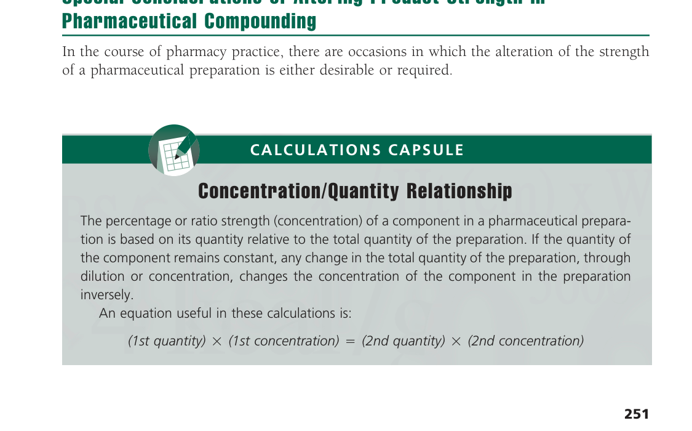
>
> The percentage or ratio strength (concentration) of a component in a pharmaceutical preparation is based on its quantity relative to the total quantity of the preparation. If the quantity of the component remains constant, any change in the total quantity of the preparation, through dilution or concentration, changes the concentration of the component in the preparation inversely.
>
> An equation useful in these calculations is:
>
> *(1st quantity) × (1st concentration) = (2nd quantity) × (2nd concentration)*

The *dilution* of a liquid dosage form, as a solution or suspension, may be desired to provide a product strength more suitable for use by a particular patient (e.g., pediatric, elderly, those in disease states). The diluent is selected based on its compatibility with the vehicle of the original product; that is, aqueous, alcoholic, hydroalcoholic, or other. The dilution of a solid dosage form (as a powder or the contents of a capsule) or a semisolid dosage form (as an ointment or cream) also may be performed to alter the dose or strength of a product. Again, the diluent is selected based on its compatibility with the original formulation. Pharmacists also may find occasion to dilute concentrated acids, alcohol preparations, or very potent therapeutic agents, as discussed in this chapter, to meet special compounding requirements.

The *concentration* of a liquid preparation, as through the evaporation of a portion of its solvent or vehicle, rarely is performed nowadays. However, the *fortification* of a liquid, solid, or semisolid dosage form, by the addition of a calculated quantity of additional therapeutic agent, remains a viable practice in pharmacy compounding.

#### Relationship Between Strength and Total Quantity

If a mixture of a given percentage or ratio strength is diluted to twice its original quantity, its active ingredient will be contained in twice as many parts of the whole, and its strength therefore will be reduced by one half. By contrast, if a mixture is concentrated by evaporation to one-half its original quantity, the active ingredient (assuming that none was lost by evaporation) will be contained in one half as many parts of the whole, and the strength will be doubled. So, if 50 mL of a solution containing 10 g of active ingredient with a strength of 20% or 1:5 w/v are diluted to 100 mL, the original volume is doubled, but the original strength is now reduced by one half to 10% or 1:10 w/v. If, by evaporation of the solvent, the volume of the solution is reduced to 25 mL or one half the original quantity, the 10 g of the active ingredient will indicate a strength of 40% or 1:2.5 w/v.

If, then, the amount of active ingredient remains constant, any change in the quantity of a solution or mixture of solids is inversely proportional to the percentage or ratio strength; that is, the percentage or ratio strength decreases as the quantity increases, and conversely.

This relationship is generally true for all mixtures except solutions containing components that contract when mixed together.

Problems in this section generally may be solved by any of the following methods:

1. Inverse proportion.
2. The equation: (1st quantity) × (1st concentration) = (2nd quantity) × (2nd concentration), or \(Q_1 \times C_1 = Q_2 \times C_2\).
3. By determining the quantity of active ingredient (solute) present or required and relating that quantity to the known or desired quantity of the preparation.

*Note: This will become clear as the chapter proceeds.*

#### Dilution and Concentration of Liquids

#### Example Calculations of the Dilution and Concentration of Liquids

*If 500 mL of a 15% v/v solution are diluted to 1500 mL, what will be the percentage strength (v/v)?*

```
1500 (mL)     15 (%)
─────────  =  ──────
 500 (mL)      x (%)

x = 5%, answer.
```

Or,

\(Q_1\) (quantity) × \(C_1\) (concentration) = \(Q_2\) (quantity) × \(C_2\) (concentration)

```
500 (mL) × 15 (%) = 1500 (mL) × x (%)

x = 5%, answer.
```

Or,

500 mL of 15% v/v solution contains 75 mL of solute

```
1500 (mL)     100 (%)
─────────  =  ───────
  75 (mL)       x (%)

x = 5%, answer.
```

*If 50 mL of a 1:20 w/v solution are diluted to 1000 mL, what is the ratio strength (w/v)?*

*Note: A student may find it simpler in solving certain problems to convert a given ratio strength to its equivalent percentage strength.*

1:20 = 5%

```
1000 (mL)     5 (%)
─────────  =  ─────
  50 (mL)      x (%)

x = 0.25% = 1:400, answer.
```

Or,

```
1000 (mL)     1/20
─────────  =  ────
  50 (mL)       x

x = 1/400 = 1:400, answer.
```

Or,

\(Q_1\) (quantity) × \(C_1\) (concentration) = \(Q_2\) (quantity) × \(C_2\) (concentration)

```
50 (mL) × 5 (%) = 1000 (mL) × x (%)

x = 0.25% = 1:400, answer.
```

Or,

50 mL of a 1:20 solution contains 2.5 g of solute

```
2.5 (g)     1000 (mL)
───────  =  ─────────
 1 (g)        x (mL)

x = 400 mL
Ratio strength = 1:400, answer.
```

*If a syrup containing 65% w/v of sucrose is evaporated to 85% of its volume, what percentage (w/v) of sucrose will it contain?*

Any convenient amount of the syrup, for example, 100 mL, may be used in the calculation. If we evaporate 100 mL of the syrup to 85% of its volume, we will have 85 mL.

```
 85 (mL)     65 (%)
────────  =  ──────
100 (mL)      x (%)

x = 76.47% or 76%, answer.
```

*How many grams of 10% w/w ammonia solution can be made from 1800 g of 28% w/w strong ammonia solution?*

```
 10 (%)     1800 (g)
───────  =  ────────
 28 (%)       x (g)

x = 5040 g, answer.
```

Or,

\(Q_1 \times C_1 = Q_2 \times C_2\)

```
1800 (g) × 28 (%) = x (g) × 10%

x = 5040 g, answer.
```

Or,

1800 g of 28% ammonia water contains 504 g of ammonia (100%)

```
 10 (%)     504 (g)
───────  =  ───────
100 (%)      x (g)

x = 5040 g, answer.
```

*How many milliliters of a 1:5000 w/v solution of the preservative lauralkonium chloride can be made from 125 mL of a 0.2% solution?*

1:5000 = 0.02%

```
0.02 (%)     125 (mL)
────────  =  ────────
 0.2 (%)       x (mL)

x = 1250 mL, answer.
```

Or,

0.2% = 1:500

```
1/5000     125 (mL)
──────  =  ────────
1/500        x (mL)

x = 1250 mL, answer.
```

Or,

125 mL of a 0.2% solution contains 0.25 g of lauralkonium chloride

```
   1 (g)     5000 (mL)
────────  =  ─────────
0.25 (g)       x (mL)

x = 1250 mL, answer.
```

Or,

```
125 (mL) × 0.2 (%) = x (mL) × 0.02 (%)

x = 1250 mL, answer.
```

*If 1 gallon of a 30% w/v solution is to be evaporated so that the solution will have a strength of 50% w/v, what will be its volume in milliliters?*

1 gallon = 3785 mL

```
50 (%)     3785 (mL)
──────  =  ─────────
30 (%)       x (mL)

x = 2271 mL, answer.
```

#### Strengthening of a Pharmaceutical Product

As noted previously, there is occasion in which a pharmacist may be called upon to strengthen an existing pharmaceutical product. This may be accomplished by the addition of active ingredient or by the admixture with a calculated quantity of a like-product of greater concentration. The latter type of calculation is presented later in this chapter under the discussion of alligation alternate.

The following problem and Case in Point 15.1 offer example calculations of product strengthening.

**Example:**

*If a cough syrup contains in each teaspoonful, 1 mg of chlorpheniramine maleate and if a pharmacist desired to double the strength, how many milligrams of that ingredient would need to be added to a 60-mL container of the syrup. Assume no increase in volume.*

```
1 mg
──── × 60 mL = 12 mg chlorpheniramine maleate in original syrup
5 mL
```

To double the strength, 12 mg of additional chlorpheniramine maleate would be required, *answer.*

> **CASE IN POINT 15.1:** A pharmacist received a prescription for 100 mL of a cefuroxime axetil suspension to contain 300 mg of drug in each 5 mL. The pharmacist has 100 mL of a suspension containing 250 mg/5 mL and also has 250-mg scored tablets of the drug. How many tablets should be pulverized and added to the suspension to achieve the desired strength? Assume no increase in the volume of the suspension.
>
> **A Second Look**
>
> The pharmacist observed that after adding the pulverized tablets, the suspension measured 102 mL in volume. Calculations revealed that rather than the prescribed drug strength of 300 mg/5 mL, there were 294.1 mg/5 mL. What should the pharmacist do to bring the suspension to the desired strength?

#### Stock Solutions

Stock solutions are concentrated solutions of active (e.g., drug) or inactive (e.g., colorant) substances and are used by pharmacists as a convenience to prepare solutions of lesser concentration.

#### Example Calculations of Stock Solutions

*How many milliliters of a 1:400 w/v stock solution should be used to make 4 liters of a 1:2000 w/v solution?*

4 liters = 4000 mL

1:400 = 0.25%

1:2000 = 0.05%

```
0.25 (%)     4000 (mL)
────────  =  ─────────
0.05 (%)       x (mL)

x = 800 mL, answer.
```

Or,

```
1/400     4000 (mL)
─────  =  ─────────
1/2000      x (mL)

x = 800 mL, answer.
```

Or,

4000 mL of a 1:2000 w/v solution requires 2 g of active constituent (solute); thus:

```
1 (g)     400 (mL)
─────  =  ────────
2 (g)      x (mL)

x = 800 mL, answer.
```

Or,

\(Q_1 \times C_1 = Q_2 \times C_2\)

```
4000 (mL) × 0.25 (%) = x × 0.05 (%)

x = 800 mL, answer.
```

*How many milliliters of a 1:400 w/v stock solution should be used in preparing 1 gallon of a 1:2000 w/v solution?*

1 gallon = 3785 mL

1:400 = 0.25%

1:2000 = 0.05%

```
0.25 (%)     3785 (mL)
────────  =  ─────────
0.05 (%)       x (mL)

x = 757 mL, answer.
```

Or,

1 gallon of a 1:2000 w/v solution requires 1.89 g of active constituent; thus:

```
1.89 (g)     x (mL)
────────  =  ──────
  1 (g)      400 (mL)

x = 756 mL, answer.
```

*How many milliliters of a 1% stock solution of a certified red dye should be used in preparing 4000 mL of a mouthwash that is to contain 1:20,000 w/v of the certified red dye as a coloring agent?*

1:20,000 = 0.005%

```
    1 (%)     4000 (mL)
──────────  =  ─────────
0.005 (%)       x (mL)

x = 20 mL, answer.
```

**Check:**

| 1% stock solution contains | 1:20,000 solution contains |
| :---- | :---- |
| 20 (mL) × 0.01 → 0.2 g certified red dye | ← 4000 (mL) × 0.00005 |

Or,

4000 mL of a 1:20,000 w/v solution requires 0.2 g of certified red dye; thus:

```
  1 (g)     100 (mL)
───────  =  ────────
0.2 (g)      x (mL)

x = 20 mL, answer.
```

*How many milliliters of a 1:16 solution of sodium hypochlorite should be used in preparing 5000 mL of a 0.5% solution of sodium hypochlorite for irrigation?*

1:16 = 6.25%

```
6.25 (%)     5000 (mL)
────────  =  ─────────
 0.5 (%)       x (mL)

x = 400 mL, answer.
```

Or,

5000 mL of a 0.5% w/v solution requires 25 g of sodium hypochlorite; thus:

```
25 (g)     x (mL)
──────  =  ──────
 1 (g)     16 (mL)

x = 400 mL, answer.
```

*How many milliliters of a 1:50 stock solution of phenylephrine hydrochloride should be used in compounding the following prescription?*

```
℞  Phenylephrine HCl  0.25%
   Rose Water ad      30 mL
   Sig. For the nose.
```

1:50 = 2%

```
   2 (%)     30 (mL)
────────  =  ───────
0.25 (%)      x (mL)

x = 3.75 mL, answer.
```

Or,

30 (g) × 0.0025 = 0.075 g of phenylephrine hydrochloride needed

1:50 means 1 g in 50 mL of stock solution

```
   1 (g)     50 (mL)
────────  =  ───────
0.075 (g)     x (mL)

x = 3.75 mL, answer.
```

Some interesting calculations are used in pharmacy practice in which the strength of a diluted portion of a solution is defined, but the strength of the concentrated stock solution used to prepare it must be determined. The relevance to pharmacy practice may be explained, for example, by the need of a pharmacist to prepare and dispense a concentrated solution of a drug and direct the patient to use a specific household measure of a solution (e.g., 1 teaspoonful) in a specified volume of water (e.g., a pint) to make of solution of the desired concentration (e.g., for irrigation or soaking). This permits the dispensing of a relatively small volume of liquid, enabling a patient to prepare relatively large volumes as needed, rather than carrying home gallons of a diluted solution from a pharmacy.

*How much drug should be used in preparing 50 mL of a solution such that 5 mL diluted to 500 mL will yield a 1:1000 solution?*

1:1000 means 1 g of drug in 1000 mL of solution

```
1000 (mL)     1 (g)
─────────  =  ─────
 500 (mL)      x (g)

x = 0.5 g of drug in 500 mL of diluted solution (1:1000), which is also the amount in 5 mL of the stronger (stock) solution
```

And,

```
 5 (mL)     0.5 (g)
───────  =  ───────
50 (mL)      y (g)

y = 5 g, answer.
```

The accompanying diagrammatic sketch should prove helpful in solving the problem.

> **Figura — Diluição a partir de solução-estoque (p. 258)**
>
> 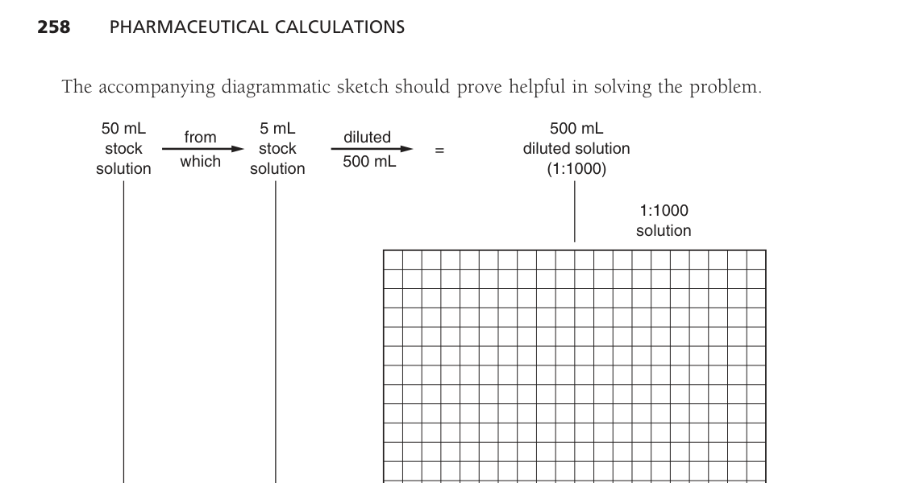
>
> 50 mL stock solution (5 g drug) → from which 5 mL stock solution (0.5 g drug) → diluted 500 mL = 500 mL diluted solution (1:1000) containing 0.5 g drug.

*How many grams of sodium chloride should be used in preparing 500 mL of a stock solution such that 50 mL diluted to 1000 mL will yield a “⅓ normal saline” (0.3% w/v) for irrigation?*

1000 (mL) × 0.003 = 3 g of sodium chloride in 1000 mL of “⅓ normal saline” (0.3% w/v), which is also the amount in 50 mL of the stronger (stock) solution to be prepared.

And,

```
 50 (mL)     3 (g)
────────  =  ─────
500 (mL)      x (g)

x = 30 g, answer.
```

*How many milliliters of a 17% w/v concentrate of benzalkonium chloride should be used in preparing 300 mL of a stock solution such that 15 mL diluted to 1 liter will yield a 1:5000 solution?*

1 liter = 1000 mL

1:5000 means 1 g of benzalkonium chloride in 5000 mL of solution

```
5000 (mL)     1 (g)
─────────  =  ─────
1000 (mL)      x (g)
```

x = 0.2 g of benzalkonium chloride in 1000 mL of diluted solution (1:5000), which is also the amount in 15 mL of the stronger (stock) solution to be prepared, and:

```
 15 (mL)     0.2 (g)
────────  =  ───────
300 (mL)      y (g)

y = 4 g of benzalkonium chloride needed,
```

because a 17% w/v concentrate contains 17 g per 100 mL, then:

```
17 (g)     100 (mL)
──────  =  ────────
 4 (g)      z (mL)

z = 23.5 mL, answer.
```

A solution of known volume and strength may be diluted with water to prepare a solution of lesser strength. In such calculations, first calculate the quantity of diluted solution that may be prepared from the concentrated solution. Then, subtract the volume of the concentrated solution from the total quantity that may be prepared to determine the volume of water needed.

*How many milliliters of water should be added to 300 mL of a 1:750 w/v solution of benzalkonium chloride to make a 1:2500 w/v solution?*

1:2500 = 0.04%

1:750 = 0.133%

```
0.04 (%)      300 (mL)
────────  =  ─────────
0.133 (%)      x (mL)

x = 997.5 or 1000 mL of 0.04% w/v solution to be prepared
```

The difference between the volume of diluted (weaker) solution prepared and the volume of stronger solution used represents the volume of water (diluent) to be used.

1000 mL − 300 mL = 700 mL, *answer.*

Or,

300 mL of a 1:750 (w/v) solution contains 0.4 g of benzalkonium chloride

```
  1 (g)     2500 (mL)
───────  =  ─────────
0.4 (g)       x (mL)

x = 1000 mL
1000 mL − 300 mL = 700 mL, answer.
```

*How many milliliters of water should be added to a pint of a 5% w/v solution to make a 2% w/v solution?*

1 pint = 473 mL

```
2 (%)     473 (mL)
─────  =  ────────
5 (%)      x (mL)

x = 1182.5 mL
```

And,

1182.5 mL − 473 mL = 709.5 mL, *answer.*

If the quantity of a component is given rather than the strength of a solution, the solution may be diluted to a desired strength as shown by the following example.

*How many milliliters of water should be added to 375 mL of a solution containing 0.5 g of benzalkonium chloride to make a 1:5000 solution?*

1:5000 means 1 g in 5000 mL of solution

```
  1 (g)     5000 (mL)
───────  =  ─────────
0.5 (g)       x (mL)

x = 2500 mL of 1:5000 (w/v) solution containing 0.5 g of benzalkonium chloride
```

And,

2500 mL − 375 mL = 2125 mL, *answer.*

*If 15 mL of a 0.06% ATROVENT (ipratropium bromide) nasal spray were diluted with 6 mL of normal saline solution, what would be the final drug concentration?*

15 mL × 0.06% = 0.009 g of ipratropium bromide

15 mL + 6 mL = 21 mL, new total volume

```
0.009 g
─────── × 100 = 0.043 %, answer.
 21 mL
```

Or,

```
15 (mL) × 0.06 (%) = 21 (mL) × x (%)

x = 0.043 %, answer.
```

#### Dilution of Alcohol

#### Example Calculations of Alcohol Dilutions

When water and alcohol are mixed, there is a physical contraction such that the resultant volume is less than the total of the individual volumes of the two liquids. Thus, to prepare a volume-in-volume strength of an alcohol dilution, the alcohol “solute” may be determined and water used to “q.s.” to the appropriate volume. Because the contraction of the liquids does not affect the weights of the components, the weight of water (and from this, the volume) needed to dilute alcohol to a desired weight-in-weight strength may be calculated.

*How much water should be mixed with 5000 mL of 85% v/v alcohol to make 50% v/v alcohol?*

```
50 (%)     5000 (mL)
──────  =  ─────────
85 (%)       x (mL)

x = 8500 mL
```

Or,

```
5000 (mL) × 85 (%) = x (mL) × 50 (%)

x = 8500 mL
```

Therefore, use 5000 mL of 85% v/v alcohol and enough water to make 8500 mL, *answer.*

*How many milliliters of 95% v/v alcohol and how much water should be used in compounding the following prescription?*

```
℞  Xcaine     1 g
   Alcohol 70%  30 mL
   Sig. Ear drops.
```

```
95 (%)     30 (mL)
──────  =  ───────
70 (%)      x (mL)

x = 22.1 mL
```

Therefore, use 22.1 mL of 95% v/v alcohol and enough water to make 30 mL, *answer.*

*How much water should be added to 4000 g of 90% w/w alcohol to make 40% w/w alcohol?*

```
40 (%)     4000 (g)
──────  =  ────────
90 (%)       x (g)

x = 9000 g, weight of 40% w/w alcohol equivalent to 4000 g of 90% w/w alcohol
```

9000 g − 4000 g = 5000 g or 5000 mL, *answer.*

#### Dilution of Acids

The strength of an official undiluted (concentrated) acid is expressed as percentage weight-in-weight. For example, Hydrochloric Acid, NF, contains not less than 36.5% and not more than 38.0%, by weight, of HCl. However, the strength of an official diluted acid is expressed as percentage weight-in-volume. For example, Diluted Hydrochloric Acid, NF, contains, in each 100 mL, not less than 9.5 g and not more than 10.5 g of HCl.<sup>1</sup>

It is necessary, therefore, to consider the specific gravity of concentrated acids in calculating the volume to be used in preparing a desired quantity of a diluted acid.

> **Nota de atualização — 05/09/2026.** A convenção que o parágrafo descreve — ácido oficial concentrado em % p/p e ácido oficial diluído em % p/v — permanece a da monografia vigente. Hydrochloric Acid, NF, segue NLT 36.5% e NMT 38.0% *by weight* de HCl; Diluted Hydrochloric Acid, NF, segue 9.5–10.5 g de HCl em cada 100 mL (oficial desde 01/01/2018; conferida na USP–NF em 15/02/2025). O que envelheceu é só a citação do rodapé (USP 31/NF 26, 2008).
> **Fontes:** USP–NF, *Hydrochloric Acid* <http://ftp.uspbpep.com/v29240/usp29nf24s0_m37880.html>; USP–NF, *Diluted Hydrochloric Acid* <https://doi.usp.org/USPNF/USPNF_M37890_03_01.html>

#### Example Calculations of Acid Dilutions

*How many milliliters of 37% w/w hydrochloric acid having a specific gravity of 1.20 are required to make 1000 mL of diluted hydrochloric acid 10% w/v?*

1000 g × 0.10 = 100 g of HCl (100%) in 1000 mL of 10% w/v acid

```
 37 (%)     100 (g)
───────  =  ───────
100 (%)      x (g)

x = 270 g of 37% acid
```

270 g of water measure 270 mL

270 (mL) ÷ 1.20 = 225 mL, *answer.*

*How many milliliters of 85% w/w phosphoric acid having a specific gravity of 1.71 should be used in preparing 1 gallon of ¼% w/v phosphoric acid solution to be used for bladder irrigation?*

1 gallon = 3785 mL

3785 (g) × 0.0025 = 9.46 g of H₃PO₄ (100%) in 3785 mL (1 gallon) of ¼% w/v solution

```
 85 (%)     9.46 (g)
───────  =  ────────
100 (%)      x (g)

x = 11.13 g of 85% phosphoric acid
```

11.13 g of water measures 11.13 mL

11.13 (mL) ÷ 1.71 = 6.5 mL, *answer.*

#### Dilution and Fortification of Solids and Semisolids

The dilution of solids in pharmacy occurs when there is need to achieve a lower concentration of an active component in a more concentrated preparation (e.g., a powdered vegetable drug). There also is a type of diluted pharmaceutical preparation, termed a *trituration* (as discussed in the next section) that represents a useful means of preparing and administering very potent therapeutic substances.

Reducing or enhancing the strengths of creams and ointments is a usual part of a compounding pharmacist’s practice to meet the special needs of patients. The dilution of semisolids is a usual part of a compounding pharmacist’s practice in reducing the strengths of creams and ointments to meet the special needs of patients.

#### Example Calculations of Solid and Semisolid Dilutions

*If 30 g of a 1% hydrocortisone ointment were diluted with 12 g of Vaseline, what would be the concentration of hydrocortisone in the mixture?*

30 g × 1% = 0.3 g hydrocortisone

30 g + 12 g = 42 g, weight of mixture

```
0.3 g
───── × 100 = 0.71% (w/w), answer.
 42 g
```

Or,

```
30 (g) × 1 (%) = 42 (g) × x (%)

x = 0.71% (w/w), answer.
```

*How many grams of 20% benzocaine ointment and how many grams of ointment base (diluent) should be used in preparing 5 lb. of 2.5% benzocaine ointment?*

5 lb. = 454 g × 5 = 2270 g

```
  20 (%)     2270 (g)
────────  =  ────────
 2.5 (%)       x (g)

x = 283.75 or 284 g of 20% ointment, and
2270 g − 284 g = 1986 g of ointment base, answers.
```

Or,

5 lb. = 454 g × 5 = 2270 g

2270 g × 2.5% = 56.75 g of benzocaine needed

```
   20 (g)     100 (g)
─────────  =  ───────
56.75 (g)      x (g)

x = 283.75 or 284 g of 20% ointment, and
2270 g − 284 g = 1986 g of ointment base, answers.
```

*How many grams of zinc oxide should be added to 3200 g of 5% zinc oxide ointment to prepare an ointment containing 20% of zinc oxide?*

```
3200 g × 0.05  = 160 g of zinc oxide in 3200 g of 5% ointment
3200 g − 160 g = 3040 g of base (diluent) in 3200 g of 5% ointment
```

In the 20% ointment, the diluent will represent 80% of the total weight

```
80 (%)     3040 (g)
──────  =  ────────
20 (%)       x (g)

x = 760 g of zinc oxide in the 20% ointment
```

Because the 5% ointment already contains 160 g of zinc oxide,

760 g − 160 g = 600 g, *answer.*

A simpler method of solving this problem can be used if we mentally translate it to read:

*How many grams of zinc oxide should be added to 3200 g of zinc oxide ointment containing 95% diluent to prepare an ointment containing 80% diluent?*

```
80 (%)     3200 (g)
──────  =  ────────
95 (%)       x (g)

x = 3800 g of ointment containing 80% diluent and 20% zinc oxide
3800 g − 3200 g = 600 g, answer.
```

*Note: For another simple method, using alligation alternate (see subsequent section in this chapter).*

#### Triturations

Triturations are dilutions of potent medicinal substances. They were at one time official and were prepared by diluting one part by weight of the drug with nine parts of finely powdered lactose. They are, therefore, 10% or 1:10 w/w mixtures.

These dilutions offer a means of obtaining conveniently and accurately small quantities of potent drugs for compounding purposes. Although no longer official as such, triturations exemplify a method for the calculation and use of dilutions of solid medicinal substances in compounding and manufacturing procedures.

A modern-day example of a trituration is the product Trituration of MUSTARGEN (mechlorethamine hydrochloride for injection), in which 10 mg of the highly toxic drug is triturated with 90 mg of sodium chloride. The trituration is dissolved in sterile water for injection or in sodium chloride injection prior to administration.

> **Nota de atualização — 05/09/2026.** O produto do exemplo saiu de linha. Recordati Rare Diseases interrompeu fabricação, distribuição e venda de Mustargen® 10 mg (mecloretamina HCl para injeção) a partir de **31/12/2018**, por demanda muito baixa; o NDA 006695 registra *Marketing End Date* **31/03/2019**. MedlinePlus confirma que a mecloretamina injetável **não está mais disponível comercialmente nos EUA**. A trituração 1:10 (10 mg de fármaco + 90 mg de NaCl) continua o método; o nome comercial é conteúdo histórico. A carta da Recordati de 04/10/2018 **(a confirmar na fonte primária — a URL do fabricante devolveu 404 nesta sessão)**.
> **Fontes:** Recordati, *NDC Discontinuation Notification for Mustargen*, 04/10/2018 <https://www.recordatirarediseases.com/us/news/ndc-discontinuation-notification-mustargen-mechlorethamine-hcl-injection-notification>; Drugs.com / bula MUSTARGEN, NDA 006695 <https://www.drugs.com/pro/mustargen.html>; MedlinePlus, mechlorethamine <https://medlineplus.gov/druginfo/meds/a682223.html>

*Note: The term trituration as used in this context should not be confused with the like term trituration, which is the pharmaceutical process of reducing substances to fine particles through grinding in a mortar and pestle.*

#### Example Calculations of Triturations

*How many grams of a 1:10 trituration are required to obtain 25 mg of drug?*

10 g of trituration contain 1 g of drug

25 mg = 0.025 g

```
   1 (g)     10 (g)
────────  =  ──────
0.025 (g)     x (g)

x = 0.25 g, answer.
```

*How many milliliters of an injection prepared by dissolving 100 mg of a 1:10 trituration of mechlorethamine hydrochloride in sufficient water for injection to prepare 10 mL of injection is required to obtain 5 mg of drug?*

100 mg of trituration = 10 mg of drug

10 mg of drug in 10 mL of injection

```
10 (mg)     10 (mL)
───────  =  ───────
 5 (mg)      x (mL)

x = 5 mL, answer.
```

*How many milligrams of a 1:10 dilution of colchicine should be used by a manufacturing pharmacist in preparing 100 capsules for a clinical drug study if each capsule is to contain 0.5 mg of colchicine?*

0.5 mg × 100 = 50 mg of colchicine needed

10 mg of dilution contain 1 mg of colchicine

```
 1 (mg)     10 (mg)
───────  =  ───────
50 (mg)      x (mg)

x = 500 mg, answer.
```

#### Alligation

Alligation is an arithmetical method of solving problems that involves the mixing of solutions or mixtures of solids possessing different percentage strengths.

#### Alligation Medial

*Alligation medial* is a method by which the “weighted average” percentage strength of a mixture of two or more substances of known quantity and concentration may be easily calculated. By this method, the percentage strength of each component, expressed as a decimal fraction, is multiplied by its corresponding quantity; then the sum of the products is divided by the total quantity of the mixture; and the resultant decimal fraction is multiplied by 100 to give the percentage strength of the mixture. Of course, the quantities must be expressed in a common denomination, whether of weight or volume.

#### Example Calculations Using Alligation Medial

*What is the percentage strength (v/v) of alcohol in a mixture of 3000 mL of 40% v/v alcohol, 1000 mL of 60% v/v alcohol, and 1000 mL of 70% v/v alcohol? Assume no contraction of volume after mixing.*

```
0.40 × 3000 mL = 1200 mL
0.60 × 1000 mL =  600 mL
0.70 × 1000 mL =  700 mL
Totals: 5000 mL     2500 mL

2500 (mL) ÷ 5000 (mL) = 0.50 × 100 = 50%, answer.
```

*What is the percentage of zinc oxide in an ointment prepared by mixing 200 g of 10% ointment, 50 g of 20% ointment, and 100 g of 5% ointment?*

```
0.10 × 200 g = 20 g
0.20 ×  50 g = 10 g
0.05 × 100 g =  5 g
Totals: 350 g    35 g

35 (g) ÷ 350 (g) = 0.10 × 100 = 10%, answer.
```

In some problems, the addition of a solvent or vehicle must be considered. It is generally best to consider the diluent as of zero percentage strength, as in the following problem.

*What is the percentage strength of alcohol in a mixture of 500 mL of a solution containing 40% v/v alcohol, 400 mL of a second solution containing 21% v/v alcohol, and a sufficient quantity of a nonalcoholic third solution to make a total of 1000 mL?*

```
0.40 × 500 mL = 200 mL
0.21 × 400 mL =  84 mL
0    × 100 mL =   0 mL
Totals: 1000 mL    284 mL

284 (mL) ÷ 1000 (mL) = 0.284 × 100 = 28.4%, answer.
```

#### Alligation Alternate

*Alligation alternate* is a method by which we may calculate the number of parts of two or more components of a given strength when they are to be mixed to prepare a mixture of desired strength. A final proportion permits us to translate relative parts to any specific denomination.

The strength of a mixture must lie somewhere between the strengths of its components; that is, the mixture must be somewhat stronger than its weakest component and somewhat weaker than its strongest. As indicated previously, the strength of the mixture is always a “weighted” average; that is, it lies nearer to that of its weaker or stronger components depending on the relative amounts involved.

This “weighted” average can be found by means of an extremely simple scheme, as illustrated in the subsequent diagram.

#### Example Calculations Using Alligation Alternate

*In what proportion should alcohols of 95% and 50% strengths be mixed to make 70% alcohol?*

Note that the difference between the strength of the stronger component (95%) and the desired strength (70%) indicates the number of parts of the weaker to be used (25 parts), and the difference between the desired strength (70%) and the strength of the weaker component (50%) indicates the number of parts of the stronger to be used (20 parts).

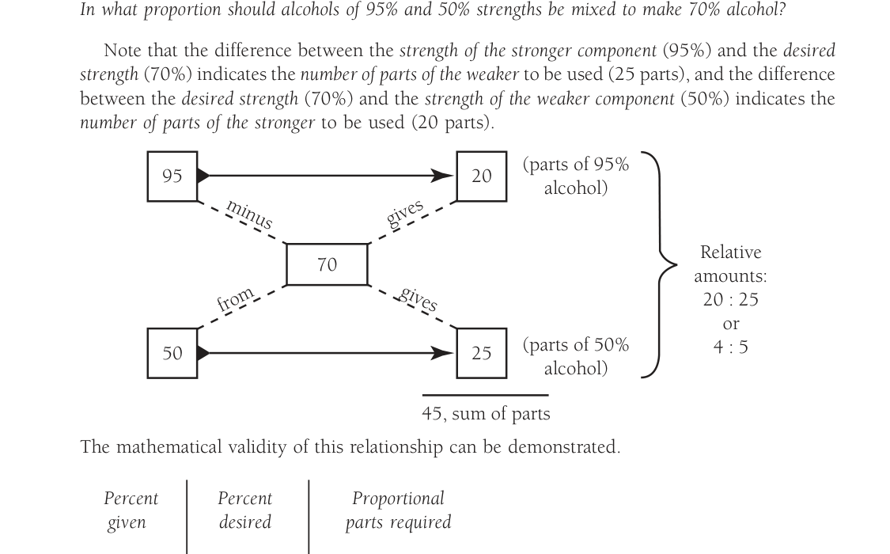

```
        95 ──────► 20   (parts of 95% alcohol)
              70
        50 ──────► 25   (parts of 50% alcohol)
                   ──
                   45, sum of parts

Relative amounts: 20 : 25 or 4 : 5
```

The mathematical validity of this relationship can be demonstrated.

| Percent given | Percent desired | Proportional parts required |
| :---- | :---- | :---- |
| \(a\) | \(c\) | \(x\) |
| \(b\) | | \(y\) |

Given these data, the ratio of \(x\) to \(y\) may be derived algebraically as follows:

\[
\begin{align*}
ax + by &= c(x + y) \\
ax + by &= cx + cy \\
ax - cx &= cy - by \\
x(a - c) &= y(c - b) \\
\frac{x}{y} &= \frac{c - b}{a - c}
\end{align*}
\]

Given \(a = 95\%\), \(b = 50\%\), and \(c = 70\%\), we may therefore solve the problems as follows:

\[
0.95x + 0.50y = 0.70(x + y)
\]

Or,

\[
\begin{align*}
95x + 50y &= 70x + 70y \\
95x - 70x &= 70y - 50y \\
x(95 - 70) &= y(70 - 50) \\
\frac{x}{y} &= \frac{70 - 50}{95 - 70} = \frac{20}{25} = \frac{4 \text{ (parts)}}{5 \text{ (parts)}},\ \text{answer.}
\end{align*}
\]

The result can be shown to be correct by alligation medial:

```
95 × 4 = 380
50 × 5 = 250
Totals: 9    630

630 ÷ 9 = 70%
```

The customary layout of alligation alternate, used in the subsequent examples, is a convenient simplification of the preceding diagram.

*In what proportion should 20% benzocaine ointment be mixed with an ointment base to produce a 2.5% benzocaine ointment?*

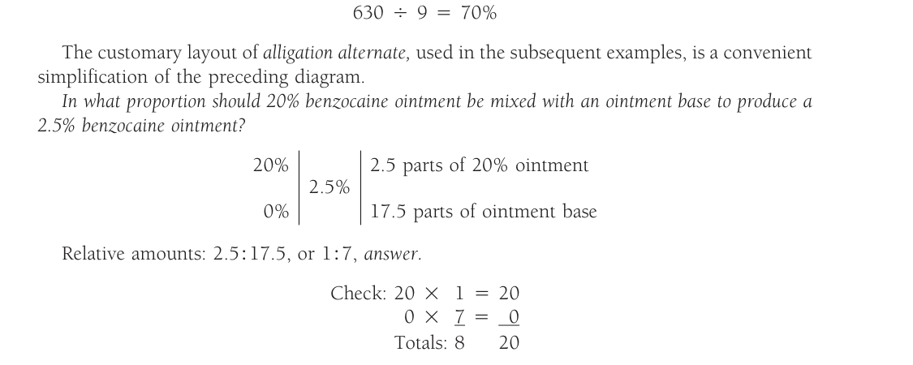

```
20% ──────► 2.5 parts of 20% ointment
       2.5%
 0% ──────► 17.5 parts of ointment base

Relative amounts: 2.5 : 17.5, or 1 : 7, answer.
```

Check:

```
20 × 1 = 20
 0 × 7 =  0
Totals: 8    20

20 ÷ 8 = 2.5%
```

*A hospital pharmacist wants to use three lots of zinc oxide ointment containing, respectively, 50%, 20%, and 5% of zinc oxide. In what proportion should they be mixed to prepare a 10% zinc oxide ointment?*

The two lots containing more (50% and 20%) than the desired percentage may be separately linked to the lot containing less (5%) than the desired percentage:

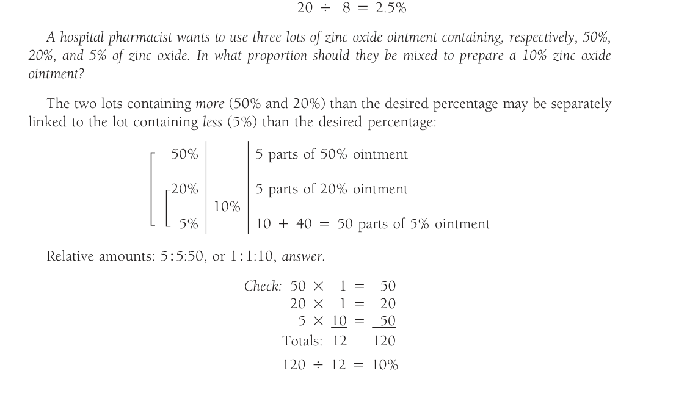

```
50% ──────►  5 parts of 50% ointment
20% ──────►  5 parts of 20% ointment
       10%
 5% ──────► 10 + 40 = 50 parts of 5% ointment

Relative amounts: 5 : 5 : 50, or 1 : 1 : 10, answer.
```

Check:

```
50 ×  1 =  50
20 ×  1 =  20
 5 × 10 =  50
Totals: 12    120

120 ÷ 12 = 10%
```

Other answers are possible, of course, because the two stronger lots may be mixed first in any proportions desired, yielding a mixture that may then be mixed with the weakest lot in a proportion giving the desired strength.

*In what proportions may a manufacturing pharmacist mix 20%, 15%, 5%, and 3% zinc oxide ointments to produce a 10% ointment?*

Each of the weaker lots is paired with one of the stronger to give the desired strength, and because we may pair them in two ways, we may get two sets of correct answers.

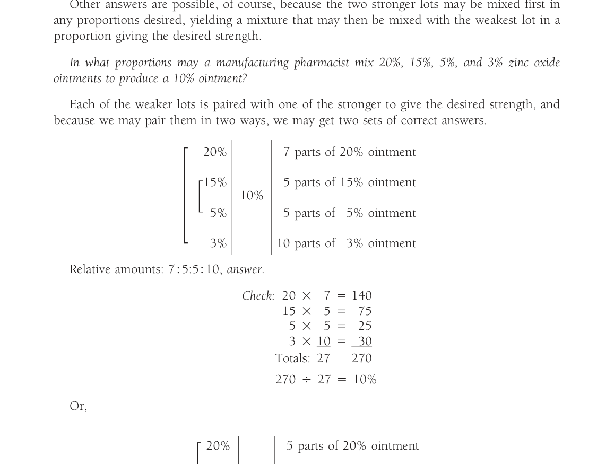

```
20% ──────►  7 parts of 20% ointment
15% ──────►  5 parts of 15% ointment
       10%
 5% ──────►  5 parts of  5% ointment
 3% ──────► 10 parts of  3% ointment

Relative amounts: 7 : 5 : 5 : 10, answer.
```

Check:

```
20 ×  7 = 140
15 ×  5 =  75
 5 ×  5 =  25
 3 × 10 =  30
Totals: 27    270

270 ÷ 27 = 10%
```

Or,

```
20% ──────►  5 parts of 20% ointment
15% ──────►  7 parts of 15% ointment
       10%
 5% ──────► 10 parts of  5% ointment
 3% ──────►  5 parts of  3% ointment

Relative amounts: 5 : 7 : 10 : 5, answer.
```

Check:

```
20 ×  5 = 100
15 ×  7 = 105
 5 × 10 =  50
 3 ×  5 =  15
Totals: 27    270

270 ÷ 27 = 10%
```

*How many milliliters of 50% w/v dextrose solution and how many milliliters of 5% w/v dextrose solution are required to prepare 4500 mL of a 10% w/v solution?*

```
50% ──────►  5 parts of 50% solution
       10%
 5% ──────► 40 parts of  5% solution
```

Relative amounts 5 : 40, or 1 : 8, with a total of 9 parts

```
9 (parts)     4500 (mL)
─────────  =  ─────────
1 (part)        x (mL)

x = 500 mL of 50% solution, and
```

```
9 (parts)     4500 (mL)
─────────  =  ─────────
8 (parts)       y (mL)

y = 4000 mL of 5% solution, answers.
```

*How many milliliters each of a 2% w/v solution and a 7% w/v solution should be used in preparing 1 gallon of a 3.5% w/v solution?*

1 gallon = 3785 mL

```
2% ──────► 3.5 parts of 2% solution
      3.5%
7% ──────► 1.5 parts of 7% solution
```

Relative amounts: 3.5 : 1.5, or 7 : 3, with a total of 10 parts

```
10 (parts)     3785 (mL)
──────────  =  ─────────
 7 (parts)       x (mL)

x = 2650 mL of 2% solution, and
```

```
10 (parts)     3785 (mL)
──────────  =  ─────────
 3 (parts)       y (mL)

y = 1135 mL of 7% solution, answers.
```

*How many grams of 2.5% hydrocortisone cream should be mixed with 360 g of 0.25% cream to make a 1% hydrocortisone cream?*

```
2.5%  ──────► 0.75 part of 2.5% cream
         1%
0.25% ──────► 1.5 parts of 0.25% cream
```

Relative amounts: 0.75 : 1.5, or 1 : 2

```
2 (parts)     360 (g)
─────────  =  ───────
1 (part)        x (g)

x = 180 g, answer.
```

Alternate (algebraic) solution of the same problem:

```
2.5(x) + 0.25(360) = 1(360 + x)
2.5x + 90 = 360 + x
1.5x = 270
x = 180 g, answer.
```

*How many grams of white petrolatum should be mixed with 250 g of 5% and 750 g of 15% zinc oxide ointments to prepare a 10% ointment?*

```
 5 × 250 =  1,250
15 × 750 = 11,250
Totals: 1000    12,500
```

12,500 ÷ 1000 = 12.5% of zinc oxide in 1000 g of a mixture of 5% and 15% ointments

```
12.5% ──────► 10 parts of 12.5% mixture
         10%
   0% ──────►  2.5 parts of white petrolatum
```

Relative amounts: 10 : 2.5, or 4 : 1

```
4 (parts)     1000 (g)
─────────  =  ────────
1 (part)        x (g)

x = 250 g, answer.
```

Check:

```
12.5 × 1000 = 12,500
   0 ×  250 =      0
Totals: 1250    12,500

12500 ÷ 1250 = 10%
```

*How many grams of zinc oxide should be added to 3200 g of 5% zinc oxide ointment to prepare an ointment containing 20% of zinc oxide?*

Zinc oxide (active ingredient) = 100%

```
100% ──────► 15 parts of 100% zinc oxide
        20%
  5% ──────► 80 parts of 5% ointment
```

Relative amounts: 15 : 80, or 3 : 16

```
16 (parts)     3200 (g)
──────────  =  ────────
 3 (parts)       x (g)

x = 600 g, answer.
```

Check:

```
100 ×  600 = 60,000
  5 × 3200 = 16,000
Totals: 3800    76,000

76,000 ÷ 3800 = 20%
```

Compare the solution of this problem by use of alligation alternate with other methods shown for the identical problem earlier in this chapter on page 262.

#### Specific Gravity of Mixtures

The methods of alligation medial and alligation alternate may be used in solving problems involving the specific gravities of different quantities of liquids of known specific gravities, provided no change in volume occurs when the liquids are mixed and that they are measured in a common denomination of volume.

> **CASE IN POINT 15.2**<sup>2</sup>: A pharmacist received the following prescription:
>
> ```
> ℞  Clindamycin Phosphate     1.5%
>    Alcohol (52% v/v) q.s. ad  120 mL
>    Sig: Apply daily for acne
> ```
>
> The pharmacist has no clindamycin phosphate powder but does have clindamycin phosphate sterile solution, 150 mg/mL, in vials. From the label, the pharmacist learns that the solution is aqueous.
>
> (a) How many milliliters of the clindamycin phosphate sterile solution should the pharmacist use in filling the prescription?
>
> (b) How many milliliters of 95% v/v of alcohol are required?
>
> (c) How many milliliters of water should be added to make 120 mL?

#### Example Calculations of Specific Gravity Using Alligation

*What is the specific gravity of a mixture of 1000 mL of syrup with a specific gravity of 1.300, 400 mL of glycerin with a specific gravity of 1.250, and 1000 mL of an elixir with a specific gravity of 0.950?*

```
1.300 × 1000 = 1300
1.250 ×  400 =  500
0.950 × 1000 =  950
Totals: 2400    2750

2750 ÷ 2400 = 1.146, answer.
```

*In what proportion must glycerin with a specific gravity of 1.25 and water be mixed to prepare a liquid having a specific gravity of 1.10?*

```
1.25 ──────► 0.10 parts of glycerin
        1.10
1.00 ──────► 0.15 parts of water
```

Relative amounts: 0.10 : 0.15, or 2 : 3, *answer.*

*How many milliliters of each of two liquids with specific gravities of 0.950 and 0.875 should be used to prepare 1500 mL of a liquid having a specific gravity of 0.925?*

```
0.950 ──────► 0.050, or 50 parts of liquid with specific gravity of 0.950
         0.925
0.875 ──────► 0.025, or 25 parts of liquid with specific gravity of 0.875
```

Relative amounts: 50 : 25, or 2 : 1, with a total of 3 parts

```
3 (parts)     1500 (mL)
─────────  =  ─────────
2 (parts)       x (mL)

x = 1000 mL of liquid with specific gravity of 0.950, and
```

```
3 (parts)     1500 (mL)
─────────  =  ─────────
1 (part)        y (mL)

y = 500 mL of liquid with specific gravity of 0.875, answers.
```

> **CASE IN POINT 15.3:** A pharmacist received the following prescription:
>
> ```
> ℞  Hydrocortisone     0.6%
>    AQUAPHOR q.s. ad   15 g
>    Sig. Apply to child’s affected area t.i.d.
> ```
>
> The pharmacist has no hydrocortisone powder but does have a hydrocortisone cream, 1%. How many grams each of hydrocortisone cream and Aquaphor should be used in filling the prescription?

#### Practice Problems (capítulo 15)

**Altering Strength, Stock Solutions, and Alligation Calculations**

1. If 250 mL of a 1:800 (v/v) solution were diluted to 1000 mL, what would be the ratio strength (v/v)?

2. If a pharmacist added 12 g of azelaic acid to 50 g of an ointment containing 15% azelaic acid, what would be the final concentration of azelaic acid in the ointment?

3. If 400 mL of a 20% w/v solution were diluted to 2 liters, what would be the percentage strength (w/v)?

4. BACTROBAN ointment contains 2% mupirocin. How many grams of a polyethylene glycol ointment base must be mixed with the contents of a 22-g tube of the BACTROBAN ointment to prepare one having a concentration of 5 mg/g?

5. How many grams of an 8% w/w progesterone gel must be mixed with 1.45 g of a single-use 4% w/w progesterone gel to achieve a gel of 5.5% w/w strength?

6. If 150 mL of a 17% (w/v) concentrate of benzalkonium chloride are diluted to 5 gallons, what will be the ratio strength (w/v) of the dilution?

7. AGENERASE oral solution contains 1.5% amprenavir. A pharmacist wished to change the drug concentration to 5 mg/mL by using a diluent of polyethylene glycols. How many milliliters of the oral solution and how many milliliters of the diluent should be used to prepare 8 fluidounces of the mixture?

> **Nota de atualização — 05/09/2026.** AGENERASE (amprenavir) solução oral 1,5% foi descontinuada pela GSK nos EUA em **outubro de 2007** — já estava fora de linha quando esta 13ª edição (2010) saiu. A conta (1,5% = 15 mg/mL → diluir a 5 mg/mL) não muda; o produto é histórico. Substituto da época: fosamprenavir (Lexiva) suspensão oral. **(a confirmar na fonte primária — carta GSK não aberta nesta sessão.)**
> **Fonte:** The Body Pro / GSK, *Agenerase Oral Solution and 50-mg Capsules to Be Discontinued in the U.S.* <https://www.thebodypro.com/article/agenerase-amprenavir-oral-solution-50-mg-capsules-discontinued-u->

8.

```
℞³ Tetracaine Hydrochloride     0.75% w/v
   Epinephrine Hydrochloride    1:4000 w/v
   Cocaine Hydrochloride        3% w/v
   Sodium Chloride Solution ad  30 mL
   Sig. Use in eye as directed.
```

How many milliliters each of a 2% w/v solution of tetracaine hydrochloride and a 1:1000 w/v solution of epinephrine hydrochloride should be used in preparing the prescription?

> **Nota de atualização — 05/09/2026.** O capítulo geral USP 〈7〉 *Labeling*, oficial em **01/05/2016**, passou a exigir quantidade/mL (e não razão) no rótulo de **injetáveis de um só fármaco**: epinefrina 1:1000 → 1 mg/mL; 1:10.000 → 0,1 mg/mL; isoproterenol 1:5000 → 0,2 mg/mL. A razão 1:N **permanece permitida** na epinefrina combinada a anestésico local (ex.: lidocaína 1% com epinefrina 1:100.000). A prescrição deste item é magistral (tetracaína + epinefrina + cocaína); a aritmética 1:4000 w/v = 0,25 mg/mL continua a do livro. Vale o mesmo para o isoproterenol 1:5000 do problema 34, que em ampola comercial hoje se rotula 0,2 mg/mL.
> **Fontes:** USP 〈7〉 *Labeling*, revisão 01/05/2019 <https://www.uspnf.com/sites/default/files/usp_pdf/EN/USPNF/revisions/gc-7-labeling-rb-notice-20190501.pdf>; USP, *Labeling* <https://www.usp.org/health-quality-safety/labeling>

9. If two tablespoonfuls of povidone iodine solution (10% w/v) were diluted to 1 quart with purified water, what would be the ratio strength (w/v) of the dilution?

10. How many milliliters of a 1:50 w/v boric acid solution can be prepared from 500 mL of a 5% w/v boric acid solution?

11. How many milliliters of water must be added to 250 mL of a 25% w/v stock solution of sodium chloride to prepare a 0.9% w/v sodium chloride solution?

12. How many milliliters of undecylenic acid would need to be added to 30 mL of a 20% undecylenic acid topical solution to change its concentration to 25%?

13. A certain product contains benzalkonium chloride in a concentration of 1:5000 w/v. How many milliliters of a 17% stock solution of benzalkonium chloride should be used in preparing 4 liters of the product?

14. How many milliliters of a 10% stock solution of a chemical are needed to prepare 120 mL of a solution containing 10 mg of the chemical per milliliter?

15. How many milliliters of water should be added to 1 gallon of 70% isopropyl alcohol to prepare a 30% solution for soaking sponges?

16. NEORAL oral solution contains 100 mg/mL of cyclosporine. If, on prescription, a pharmacist desired to prepare 30 mL of an oral solution containing 10% cyclosporine, how many milliliters of diluent should be used?

17. The formula for a buffer solution contains 1.24% w/v of boric acid. How many milliliters of a 5% w/v boric acid solution should be used to obtain the boric acid needed in preparing 1 liter of the buffer solution?

18.

```
Menthol            0.1%
Hexachlorophene    0.1%
Glycerin          10.0%
Alcohol 70%, to make  500 mL
Label: Menthol and Hexachlorophene Lotion.
```

How many milliliters of a 5% w/v stock solution of menthol in alcohol should be used to obtain the amount of menthol needed in preparing the lotion?

19.

```
℞  Gentian Violet Solution  500 mL
   1:100,000
   Sig. Mouthwash
```

How many milliliters of ½% stock solution of gentian violet should be used in preparing the prescription?

20. How many milliliters of Burow’s solution (containing 5% w/v of aluminum acetate) should be used in preparing 2 liters of a 1:800 (w/v) solution to be used as a wet dressing?

21.

```
℞⁴ Rhus Toxicodendron Extract     10 µg/mL
   Sterile Water for Injection qs  100 mL
   Sig. As directed.
```

How many milliliters of a 100 mg/mL concentrate of Rhus toxicodendron extract should be used in preparing the prescription?

22. If a pharmacist fortified 10 g of a 0.1% w/w tacrolimus (PROTOPIC) ointment by adding 12.5 g of an ointment containing 0.03% w/w of the same drug, what would be the percentage strength (w/v) of the mixture?

23. A physician prescribes an ophthalmic suspension to contain 100 mg of cortisone acetate in 8 mL of normal saline solution. The pharmacist has on hand a 2.5% suspension of cortisone acetate in normal saline solution. How many milliliters of this and how many milliliters of normal saline solution should be used in preparing the prescribed suspension?

24.

```
℞  Benzalkonium Chloride Solution  240 mL
   Make a solution such that
   10 mL diluted to a liter
   equals a 1:5000 solution.
   Sig. 10 mL diluted to a liter for external use.
```

How many milliliters of a 17% stock solution of benzalkonium chloride should be used in preparing the prescription?

25. How many milliliters of water should be added to 100 mL of a 1:125 w/v solution to make a solution such that 25 mL diluted to 100 mL will yield a 1:4000 dilution?

26. How many milliliters of a lotion base must be added to 30 mL of oxiconazole nitrate (OXISTAT) lotion 1% w/v, to reduce its concentration to 6 mg/mL?

27.

```
℞⁵ Lactic Acid            10% w/v
   Salicylic Acid         10% w/v
   Flexible Collodion q.s.  15 mL
   Sig. For wart removal. Use externally as directed.
```

How many milliliters of an 85% w/w solution of lactic acid with a specific gravity of 1.21 should be used in preparing the prescription?

28. How many milliliters of water should be mixed with 1200 g of 65% w/w alcohol to make 45% w/w alcohol?

29. How many milliliters of a syrup containing 85% w/v of sucrose should be mixed with 150 mL of a syrup containing 60% w/v of sucrose to make a syrup containing 80% w/v of sucrose?

30.

```
℞  Castor Oil                 5 mL
   Resorcinol Monoacetate    15 mL
   Alcohol 85%            ad  240 mL
   Sig. For the scalp.
```

How many milliliters each of 95% v/v alcohol and water should be used in preparing the prescription?

31. How many milliliters of 95% w/w sulfuric acid having a specific gravity of 1.820 should be used in preparing 2 liters of 10% w/v acid?

32. A pharmacist mixes 100 mL of 38% w/w hydrochloric acid with enough purified water to make 360 mL. If the specific gravity of hydrochloric acid is 1.20, calculate the percentage strength (w/v) of the resulting dilution.

33. How many milliliters of 28% w/w strong ammonia solution having a specific gravity of 0.89 should be used in preparing 2000 mL of 10% w/w ammonia solution with a specific gravity of 0.96?

34. In using isoproterenol hydrochloride solution (1:5000 w/v), 1 mL of the solution is diluted to 10 mL with sodium chloride injection before intravenous administration. What is the percentage concentration of the diluted solution?

35. A 1:750 w/v solution of benzalkonium chloride diluted with purified water in a ratio of 3 parts of the benzalkonium solution and 77 parts of purified water is recommended for bladder and urethral irrigation. What is the ratio strength of benzalkonium chloride in the final dilution?

36. How many milliliters of a suspension base must be mixed with 250 mL of a paroxetine (PAXIL) oral suspension, 10 mg/5 mL, to change its concentration to 0.1% w/v?

37. An insect venom concentrate for immunotherapy contains 100 µg/mL. How many milliliters of water should be added to 1.2 mL of the venom concentrate to yield a 1:100,000 dilution?

38. How many grams of a 2.5% w/w benzocaine ointment can be prepared by diluting 1 lb. of a 20% w/w benzocaine ointment with white petrolatum?

39. How many grams of salicylic acid should be added to 75 g of a polyethylene glycol ointment to prepare an ointment containing 6% w/w of salicylic acid?

40. How many grams of an ointment base must be added to 45 g of clobetasol (TEMOVATE) ointment, 0.05% w/w, to change its strength to 0.03% w/w?

41.

```
℞  Hydrocortisone Acetate Ointment 0.25%  10 g
   Sig. Apply to the eye.
```

How many grams of 2.5% ophthalmic hydrocortisone acetate ointment and how many grams of ophthalmic base (diluent) should be used in preparing the prescription?

42. How many grams of zinc oxide should be added to 3400 g of a 10% zinc oxide ointment to prepare a product containing 15% of zinc oxide?

43. How many milliliters of a nonmedicated, flavored syrup base must be added to 1 pint of ranitidine (ZANTAC) syrup, 15 mg/mL, to change its concentration to 5 mg/mL?

> **Nota de atualização — 05/09/2026.** A ranitidina do enunciado (ZANTAC xarope 15 mg/mL) **não existe mais**. O FDA pediu a retirada de todas as ranitidinas em **01/04/2020** (impureza NDMA que aumenta com o tempo e com calor). No Brasil, a **Resolução-RE nº 3.259, de 26/08/2020** (DOU de 27/08/2020) proibiu comercialização, distribuição, fabricação, importação, **manipulação** e propaganda; a **Portaria SCTIE/MS nº 76, de 29/12/2021** (Relatório Conitec nº 695) excluiu do SUS a solução injetável 25 mg/mL, o xarope 15 mg/mL e o comprimido 150 mg. A conta (pinta a 15 mg/mL → 5 mg/mL) permanece; o fármaco do exemplo, não.
> **Fontes:** FDA, 01/04/2020 <https://www.fda.gov/news-events/press-announcements/fda-requests-removal-all-ranitidine-products-zantac-market>; Conitec, Relatório de Recomendação nº 695 (cita a Resolução-RE nº 3.259, de 26/08/2020) <http://antigo-conitec.saude.gov.br/images/Relatorios/2021/20211230_Relatorio_695_exclusao_ranitidina_Final.pdf>; **Portaria SCTIE/MS nº 76, de 29/12/2021** <https://bvsms.saude.gov.br/bvs/saudelegis/sctie/2021/prt0076_30_12_2021.html>

44.

```
℞  Zinc Oxide               1.5
   Hydrophilic Petrolatum   2.5
   Purified Water           5
   Hydrophilic Ointment ad  30
   Sig. Apply to affected areas.
```

How much zinc oxide should be added to the product to make an ointment containing 10% of zinc oxide?

45. If equal portions of tretinoin gel (RETIN-A MICRO), 0.1% w/w and 0.04% w/w, are combined, what would be the resultant percentage strength?

46. A vaginal douche powder concentrate contains 2% w/w of active ingredient. What would be the percentage concentration (w/v) of the resultant solution after a 5-g packet of powder is dissolved in enough water to make 1 quart of solution?

47.<sup>6</sup> How many milliliters of a 0.2% solution of a skin-test antigen must be used to prepare 4 mL of a solution containing 0.04 mg/mL of the antigen?

48. How many milligrams of sodium fluoride are needed to prepare 100 mL of a sodium fluoride stock solution such that a solution containing 2 ppm of sodium fluoride results when 0.5 mL is diluted to 250 mL with water?

49.

```
℞⁷ Cyclosporine  2%
   Corn Oil      qs
   Sig. Use as directed.
```

(a) How many milliliters each of corn oil and a 10% solution of cyclosporine would be needed to prepare 30 mL of the prescription? (b) If you then wished to dilute the prescription to a concentration of 1.5% cyclosporine, how many additional milliliters of corn oil would be required?

50. A prescription calls for 0.005 g of morphine sulfate. How many milligrams of a 1:10 trituration may be used to obtain the morphine sulfate?

51. If 100 mg of a 1:10 trituration of mechlorethamine hydrochloride (MUSTARGEN) are diluted to 10 mL with water for injection, how many milliliters of the injection should be administered to a 132-lb. patient if the dose of mechlorethamine hydrochloride is 0.1 mg/kg?

52. A hospital worker combined 2 fluidounces of a povidone-iodine cleaner, 7.5% w/v, with 4 fluidounces of a povidone-iodine topical solution, 10% w/v. Calculate the resulting strength of the povidone-iodine mixture.

53. If 60 mL of a combination gel of hydrocortisone acetate, 1% w/w, and pramoxide, 1% w/w, are mixed with 12.5 mL of a gel containing hydrocortisone acetate, 2.5% w/w, and pramoxide, 1% w/w, calculate the percentage strength of each of the two drugs in the mixture.

54. A drug is commercially available in capsules each containing 12.5 mg of drug and 37.5 mg of diluent. How many milligrams of additional diluent must be added to the contents of one capsule to make a dilution containing 0.5 mg of drug in each 100 mg of powder?

55. Calculate the percentage of alcohol in a lotion containing 2 liters of witch hazel (14% of alcohol), 1 liter of alcohol (95%), and enough boric acid solution to make 5 liters.

56. In what proportion should 5% and 1% hydrocortisone ointments be mixed to prepare a 2.5% ointment?

57. In what proportion should a 20% zinc oxide ointment be mixed with white petrolatum (diluent) to produce a 3% zinc oxide ointment?

58. In what proportion should 30% and 1.5% hydrogen peroxide solutions be mixed to prepare a 3% hydrogen peroxide solution?

59. The solvent for the extraction of a vegetable drug is 70% alcohol. In what proportion may 95%, 60%, and 50% alcohol be mixed to prepare a solvent of the desired concentration?

60. A parent diluted 1 mL ibuprofen oral drops (Infant’s MOTRIN Concentrated Drops) with 15 mL of water prior to administering the medication. The concentrated drops contain ibuprofen, 50 mg/1.25 mL. Calculate the concentration of ibuprofen in the dilution in (a) mg/mL, and (b) as a percentage strength.

61. How many milliliters of a 2.5% w/v chlorpromazine hydrochloride injection and how many milliliters of 0.9% w/v sodium chloride injection should be used to prepare 500 mL of a 0.3% w/v chlorpromazine hydrochloride injection?

62. How many milliliters of a 2% w/v solution of lidocaine hydrochloride should be used in preparing 500 mL of a solution containing 4 mg of lidocaine hydrochloride per milliliter of solution?

63. Dopamine hydrochloride injection is available in 5-mL ampuls containing 40 mg of dopamine hydrochloride per milliliter. The injection must be diluted before administration. If a physician wishes to use sodium chloride injection as the diluent and wants a dilution containing 0.04% w/v of dopamine hydrochloride, how many milliliters of sodium chloride injection should be added to 5 mL of the injection?

64. A solution of benzalkonium chloride is available in a concentration of 1:750 w/v. How many milliliters of purified water should be added to 30 mL of the solution to prepare a 1:5000 benzalkonium chloride solution for use as a wet dressing to the skin?

65. If an antibiotic injection contains 5% w/v of the drug, how many milliliters of diluent should be added to 5 mL of the injection to prepare a concentration of 5 mg of the antibiotic per milliliter?

66.<sup>8</sup> How many milliliters of sterile water for injection should be added to a vial containing 5 µg/mL of a drug to prepare a solution containing 1.5 µg/mL of the drug?

67.

```
℞  Zephiran Chloride Solution (17% w/v)  q.s.
   Purified Water, to make               480 mL
   Sig. One tbsp. diluted to 1 gallon with water
        to make a 1:10,000 dilution.
```

How many milliliters of zephiran chloride solution should be used in preparing the prescription?

**Specific Gravity Calculations of Mixtures**

68. What is the specific gravity of a mixture containing 1000 mL of water, 500 mL of glycerin having a specific gravity of 1.25, and 1500 mL of alcohol having a specific gravity of 0.81? (Assume no contraction occurs when the liquids are mixed.)

69. If a pharmacist mixed 1 pint of propylene glycol having a specific gravity of 1.20 with 500 mL of water, how many milliliters additional of propylene glycol should be added to change the specific gravity to 1.15?

70. How many milliliters of a syrup having a specific gravity of 1.350 should be mixed with 3000 mL of a syrup having a specific gravity of 1.250 to obtain a product having a specific gravity of 1.310?

71. How many grams of sorbitol solution having a specific gravity of 1.285 and how many grams (milliliters) of water should be used in preparing 500 g of a sorbitol solution having a specific gravity of 1.225?

#### Answers (capítulo 15)

**Case in Point 15.1**

Cefuroxime axetil present in original suspension:

```
100 mL × 250 mg / 5 mL = 5000 mg
```

Cefuroxime axetil required in strengthened suspension:

```
100 mL × 300 mg / 5 mL = 6000 mg
```

Cefuroxime axetil to add:

6000 mg − 5000 mg = 1000 mg

Tablets required:

```
1000 mg × 1 tablet / 250 mg = 4 tablets, answer.
```

**A Second Look**

There are a number of ways in which this problem could be addressed. One way would be to add another 250-mg pulverized tablet, calculate the volume of suspension that could be prepared at a concentration of 300 mg/5 mL, dispense 100 mL of that and discard the remaining volume.

Cefuroxime axetil in strengthened suspension plus another tablet:

6000 mg + 250 mg = 6250 mg cefuroxime axetil

Volume of suspension that could be prepared at a concentration of 300 mg/5 mL:

```
5 mL / 300 mg × 6250 mg = 104.17 mL
```

Volume to dispense: 100 mL, and

Volume to discard: 4.17 mL, *answers.*

Proof: “If there are 6250 mg of cefuroxime axetil in 104.17 mL, how many milligrams would be present in each 5 mL?”

```
6250 mg × 5 mL / 104.17 mL = 299.99 or 300 mg, answer.
```

**Case in Point 15.2**

(a)

```
120 mL × 0.15 (1.5%) = 1.8 g
1.8 g = 1800 mg
1800 mg × 1 mL / 150 mg = 12 mL, clindamycin phosphate sterile solution, answer.
```

(b) If the pharmacist had had clindamycin phosphate powder with which to fill the prescription, 1.8 g would have been used, and that quantity would have taken up a negligible volume on solution in the 52% v/v alcohol. Thus, the interpretation of the prescription is that the 120 mL (not 120 mL − 12 mL) of 52% v/v alcohol should be used.

```
120 mL × 0.52 (52% v/v) = 62.4 mL of solute (100% v/v alcohol)

62.4 mL / x mL = 95 mL / 100 mL;  x = 65.68 mL of 95% v/v alcohol, answer.
```

(c) Due to contraction when alcohol and water are mixed, the volume of water cannot be determined by subtracting 65.68 mL from 120 mL; thus, a sufficient volume of water is used (q.s.) to make 120 mL, *answer.*

**Case in Point 15.3**

```
15 g × 0.006 (0.6% w/w) = 0.09 g hydrocortisone
1% hydrocortisone cream = 1 g hydrocortisone / 100 g

Thus, 0.09 g / x g = 1 g / 100 g;  x = 9 g hydrocortisone cream, and
15 g − 9 g = 6 g AQUAPHOR, answers.
```

*Note: The problem also may be solved by alligation alternate.*

**Practice Problems**

| # | Answer |
| :---- | :---- |
| 1 | 1:3200 v/v |
| 2 | 31.5% w/w |
| 3 | 4% w/v |
| 4 | 66 g polyethylene glycol ointment base |
| 5 | 0.87 g progesterone gel, 8% |
| 6 | 1:742 w/v |
| 7 | 78.9 mL AGENERASE oral solution; 157.7 mL polyethylene glycols |
| 8 | 11.25 mL tetracaine hydrochloride solution; 7.5 mL epinephrine hydrochloride solution |
| 9 | 1:315 w/v |
| 10 | 1250 mL boric acid solution |
| 11 | 6694.4 mL water |
| 12 | 2 mL undecylenic acid |
| 13 | 4.7 mL stock solution |
| 14 | 12 mL stock solution |
| 15 | 5046.67 mL water |
| 16 | 0 mL diluent |
| 17 | 248 mL boric acid solution |
| 18 | 10 mL stock solution |
| 19 | 1 mL stock solution |
| 20 | 50 mL Burow’s solution |
| 21 | 0.01 mL concentrate |
| 22 | 0.06% w/w |
| 23 | 4 mL cortisone acetate suspension; 4 mL normal saline solution |
| 24 | 28.2 mL stock solution |
| 25 | 700 mL water |
| 26 | 20 mL lotion base |
| 27 | 1.46 mL lactic acid solution |
| 28 | 533.33 mL water |
| 29 | 600 mL syrup |
| 30 | 196.84 mL alcohol; q.s. with water to 240 mL |
| 31 | 115.67 mL sulfuric acid, 95% |
| 32 | 12.67% w/v |
| 33 | 770.47 mL strong ammonia solution |
| 34 | 0.002% w/v |
| 35 | 1:20,000 w/v |
| 36 | 250 mL suspension base |
| 37 | 10.8 mL water |
| 38 | 3632 g benzocaine ointment, 2.5% |
| 39 | 4.787 g salicylic acid |
| 40 | 30 g ointment base |
| 41 | 1 g hydrocortisone acetate ointment, 2.5%; 9 g ophthalmic base |
| 42 | 200 g zinc oxide |
| 43 | 946 mL syrup base |
| 44 | 1.667 g zinc oxide |
| 45 | 0.07% w/w |
| 46 | 0.011% w/v |
| 47 | 0.08 mL antigen, 0.2% |
| 48 | 100 mg sodium fluoride |
| 49 | (a) 24 mL corn oil; 6 mL cyclosporin solution. (b) 10 mL corn oil |
| 50 | 50 mg trituration |
| 51 | 6 mL MUSTARGEN injection |
| 52 | 9.17% w/v |
| 53 | 1% pramoxide; 1.26% hydrocortisone |
| 54 | 2450 mg diluent |
| 55 | 24.6% v/v |
| 56 | 3:5 |
| 57 | 3:17 |
| 58 | 1.5:27 or 3:54 or 1:18 |
| 59 | 6:5:5 |
| 60 | (a) 2.5 mg/mL ibuprofen; (b) 2.5% ibuprofen |
| 61 | 60 mL chlorpromazine hydrochloride injection; 440 mL sodium chloride injection |
| 62 | 100 mL lidocaine hydrochloride injection |
| 63 | 495 mL sodium chloride injection |
| 64 | 170 mL purified water |
| 65 | 45 mL diluent |
| 66 | 2.33 mL sterile water for injection |
| 67 | 71.2 mL zephiran chloride solution |
| 68 | 0.947 |
| 69 | 1031.38 mL propylene glycol |
| 70 | 4500 mL syrup |
| 71 | 394.737 g sorbitol solution; 105.263 mL water |

*Nota sobre o item 60 (b):* o gabarito impresso no livro traz “2.5% ibuprofen”. 2.5 mg/mL = 0.25% w/v; a casa decimal do gabarito impresso está deslocada. A transcrição do número segue o original; o valor coerente com (a) é **0.25%**. Ver [Notas da transcrição (capítulo 15)](#notas-da-transcrição-capítulo-15).

#### References (capítulo 15)

1. United States Pharmacopeia 31st Rev. National Formulary 26. Rockville, MD: United States Pharmacopeial Convention, 2008;1:1147.
2. Beach W. Athens, GA: College of Pharmacy, University of Georgia, 2005.
3. Prince SJ. Calculations. *International Journal of Pharmaceutical Compounding* 2000;4:221.
4. Karolchyk S. Treating patients allergic to poison ivy. *International Journal of Pharmaceutical Compounding* 1998;2:421.
5. Prince SJ. Calculations. *International Journal of Pharmaceutical Compounding* 1998;2:310.
6. Prince SJ. Calculations. *International Journal of Pharmaceutical Compounding* 1998;2:453.
7. Prince SJ. Calculations. *International Journal of Pharmaceutical Compounding* 2000;4:393.
8. Prince SJ. Calculations. *International Journal of Pharmaceutical Compounding* 1999;3:145.

#### Notas da transcrição (capítulo 15)

- As **figuras** do capítulo (Calculations Capsule, esquema da solução-estoque e diagramas de aligação) foram recortadas do PDF e estão em `recursos/ansel13-cap15/`. No texto, a aligação também foi remontada em tabela, para o arquivo continuar legível sem as imagens.
- As proporções, que no original vêm empilhadas em duas colunas, foram convertidas em fração \(\frac{a}{b} = \frac{c}{d}\). Os operadores (×, =, −, +) que o OCR do PDF entregava como glifos foram restaurados pelo confronto com a página.
- Os problemas de treino, em duas colunas no livro, foram linearizados na ordem 1–71. Os números, as unidades e a grafia seguem o original — inclusive “pramoxide” (o fármaco é pramoxina), “clobestasol” no OCR (no impresso, clobetasol/TEMOVATE) e a razão 1:N com dois-pontos.
- O problema 22 pergunta *percentage strength (w/v)* de uma mistura de pomadas; o gabarito imprime **0.06% w/w**. A transcrição mantém os dois como no original.
- O problema 60 (b): o gabarito impresso traz 2.5% de ibuprofeno; 2.5 mg/mL = **0.25%** w/v. O original do gabarito foi transcrito na tabela; o valor coerente com (a) fica nesta nota.
- **Notas de atualização (05/09/2026):** cinco blocos iniciados por *Nota de atualização* — ácidos NF (monografia vigente), MUSTARGEN (descontinuado), AGENERASE (já descontinuado em 2007), USP 〈7〉 (razão em injetáveis) e ranitidina/ZANTAC (proibida no Brasil). O texto do livro não foi reescrito.
- O galão do livro é o **americano** (3785 mL) e a pinta, 473 mL. Prova brasileira trabalha em mL.
- Os capítulos 6, 9, 13, 15 e 17 estão transcritos neste arquivo.

## Atualizações desde a 13ª edição (2010) — capítulo 17

A transcrição abaixo é da **13ª edição em inglês** (Lippincott Williams & Wilkins, 2010; o PDF enviado cobre as páginas **287–309** do livro). O título do capítulo permanece o mesmo na 15ª (2016) e na 16ª (*Stoklosa and Ansel's Pharmaceutical Calculations*, 2021, cap. 17, p. 328–357). A 16ª saiu **antes** da revisão oficial de ⟨795⟩/⟨797⟩ (1º/11/2023); mesmo quem estuda pela edição nova precisa das notas abaixo.

Levantamento fechado em **setembro de 2026**. Nove notas ao longo da transcrição — as de transcrição (typos do original) estão em [Notas da transcrição (capítulo 17)](#notas-da-transcrição-capítulo-17).

Onde o capítulo está nas edições:

| Edição | Ano | Capítulo | Páginas (inglês) |
| :---- | :---- | :---- | :---- |
| 13ª (a transcrita) | 2010 | **17** — Selected Calculations in Contemporary Compounding | 287–309 |
| 15ª | 2016 | **17** (mesmo título) | — |
| 16ª (*Stoklosa and Ansel's*) | 2021 | **17** (mesmo título) | 328–357 |

### 1. O que a aritmética do capítulo ainda acerta

Constituição de pós orais e parenterais, volume ocupado pelo pó, uso de comprimido/cápsula/ampola como fonte de fármaco, *diluent displacement* em cápsulas e calibração de molde de supositório: a conta é a mesma. A [#Q2023-27](../QOS_PMMG_Banco_de_Questoes.md#2023--q27--conhecimentos-específicos) (penicilina G 5.000.000 UI, deslocamento 2 mL) e a [#Q2024-26](../QOS_PMMG_Banco_de_Questoes.md#2024--q26--conhecimentos-específicos) (Tazocin 4,5 g, volume final 23 mL) são este capítulo.

### 2. USP ⟨795⟩ e ⟨797⟩: o capítulo cita a edição de 2008

O texto apoia-se em USP 31/NF 26 (2008), capítulos ⟨795⟩ (não estéril) e ⟨797⟩ (estéril), e ainda fala em **risk levels** (low/medium/high) para preparações estéreis. A revisão publicada em **1º/11/2022** tornou-se oficial em **1º/11/2023**:

- **⟨797⟩** abandonou os níveis de risco. Vale **Category 1 / 2 / 3**, definidas pelo ambiente (SCA não classificada vs. *cleanroom suite* ISO 5/7/8) e pelo BUD, não pela complexidade do processo. Category 1: BUD ≤ 12 h em temperatura ambiente ou ≤ 24 h refrigerado. Category 3 chega a 180 dias congelado, com teste de esterilidade e endotoxina.
- **⟨795⟩** passou a fixar BUD por **atividade de água** (*a*<sub>w</sub>), não por “oral com água / tópico / não aquoso”. Aquoso não preservado (*a*<sub>w</sub> ≥ 0,6): **14 dias refrigerado**. Aquoso preservado: **35 dias**. Líquido oral não aquoso: **90 dias**. Outras formas não aquosas (cápsulas, supositórios, pomadas): **180 dias**. Os “até 10 dias à temperatura ambiente ou 14 sob refrigeração” do capítulo são prazo de **produto industrializado reconstituído segundo a bula**, não BUD de preparação magistral.
- **⟨800⟩** (*Hazardous Drugs—Handling in Healthcare Settings*), inexistente em 2010, tornou-se oficial em **1º/12/2019** e compendialmente aplicável com as revisões de ⟨795⟩/⟨797⟩ em 2023.
- **⟨825⟩** (radiofármacos) também é capítulo novo, posterior a esta edição.

No Brasil, USP não é lei. Quem manda em farmácia de manipulação é a **RDC/ANVISA nº 67, de 8/10/2007** (e a RDC 87/2008), transcrita no [2.02](2.02%20Boas%20pr%C3%A1ticas%20de%20manipula%C3%A7%C3%A3o%20de%20magistrais%2C%20oficinais%20e%20produtos%20est%C3%A9reis%20e%20n%C3%A3o%20est%C3%A9reis.md). O Anexo IV (estéreis) está em revisão: TAP nº 9, de 27/02/2025; Informe nº 1/2025/SEI/DIRE4/ANVISA (ROP 10/2025) cita expressamente o ⟨797⟩ como referência internacional à qual o anexo vigente não se alinha. Consulta pública ainda não publicada. Diálogo setorial em 30/06/2026.

### 3. Fármacos dos exemplos que saíram de cena

| No capítulo | O que mudou |
| :---- | :---- |
| **Efalizumabe (RAPTIVA)** — problema 7 | Retirada voluntária nos EUA em **08/04/2009** (PML); EMA retirou a autorização em **09/06/2009**. O exercício é histórico: o produto não existe. |
| **Meticilina (Staphcillin)** — Case in Point 17.2 | Descontinuada há décadas (nefrite intersticial, MRSA). A conta de reconstituição + infusão continua válida com oxacilina/nafeilina ou outro frasco. |
| **Ranitidina (ZANTAC)** — Case in Point 17.3 | FDA pediu retirada de **todos** os produtos em **01/04/2020** (NDMA). No Brasil, **Resolução-RE nº 3.259, de 26/08/2020** proibiu comercialização, fabricação, importação, **manipulação** e propaganda; a Conitec excluiu do SUS (Relatório nº 695; Portaria SCTIE/MS nº 76, de 29/12/2021). |
| **Cefprozil (CEFZIL)** — primeiro exemplo oral | Marca descontinuada (carta BMS de 07/09/2010); FDA determinou em 2018 que **não** foi por segurança/eficácia. Genéricos de cefprozil seguem. A conta (2,5 g → 125 mg/5 mL) não muda. |
| **Oseltamivir 15 mg/mL em cherry syrup** — problema 58 | A suspensão industrializada (TAMIFLU 6 mg/mL após constituição) é o produto preferido. Manipular a partir das cápsulas de 75 mg é procedimento **de emergência** da bula, na concentração **6 mg/mL** (não 15), só se o industrializado não estiver disponível. |

### 4. PCAB e IACP

A referência 1 aponta `pcab.org` (2008). Em **julho de 2014** o PCAB passou a ser serviço da **ACHC** (*Accreditation Commission for Health Care*); o sítio vigente é <https://achc.org/pcab/>. A IACP (ref. 2) segue em <https://www.iacprx.org>.

### O que mais vale a pena guardar para a prova

1. **Deslocamento do pó entra no denominador** — é o núcleo deste capítulo e da [#Q2023-27](../QOS_PMMG_Banco_de_Questoes.md#2023--q27--conhecimentos-específicos)/[#Q2024-26](../QOS_PMMG_Banco_de_Questoes.md#2024--q26--conhecimentos-específicos).
2. **BUD de magistral ≠ prazo da bula do industrializado reconstituído.**
3. **Ranitidina não se manipula no Brasil** desde a RE 3.259/2020 — o Case 17.3 é só a conta.
4. No hospital brasileiro, ⟨795⟩/⟨797⟩/⟨800⟩ explicam a lógica internacional; a norma cobrada é a **RDC 67/2007** (e, para antineoplásicos, a RDC 220/2004 no [2.04](2.04%20Prepara%C3%A7%C3%A3o%20e%20dispensa%C3%A7%C3%A3o%20de%20terapia%20antineopl%C3%A1sica.md)).

### Fontes consultadas

<details>
<summary><strong>Referências das atualizações</strong> — clique para abrir</summary>

- USP. Publicação da revisão de ⟨795⟩ e ⟨797⟩ em 01/11/2022; data oficial 01/11/2023.
  <https://www.uspnf.com/notices/795-pub-announcement-20221101>
  <https://www.uspnf.com/notices/797-pub-announcement-20221101>
  <https://www.usp.org/compounding/general-chapter-795>
  <https://www.usp.org/compounding/general-chapter-797>
- USP ⟨795⟩ FAQs (01/11/2023) e ⟨797⟩ FAQs (dez/2023).
  <https://www.usp.org/compounding/general-chapter-795>
- USP ⟨800⟩ *Hazardous Drugs—Handling in Healthcare Settings* — official date 01/12/2019.
  <https://www.usp.org/compounding/general-chapter-hazardous-drugs-handling-healthcare>
- NABP. *USP Compounding Webinar Handout*, 14/09/2023 (tabela BUD ⟨795⟩ 2008 × 2023).
  <https://nabp.pharmacy/wp-content/uploads/2023/09/USP-Compounding-Webinar-Handout-September-14-2023.pdf>
- ANVISA. **RDC nº 67, de 8/10/2007** (BPMF). <https://bvsms.saude.gov.br/bvs/saudelegis/anvisa/2007/res0067_08_10_2007.html>
- ANVISA. Termo de Abertura de Processo (TAP) nº 9, de 27/02/2025 — revisão do Anexo IV da RDC 67/2007.
  <https://anvisalegis.datalegis.net/action/ActionDatalegis.php?acao=abrirTextoAto&codTipo=&cod_menu=9484&cod_modulo=631&desItem=&desItemFim=&numeroAto=00000009&orgao=ANVISA%2FMS&pesquisa=true&seqAto=222&tipo=TAP&valorAno=2025>
- ANVISA. Informe nº 1/2025/SEI/DIRE4 (ROP 10/2025, item 1.1) — processo 25351.815666/2024-91.
  <https://www.gov.br/anvisa/pt-br/composicao/diretoria-colegiada/reunioes-da-diretoria/votos/2025/rop-10.2025/1-1.pdf>
- FDA. *Statement on the Voluntary Withdrawal of Raptiva From the U.S. Market*, 08/04/2009.
  <https://www.sec.gov/Archives/edgar/data/791908/000095016209000187/ex_1.htm>
- EMA. Raptiva (efalizumab) — retirada da autorização em 09/06/2009.
  <https://www.ema.europa.eu/en/medicines/human/EPAR/raptiva>
- FDA. *FDA Requests Removal of All Ranitidine Products (Zantac) from the Market*, 01/04/2020.
  <https://www.fda.gov/news-events/press-announcements/fda-requests-removal-all-ranitidine-products-zantac-market>
- ANVISA. Resolução-RE nº 3.259, de 26/08/2020 (DOU 27/08/2020, Seção 1, p. 164) — proibição da ranitidina, inclusive **manipulação**.
  <https://www.in.gov.br/en/web/dou/-/resolucao-re-n-3.259-de-26-de-agosto-de-2020-274384354>
- Conitec. Relatório de Recomendação nº 695, 30/12/2021 (cita a RE nº 3.259).
  <http://antigo-conitec.saude.gov.br/images/Relatorios/2021/20211230_Relatorio_695_exclusao_ranitidina_Final.pdf>
- Ministério da Saúde. Portaria SCTIE/MS nº 76, de 29/12/2021 — exclusão da ranitidina do SUS.
  <https://bvsms.saude.gov.br/bvs/saudelegis/sctie/2021/prt0076_30_12_2021.html>
- FDA. *Determination That CEFZIL (Cefprozil) … Was Not Withdrawn From Sale for Reasons of Safety or Effectiveness*, 83 FR 45940, 11/09/2018.
  <https://www.federalregister.gov/documents/2018/09/11/2018-19663/determination-that-cefzil-cefprozil-tablets-250-milligrams-and-500-milligrams-and-for-oral>
- DailyMed / FDA. Bula TAMIFLU (oseltamivir) — suspensão 6 mg/mL preferida; manipulação de emergência a partir das cápsulas.
  <https://dailymed.nlm.nih.gov/dailymed/drugInfo.cfm?setid=03a2a7f0-406c-4784-84c1-5fd5f5be4773>
- ACHC. PCAB Accreditation (serviço da ACHC desde julho/2014).
  <https://achc.org/pcab/>

</details>

## Transcrição — Ansel, 13ª ed., capítulo 17 (páginas 287–309)

> [!IMPORTANT]
> Transcrição *ipsis litteris* de **Howard C. Ansel, *Pharmaceutical Calculations*, 13th edition
> (2010), Chapter 17: Selected Calculations in Contemporary Compounding**, páginas **287–309**,
> a partir do PDF enviado. O texto corrido não foi traduzido nem reescrito; a quebra de linha
> do PDF foi recomposta em parágrafos Markdown, os títulos viraram cabeçalhos e as proporções
> foram remontadas em frações. Figuras extraídas para `recursos/ansel13-cap17/`. Onde o original
> ficou incorreto ou o fármaco saiu de cena, o texto permanece e um bloco *Nota de atualização*
> registra o que mudou. Typos do próprio livro (não da extração) estão em
> [Notas da transcrição (capítulo 17)](#notas-da-transcrição-capítulo-17).

**Fonte:** ANSEL, H. C. *Pharmaceutical Calculations*. 13th ed. Philadelphia: Lippincott Williams & Wilkins, 2010. **Chapter 17: Selected Calculations in Contemporary Compounding**, p. 287–309.

### Sumário do capítulo 17

- [Objectives](#objectives-capítulo-17)
- [General Considerations in Compounding Practice](#general-considerations-in-compounding-practice)
- [Constitution of Dry Powders](#constitution-of-dry-powders)
  - [Constitution of Dry Powders for Oral Solution or Suspension](#constitution-of-dry-powders-for-oral-solution-or-suspension)
  - [Constitution of Dry Powders for Parenteral Solution](#constitution-of-dry-powders-for-parenteral-solution)
- [Use of Prefabricated Dosage Forms in Compounding](#use-of-prefabricated-dosage-forms-in-compounding)
- [Special Calculations: Capsule Filling and Suppository Molding](#special-calculations-capsule-filling-and-suppository-molding)
  - [Capsule Filling](#capsule-filling)
  - [Suppository Molding](#suppository-molding)
- [Compounding Specialized Formulas](#compounding-specialized-formulas)
- [Practice Problems](#practice-problems-capítulo-17)
- [Answers to “Case in Point” and Practice Problems](#answers-to-case-in-point-and-practice-problems-capítulo-17)
- [References](#references-do-capítulo-17)
- [Notas da transcrição](#notas-da-transcrição-capítulo-17)

---

### 17 Selected Calculations in Contemporary Compounding

#### Objectives (capítulo 17)

Upon successful completion of this chapter, the student will be able to:

- Perform calculations for the constitution of dry powders for oral solution or suspension.
- Perform calculations for the constitution of dry powders for parenteral use.
- Perform calculations for the use of prefabricated dosage forms in compounding procedures.
- Perform calculations applied to the filling of capsules.
- Perform calculation applied to the preparation of suppositories by molding.

Pharmaceutical compounding is the process by which pharmacists combine therapeutically active ingredients with pharmaceutical materials in the preparation of prescriptions and medication orders to meet the specific needs of individual patients. This is in contrast to the large-scale production of pharmaceutical products to meet the needs of the general population that is termed pharmaceutical manufacturing.

Compounding is an activity for which pharmacists are uniquely qualified by virtue of their education, training, and experience. Many pharmacists have developed specialized practices in compounding that have contributed greatly to the medication needs of their patients.

This chapter presents calculations that apply to the preparation of oral and parenteral fluids by the constitution of dry powders; the use of tablets, capsules, and injections as the source of active therapeutic ingredients (ATI) in compounding; calculations specifically applicable to the extemporaneous preparation of suppositories and capsules; and calculations relevant to specialized prescriptions, medication orders, and formulas.

### General Considerations in Compounding Practice

Compounded prescriptions may be desired for a number of reasons, including<sup>1,2</sup>:

- the need to adjust the strength or dose of a commercially available product to meet the specific requirements of a patient (e.g., a pediatric patient);
- the need to provide a product more organoleptically acceptable (e.g., taste) to a pediatric or veterinary patient;
- the need to prepare a different dosage form (e.g., a liquid) than the commercially available product (e.g., a tablet) to meet the requirements of a patient unable to swallow the existing dosage form (e.g., a pediatric or elderly patient);
- the need to prepare a dosage form free of an agent (e.g., sugar, preservatives) in the commercially available product that cannot be tolerated by a patient; and
- the need to provide a patient with a specifically designed formulation of an approved drug or drug combination, which is unavailable as a commercial product.

The United States Pharmacopeia—National Formulary (USP/NF) devotes a chapter to compounding nonsterile preparations that includes sections titled *Definitions*; *Ingredient Selection and Calculations*; *Checklist for Acceptable Strength, Quality, and Purity*; *Compounded Preparations*; *Compounding Process*; and *Compounding Records and Documents*.<sup>3</sup> Another USP/NF chapter is devoted compounding sterile preparations.<sup>4</sup> These chapters, along with other pharmaceutical references, should be referred to as required to ensure that standards of good pharmaceutical practice in compounding are understood and met.<sup>5</sup> Among the steps included in the USP/NF section titled *Compounding Process* is, “Perform necessary calculations to establish the amounts of ingredients needed.”<sup>3</sup>

> **Nota de atualização — 05/09/2026.** O capítulo cita a USP 31/NF 26 (2008): ⟨795⟩ *Pharmaceutical Compounding—Nonsterile Preparations* e ⟨797⟩ *Pharmaceutical Compounding—Sterile Preparations*. Esses dois capítulos foram republicados em 01/11/2022 e tornaram-se oficiais em **01/11/2023**. O ⟨797⟩ substituiu os *risk levels* (low/medium/high) pelas **Category 1, 2 e 3**. O ⟨795⟩ passou a fixar BUD pela atividade de água. O ⟨800⟩ (*Hazardous Drugs*), inexistente nesta edição, é oficial desde 01/12/2019. No Brasil a norma de manipulação segue sendo a RDC/ANVISA nº 67, de 08/10/2007; o Anexo IV (estéreis) está em revisão (TAP nº 9, de 27/02/2025). Detalhe no panorama [Atualizações desde a 13ª edição](#atualizações-desde-a-13ª-edição-2010--capítulo-17).
> **Fontes:** USP ⟨795⟩/⟨797⟩ publication announcements, 01/11/2022 <https://www.uspnf.com/notices/795-pub-announcement-20221101> <https://www.uspnf.com/notices/797-pub-announcement-20221101>; USP ⟨800⟩ <https://www.usp.org/compounding/general-chapter-hazardous-drugs-handling-healthcare>; ANVISA TAP nº 9/2025 <https://anvisalegis.datalegis.net/action/ActionDatalegis.php?acao=abrirTextoAto&codTipo=&cod_menu=9484&cod_modulo=631&desItem=&desItemFim=&numeroAto=00000009&orgao=ANVISA%2FMS&pesquisa=true&seqAto=222&tipo=TAP&valorAno=2025>; Informe ANVISA nº 1/2025/SEI/DIRE4 <https://www.gov.br/anvisa/pt-br/composicao/diretoria-colegiada/reunioes-da-diretoria/votos/2025/rop-10.2025/1-1.pdf>

### Constitution of Dry Powders

#### Constitution of Dry Powders for Oral Solution or Suspension

Some drugs, most notably antibiotics, lose their potency in a relatively short period when prepared in a liquid dosage form. To enhance the shelf-life of these drugs, manufacturers provide products to the pharmacy in dry powder form for constitution with purified water or special diluent at the time a prescription or medication order is received. Depending on the product, the dry powder may be stable for about 24 months. After constitution, the resultant solution or suspension is stable in the quantities usually dispensed, for up to 10 days at room temperature or 14 days if maintained under refrigeration.

> **Nota de atualização — 05/09/2026.** Os “até 10 dias à temperatura ambiente ou 14 sob refrigeração” são prazo típico de **antibiótico oral industrializado** após constituição segundo a **bula do produto** — não BUD de preparação magistral. O ⟨795⟩ de 2023, na ausência de monografia ou dado de estabilidade específico, limita forma aquosa **não preservada** (*a*<sub>w</sub> ≥ 0,6) a **14 dias refrigerado** e aquosa **preservada** a **35 dias** (ambiente ou refrigerado). Sempre prevalece o menor entre o BUD da USP e o prazo da bula/estabilidade química.
> **Fontes:** USP ⟨795⟩ FAQs, 01/11/2023 <https://www.usp.org/compounding/general-chapter-795>; NABP USP Compounding Webinar Handout, 14/09/2023 <https://nabp.pharmacy/wp-content/uploads/2023/09/USP-Compounding-Webinar-Handout-September-14-2023.pdf>

Dry powders for constitution are packaged in self-contained bottles of sufficient size to accommodate the addition of the required volume of diluent (Figure 17.1). In addition to the quantitative amount of therapeutic agent, the powder contains such pharmaceutical ingredients as solubilizing or suspending agents, stabilizers, colorants, sweeteners, and flavorants.

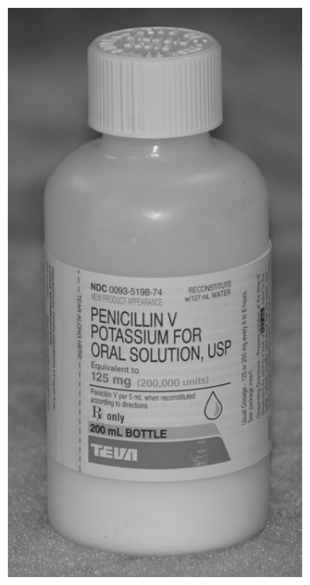

**FIGURE 17.1** Example of a dry powder for reconstitution to prepare an oral solution. The label calls for the addition of 127 mL of water to prepare 200 mL of solution having a concentration of 125 mg or 200,000 units of penicillin V per 5 mL of solution.

On receipt of a prescription order, the pharmacist follows the label instructions for constitution,<sup>a</sup> adding the proper amount of purified water or other diluent to prepare the liquid form. Depending on the product’s formulation, constitution results in the preparation of a clear *solution* (often called a *syrup*) or a *suspension*. The final volume of product is the sum of the volume of solvent or diluent added and the volume occupied by the dissolved or suspended powder mixture. These products generally are intended for infants and children but also can be used by adults who have difficulty swallowing the counterpart solid dosage form products, such as tablets and capsules.

For children and adults, a constituted product for oral solution or suspension generally is formulated such that the usual dose of the drug is contained in a teaspoonful amount of product. For infants, *pediatric drops*, which also require constitution, may be used. The calculations that follow demonstrate the preparation of constituted products and how the drug concentrations can be designed to meet a particular patient’s requirements.

<sup>a</sup> Some labeling instructions use the term “reconstitute” rather than “constitute” in describing the general process. Technically, if a dry powder is prepared from its original solution by removing the solvent (as through freeze drying), and then the solution is restored by the pharmacist, the term *reconstituted* would correctly apply. Some injectable products are prepared in this fashion.

##### Example Calculations for the Constitution of Dry Powders for Oral Use

*The label for a dry powder package of cefprozil (CEFZIL) for oral suspension directs the pharmacist to add 72 mL of purified water to prepare 100 mL of suspension. If the package contains 2.5 g of cefprozil, how many milligrams of the drug would be contained in each teaspoonful dose of the constituted suspension?*

2.5 g = 2500 mg

2500 mg / 100 mL = x mg / 5 mL

x = 125 mg cefprozil, *answer*.

Or, solving by dimensional analysis:

(1000 mg / 1 g) × (5 mL / 1 tsp) × (2.5 g / 100 mL) = 125 mg cefprozil, *answer*.

> **Nota de atualização — 05/09/2026.** A marca **CEFZIL** (Bristol-Myers Squibb) foi descontinuada da venda (carta de 07/09/2010); o FDA determinou em 11/09/2018 que a retirada **não** foi por segurança ou eficácia (83 FR 45940), e genéricos de cefprozil seguem aprovados. A conta (2,5 g em 100 mL → 125 mg/5 mL) não muda.
> **Fonte:** FDA, 83 FR 45940, 11/09/2018 <https://www.federalregister.gov/documents/2018/09/11/2018-19663/determination-that-cefzil-cefprozil-tablets-250-milligrams-and-500-milligrams-and-for-oral>

*Label instructions for an ampicillin product call for the addition of 78 mL of water to make 100 mL of constituted suspension such that each 5 mL contains 125 mg of ampicillin. Calculate the volume of dry powder in the product and the total content of ampicillin.*

Volume of dry powder: Because the addition of 78 mL of water results in the preparation of 100 mL of product, the volume occupied by the dry powder is:

100 mL − 78 mL = 22 mL, *answer*.

Total drug (ampicillin) present: If, in the constituted product, each 5 mL contains 125 mg of ampicillin, the total amount of ampicillin in the 100-mL product is:

5 mL / 125 mg = 100 mL / x

x = 2500 mg, *answer*.

*Using the product in the previous example, if a physician desires an ampicillin concentration of 100 mg/5 mL (rather than 125 mg/5 mL), how many milliliters of water should be added to the dry powder?*

Because it was determined that 2500 mg of ampicillin are in the dry product, the volume of product that can be made with a concentration of 100 mg/5 mL may be calculated by:

2500 mg / x mL = 100 mg / 5 mL

x = 125 mL, *answer*.

Then, because it had been determined that the dry powder occupies 22 mL of volume, it is possible to determine the amount of water to add:

125 mL − 22 mL = 103 mL, *answer*.

*The label of a dry powder for oral suspension states that when 111 mL of water are added to the powder, 150 mL of a suspension containing 250 mg of ampicillin per 5 mL are prepared. How many milliliters of purified water should be used to prepare, in each 5 mL of product, the correct dose of ampicillin for a 60-lb. child based on the dose of 8 mg/kg of body weight?*

The dose of ampicillin may be determined by:

8 mg / 2.2 lb. = x mg / 60 lb.

x = 218 mg

Then, the amount of ampicillin in the container is determined by:

250 mg / 5 mL = x mg / 150 mL

x = 7500 mg

Thus, the amount of product that can be made from 7500 mg of drug such that each 5 mL contains 218 mg of drug may be found by:

218 mg / 5 mL = 7500 mg / x mL

x = 172 mL

Finally, because the volume of powder occupies 39 mL (150 mL − 111 mL), the amount of water to add is determined by:

172 mL − 39 mL = 133 mL, *answer*.

*The label of a dry powder for constitution into pediatric drops states that when 12 mL of purified water are added to the powder, 15 mL of a pediatric suspension containing 50 mg of amoxicillin per milliliter results. How many milliliters of water should be added to prepare the dose of amoxicillin in each 10 drops if the dropper delivers 20 drops/mL, the child has a body surface area (BSA) of 0.4 m², and the dose of the drug is based on 50 mg/m² of BSA?*

The dose of amoxicillin may be determined by:

50 mg / 1 m² BSA = x mg / 0.4 m² BSA

x = 20 mg

The volume of product to contain the 20-mg dose is determined by:

10 drops / x mL = 20 drops / 1 mL

x = 0.5 mL

The amount of amoxicillin in the package is determined by:

50 mg / 1 mL = x mg / 15 mL

x = 750 mg

The amount of product of the desired dose that may be prepared is determined by:

750 mg / x mL = 20 mg / 0.5 mL

x = 18.75 mL

Subtracting the volume accounted for by the dry powder (15 mL − 12 mL = 3 mL), the volume of water to add is determined by:

18.75 mL − 3 mL = 15.75 mL, *answer*.

> **CASE IN POINT 17.1**<sup>6</sup>: A pediatrician telephones a pharmacist asking that the concentration of an antibiotic suspension be changed. The pediatrician wants the child-patient to take 200 mg of amoxicillin per teaspoonful dose. The label for amoxicillin powder for oral suspension indicates that the addition of 68 mL of purified water will result in a final volume of 100 mL with a concentration of 250 mg amoxicillin per 5 mL of suspension.
>
> How many milliliters of water should the pharmacist add to the amoxicillin powder to produce a concentration of 200 mg/teaspoonful?

#### Constitution of Dry Powders for Parenteral Solution

As noted earlier, the USP/NF contains an important and often referred to chapter on the pharmaceutical compounding of sterile preparations.<sup>4</sup> The chapter provides the steps necessary for the safe preparation, storage, stability, and use of compounded sterile preparations. It defines the risk levels for the compounding of single-dose and multiple-dose sterile preparations.

> **Nota de atualização — 05/09/2026.** Trecho envelhecido. O original diz que o ⟨797⟩ “defines the risk levels for the compounding of single-dose and multiple-dose sterile preparations.” Desde 01/11/2023 o capítulo oficial **não usa mais** low/medium/high-risk: usa **Category 1, 2 e 3**, definidas pelo ambiente de manipulação e pelo BUD. Category 1 (PEC ISO 5 em SCA não classificada): ≤ 12 h ambiente ou ≤ 24 h refrigerado. Category 2 e 3 exigem *cleanroom suite* (ISO 5/7/8); Category 3, com teste de esterilidade, permite os BUD mais longos (até 180 dias congelado). No Brasil, o Anexo IV da RDC 67/2007 (estéreis) ainda é o de 2007; a ANVISA abriu revisão (TAP nº 9/2025) precisamente porque o anexo “não contempla requisitos modernos” e não reflete o ⟨797⟩ vigente (Informe nº 1/2025/SEI/DIRE4).
> **Fontes:** USP ⟨797⟩ becomes official 01/11/2023 <https://www.usp.org/compounding/general-chapter-797>; USP ⟨797⟩ publication announcement 01/11/2022 <https://www.uspnf.com/notices/797-pub-announcement-20221101>; ANVISA Informe nº 1/2025/SEI/DIRE4 <https://www.gov.br/anvisa/pt-br/composicao/diretoria-colegiada/reunioes-da-diretoria/votos/2025/rop-10.2025/1-1.pdf>

Because of instability in liquid form, some medications (particularly antibiotics) intended for injection are provided as dry powder in vials to be constituted with sterile water for injection or other designated solvent or diluent immediately before use. Generally, these medications are small-volume products intended for use by injection or as additives to large-volume parenterals.

In contrast to the dry powders intended for oral use after constitution, injectable products may contain only limited amounts of specified added ingredients to increase the stability and effectiveness of the drug (obviously, no colorants, flavorants, or sweeteners are added). So, in effect, the bulk volume of the dry contents of a vial is largely or entirely the medication.

If the quantity of the dry drug powder is small and does not contribute significantly to the final volume of the constituted solution, the volume of solvent used will approximate the final volume of solution. For example, if 1000 units of a certain antibiotic in dry form are to be dissolved, and if the powder does not account for any significant portion of the final volume, the addition of 5 mL of solvent will produce a solution containing 200 units/mL. If the dry powder, however, because of its bulk, contributes to the final volume of the constituted solution, the increase in volume produced by the drug must be considered, and this factor must then be used in calculating the amount of solvent needed to prepare a solution of a desired concentration. For example, the package directions for making injectable solutions of piperacillin sodium specify that 4 mL of sterile solvent should be added to 2 g of the dry powder to produce 5.0 mL of a solution that is to contain 400 mg/mL. The drug, in this case, accounts for 1 mL of the final volume. Again, in dissolving 20,000,000 units of penicillin G potassium, the addition of 32 mL of sterile solvent provides a total volume of 40 mL of a solution that contains 500,000 units/mL. The dry powder now accounts for 8 mL of the final volume.

##### Example Calculations for the Constitution of Dry Powders for Parenteral Use

*Using a vial containing 200,000 units of penicillin G potassium, how many milliliters of solvent should be added to the dry powder in preparing a solution having a concentration of 25,000 units/mL?*

25,000 (units) / 200,000 (units) = 1 (mL) / x (mL)

x = 8 mL, *answer*.

*Using a vial containing 200,000 units of penicillin G sodium and sodium chloride injection as the solvent, explain how you would obtain the penicillin G sodium needed in preparing the following prescription.*

℞

| | |
| :---- | ---: |
| Penicillin G Sodium | 15,000 units per mL |
| Sodium Chloride Injection ad | 10 mL |
| Sig. For IM Injection. | |

15,000 units × 10 = 150,000 units of penicillin G sodium needed

Because the dry powder represents 200,000 units of penicillin G sodium or 4/3 times the number of units desired, 3/4 of the powder will contain the required number of units.

Step 1. Dissolve the dry powder in 4 mL of sodium chloride injection.

Step 2. Use 3 mL of the constituted solution, *answer*.

Or, solving by dimensional analysis:

10 mL × (15,000 units / 1 mL) × (4 mL / 200,000 units) = 3 mL, *answer*.

*The package information enclosed with a vial containing 5,000,000 units of penicillin G potassium (buffered) specifies that when 23 mL of a sterile solvent are added to the dry powder, the resulting concentration is 200,000 units/mL. On the basis of this information, how many milliliters of sterile water for injection should be used in preparing the following solution?*

℞

| | |
| :---- | ---: |
| Penicillin G Potassium (buffered) | 5,000,000 units |
| Sterile Water for Injection q.s. | |
| Make solution containing 500,000 units per mL | |
| Sig. One mL = 500,000 units of Penicillin G Potassium | |

The package information states that the constituted solution prepared by dissolving 5,000,000 units of the dry powder in 23 mL of sterile solvent has a final volume of 25 mL. The dry powder, then, accounts for 2 mL of this volume.

Step 1. The final volume of the prescription is determined as follows:

500,000 (units) / 5,000,000 (units) = 1 (mL) / x (mL)

x = 10 mL

Step 2. 10 mL − 2 mL (dry powder accounts for this volume) = 8 mL, *answer*.

*Piperacillin sodium is available in 2-g vials, and the dry powder accounts for 1 mL of the volume of the constituted solution. Using a 2-g vial of piperacillin sodium and sodium chloride injection as the solvent, explain how you could fill the following medication order.*

| | |
| :---- | ---: |
| Piperacillin Sodium | 250 mg |
| Sodium Chloride Injection ad | 15 mL |

Step 1. Dissolve the 2 g of dry powder in 9 mL of sodium chloride injection to prepare 10 mL of solution. Each milliliter will contain 200 mg of piperacillin sodium.

Step 2. Use 1.25 mL of the constituted solution and 13.75 mL of sodium chloride injection, *answer*.

> **CASE IN POINT 17.2**<sup>7</sup>: A hospital pharmacist received the following order for a patient:
>
> Medication Order: Staphcillin, 750 mg IV every 4 hours
>
> The following product and procedures were followed:
>
> Product: 6-g vial Staphcillin
>
> Pharmacy Operations: Reconstitute vial with sterile water for injection to yield Staphcillin 500 mg/mL and further dilute in 100 mL of sodium chloride injection.
>
> Administer: 30-minute IV infusion.
>
> (a) How many milliliters of solution from the reconstituted vial should be used per infusion?
>
> (b) What should be the infusion rate in milliliters per hour?
>
> (c) With a drop factor of 10 drops per milliliter, calculate the infusion rate in drops per minute.

> **Nota de atualização — 05/09/2026.** **Staphcillin** (meticilina sódica) foi descontinuada; não há apresentação comercial. A meticilina saiu de uso clínico (nefrite intersticial; MRSA). A *conta* do case (1,5 mL do reconstituído a 500 mg/mL; 101,5 mL em 30 min → 203 mL/h; 34 gotas/min) continua o modelo de reconstituição + infusão da prova. Na prática, o mesmo raciocínio aplica-se a oxacilina, nafeilina ou outro frasco com deslocamento informado na bula.
> **Fonte:** NCATS/Inxight: methicillin sodium anhydrous, US previously marketed (Staphcillin) <https://drugs.ncats.io/drug/NBQ410S76Y>

### Use of Prefabricated Dosage Forms in Compounding

Pharmacists frequently find that bulk supplies of certain proprietary drug substances are not available for extemporaneous compounding and that prefabricated tablets, capsules, injections, and other dosage forms provide the only available source of the medicinal agents needed. This situation occurs, for example, when an adult or pediatric patient is unable to swallow solid dosage forms, and the commercially available tablets or capsules must be used to prepare a liquid form of the same medication.

When using commercially prepared dosage forms as the source of a medicinal agent, the pharmacist selects products that are of the most simple, economic, and convenient form. For example, uncoated tablets or capsules are preferred over coated tablets or sustained-release dosage forms. For both convenience and economy, use of the fewest dosage units is preferred; for example, five 100-mg tablets rather than one hundred 5-mg tablets. An injection often provides a convenient source of medicinal agent when the volume of injection required is small and it is compatible with the physical characteristics of the dosage form being prepared (e.g., an oral liquid rather than dry-filled capsules).

Occasionally, when of the prescribed strength, small whole tablets or broken scored (grooved) tablets, may be placed within capsule shells when capsules are prescribed. In most instances, however, tablets are crushed in a mortar and reduced to a powder. When capsules are used as the drug source, the capsule shells are opened and their powdered contents are expelled. The correct quantity of powder is then used to fill the prescription or medication order.

It is important to understand that in addition to the medicinal agent, most solid dosage forms contain additional materials, such as fillers, binders, and disintegrants. These ingredients may need to be considered in the required calculations. For example, a tablet labeled to contain 10 mg of a drug may actually weigh 200 mg or more because of the added ingredients. Calculations involved in the use of injections generally are simplified because injections are labeled according to quantity of drug per unit volume; for example, milligrams per milliliter (mg/mL).

##### Example Calculations for the Use of Prefabricated Dosage Forms in Compounding

*Only capsules, each containing 25 mg of indomethacin, are available. How many capsules should be used to obtain the amount of indomethacin needed in preparing the following prescription?*

℞

| | |
| :---- | ---: |
| Indomethacin | 2 mg/mL |
| Cherry Syrup ad | 150 mL |
| Sig. 5 mL b.i.d. | |

Because 2 mg/mL of indomethacin are prescribed, 300 mg are needed in preparing the prescription. Given that each capsule contains 25 mg of indomethacin, then 300 (mg) ÷ 25 (mg) = 12 capsules are needed, *answer*.

*The drug metoprolol tartrate (LOPRESSOR) is available as 50-mg tablets. Before preparing the following prescription, a pharmacist determined that each tablet weighed 120 mg. Explain how to obtain the proper quantity of LOPRESSOR.*

℞

| | |
| :---- | ---: |
| LOPRESSOR | 15 mg |
| Lactose, qs ad | 300 mg |
| Prepare 24 such capsules. | |
| Sig. One cap. 2× a day. | |

15 (mg) × 24 = 360 mg of LOPRESSOR needed

Crush 8 tablets, which contain:

400 mg (8 × 50 mg) of LOPRESSOR and

960 mg (8 × 120 mg) of total powder

400 mg LOPRESSOR / 360 mg LOPRESSOR = 960 mg total / x mg total

x = 864 mg quantity of powder to use, *answer*.

*How many milliliters of an injection containing 40 mg of triamcinolone per milliliter may be used in preparing the following prescription?*

℞

| | |
| :---- | ---: |
| Triamcinolone | 0.05% |
| Ointment Base ad | 120 g |
| Sig. Apply to affected area. | |

120 g × 0.0005 = 0.06 g = 60 mg triamcinolone needed

40 mg / 60 mg = 1 mL / x mL

x = 1.5 mL, *answer*.

*The only source of sodium chloride is in the form of tablets, each containing 1 g. Explain how you would obtain the amount of sodium chloride needed for the following prescription.*

℞

| | |
| :---- | ---: |
| Ephedrine Sulfate | 0.5 |
| Isotonic Sodium Chloride Solution (0.9%) | 50 |
| Sig. For the nose. | |

50 g × 0.009 = 0.45 g of sodium chloride needed

Because one tablet contains 1 g of sodium chloride or 20/9 times the amount desired, 9/20 of the tablet will contain the required quantity, or 0.45 g. The required amount of sodium chloride may be obtained as follows:

Step 1. Dissolve one tablet in enough purified water to make 20 mL of dilution.

Step 2. Take 9 mL of the dilution, *answer*.

*The only source of potassium permanganate is in the form of tablets for topical solution, each containing 0.3 g. Explain how you would obtain the amount of potassium permanganate needed for the following prescription.*

℞

| | |
| :---- | ---: |
| Potassium Permanganate Solution | 250 mL |
| 1:5000 | |
| Sig. Use as directed. | |

1:5000 = 0.02%

250 g × 0.0002 = 0.05 g or 50 mg of potassium permanganate needed

Because one tablet for topical solution contains 300 mg of potassium permanganate or 6 times the amount needed, 1/6 of the tablet will contain the required amount, or 50 mg. The required quantity of potassium permanganate may be obtained as follows:

Step 1. Dissolve one tablet for topical solution in enough purified water to make 60 mL of dilution.

Step 2. Take 10 mL of the dilution, *answer*.

### Special Calculations: Capsule Filling and Suppository Molding

#### Capsule Filling

The extemporaneous filling of capsules<sup>8</sup> enables the pharmacist to prepare patient-specific doses of drugs in a conveniently administrated form. Empty capsule shells, made of gelatin, are readily available in a variety of sizes, as shown in Figure 17.2, with size 000 being the largest and size 5 the smallest.

Filled capsules should be neither underfilled nor overfilled but should hold the ingredients snugly. Different drug powders have different densities, and thus different weights can be packed into a given size capsule (see Table 17.1). In filling a prescription or medication order, a pharmacist should select a capsule size that accommodates the fill and will be easy for the patient to swallow.

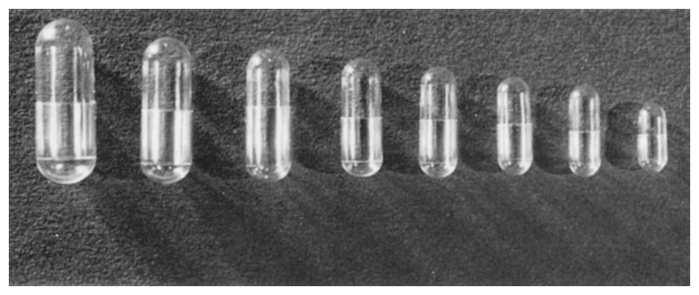

**FIGURE 17.2** Hard gelatin capsule sizes, from left to right: 000, 00, 0, 1, 2, 3, 4, and 5.

Most oral drugs have relatively small doses; thus, a diluent, like lactose, commonly is added to provide the necessary bulk to completely fill the prescribed capsules.

The steps used in calculating the proper capsule fill may be described as follows:

- **Step 1.** Select an appropriate capsule size.
- **Step 2.** Fill the capsule shell separately with each drug and diluent, and record the weights of each.
- **Step 3.** Calculate the *diluent displacement weight* for each drug, as demonstrated in the following example problem.
- **Step 4.** Calculate the amount of diluent required per capsule.
- **Step 5.** Calculate the total quantities of each drug and the diluent needed to fill all of the capsules prescribed.

**Note:** Some pharmacists calculate for an extra capsule or two so as not to run short of fill due to any powder residue remaining in the mortar after the mixing process; this may not be done for “accountable” drugs, such as narcotics.

##### Example Calculation to Determine a Capsule Fill

Determine the total quantities of each drug and lactose required to fill the following prescription.

℞

| | |
| :---- | ---: |
| Drug A | 20 mg |
| Drug B | 55 mg |
| Lactose, q.s. | |
| M.ft. caps # 20 | |

**TABLE 17.1 CAPSULE SIZES AND APPROXIMATE FILL CAPACITIES**

| CAPSULE SIZE | APPROXIMATE VOLUME | APPROXIMATE POWDER WEIGHT |
| :---- | :---- | :---- |
| 000 | 1.4 mL | 430 mg – 1.8 g |
| 00 | 0.95 mL | 390 mg – 1.3 g |
| 0 | 0.68 mL | 325 – 900 mg |
| 1 | 0.5 mL | 227 – 650 mg |
| 2 | 0.37 mL | 200 – 520 mg |
| 3 | 0.3 mL | 120 – 390 mg |
| 4 | 0.21 mL | 100 – 260 mg |
| 5 | 0.13 mL | 65 – 130 mg |

Step 1. For the purpose of this example, assume the pharmacist selected a size 1 capsule.

Step 2. The pharmacist filled a capsule individually with each ingredient, weighed them, and found:

| | |
| :---- | ---: |
| Capsule filled with drug A weighed | 620 mg |
| Capsule filled with drug B weighed | 470 mg |
| Capsule filled with lactose weighed | 330 mg |

Step 3. The *diluent displacement weights* for drugs A and B are calculated by ratio and proportion as follows:

For drug A:

620 mg (drug A in filled capsule) / 330 mg (lactose in filled capsule) = 20 mg (drug A per capsule) / x (lactose displacement)

x = 10.65 mg (diluent displacement by 20 mg of drug A)

For drug B:

470 mg / 330 mg = 55 mg / x

x = 38.62 mg (diluent displacement by 55 mg of drug B)

Step 4. The diluent required per capsule:

330 mg − 49.27 mg (10.65 mg + 38.62 mg) = 280.73 mg lactose

Step 5. The total quantities of each drug and diluent needed to fill all the capsules prescribed:

Drug A = 20 mg × 20 (capsules) = 400 mg

Drug B = 55 mg × 20 (capsules) = 1100 mg

Lactose = 280.73 mg × 20 (capsules) = 5614.6 mg, *answers*.

#### Suppository Molding

Pharmacists extemporaneously prepare suppositories<sup>8</sup> by using a mold, such as that shown in Figure 17.3. The drug(s) prescribed and a suppository base are the components of any suppository.

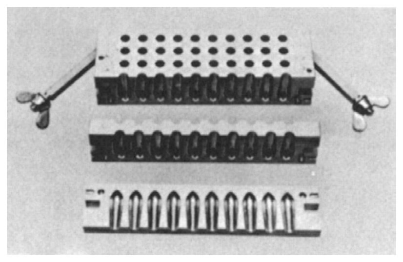

**FIGURE 17.3** A partially opened 50-cell suppository mold. *(Courtesy of Chemical and Pharmaceutical Industry Co.)*

As defined in Appendix C, suppositories are solid dosage forms intended for insertion into body orifices where they soften, melt, or dissolve, releasing their medications to the surrounding tissues. Any of a number of suppository bases can be used as vehicles for the medication; in extemporaneous compounding, cocoa butter (also termed theobroma oil) is commonly used. Cocoa butter is a solid at room temperature but melts at body temperatures.

The calculations involved in preparing suppositories by molding are described by the following steps. Other methods are used and may be found in the cited reference.<sup>9</sup>

To calibrate the suppository mold:

- **Step 1.** Fill all the cells of the suppository mold with melted base. After allowing time to cool and harden, extract the formed suppositories, weigh them, and determine the total and average suppository weights.
- **Step 2.** Divide the total and average suppository weights by the density of the suppository base to determine the volume capacity of the suppository mold and the average volume of each cell.

To calculate and prepare medicated suppositories:

- **Step 1.** Weigh the active ingredient for the preparation of a single suppository.
- **Step 2.** Mix the single dose of active ingredient with a portion of melted base insufficient to fill one cell of the mold (based on information obtained by previously calibrating the mold).
- **Step 3.** Pour the drug-base mixture into a cell, and add additional melted base to completely fill the cell.
- **Step 4.** After the suppository cools and hardens, extract and weigh it.
- **Step 5.** The weight of the base is determined by subtracting the amount of the drug from the weight of the molded suppository.
- **Step 6.** The individual weights of the drug and base required to prepare the prescribed number of suppositories may then be determined by multiplying the amounts for a single suppository. The volume of base required may also be calculated, if desired, by the use of its known density.

##### Example Calculation to Prepare Suppositories by Molding

Calculate the quantities of drug A and cocoa butter needed to fill the following prescription.

℞

| | |
| :---- | ---: |
| Drug A | 350 mg |
| Cocoa Butter q.s. | |
| M. ft. rectal suppos. # 12 | |

Step 1. 350 mg of drug A is weighed.

Step 2. Since a rectal suppository mold prepares suppositories weighing approximately 2 g, the amount of cocoa butter to use that would be insufficient to fill one cell may be estimated by:

2 g − 0.35 g (drug A) = 1.65 g (cocoa butter)

1.65 g ÷ 0.86 g/mL (density of cocoa butter) = 1.92 mL (approximate volume of melted cocoa butter, when added to drug A, to completely fill the cell)

By mixing the drug with 1 mL of melted cocoa butter, the pharmacist knows that this volume is insufficient to fill a cell.

Step 3. The mixture of 350 mg of drug A and 1 mL of melted cocoa butter is placed in a cell, and sufficient additional melted cocoa butter is used to completely fill the cell.

Step 4. The cooled and hardened suppository is extracted and is found to weigh 1.95 g.

Step 5. The weight of the cocoa butter in one suppository is calculated:

1.95 g − 0.35 g (drug A) = 1.6 g cocoa butter

Step 6. The total quantities of drug A and cocoa butter needed to fill the prescription are:

0.35 g × 12 (suppositories) = 4.2 g drug A

1.6 g × 12 (suppositories) = 19.2 g cocoa butter, *answers*.

**Note:** Some pharmacists calculate for an extra suppository or two so as not to run short of fill mixture. In filling the mold, each cell should be slightly overfilled to allow for contraction on cooling.

### Compounding Specialized Formulas

Not all commercially available products are suitable for every patient. Often a pharmacist must modify an existing product or prepare an original formulation to meet the requirements of a patient.

In their compounding practices, pharmacists may develop their own formulas, or they may refer to contemporary formulas developed and published by colleagues.<sup>10</sup> To facilitate the practice of compounding, some manufacturers make available resource materials, formulas, and a variety of compounding adjuncts, including ointment and suppository bases, oral suspending and syrup vehicles, rectal/vaginal vehicles, and other nonmedicated products to which medications may be added.<sup>11</sup>

##### Example Calculations of Specialized Formulas

Calculate the number of tablets containing the combination of spironolactone 25 mg and hydrochlorothiazide 25 mg that must be used to prepare the following formula using ORA-PLUS as the oral suspending vehicle.<sup>12</sup>

| | |
| :---- | ---: |
| Spironolactone | 5 mg/mL |
| Hydrochlorothiazide | 5 mg/mL |
| ORA-PLUS ad | 120 mL |

Spironolactone/hydrochlorothiazide:

5 mg of each drug/mL × 120 mL = 600 mg of each drug

600 mg (of each drug) ÷ 25 mg (of each drug/tablet) = 24 tablets, *answer*.

Calculate the amount of FATTIBASE, a suppository base, required to prepare 200 suppositories from the following formula for one progesterone vaginal suppository.<sup>13</sup>

| | |
| :---- | ---: |
| Progesterone, micronized | 25 mg |
| Silica Gel, micronized | 20 mg |
| FATTIBASE ad | 2 g |

25 mg (progesterone) + 20 mg (silica gel) = 45 mg

2 g − 0.045 g = 1.955 g

1.955 g × 200 (suppositories) = 391 g FATTIBASE, *answer*.

> **CASE IN POINT 17.3**<sup>14</sup>: A pharmacist receives a telephone call from a pediatrician who has an 8.8-lb. 1-month-old patient with an acid reflux condition. The infant was started on ranitidine (ZANTAC) syrup, 15 mg/mL, at a dose of 10 mg/kg/day, and has shown improvement. However, because of the flavor (peppermint) and alcohol content (7.5%), the baby frequently rejects the medication.
>
> The pharmacist suggests preparing a sugar-free and alcohol-free syrup/suspension with a fruity odor and taste. The physician agrees and prescribes ranitidine syrup/suspension, 60 mL, at a dose of 10 mg/kg/day, divided into two 0.5-mL doses.
>
> The pharmacist uses finely crushed 75-mg ranitidine tablets as the source of the drug and ORA-SWEET SF as the vehicle.
>
> How many 75-mg ranitidine tablets are required?

> **Nota de atualização — 05/09/2026.** O original pede para manipular ranitidina (ZANTAC) a partir de comprimidos. **Não se faz mais.** O FDA pediu a retirada de todos os produtos de ranitidina em **01/04/2020** (NDMA que aumenta com o tempo e o calor). No Brasil a **Resolução-RE nº 3.259, de 26/08/2020** proibiu comercialização, distribuição, fabricação, importação, **manipulação** e propaganda de cloridrato de ranitidina em todas as apresentações; a Conitec excluiu do SUS (Relatório nº 695; Portaria SCTIE/MS nº 76, de 29/12/2021). A *conta* do case (8,8 lb → 4 kg → 40 mg/dia → 20 mg/0,5 mL → 2400 mg em 60 mL → 32 comprimidos de 75 mg) permanece como exercício. Substitutos sem o mesmo risco de NDMA: famotidina, cimetidina, IBP.
> **Fontes:** FDA, 01/04/2020 <https://www.fda.gov/news-events/press-announcements/fda-requests-removal-all-ranitidine-products-zantac-market>; ANVISA, Resolução-RE nº 3.259, de 26/08/2020 (DOU 27/08/2020) <https://www.in.gov.br/en/web/dou/-/resolucao-re-n-3.259-de-26-de-agosto-de-2020-274384354>; Relatório Conitec nº 695 <http://antigo-conitec.saude.gov.br/images/Relatorios/2021/20211230_Relatorio_695_exclusao_ranitidina_Final.pdf>; Portaria SCTIE/MS nº 76, de 29/12/2021 <https://bvsms.saude.gov.br/bvs/saudelegis/sctie/2021/prt0076_30_12_2021.html>

### Practice Problems (capítulo 17)

#### Calculations for the Constitution of Dry Powders for Oral Administration

1. After constitution of a dry powder, each 5 mL of ampicillin for oral suspension contains 250 mg of ampicillin in package sizes to prepare 100 mL, 150 mL, or 200 mL of suspension. Which package size should be dispensed for a 20-kg child who is to take 50 mg/kg/day total, q.i.d. in equally divided and spaced doses for 10 days?

2. Manufacturer’s directions call for the addition of 90 mL of water to constitute a 150-mL container of cefaclor to yield a strength of 250 mg of cefaclor per 5 mL. If 60 mL of water were mistakenly added in constituting the product, calculate the resultant milligrams of cefaclor per 5 mL.

3. The label on a bottle of dry powder mix for constitution states that when 128 mL of water are added, 150 mL of an oral suspension containing 250 mg of ampicillin in each 5 mL results.

    (a) How many milliliters of water should be added to the dry powder mix if a strength of 150 mg of ampicillin per 5 mL is desired?

    (b) If the dose of ampicillin is 5 mg/kg of body weight, how many milliliters of water should be added to the dry powder mix so that a child weighing 66 lb. would receive the proper dose in each 5 mL of the suspension?

4. Amoxicillin/clavulanate potassium (AUGMENTIN) powder for oral suspension is prepared prior to dispensing by adding 134 mL of purified water to the contents of the container to prepare 150 mL of suspension. If each teaspoonful of suspension contains 125 mg of amoxicillin and 31.25 mg of clavulanate potassium, how much of each of these agents is contained in the dry powder prior to reconstitution?

5. If, in the above problem, a pharmacist wished to use the dry product to prepare an oral suspension containing 200 mg of amoxicillin and 50 mg of clavulanate potassium/5 mL of suspension, how many milliliters of purified water should be used for reconstitution?

#### Calculations Applied to Compounding for Parenteral Administration

6. A 7.5-g bulk pharmacy vial of cefuroxime (ZINACEF) when constituted with 77 mL of sterile water for injection, contains 375 mg of cefuroxime in each 4 mL. How many milliliters of volume were occupied by the dry powder in the vial?

7. Efalizumab (RAPTIVA) is available in vials which when reconstituted with 1.3 mL of sterile water for injection yields 1.5 mL of solution containing 100 mg/mL of drug. How much dry efalizumab is present in the vial?

    (a) 130 mg

    (b) 150 mg

    (c) 0.2 g

    (d) 15 mg

> **Nota de atualização — 05/09/2026.** **RAPTIVA** (efalizumabe) foi retirada do mercado americano em **08/04/2009** (retirada voluntária da Genentech, com apoio do FDA) por risco de leucoencefalopatia multifocal progressiva (PML); deixou de estar disponível nos EUA a partir de 08/06/2009. A EMA suspendeu e depois retirou a autorização em **09/06/2009**. O exercício (1,3 mL → 1,5 mL a 100 mg/mL → 150 mg no frasco; alternativa b) é só a conta de deslocamento do pó. O produto não existe.
> **Fontes:** FDA Statement on the Voluntary Withdrawal of Raptiva, 08/04/2009 <https://www.sec.gov/Archives/edgar/data/791908/000095016209000187/ex_1.htm>; EMA EPAR Raptiva, retirada 09/06/2009 <https://www.ema.europa.eu/en/medicines/human/EPAR/raptiva>

8. A hospital pharmacist constitutes a vial containing 2 g of piperacillin sodium to 10 mL with sterile water for injection. This solution is then diluted by adding it to 100 mL of 5% dextrose injection for administration by infusion. What is the concentration, in milligrams per milliliter (mg/mL), of piperacillin sodium in the infusion solution?

9. A vial of cefazolin injection contains 1 g per 3 mL. If 1.6 mL of the injection is diluted to 200 mL with sodium chloride injection, how many milliliters of the dilution should be administered daily to a child weighing 40 lb. if the daily dose is 25 mg/kg of body weight?

10.<sup>7</sup> Medication Order: Piperacillin, 1500 mg every 6 hours.

    Product: 3-g vial, piperacillin.

    Pharmacy operations: Reconstitute vial to 5 mL with sterile water for injection and further dilute to 50 mL with sodium chloride injection.

    Administer: 20-minute IV infusion.

    (a) How many milliliters of solution from the reconstituted vial should be used?

    (b) What should be the infusion rate in milliliters per hour?

    (c) With a drop factor of 20 drops per milliliter, calculate the infusion rate in drops per minute.

11. A medication order calls for 400 mg of cefazolin sodium to be administered IM to a patient every 12 hours. Vials containing 500 mg, 1 g, and 10 g of cefazolin sodium are available. According to the manufacturer’s directions, dilutions may be made as follows:

| Vial Size | Solvent to Be Added | Final Volume |
| :---- | :---- | :---- |
| 500 mg | 2 mL | 2.2 mL |
| 1 g | 2.5 mL | 3 mL |
| 10 g | 45 mL | 51 mL |

Explain how the prescribed amount of cefazolin sodium could be obtained.

12. Using the vial sizes in Problem 11 as the source of cefazolin sodium, how many milliliters of the diluted 500-mg vial should be administered to a 40-lb. child who is to receive 8 mg of cefazolin sodium per kilogram of body weight?

13. Using cefazolin sodium injection in a concentration of 125 mg/mL, complete the following table representing a *Pediatric Dosage Guide*:

| Weight | | Dose (25 mg/kg/day divided into 3 doses) | |
| :---- | :---- | :---- | :---- |
| *lb.* | *kg* | *approximate single dose (mg/q8h)* | *mL of dilution (125 mg/mL) needed* |
| 10 | 4.5 | 37.5 or 38 mg | 0.3 mL |
| 20 | | | |
| 30 | | | |
| 40 | | | |
| 50 | | | |

14. A vial contains 1 g of ceftazidime. Express the concentrations of the drug, in milligrams per milliliter, following constitution with sterile water for injection to the following volumes: (a) 2.2 mL, (b) 4.5 mL, and (c) 10 mL.

15. Acetazolamide sodium is available in 500-mg vials to be constituted to 5 mL with sterile water for injection before use. The dose of the drug for children is 5 mg/kg of body weight. How many milliliters of the injection should be administered to a child weighing 25 lb.?

16. An intravenous infusion for a child weighing 60 lb. is to contain 20 mg of vancomycin hydrochloride per kilogram of body weight in 200 mL of sodium chloride injection. Using a 10-mL vial containing 500 mg of vancomycin hydrochloride (dry powder), explain how you would obtain the amount needed in preparing the infusion.

#### Calculations for the Use of Prefabricated Dosage Forms in Compounding

17. ℞ Potassium Permanganate Solution 1:10,000  500 mL

    Sig. Use as directed.

    Using tablets, each containing 0.3 g of potassium permanganate, explain how you would obtain the amount of potassium permanganate needed for the prescription.

18. ℞ Estropipate  0.0125% w/w

    Cream Base ad  60 g

    Sig. Vaginal Cream.

    How many 0.75-mg tablets of estropipate may be used to prepare the prescription?

19. How many milliliters of a 0.9% solution of sodium chloride can be made from 10 tablets for solution each containing 2.25 g of sodium chloride?

20. ℞ Phenacaine Hydrochloride Solution 1%  7.5 mL

    Scopolamine Hydrobromide Solution 0.2%  7.5 mL

    Sig. For the eye.

    How many tablets, each containing 600 μg of scopolamine hydrobromide, should be used in preparing the prescription?

21. ℞ Hexachlorophene

    Hydrocortisone  aa  0.25%

    Coal Tar Solution  30 mL

    Hydrophilic Ointment ad  120 g

    Sig. Apply.

    How many tablets, each containing 20 mg of hydrocortisone, should be used in preparing the prescription?

22. How many milliliters of an injection containing 40 mg of a drug per milliliter would provide the amount of the drug needed to prepare 120 mL of a 0.2% suspension?

23. ℞ Allopurinol  65 mg/5 mL

    Cologel  40 mL

    Syrup ad  150 mL

    M. ft. susp.

    Sig. As directed.

    How many scored 100-mg allopurinol tablets may be used in preparing the prescription?

24. ℞ Enalapril  7.5 mg

    Lactose ad  200 mg

    DTD Caps # 40

    Sig. Take one capsule each morning.

    How many 20-mg tablets of enalapril, each weighing 120 mg, and how many grams of lactose would be needed to prepare the prescription?

25. How many tablets for topical solution, each containing 300 mg of potassium permanganate, should be added to 1 gallon of purified water to provide a concentration of 0.012% w/v?

26. A prescription for 240 mL of a cough mixture calls for 2 mg of hydrocodone bitartrate per teaspoonful. How many tablets, each containing 5 mg of hydrocodone bitartrate, should be used in preparing the cough mixture?

27. ℞ Dantrolene Sodium  5 mg/mL

    Citric Acid  150 mg

    Purified Water  10 mL

    Syrup ad  125 mL

    M. ft. susp.

    Sig. As directed.

    If the only source of dantrolene sodium is 100-mg capsules, each containing 200 mg of drug-diluent powder mix, (a) how many capsules must be opened, and (b) how many milligrams of the powder mix should be used in preparing the prescription?

28. ℞<sup>15</sup> Ketorolac Tromethamine  7.5 mg/5 mL

    Suspension Vehicle ad  120 mL

    Sig. 1 tsp q6h

    How many 10-mg ketorolac tromethamine (TORDOL) tablets may be used to prepare this prescription?

29. How many DANTRIUM capsules, each containing 25 mg of dantrolene, are needed to prepare 100 mL of a pediatric suspension containing 5 mg of dantrolene per milliliter?

30. The following is a formula for a diazepam rectal gel.<sup>16</sup> How many 10-mL vials of VALIUM Injection containing 5 mg/mL of diazepam would be needed to compound the formula?

| | |
| :---- | ---: |
| Diazepam | 100 mg |
| Methylcellulose (1500 cps) | 2.5 g |
| Methylparaben | 100 mg |
| Glycerin | 5 g |
| Purified Water ad | 100 mL |

31. How many tablets, each containing 25 mg of spironolactone, are needed to prepare 200 mL of a pediatric suspension to contain 5 mg of spironolactone per milliliter?

32. A physician prescribes 30 capsules, each containing 300 mg of ibuprofen, for a patient. The pharmacist has on hand 400-mg and 600-mg ibuprofen tablets. How many each of these tablets could be used to obtain the amount of ibuprofen needed in preparing the prescription?

33. ℞ Indomethacin Powder  1%

    Carbopol 941 Powder  2%

    Purified Water  10%

    Alcohol ad  90 mL

    Sig. Use as directed.

    How many 75-mg capsules of indomethacin should be used in preparing the prescription?

34. ℞ Minoxidil  0.3%

    Vehicle/N ad  50 mL

    Sig. Apply to affected areas of the scalp b.i.d.

    Tablets containing 2.5 mg and 10 mg of minoxidil are available. Explain how you would obtain the amount of minoxidil needed in preparing the prescription, using the available sources of the drug.

35. If a pharmacist used one 50-mg tablet of a drug to prepare 30 mL of an otic suspension in sweet oil, calculate the percentage strength of the preparation.

36. ℞ Aminophylline  500 mg

    Sodium Pentobarbital  75 mg

    Carbowax Base ad  2 g

    Ft. suppos. no. 12

    Sig. Insert one at night.

    How many capsules, each containing 100 mg of sodium pentobarbital, should be used to provide the sodium pentobarbital needed in preparing the prescription?

37. A starting pediatric dose of phenytoin sodium (DILANTIN Sodium) is 6 mg/kg/d, administered in three equally divided doses. Using tablets containing 50 mg of phenytoin sodium, a pharmacist prepared a suspension such that each 1 mL, delivered from a calibrated dropper, contained a single dose for a 44-lb. child. How many tablets should be used to prepare 30 mL of the suspension?

38. ℞ CARAFATE  400 mg/5 mL

    Cherry Syrup  40 mL

    Sorbitol Solution  40 mL

    Flavor  q.s.

    Purified Water ad  125 mL

    Sig. 5 mL t.i.d.

    How many 1-g CARAFATE tablets should be used in preparing the prescription?

#### Calculations Used in Capsule Filling and Suppository Molding

39.<sup>8</sup> A pharmacist needs to prepare 50 capsules, each containing 4 mg of estriol and 1 mg of estradiol. A size 3 capsule is selected for use. Capsule shells are individually filled with each drug and lactose and the weights recorded as follows:

- Estriol 250 mg
- Estradiol 190 mg
- Lactose 320 mg

    (a) How many milligrams of each component will be needed to fill all the capsules?

    (b) How many milligrams should the content of each capsule weigh?

40.<sup>8</sup> A pharmacist prepares six suppositories using a polyethylene glycol base, density 1.18 g/mL. The total weight of the suppositories is found to be 13.81 g. Calculate the volume of the mold per cell.

41.<sup>8,17</sup> ℞ Fluconazole  200 mg

    PEG base, q.s.

    M. ft. suppos # 20

    (a) How many grams of fluconazole are needed?

    (b) If a trial molded suppository weighs 2.4 g, how many grams of PEG base are needed to compound the prescription?

#### Calculations of Specialized Formulas

42. The following is a formula for an oral ulceration mouthwash.<sup>18</sup>

| | |
| :---- | ---: |
| Hydrocortisone | 55.2 mg |
| Lidocaine HCl | 2.4 g |
| Erythromycin Stearate | 1.5 g |
| Diphenhydramine HCl | 150 mg |
| Nystatin | 2,000,000 units |
| Xanthan Gum | 240 mg |
| Stevia Powder Extract | 280 mg |
| Sodium Saccharin | 120 mg |
| Flavor | 1 mL |
| Simple Syrup or Sorbitol Solution (70%) ad | 120 mL |

    (a) Calculate the percentage strength of hydrocortisone in the formula.

    (b) If nystatin is available as a powder containing 5225 units/mg, calculate the quantity required, in milligrams, to compound the formula.

    (c) Calculate the concentration of erythromycin stearate, in mg/mL, in the formula.

43. Misoprostol and Lidocaine in Glycerin Mouth Paint<sup>19</sup>

| | |
| :---- | ---: |
| Misoprostol 200-mcg tablets | 12 tablets |
| Lidocaine HCl | 1 g |
| Glycerin qs ad | 100 mL |

How many micrograms of misoprostol would be present in each milliliter of mouth paint?

44. Progesterone Liquid Fill Capsules.<sup>20</sup>

| | |
| :---- | ---: |
| Progesterone, micronized | 10 g |
| Sesame Oil qs ad | 30 mL |
| To make 100 capsules | |

How many (a) micrograms of progesterone and (b) microliters of the formula would be contained in each capsule?

45. Tri-Est Aqueous Injection<sup>21</sup>

| | |
| :---- | ---: |
| Estriol | 200 mg |
| Estrone | 25 mg |
| Estradiol | 25 mg |
| Polysorbate 80 | 0.2 mL |
| Benzyl Alcohol | 1 mL |
| Sterile Water for Injection ad | 100 mL |

How many milliliters of the injection should be used to deliver 1.75 mg of total estrogens?

46. Intracavernosal Injection<sup>22</sup>

| | |
| :---- | ---: |
| Prostaglandin E | 5.9 μg/mL |
| Papaverine HCl | 17.6 mg/mL |
| Phentolamine Mesylate | 0.6 mg/mL |
| Sterile Water for Injection ad | 1.5 mL |

How many milligrams of each ingredient should be used in preparing 12 syringes, each containing 1.5 mL of injection?

47. Progesterone Nasal Spray<sup>23</sup>

| | |
| :---- | ---: |
| Progesterone | 20 mg |
| Dimethyl-β-cyclodextrin | 62 mg |
| Purified Water ad | 1 mL |

How many milligrams each of progesterone and dimethyl-β-cyclodextrin would be delivered in each 0.05 mL spray of solution?

48. Triple Estrogen Slow-Release Capsules<sup>24</sup>

For 100 capsules:

| | |
| :---- | ---: |
| Estriol | 200 mg |
| Estrone | 25 mg |
| Estradiol | 25 mg |
| Methocel E4M premium | 10 g |
| Lactose | 23.75 g |

Calculate the weight, in milligrams, of the formula in each capsule.

49. Nail Fungus Solution<sup>25</sup>

| | |
| :---- | ---: |
| NIZORAL, 200-mg tablets | 10 tablets |
| Clotrimazole | 900 mg |
| Ethyl Alcohol, 95% | 5 mL |
| Polyethylene Glycol 300 | 67 mL |
| Dimethyl Sulfoxide | 23 mL |

If the formula prepares 98 mL, what is the percent concentration of NIZORAL in the solution?

50. Pediatric Chewable Gummy Gel Base<sup>26</sup>

| | |
| :---- | ---: |
| Gelatin | 43.4 g |
| Glycerin | 155 mL |
| Purified Water | 21.6 mL |

If the specific gravity of glycerin is 1.25, what is the weight of the formula?

51. Antiemetic Injection for Cancer Chemotherapy<sup>27</sup>

| | |
| :---- | ---: |
| REGLAN (5 mg/mL) | 30 mL |
| ATIVAN (2 mg/mL) | 0.5 mL |
| Mannitol, 25% | 50 mL |
| COMPAZINE (5 mg/mL) | 2 mL |
| Dextrose Injection, 5% | 50 mL |

How many milligrams each of REGLAN, ATIVAN, and COMPAZINE are contained in each milliliter of the injection?

52. Migraine Headache Suppositories<sup>28</sup>

| | |
| :---- | ---: |
| Ergotamine Tartrate | 2 mg |
| Caffeine | 100 mg |
| Hyoscyamine Sulfate | 0.25 mg |
| Pentobarbital Sodium | 60 mg |
| FATTIBASE ad | 2 g |

The formula is for one suppository. If the specific gravity of FATTIBASE is 0.89, how many milliliters of the melted base (assuming no volume change due to heat) may be used to prepare 36 suppositories?

53. Veterinary Dexamethasone Ophthalmic Ointment<sup>29</sup>

| | |
| :---- | ---: |
| Dexamethasone Sodium Phosphate | 39.6 mg |
| Bacteriostatic Water for Injection | 0.4 mL |
| Polysorbate 80 | 0.3 mL |
| Lacrilube qs | 30 g |

Calculate the percentage strength of dexamethasone (base) in the formula if 1 mg of dexamethasone (base) is equivalent to 1.32 mg of dexamethasone sodium phosphate.

54. The following is a formula for a captopril oral liquid.<sup>11</sup>

℞ Captopril  100-mg tablet

ORA-SWEET ad  134 mL

How many milliliters of the oral liquid would provide 0.75 mg of captopril?

55. The following is a formula for a rifampin oral liquid.<sup>11</sup>

℞ Rifampin  25 mg/mL

ORA-PLUS ad  120 mL

How many 300-mg tablets of rifampin should be used?

56. The following is a formula for a fluconazole topical cream.<sup>11</sup>

℞ Fluconazole  10 g

Glycerin  18.75 g

DERMABASE ad  100 g

How many milliliters of glycerin should be used (sp. gr. 1.25)?

57. The following is a formula for a clotrimazole topical preparation.<sup>11</sup>

℞ Clotrimazole, powder  1%

DERMABASE ad  30 g

How many grams of DERMABASE are required?

58.<sup>30</sup> ℞ Oseltamivir phosphate  15 mg/mL

Cherry Syrup qs ad  60 mL

Sig: One teasp. 2 × daily × 5 days

How many 75-mg capsules of oseltamivir phosphate (TAMIFLU) should be used to compound this prescription?

> **Nota de atualização — 05/09/2026.** O original pede 15 mg/mL em cherry syrup a partir das cápsulas de 75 mg (gabarito: 12 cápsulas). A bula vigente do TAMIFLU estabelece que a **suspensão industrializada 6 mg/mL** (após constituição com 55 mL de água → 60 mL utilizáveis) é o produto **preferido**. Manipular a partir das cápsulas é procedimento **de emergência**, na concentração **6 mg/mL** (não 15), veículos estudados: Cherry Syrup (Humco), Ora-Sweet SF ou xarope simples, **somente se** o industrializado não estiver disponível. No Brasil, conferir a bula ANVISA vigente do fosfato de oseltamivir (suspensão e cápsulas).
> **Fonte:** DailyMed, TAMIFLU (oseltamivir phosphate) powder for suspension <https://dailymed.nlm.nih.gov/dailymed/drugInfo.cfm?setid=03a2a7f0-406c-4784-84c1-5fd5f5be4773>

### Answers to “Case in Point” and Practice Problems (capítulo 17)

#### Case in Point 17.1

Calculate the amount of amoxicillin in container:

250 mg (amoxicillin) / 5 mL = x mg (amoxicillin) / 100 mL

x = 5000 mg amoxicillin in container

Calculate volume that can be prepared from 5000 mg at 200 mg/5 mL:

200 mg / 5 mL = 5000 mg / x mL

x = 125 mL of oral suspension can be prepared

Calculate volume of amoxicillin powder in container:

100 mL − 68 mL (water added by label instructions) = 32 mL (volume of powder)

Calculate water requirement for new concentration:

125 mL − 32 mL = 93 mL of water required, *answer*.

Proof: 5000 mg amoxicillin per 125 mL = 200 mg amoxicillin per 5 mL.

#### Case in Point 17.2

(a) 750 mg × (1 mL / 500 mg) = 1.5 mL of reconstituted solution, *answer*.

(b) Infusion time: 30 minutes. Infusion volume: 101.5 mL. Infusion rate per hour:

60 min × (101.5 mL / 30 min) = 203 mL, infusion rate per hour, *answer*.

(c) 101.5 mL (infusion volume) × (10 drops / 1 mL) = 1015 drops

1015 drops / 30 min = 33.8 or 34 drops per minute, *answer*.

#### Case in Point 17.3

Calculate milligrams of ranitidine required per 0.5-mL dose:

8.8 lb. / 2.2 lb./kg = 4 kg (weight of child)

4 kg × 10 mg/kg/day = 40 mg/day

40 mg ÷ 2 doses/day = 20 mg/dose; thus, 20 mg/0.5-mL dose

Calculate milligrams of ranitidine required in 60-mL prescription:

20 mg / 0.5 mL = x mg / 60 mL

x = 2400 mg ranitidine required

Calculate number of 75-mg ranitidine tablets needed to provide 2400 mg:

2400 mg ÷ 75 mg/tablet = 32 tablets, *answer*.

#### Practice Problems

1. 200 mL

2. 312.5 mg cefaclor

3. (a) 228 mL water

    (b) 228 mL water

4. 3750 mg amoxicillin

    937.3 mg clavulanate potassium

5. 77.75 mL purified water

6. 3 mL

7. (b) 150 mg efalizumab

8. 18.18 mg/mL piperacillin

9. 170.5 mL

10. (a) 2.5 mL

    (b) 157.5 or 158 mL/hr

    (c) 52.5 or 53 drops/minute

11. Dilute and use 1.767 mL of the 500-mg vial, or dilute and use 1.2 mL of the 1-g vial, or dilute and use 2.04 or 2 mL of the 10-g vial

12. 0.64 mL

13.

| | | | |
| :---- | :---- | :---- | :---- |
| 20 | 9.1 kg | 75.8 mg | 0.61 mL |
| 30 | 13.6 kg | 113.3 mg | 0.91 mL |
| 40 | 18.2 kg | 151.7 mg | 1.21 mL |
| 50 | 22.7 kg | 189.2 mg | 1.51 mL |

14. (a) 454.55 mg/mL

    (b) 222.22 mg/mL

    (c) 100 mg/mL

15. 0.57 mL acetazolamide sodium injection

16. 545 mg needed. Use 1 vial + 10 mL of sterile diluent to a second vial to make 10 mL, and use 0.9 mL of the dilution.

17. Dissolve 1 tablet in enough distilled water to make 60 mL, and take 10 mL of the dilution.

18. 10 tablets estropipate

19. 2500 mL sodium chloride solution

20. 25 tablets scopolamine hydrobromide

21. 15 tablets hydrocortisone

22. 6-mL injection

23. 19.5 tablets allopurinol

24. 15 tablets enalapril

    6.2 g lactose

25. 1.5 tablets potassium permanganate

26. 19.2 tablets hydrocodone bitartrate

27. (a) 7 capsules dantrolene sodium

    (b) 1250 mg powder

28. 18 tablets TORDOL

29. 20 capsules DANTRIUM

30. 2 vials VALIUM Injection

31. 40 tablets spironolactone

32. 22.5 tablets (400 mg each) ibuprofen, or 15 tablets (600 mg each) ibuprofen

33. 12 capsules indomethacin

34. 60 tablets (2.5 mg each) minoxidil, or 15 tablets (10 mg each) minoxidil

35. 0.167%

36. 9 capsules sodium pentobarbital

37. 24 tablets phenytoin sodium

38. 10 tablets CARAFATE

39. (a) 200 mg estriol

    50 mg estradiol

    15,660 mg lactose

    (b) 318.2 mg

40. 1.95 mL

41. (a) 4 g fluconazole

    (b) 44 g PEG base

42. (a) 0.046% hydrocortisone

    (b) 382.78 mg nystatin

    (c) 12.5 mg/mL erythromycin stearate

43. 24 μg misoprostol

44. (a) 100,000 μg progesterone

    (b) 300 μL

45. 0.7 mL injection

46. 0.106 mg prostaglandin E

    316.8 mg papaverine HCl

    10.8 mg phentolamine mesylate

47. 1 mg progesterone

    3.1 mg dimethyl-β-cyclodextrin

48. 340 mg

49. 2.04% NIZORAL

50. 258.75 g

51. 1.13 mg REGLAN

    0.0075 mg ATIVAN

    0.075 mg COMPAZINE

52. 74.34 mL FATTIBASE

53. 0.1% dexamethasone

54. 1 mL oral liquid

55. 10 tablets rifampin

56. 15 mL glycerin

57. 29.7 g DERMABASE

58. 12 tablets oseltamivir phosphate

### References do capítulo 17

1. Pharmacy Compounding Accreditation Board. Available at: http://www.pcab.org/. Accessed January 4, 2008.

2. International Academy of Compounding Pharmacists. Available at: http://www.iacprx.org. Accessed January 4, 2008.

3. United States Pharmacopeia 31st Rev. National Formulary 26. Rockville, MD: United States Pharmacopeial Convention, 2008;(795)1:315–319.

4. United States Pharmacopeia 31st Rev. National Formulary 26. Rockville, MD: United States Pharmacopeial Convention, 2008;(797)1:319–336.

5. Allen LV Jr. USP Chapter ⟨795⟩ Pharmaceutical compounding—nonsterile preparations. *Secundum Artem* 2006; 13:4. Available at: http://www.paddocklabs.com/forms/secundum/volume%2013. Accessed January 4, 2008.

6. Warren F. College of Pharmacy. Athens, GA: University of Georgia, 2005.

7. Craig GP. *Clinical Calculations Made Easy*. Baltimore: Lippincott Williams & Wilkins, 2001:195–196.

8. Prince SJ. In Ansel HC, Prince SJ. *Pharmaceutical Calculations: The Pharmacist’s Handbook*. Baltimore: Lippincott Williams & Wilkins, 2004:96–105.

9. Allen LV Jr, Popovich NG, Ansel HC. *Pharmaceutical Dosage Forms and Drug Delivery Systems*. 8th Ed. Baltimore: Lippincott Williams & Wilkins, 2005:325–328.

10. Allen LV Jr. *Allen’s Compounded Formulations*. 2nd Ed. Washington, DC: American Pharmacist’s Association, 2004.

11. Paddock Laboratories. Compounding. Available at: http://www.paddocklabs.com. Accessed January 3, 2008.

12. *International Journal of Pharmaceutical Compounding* 1997;1:183.

13. *International Journal of Pharmaceutical Compounding* 1998;2:65.

14. Beach W. College of Pharmacy. Athens, GA: University of Georgia, 2005.

15. Prince SJ. Calculations. *International Journal of Pharmaceutical Compounding* 1998;2:164.

16. Allen LV Jr. Diazepam dosed as a rectal gel. *U.S. Pharmacist* 2000;25:98.

17. Allen LV. *The Art, Science, and Technology of Pharmaceutical Compounding*. Washington, DC: American Pharmacist’s Association, 1997:140.

18. *International Journal of Pharmaceutical Compounding* 1999;3:10.

19. *International Journal of Pharmaceutical Compounding* 1999;3:48.

20. *International Journal of Pharmaceutical Compounding* 1999;3:294.

21. *International Journal of Pharmaceutical Compounding* 1999;3:304.

22. *International Journal of Pharmaceutical Compounding* 1999;3:81.

23. *International Journal of Pharmaceutical Compounding* 1998;2:56.

24. *International Journal of Pharmaceutical Compounding* 1999;3:401.

25. *International Journal of Pharmaceutical Compounding* 1998;2:277.

26. *International Journal of Pharmaceutical Compounding* 1997;1:106.

27. *International Journal of Pharmaceutical Compounding* 1997;1:175.

28. *International Journal of Pharmaceutical Compounding* 1998;2:151.

29. *International Journal of Pharmaceutical Compounding* 1998;2:206.

30. Winiarski AP, Infeld MH, Tscherne R, et al. Preparation and stability of extemporaneous oral liquid formulations of oseltamivir using commercially available capsules. *Journal of the American Pharmacist’s Association* 2007;47:747–755.

> **Nota de atualização — 05/09/2026.** A ref. 1 (`http://www.pcab.org/`, acesso em 04/01/2008) aponta para o *Pharmacy Compounding Accreditation Board* como entidade autônoma. Desde **julho de 2014** o PCAB é um serviço da **ACHC** (*Accreditation Commission for Health Care*); o endereço vigente é <https://achc.org/pcab/>, alinhado a ⟨795⟩, ⟨797⟩ e ⟨800⟩. A IACP (ref. 2) permanece em <https://www.iacprx.org>. Paddock Laboratories (refs. 5 e 11) foi absorvida; o material *Secundum Artem* circula hoje sob Padagis/arquivos.
> **Fonte:** ACHC, PCAB Accreditation <https://achc.org/pcab/>

### Notas da transcrição (capítulo 17)

- A extração do PDF substituía sinais matemáticos por caracteres de controle; as proporções foram remontadas como `a / b = c / d` e as operações como ×, ÷, −, =. Nenhuma palavra do texto corrido foi trocada.
- O original traz **“Perform calculation applied”** (sem *s*) no quinto objetivo; **“is devoted compounding”** (falta *to*) no parágrafo da USP; e, no gabarito, o item **30** impresso como **“39. 2 vials VALIUM Injection”** (o 30 do problema; o 39 verdadeiro vem depois, com estriol/estradiol). Esses erros são do livro, não da transcrição: o gabarito do item 30 foi numerado aqui como **30**, com esta nota.
- **TORDOL** no problema 28 e no gabarito é a grafia do original (a marca é **TORADOL**, cetorolaco).
- As figuras 17.1–17.3 foram recortadas do PDF para `recursos/ansel13-cap17/`. A Tabela 17.1 e a tabela de reconstituição da cefazolina (problema 11) foram remontadas como tabelas Markdown.
- **Notas de atualização (05/09/2026):** os blocos de citação iniciados por *Nota de atualização* não são do livro. O texto transcrito permanece como no original.

## Legislação e referências

- **ANSEL, H. C.** *Pharmaceutical Calculations*. 13. ed. Philadelphia: Lippincott Williams & Wilkins, 2010. Edição brasileira: *Cálculos Farmacêuticos* (Artmed/Grupo A). Os capítulos [6](#transcrição--ansel-13ª-ed-capítulo-6), [9](#transcrição--ansel-13ª-ed-capítulo-9-unidades-de-atividade-e-outras-medidas-de-potência), [13](#transcrição--ansel-13ª-ed-capítulo-13), [15](#transcrição--ansel-13ª-ed-capítulo-15) e [17](#transcrição--ansel-13ª-ed-capítulo-17-páginas-287309) estão transcritos neste arquivo. O mapa está em [Onde isso está no Ansel](#onde-isso-está-no-ansel). A 15ª (2017) e a 16ª (*Stoklosa and Ansel's*, 2022) mantêm os mesmos blocos (infusões no cap. 13; diluição no cap. 15); a 16ª ainda descreve insulina só como U-100 ou U-500.
- **Bula do produto** (Anvisa — Consultas de produto): volume de reconstituição, volume final, diluente, concentração máxima, velocidade máxima, estabilidade após reconstituição e após diluição, e — no caso de insulina — a concentração em U/mL da apresentação. É a fonte dos números clínicos; o Ansel ensina a conta.
- **BRASIL. Ministério da Saúde / ANVISA / Fiocruz.** Protocolo de Segurança na Prescrição, Uso e Administração de Medicamentos (Programa Nacional de Segurança do Paciente). Base da [#Q2023-26](../QOS_PMMG_Banco_de_Questoes.md#2023--q26--conhecimentos-específicos) (dispensação correta para 24 h) e da proibição de **U** e **UI**. Texto e contexto no tópico [4.01](../4.%20Seguran%C3%A7a%20do%20Paciente%20e%20Controle%20de%20Infec%C3%A7%C3%A3o/4.01%20Seguran%C3%A7a%20do%20paciente%2C%20erros%20de%20medica%C3%A7%C3%A3o%20e%20protocolos%20b%C3%A1sicos.md).
- **RDC/ANVISA nº 197, de 26/12/2017** — requisitos mínimos dos serviços de vacinação humana (farmácias inclusive). **Resolução CFF nº 654, de 22/02/2018** — requisitos do farmacêutico vacinador.
- **RDC/ANVISA nº 67, de 8/10/2007** (e atualizações), item sobre registro dos cálculos na manipulação; anexo de estéreis — reconstituição, transferência e incorporação em serviços de saúde. Tópico [2.02](2.02%20Boas%20pr%C3%A1ticas%20de%20manipula%C3%A7%C3%A3o%20de%20magistrais%2C%20oficinais%20e%20produtos%20est%C3%A9reis%20e%20n%C3%A3o%20est%C3%A9reis.md).
- **ALLEN, L. V.; ANSEL, H. C.** *Formas farmacêuticas e sistemas de liberação de fármacos* (Allen & Ansel, 2013 na bibliografia da prova de 2024) — classificação de injetáveis; é o livro vizinho, cobrado no [2.01](2.01%20Formas%20farmac%C3%AAuticas%20%28s%C3%B3lidas%2C%20l%C3%ADquidas%2C%20semiss%C3%B3lidas%2C%20injet%C3%A1veis%29%20e%20vias%20de%20administra%C3%A7%C3%A3o.md), não o de cálculos.

## Questões relacionadas

No banco `QOS_PMMG_Banco_de_Questoes.md`:

| Questão | O que cobra | Núcleo deste arquivo |
| :--- | :--- | :--- |
| [#Q2023-26](../QOS_PMMG_Banco_de_Questoes.md#2023--q26--conhecimentos-específicos) | Gotejamento 40 gotas/min → unidades para 24 h de SF, glicose 50%, KCl 10%, NaCl 10% | [§ 4](#4-infusão-intravenosa-volume-gotas-e-24-horas) |
| [#Q2023-27](../QOS_PMMG_Banco_de_Questoes.md#2023--q27--conhecimentos-específicos) | Penicilina G 5.000.000 UI, deslocamento 2 mL, diluente 10 mL → volume da dose de 1.000.000 UI | [§ 3](#3-reconstituição-e-volume-de-deslocamento-do-pó), [cap. 9](#transcrição--ansel-13ª-ed-capítulo-9-unidades-de-atividade-e-outras-medidas-de-potência) e [cap. 17](#constitution-of-dry-powders-for-parenteral-solution) |
| [#Q2024-25](../QOS_PMMG_Banco_de_Questoes.md#2024--q25--conhecimentos-específicos) | Azul de metileno 1% p/v → 0,005%; diluição em série 1:100 + 1:2 | [§ 2](#2-diluição-a-quantidade-de-fármaco-não-muda) · [cap. 15](#transcrição--ansel-13ª-ed-capítulo-15) |
| [#Q2024-26](../QOS_PMMG_Banco_de_Questoes.md#2024--q26--conhecimentos-específicos) | Tazocin 4,5 g; volume final 23 mL; 4 doses/24 h; 11,5 mL; 48 h refrigerado | [§ 3](#3-reconstituição-e-volume-de-deslocamento-do-pó) e [cap. 17](#constitution-of-dry-powders-for-parenteral-solution) |
| [#Q2024-34](../QOS_PMMG_Banco_de_Questoes.md#2024--q34--conhecimentos-específicos) | Vancomicina 2500 mg: tempo mín. 250 min e 10 mg/mL na restrição hídrica | [§ 5](#5-velocidade-de-infusão--concentração-de-infusão) |

## Recursos

Imagens, esquemas e anexos deste eixo ficam na pasta `recursos/`, ao lado deste arquivo. Figuras do Ansel: `recursos/ansel13-cap9/` (cap. 9), `recursos/ansel13-cap15/` (cap. 15) e `recursos/ansel13-cap17/` (cap. 17). Para referenciar:

```markdown


```

| Arquivo (cap. 15) | Conteúdo |
| :---- | :---- |
| `fig-15-01-calculations-capsule.png` | Calculations Capsule — Concentration/Quantity Relationship (p. 251) |
| `fig-15-02-stock-dilution-diagram.png` | Esquema da diluição a partir de solução-estoque (p. 258) |
| `fig-15-03-alligation-alternate-scheme.png` | Esquema da aligação alternada 95%/50% → 70% (p. 265) |
| `fig-15-04-alligation-benzocaine.png` | Aligação 20% benzocaína + base → 2,5% (p. 266) |
| `fig-15-05-alligation-three-lot.png` | Três lotes de óxido de zinco → 10% (p. 266) |
| `fig-15-06-alligation-four-lot.png` | Quatro lotes de óxido de zinco, dois emparelhamentos (p. 267) |

## Controle de revisão

- [ ] 1ª leitura
- [x] Resumo escrito
- [x] Capítulos 6, 9, 13, 15 e 17 do Ansel (13ª ed.) transcritos; 8 notas no cap. 9, 5 no cap. 15 e 9 no cap. 17 (05/09/2026)
- [ ] Questões resolvidas
- [ ] Revisão final
