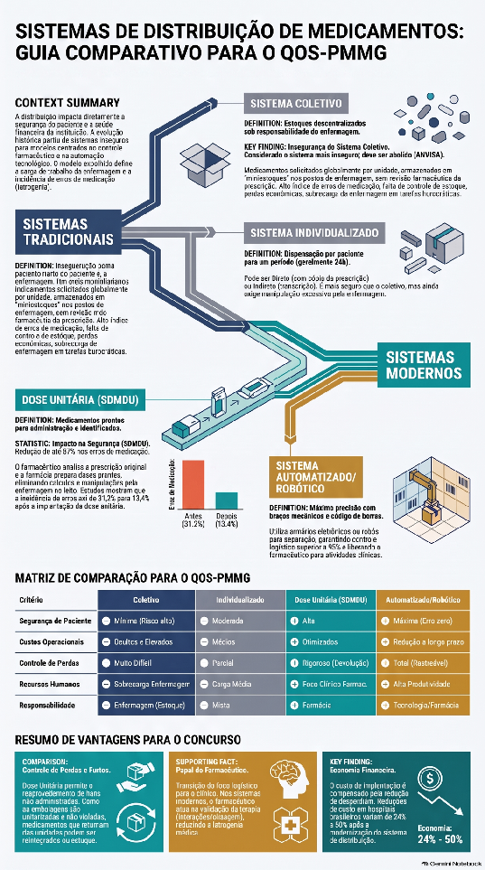

# 3.05 Sistemas de distribuição e boas práticas de dispensação

> **Eixo 3 — Gestão e Logística da Farmácia Hospitalar**

## Dados do edital e das provas

| Campo | Valor |
| :---- | :---- |
| Exigido em | 2013, 2017, 2023, 2024 |
| Nº de editais | 4 de 4 |
| Questões nas provas | 5 |
| Incidência | Alta incidência |

Exigido nos editais de 2013, 2017, 2023 e 2024 — 4 de 4 editais. Gerou 5 questões no conjunto das provas de 2013, 2017, 2023 e 2024.

Prioridade máxima: tópico de alta incidência, com presença recorrente nas provas. Vale dominar enunciados, exceções e números.

*Fonte dos números: planilha `QOS_PMMG_Analise_Estatistica`, aba «6. Cobertura do edital» (editais e provas de 2013, 2017, 2023 e 2024).*

## Resumo do tópico

<!-- a preencher -->

## Pontos-chave

<!-- a preencher: o que a banca costuma cobrar, pegadinhas, números -->

## Transcrição — Sistemas de distribuição de medicamentos

> [!IMPORTANT]
> Transcrição de capítulo de livro-texto brasileiro de farmácia hospitalar, migrada em
> 05/09/2026 do bloco "Questões geradas por IA" do banco de questões, onde estava colada
> abaixo das afirmativas Q3IA. Os títulos de seção, que no original vinham em caixa alta e
> às vezes quebrados em duas linhas pela extração do PDF, foram convertidos em cabeçalhos; o
> texto corrido não foi alterado e mantém as marcas de referência numéricas do original.

**Fonte:** Ribeiro, E. *Sistemas de Distribuição de Medicamentos para Pacientes Internados*,
cap. 17; com material do cap. 20 de *Ciências Farmacêuticas — Uma abordagem hospitalar*.



Fonte: Cap 20, Sistemas de Distribuição de Medicamentos em Farmácia Hospitalar, do livro “Ciências Farmacêuticas - Uma abordagem hospitalar”.

Os medicamentos representam atualmente uma alta parcela no orçamento dos hospitais e são de suma importância no tratamento de grande parte das doenças, justificando, portanto, a implementação de medidas que assegurem o uso racional destes produtos. Uma das medidas de grande impacto neste contexto é uma efetiva dispensação e/ou distribuição dos medicamentos 1.

É importante ressaltar que a dispensação de medicamentos é uma atividade técnico-científica de orientação ao paciente, de importância para a observância ao tratamento e, portanto, eficaz, quando bem administrada, devendo ser exclusividade de profissional tecnicamente habilitado — o farmacêutico; É que a distribuição racional de medicamentos consiste em assegurar os produtos solicitados pelos usuários na quantidade e especificações solicitadas, de forma segura e no prazo estabelecido, empregando métodos de melhor custo versus eficácia e custo versus eficiência 2.

Nas instituições hospitalares, o contato diário do serviço de farmácia com as unidades de internação e demais serviços acontece, principalmente, por meio do setor de distribuição, fazendo dele o cartão de apresentação da farmácia hospitalar 3,4. Vários fatores interferem na implantação e/ou implementação de um sistema de distribuição de medicamentos (SDM), e os principais são:

• supervisão técnica adequada;  
• características do hospital como: complexidade, tipo de edificação e fonte mantenedora;  
• existência de padronização de medicamentos atualizada;  
• gestão de estoque eficiente;  
• existência de controle de qualidade de produtos e processos;  
• manual de normas e rotinas aplicável.

Alguns autores classificam os sistemas de distribuição de medicamentos (SDMs) em apenas dois grandes grupos: tradicional e dose unitária 5,6, entretanto, será considerada a classificação dos tipos de sistemas em: coletivo, individualizado, combinado ou misto e dose unitária 3,4,7,8.

Em qualquer um dos sistemas citados, se houver farmácia satélite, o mesmo será considerado como descentralizado e quando não houver centralizado 1,3,4.

### Sistema de Distribuição Coletivo

O sistema de distribuição coletivo é o mais primitivo e arcaico dos sistemas, entretanto ainda há hospitais brasileiros que adotam 7,9. O sistema coletivo se caracteriza, principalmente, pelo fato de os medicamentos serem distribuídos por unidade de internação e/ou serviço a partir de uma solicitação da enfermagem, implicando a formação de vários estoques nas unidades assistenciais 1,3,4.

Neste sistema, os medicamentos são liberados sem que o serviço de farmácia tenha as seguintes informações:

* para quem o medicamento está sendo solicitado  
* porque está sendo solicitado  
* por quanto tempo será necessário

Neste modelo, a farmácia hospitalar é um mero repassador de medicamentos em suas embalagens originais segundo o solicitado pela enfermagem 1.

No sistema de distribuição coletivo, constata-se que a assistência ao paciente fica prejudicada pela não participação do farmacêutico na revisão e análise da prescrição médica e também pelo fato de a enfermagem estar mais envolvida com as questões relacionadas aos medicamentos do que a própria farmácia 1,3,7,10,11. Vários trabalhos relatam que a enfermagem, neste sistema, gasta cerca de 25% do seu tempo de trabalho em procedimentos relacionados aos medicamentos como: transcrever prescrição, verificar o estoque existente na unidade, preencher solicitação, ir à farmácia, aguardar separação dos mesmos, transportá-los até a unidade, guardá-los nos seus devidos lugares, separar os que são necessários a cada horário, fazer cálculos, prepará-los e administrá-los 7,9,11. Uma grave consequência é o alto índice de erros de administração de medicamentos que este sistema gera, desde o ato da prescrição até o momento da administração dos mesmos 1,3,4,7,9.

Os principais erros descritos são:  
• duplicação de doses;  
• medicamentos, dosagem e/ou via incorretos;  
• administração de medicamentos não prescritos.

Outro aspecto importante é o alto custo deste sistema para a instituição devido às perdas, por existirem vários pontos de estoque facilitando desvios, armazenamento inadequado ou caducidade dos medicamentos 1,3,4.

### Desvantagens do Sistema de Distribuição Coletivo

O sistema de distribuição coletivo apresenta as seguintes desvantagens 1,3,4,7,11,12:  
• transcrições das prescrições médicas;  
• falta de revisão da prescrição pelo farmacêutico;  
• maior incidência de erros na administração de medicamentos;  
• consumo excessivo do tempo da enfermagem em atividades relacionadas ao medicamento;  
• uso inadequado de medicamentos nas unidades assistenciais;  
• aumento de estoque nas unidades assistenciais;  
• perdas de medicamentos;  
• impossibilidade de faturamento real dos gastos por paciente;  
• alto custo institucional.

### Vantagens do Sistema de Distribuição Coletivo

O sistema de distribuição coletivo apresenta as seguintes vantagens 1,3,4,7,11:  
• grande disponibilidade de medicamentos nas unidades assistenciais;  
• redução do número de solicitações e devoluções de medicamentos à farmácia;  
• necessidade de menor número de funcionários na farmácia.

É importante ressaltar que, na realidade, as vantagens citadas são obstáculos para uma assistência farmacêutica de qualidade ao paciente.

### Sistema de Distribuição Individualizado

O sistema de distribuição individualizado se caracteriza pelo fato de o medicamento ser dispensado por paciente, geralmente para um período de 24 horas 3. Este sistema se divide em indireto e direto 1,7.

No sistema de distribuição individualizado indireto, a distribuição é baseada na transcrição da prescrição médica. A solicitação à farmácia é feita por paciente e não por unidade assistencial como no coletivo.

No sistema de distribuição individualizado direto, a distribuição é baseada na cópia da prescrição médica, eliminando a transcrição. Neste contexto, é possível uma discreta participação do farmacêutico na terapêutica medicamentosa, sendo já um grande avanço para realidade brasileira.

As prescrições podem ser encaminhadas à farmácia de diversas formas tais como:  
1) Prescrição com cópia carbonada - prescrição em duas vias, com carbono entre as folhas ou impresso confeccionado de modo a se obter uma cópia direta. Esta forma proporciona ao farmacêutico uma via da prescrição e não requer equipamentos especiais 9.  
2) Prescrição por fotocópias - utilização de máquinas copiadoras para produzir uma cópia exata da prescrição médica 9.  
3) Prescrição via fax - utilização de aparelho de fax para emissão na unidade assistencial e recepção na farmácia. Os inconvenientes do uso desta tecnologia são: permitir o envio de uma mesma prescrição mais de uma vez, gerar emissão de documentos ilegíveis induzindo aparecimento de novas fontes de erros de administração de medicamentos e permitir a perda das informações com o passar do tempo. Porém diminui o tempo gasto com o transporte de documentos 9.  
4) Prescrição informatizada - em cada unidade assistencial existe um terminal de computador no qual os médicos fazem diariamente a prescrição que é remetida à farmácia. Algumas das vantagens deste processo são a eliminação de falhas devido à má qualidade da grafia médica e a redução do tempo gasto com transporte de documentos 9,13.  
5) Sistema de radiofreqüência interligando computadores e leitores ópticos - o médico utiliza um terminal com uma tela que pode ser operado por meio de uma espécie de caneta eletrônica. Esta forma permite a verificação imediata de dados do paciente e a agilização da prescrição, que poderá ser feita próximo ao leito. Implica diminuição do número de terminais de computador na área hospitalar, redução de cabos de interligação e agilização da disponibilidade da prescrição para a farmácia e serviços de apoio 13. O sistema de distribuição individualizado já é adotado em hospitais brasileiros, existindo algumas variações de acordo com as peculiaridades de cada instituição, como: forma da prescrição médica, o modo de preparo e distribuição das doses e fluxo da rotina operacional 1,4,7,9.

O sistema de distribuição individualizado pode ser operacionalizado de várias formas:  
a) os medicamentos são dispensados em único compartimento, podendo ser um saco plástico identificado com a unidade assistencial, o número do leito, nome do paciente, contendo todos medicamentos de forma desordenada semelhante ao sistema de distribuição coletivo e para um período determinado que, geralmente, pode ser 12 horas, 24 horas ou por turno de trabalho.  
b) os medicamentos são fornecidos em embalagens, dispostos segundo o horário de administração constante na prescrição médica, individualizados e identificados para cada paciente e para no máximo de 24 horas. Sua distribuição pode ser feita em embalagem plástica, com separações obtidas por termossolda ou em escaninhos adaptáveis a carros de medicamentos adequados ao sistema de distribuição 1,3,4,11.

É fundamental para o êxito deste sistema que todos os profissionais envolvidos (farmacêutico, enfermeiro, médico, administrador hospitalar) participem de todo o processo de implantação, elaboração de impressos, aquisição de materiais e equipamentos e definição da rotina operacional.

### Desvantagens do Sistema de Distribuição Individualizado
O sistema de distribuição individualizado apresenta as seguintes desvantagens 3,4,7,11,12:  
• erros de distribuição e administração de medicamentos;  
• consumo significativo do tempo de enfermagem em atividades relacionadas aos medicamentos;  
• necessidade por parte da enfermagem de cálculos e preparo de doses;  
• perdas de medicamentos devido a desvios, caducidade e uso inadequado.

### Vantagens do Sistema de Distribuição Individualizado
O sistema de distribuição individualizado apresenta as seguintes vantagens 1,3,4,7,11,12:  
• possibilidade de revisão das prescrições médicas;  
• maior controle sobre o medicamento;  
• redução de estoques nas unidades assistenciais;  
• pode estabelecer devoluções;  
• permite o faturamento mais apurado do gasto por paciente.

### Causas de Erros de Administração de Medicamentos nos Sistemas de Distribuição Coletivo e Individualizado
Os resultados de vários estudos comprovaram que tanto no sistema de distribuição coletivo, como também no individualizado, em média, para cada seis doses administradas ao paciente uma estava errada 3,6,7,14,15.

As principais causas de erros de administração de medicamentos relacionadas nestes estudos foram:  
• má qualidade da grafia médica;  
• transcrição de prescrição médica;  
• a utilização de abreviaturas não padronizadas;  
• as ordens médicas verbais;  
• prescrições médicas incompletas e confusas;  
• fato de o médico não fazer uma nova prescrição a cada dia, apenas colocar no prontuário do paciente, a informação "manter prescrição";  
• falta de conhecimento amplo sobre estabilidade, incompatibilidade, armazenamento de medicamentos por parte da enfermagem;  
• nomes comerciais e/ou fármacos com grafias semelhantes;  
• dificuldade da enfermagem de correlacionar o nome do fármaco com especialidades farmacêuticas ou vice-versa.  

### Sistema de Distribuição Combinado ou Misto
No sistema de distribuição combinado ou misto, a farmácia distribui alguns medicamentos mediante solicitação e outros por cópia da prescrição médica — portanto, parte do sistema é coletivo e parte individualizado 1,4.

Geralmente, as unidades de internação, de forma parcial ou integral, são atendidas pelo sistema individualizado e os serviços (radiologia, endoscopia, ambulatórios, serviços de urgência e outros) são atendidos pelo sistema coletivo. É indicado que, neste sistema, as solicitações encaminhadas pelas unidades assistenciais sejam embasadas em relação de estoque previamente estabelecida entre farmácia e enfermagem. Estes estoques deverão ser controlados e repostos pela farmácia mediante documento justificando o uso do medicamento.  

### Sistema de Distribuição por Dose Unitária
No final da década de 1950, com o lançamento no mercado de medicamentos novos e mais potentes, mas também causadores de efeitos colaterais importantes, iniciou-se a publicação de trabalhos sobre a incidência de erros de administração de medicamentos em hospitais 7,14. Os resultados mostraram a necessidade de que os sistemas tradicionais (coletivo e individualizado) fossem revistos, visando melhorar a segurança na distribuição e na administração dos medicamentos.

Foi neste contexto que, nos anos de 1960, farmacêuticos hospitalares americanos desenvolveram o sistema de distribuição por dose unitária.

Analisando os SDMs, o sistema de distribuição por dose unitária é o que oferece melhores condições para um adequado seguimento da terapia medicamentosa do paciente. Vários trabalhos científicos 1,3,4,16,17 demonstraram que este sistema é mais seguro para o paciente, visto que reduz a incidência de erros, utiliza mais efetivamente os recursos profissionais e é mais eficiente e econômico para a instituição.

Estudos demonstraram que nos hospitais que adotaram o sistema de distribuição por dose unitária houve uma importante redução de gastos com medicamentos, variando de 25% a 40% 1,7,9.

É importante fazer uma diferenciação entre o sistema de distribuição por dose unitária e dose unitária de medicamentos! O conceito de distribuição por dose unitária é a distribuição ordenada dos medicamentos com formas e dosagens prontas para serem administradas a um determinado paciente de acordo com a prescrição médica, num certo período de tempo 8. A dose unitária industrial corresponde à dose padrão comercializada pelos laboratórios, fornecida em embalagem unitária, em que constam a correta identificação do fármaco, prazo de validade, lote, nome comercial e outras informações 1.

Portanto, um serviço que adote o sistema de dose unitária propriamente dito deverá distribuir todos os medicamentos, em todas as formas farmacêuticas, prontos para uso, sem necessidade de transferências ou cálculos por parte da enfermagem.

Outro princípio básico da dose unitária é que haja uma análise da prescrição médica e a elaboração do perfil farmacoterapêutico de cada paciente por parte do farmacêutico e registro da administração por parte da enfermagem 3,17.

O perfil farmacoterapêutico deve conter os seguintes dados sobre o paciente: idade, peso, diagnóstico, data de admissão, número do leito e nome da unidade assistencial. Com relação ao medicamento, deve incluir nome do fármaco de acordo com a Denominação Comum Internacional (DCI) ou Denominação Comum Brasileira (DCB), forma farmacêutica, concentração, dose, intervalo, via de administração, data do início e quantidade distribuída por dia 3,4,5,17,18.

Como pré-requisito para implantação da dose unitária, é necessário um sistema de gerenciamento de medicamentos efetivo, seguro e recursos humanos qualificados. Ou seja, farmacêuticos com conhecimentos básicos de farmacoterapia para participar e elaborar adequadamente planos terapêuticos e técnicos ou auxiliares de farmácia devidamente treinados 17,18. Estas atividades combinadas são a base da prática de farmácia clínica.

O grande desafio para que o sistema de dose unitária seja uma realidade brasileira é que se consiga obter as formas farmacêuticas estéreis unitarizadas. Para tanto, é necessário um alto investimento inicial para aquisição de materiais e equipamentos específicos para implantação de uma Central de Preparações Estéreis, o que nem sempre é viável para hospitais de pequeno e médio portes, que correspondem a cerca de 88% dos hospitais brasileiros 19.

Alguns farmacêuticos hospitalares classificam o SDM adotado em suas instituições como por dose unitária pelo fato de distribuírem os medicamentos separados por horário de administração e com algumas das formas farmacêuticas unitarizadas (geralmente os sólidos), desconsiderando, assim, os conceitos adotados nas atuais publicações científicas.

### Acondicionamento e Embalagem de Dose Unitária
Um dos fatores de relevância no sistema de distribuição de medicamentos por dose unitária é a forma pela qual são acondicionados e embalados os medicamentos 4.

Na escolha do acondicionamento e/ou da embalagem, deve-se considerar 4:  
• a adequação às condições físicas do hospital;  
• as condições financeiras da instituição;  
• as considerações farmacológicas, tais como estabilidade, fotossensibilidade, entre outros;  
• as vantagens econômicas.  

### Materiais Utilizados no Preparo de Dose Unitária
Para garantir a manutenção da qualidade dos produtos, é de suma importância que para cada produto seja verificado, em publicações científicas atualizadas, o tipo de envase mais apropriado.

O fracionamento ou reembalagem de medicamentos para o sistema de distribuição individualizado e/ou por dose unitária deve se efetuar em condições semelhantes às utilizadas pelo fabricante, de forma a impedir tanto uma possível alteração de estabilidade como a contaminação cruzada ou microbiana 1.

Entre os materiais mais utilizados estão os plásticos, laminados, vidros e alumínio 4.

### Considerações Específicas de Embalagem das Seguintes Formas Farmacêuticas

#### Líquidos para Uso Oral
O envase deve ser suficiente para liberar o conteúdo total etiquetado. É aceitável que seja necessário um acréscimo de volume conhecido, dependendo da forma de envase, do material e da formulação do medicamento. A concentração do fármaco deve ser especificada em unidade de peso por medida (mg/mL; g/mL). As seringas para administração oral não devem permitir a colocação de agulha. Os envases devem permitir a administração de seu conteúdo diretamente ao paciente 3,17.

#### Sólidos de Uso Oral
Para embalagem tipo blister, deve-se ter um verso opaco que permita imprimir informações, e o outro deverá ser de material transparente. O mesmo deve permitir fácil remoção do medicamento 3,17.

#### Medicamentos para Uso Parenteral
Uma agulha de tamanho apropriado deve ser parte integral da seringa. A seringa deve estar pronta, permitindo que o seu conteúdo seja administrado ao paciente sem necessitar de instruções adicionais. A proteção da agulha deve ser impenetrável, preferencialmente de um material rígido, evitando acidentes. A seringa deve permitir fácil manuseio e visualização de seu conteúdo 3,17.

#### Outras Formas Farmacêuticas
Os medicamentos para uso oftálmico, supositórios, ungüentos, entre outros, devem ser adequadamente etiquetados, indicando seu uso, via de administração e outras informações importantes 1,17.

### Requisitos para Implantação do Sistema de Distribuição por Dose Unitária
• farmacêutico hospitalar com treinamento específico para este fim;  
• laboratório de farmacotécnica;  
• central de preparações estéreis;  
• padronização de medicamentos;  
• dispositivo para entrega de doses unitárias (carrinhos, cestas e outros);  
• impressos adequados;  
• máquinas de soldar plásticos;  
• material de embalagens: sacos e potes plásticos; frascos de plásticos, de vidro, de alumínio; caixas de madeiras ou acrílico;  
• envelopadora — máquina de selagem e etiquetagem de comprimidos;  
• envasadora (líquidos, cremes, pomadas);  
• máquina de cravar frascos;  
• rotuladora;  
• impressora;  
• máquina para lavar frascos;  
• terminal de computador.  

### Vantagens do Sistema de Distribuição por Dose Unitária
O sistema de distribuição por dose unitária apresenta as seguintes vantagens 1,3,4,7,11,12:  
• identificação do medicamento até o momento de sua administração, sem necessidade de transferências e cálculos;  
• redução da incidência de erros de administração de medicamentos;  
• redução do tempo da enfermagem com atividades relacionadas ao medicamento, permitindo maior disponibilidade para o cuidado do paciente;  
• diminuição de estoques nas unidades assistenciais com conseqüente redução de perdas;  
• otimização do processo de devoluções;  
• auxílio no controle da infecção hospitalar devido à higiene e à organização no preparo de doses;  
• grande adaptabilidade a sistemas automatizados e computadorizados;  
• faturamento mais exato do consumo de medicamentos utilizados por cada paciente;  
• maior segurança para o médico em relação ao cumprimento de suas prescrições;  
• participação efetiva do farmacêutico na definição da terapêutica medicamentosa;  
• melhoria do controle sobre o padrão e horário de trabalho desenvolvidos pelo pessoal de enfermagem e farmácia;  
• redução do espaço destinado à guarda do medicamento nas unidades assistenciais antes da administração aos pacientes;  
• melhoria da qualidade da assistência prestada ao paciente.  

### Desvantagens do Sistema de Distribuição por Dose Unitária
O sistema de distribuição individualizado apresenta as seguintes vantagens 1,4,7:  
• dificuldade de se obter no mercado farmacêutico todas as formas e dosagens para uso em dose unitária;  
• resistência dos serviços de enfermagem;  
• aumento das necessidades de recursos humanos e infra-estrutura da farmácia hospitalar;  
• necessidade da aquisição de materiais e equipamentos específicos;  
• necessidade inicial de alto investimento financeiro.  

### Causas de redução de erros de distribuição e administração no sistema de dose unitária
Os seguintes fatores reduzem erros de distribuição e administração de medicamentos no sistema de distribuição por dose unitária 3,7,15,17:  
• a dose do medicamento é embalada, identificada e distribuída pronta, para ser administrada ao paciente, de acordo com a prescrição médica, não requerendo manipulação prévia por parte da equipe de enfermagem;  
• na unidade assistencial estarão estocados somente os medicamentos que atendem os casos de emergência, anti-sépticos e as doses necessárias para suprir as próximas 24 horas de tratamento do paciente;  
• a dupla conferência do medicamento pela farmácia e equipe de enfermagem através, respectivamente, do registro farmacoterapêutico do paciente e do registro de administração do medicamento.  

### Fluxos Especiais de Dispensação e Distribuição
É conveniente reforçar que a responsabilidade do farmacêutico no controle do uso de medicamentos se estende durante todo o ciclo de distribuição, tanto para pacientes internados como para ambulatoriais 18.

Alguns medicamentos, devido às suas peculiaridades, exigem uma distribuição diferenciada e, para estes, cada instituição promoverá adaptações de acordo com suas necessidades e possibilidades.  

### Soluções Parenterais de Grande Volume (SPGV)
Estas soluções estão acondicionadas em recipiente único com capacidade de 100 mL ou mais, conforme Portaria 500/97 da Secretaria de Vigilância Sanitária do Ministério da Saúde.

Atualmente existem diversos métodos de solicitação e distribuição de SPGV. O mesmo dependerá do tipo do hospital, do sistema de distribuição vigente e da existência ou não de uma central de misturas endovenosas 3.

Uma particularidade destes medicamentos é que eles ocupam um espaço físico considerável e têm peso significativo quando comparado com os demais.  

### Preparações Estéreis — Citostáticos

### Misturas endovenosas, nutrição parenteral e outras preparações
Naqueles hospitais em que se realize algumas destas atividades, será necessário organizar fluxos de solicitação e distribuição das soluções elaboradas.

Em alguns hospitais que adotam o sistema de distribuição por dose unitária, as referidas preparações são distribuídas junto com os demais medicamentos.

No que se refere aos citostáticos, é importante que cuidados especiais sejam tomados devido aos riscos ocupacionais dos mesmos.  

### Medicamentos Sujeitos a Controle Especial
Para a distribuição destes medicamentos se procederá de acordo com a norma vigente da vigilância sanitária. Independentemente do sistema de distribuição adotado, deverá ser utilizado impresso próprio do hospital e é recomendado que:  
• seja restrito o número de pessoas envolvidas com o processo de distribuição destes medicamentos;  
• que os mesmos sejam distribuídos separadamente dos demais medicamentos;  
• que os mesmos sejam armazenados nas unidades assistenciais em local adequado e seguro.  

### Medicamentos de Emergências
Todas as unidades assistenciais deverão manter em local de fácil acesso um estoque de medicamento para ser utilizado nas situações de emergências. Estes medicamentos deverão ser armazenados em carrinhos ou maletas próprios.

É importante que se determine qual profissional será o responsável pela reposição e controle dos mesmos, de forma a manter o estoque estabelecido sempre atualizado, visando à garantia de um atendimento eficiente e eficaz do paciente quando for necessário.

É recomendável que esta reposição seja feita mediante prescrição médica em nome do paciente que utilizou o medicamento.  

### Medicamentos de Uso Restrito
Visando ao uso racional de medicamentos, alguns hospitais adotam uma política diferenciada para distribuição de determinados grupos de medicamentos, entre eles:  
• os que são considerados reservas terapêuticas;  
• os de elevado custo de aquisição para a instituição;  
• os de indicações terapêuticas específicas.  

Para distribuição destes produtos, além da prescrição médica, é exigido o preenchimento de impressos específicos. Estes impressos são avaliados por auditores da comissão de padronização/comissão de farmácia e terapêutica ou serviço de controle de infecção hospitalar 22.

### Medicamentos para Ensaio Clínico
As boas práticas de pesquisa clínica preconizam que os medicamentos para estudos clínicos sejam distribuídos pela farmácia. É necessário que haja um rígido controle dos medicamentos distribuídos observando: o número de randomização do paciente, as doses liberadas e devolvidas. A adesão do paciente ao tratamento deve ser monitorizada. Os medicamentos devem ser prescritos apenas pelos investigadores autorizados.  

### Medicamentos para pacientes ambulatoriais
Um número significativo de internações hospitalares ocorre devido à falta de cumprimento dos esquemas terapêuticos. As atividades de orientação farmacêutica propiciam adesão ao tratamento e uso adequado dos medicamentos. Uma assistência farmacêutica ambulatorial de qualidade reduz custos e otimiza a terapêutica.

Portanto, é de grande relevância a elaboração de um sistema de dispensação de medicamentos para pacientes onco-hematológicos, portadores de patologias tais como: hipertensão, diabetes, tuberculose, hanseníase, síndrome de imunodeficiência adquirida e outras em tratamento ambulatorial.  

### Medicamentos para estoque padrão
Este fluxo existe basicamente nos sistemas de distribuição coletivo e individualizado. O mesmo se caracteriza pela existência nas unidades assistenciais de um estoque de determinados medicamentos com base em uma relação previamente definida entre a farmácia e a enfermagem. É recomendado que o mesmo se restrinja a medicamentos para atendimento de urgência e reposição eletrolítica.  

### Medicamentos Distribuídos por meio de Kits
A utilização de kits é uma forma de distribuir medicamentos organizados para realização de procedimentos específicos. Nestes kits são enviados, não só medicamentos, mas também os materiais médico-hospitalares que serão utilizados para veicular ou administrá-los. Este fluxo é muito empregado em farmácia satélite, principalmente de unidades cirúrgicas, apresentando bons resultados no que se refere à racionalização do uso de medicamentos e materiais médico-hospitalares 23,24.  

### Sistema de Distribuição Centralizado e Descentralizado
O sistema de distribuição de medicamentos pode também ser dividido em centralizado e descentralizado. No sistema centralizado, o setor de distribuição está concentrado em uma única área física e atende a todas as unidades assistenciais, enquanto no sistema descentralizado existe mais de uma unidade de distribuição situada em locais estratégicos destinados a uma demanda diferenciada de medicamentos. Estas unidades são denominadas farmácias satélites e estão ligadas à farmácia central por normas e rotinas operacionais e técnicas 3,4.

A necessidade da descentralização da distribuição surge quando existem setores com demanda diferenciada e/ou quando a edificação do hospital é do tipo multiblocos ou com muitos andares e, ainda, quando a implementação de novos serviços e tecnologias no hospital implica expansão da área física da farmácia.

Geralmente têm sido implantadas as farmácias satélites em unidades como bloco cirúrgico, centro obstétrico, quimioterapia e unidade coronariana.  

### Vantagens do Sistema de Distribuição Centralizado e Descentralizado
O sistema de distribuição de forma centralizada e descentralizada apresenta as seguintes vantagens 7,9:  
• melhorar a comunicação entre equipe médica, enfermagem e farmácia com esclarecimento de dúvidas e avaliação da utilização adequada dos medicamentos;  
• maior agilidade e viabilização no uso racional dos medicamentos;  
• treinamento do pessoal de apoio direcionado de acordo com as peculiaridades de cada unidade assistencial.  

### Desvantagens do sistema de distribuição centralizado e descentralizado
O sistema de distribuição de forma centralizada e descentralizada apresenta as seguintes desvantagens 7,9:  
• aumento de custos com recursos humanos e implantação de unidades satélites;  
• necessidade de aplicar os instrumentos gerenciais em mais de uma área física.  

### Informática, Automação e Sistemas de Distribuição de Medicamentos
A informática, como a automação, atuam como importantes instrumentos para racionalização do emprego do tempo e agilização das atividades desenvolvidas na farmácia.

As atividades exercidas diariamente na farmácia do hospital são um processamento contínuo de dados relacionados a medicamentos, pacientes, tempo, pessoal e atividades programadas 25.

Em muitos estabelecimentos de saúde, a entrada e o processamento dos dados são feitos de forma manual, de maneira insuficiente, dificultando a sua localização quando necessária, além de consumir muito tempo e possibilitar informações incorretas 25.

Existem, na farmácia hospitalar, muitas áreas onde a melhoria da qualidade e produtividade do serviço prestado pode estar associada à utilização de um serviço eficiente e eletrônico de processamento de dados 3.

A informática, em qualquer atividade, é importante na atualização e consolidação de dados, com redução de tempo de trabalho, maior confiabilidade e rapidez na produção de informação 1.

No estado atual de desenvolvimento da informática em todos os setores e atividades da vida moderna, não cabe questionar se esta ferramenta poderá ser empregada, mas sim como ela será utilizada para otimizar e agilizar sua aplicação.

Até pouco tempo, era necessária justificativa meticulosa e bem fundamentada para o emprego da informática nos controles realizados na farmácia hospitalar. Estas exigências, feitas principalmente pela diretoria das instituições, eram decorrentes do alto custo de aquisição dos equipamentos de informática. Entretanto, hoje em dia, com a redução considerável dos preços das máquinas e programas, os administradores hospitalares aceitam com maior facilidade a sua necessidade 25.

A utilização da informática nas atividades da farmácia deve ter os seguintes objetivos gerais 26:  
• facilitar e agilizar a gestão econômica do serviço através de estatísticas sobre aquisição, distribuição e dimensionamento de estoque;  
• facilitar o gerenciamento de pessoal e produtos;  
• melhorar a confiabilidade nos dados durante e no final do processo;  
• melhorar os sistemas de trabalho nas diversas atividades, diminuindo, assim, os aspectos burocráticos;  
• agilizar a monitorização da utilização de produtos;  
• melhorar a qualidade da assistência aos pacientes através da transmissão rápida e precisa de informações, passíveis de revisão e correlação, possibilitando, assim, uma atuação mais clínica do farmacêutico;  
• avaliar a carga de trabalho nas diferentes áreas para distribuir os recursos e obter a máxima eficácia com o menor custo 25.  

### A Utilização da Informática nos Sistemas de Distribuição de Medicamentos
É notório que, independentemente do SDM escolhido para utilização em um estabelecimento de saúde, a informática pode contribuir significativamente para a redução de trabalho, erros e custos 3,26.

O plano de informatização da farmácia deve se basear numa seleção ordenada — no tempo e grau de desenvolvimento — tanto de serviços implicados quanto nos processos, de modo que cada uma das atividades implantadas possa servir de apoio para o desenvolvimento de outras aplicações, seja no mesmo serviço ou em outro serviço do hospital 25.

É necessária, antes da escolha e implantação da informatização, a definição de alguns pontos básicos como 25:  
• os documentos que podem ser obtidos ou gerados;  
• avaliação de todos os setores de atividades que formam a estrutura do serviço de farmácia para possibilitar o compartilhamento de dados obtidos por meio dos processos realizados, evitando, assim, a repetição de informações de saída;  
• estabelecer a ordem de prioridade e a seqüência de aplicação dos programas;  
• prevenir as conseqüências do impacto da aplicação desta tecnologia sobre os sistemas em funcionamento e sobre o pessoal.  

Todas as atividades e o SDM estabelecidos na farmácia são em função do medicamento e do paciente. Existem três áreas prioritárias que devem ser observadas com relação ao medicamento para o estabelecimento de um programa integrado de informática no âmbito hospitalar 25.

1 — utilização do formulário ou guia farmacoterapêutico: as informações sobre os fármacos e dados como apresentação, via de administração, grupo terapêutico, posologia mais comum, interações e incompatibilidades são importantes;

2 — farmacotécnica: disponibilizar as informações sobre composição das fórmulas e produto acabado;

3 — centro de informação de medicamentos (CIM): criação de base de dados com informações obtidas de revisões, análise de artigos científicos, através da qual o CIM emitirá uma opinião sobre determinados aspectos da terapia.

Em relação ao paciente, o perfil farmacoterapêutico é um item que deve ser observado pois, por meio dele, podem ser obtidas informações sobre todos os fármacos administrados ao paciente em cada uma das internações. Estas informações se originam das prescrições médicas de medicamentos sintomáticos, terapêuticos, preparações intravenosas, como nutrição parenteral e agentes citostáticos, medicamentos com substâncias sujeitas a controle legal e devoluções ou doses não administradas 25.  

### A Utilização da Automação nos Sistemas de Distribuição de Medicamentos
Os equipamentos automatizados para distribuição e estocagem são cada vez mais um componente prevalente nos processos de utilização de medicamentos nas organizações de saúde em países desenvolvidos 26.

A Associação Nacional de Conselhos de Farmácia dos EUA (NABP) definiu sistemas automatizados de farmácia como sistemas mecânicos que executam operações ou atividades relacionados à estocagem, à embalagem ou à distribuição de medicamentos, executando também as ações de controle e gerenciamento de informações. O processamento de dados e o código de barras, embora incorpore componentes destes sistemas, não são considerados como tecnologia de distribuição automatizada de medicamentos 26.

No momento atual, as experiências com equipamentos para automatização sugerem que os mesmos são apropriados quando a sua utilização pode ser efetiva. Quando estas máquinas não podem ser utilizadas adequadamente, sua complexidade, desenho, funções variadas, requerimento de manutenção, pessoal especializado para operar e outros fatores podem ter efeitos indesejáveis e comprometer o próprio paciente 26.

A utilização dos equipamentos automatizados deve ser feita, tendo em mente os seguintes objetivos 25,26:  
• apresentar informações necessárias para a administração apropriada dos medicamentos de tal forma que o cuidado ao paciente seja acessível e oportuno;  
• disponibilizar, prontamente, medicamentos para as necessidades dos pacientes de forma e controle seguros;  
• possibilitar a identificação e minimização dos erros com medicamentos;  
• desenvolver consciência segura, precisa e produtiva nas pessoas envolvidas com o processo de distribuição;  
• satisfazer os pacientes com entrega em tempo hábil e com qualidade;  
• facilitar o sistema de distribuição de medicamentos;  
• aperfeiçoar a administração dos recursos para reordenar os suprimentos para o sistema de distribuição.  

O farmacêutico é o responsável por assegurar que as operações dos sistemas automatizados sejam projetadas e tenham uma boa manutenção para prevenir os erros e as interrupções do sistema. Todas as informações disponibilizadas pelos sistemas automatizados requerem verificação periódica 26.

O sistema automatizado traz junto informações, máquinas e pessoas em um relacionamento complexo e interdependente. Durante todo o processo é necessário treinamento continuado desde a elaboração do projeto até a manutenção do sistema 26.

Cada organização deve ter um plano emergencial para manutenção oportuna da distribuição dos medicamentos, segurança e documentação quando ocorrer interrupção do sistema automatizado 26.

Alcançar uma correta distribuição de medicamentos é a responsabilidade mais bem estabelecida da farmácia. A automatização evoluiu continuamente para facilitar o cumprimento desta proposta 26.  

### Garantia da Qualidade nos Sistemas de Distribuição de Medicamentos
A preocupação com a qualidade na prestação de serviços de saúde tem aumentado. Na distribuição dos medicamentos, a qualidade deve estar assegurada em todas as etapas do processo, que tem início na leitura e interpretação das prescrições médicas e termina na disponibilidade do medicamento para o paciente ou seu retorno ao estoque 27.

A garantia da qualidade poderá ser monitorizada por várias formas e métodos. Alguns autores preconizam a utilização de itens de controle com o objetivo de priorizar as etapas a serem controladas no processo da garantia da qualidade 27,28,29.

Alguns pontos importantes de medida e controle dentro da distribuição de medicamentos podem ser registrados e mapeados continuamente como:  
• tempo gasto no preparo e na entrega das doses;  
• monitorização do padrão de apresentação da entrega, observando, por exemplo, o aspecto visual da embalagem, segurança, identificação entre outros;  
• avaliação dos erros encontrados no preparo e na entrega das doses;  
• avaliação da satisfação da enfermagem e médicos com os serviços prestados pela farmácia;  
• nível de informações prestadas à equipe de saúde nos seguintes aspectos: clareza, precisão e dados complementares.  

Qualidade implica busca constante de melhoria. Ao alcançar a meta proposta, devem-se procurar novas estratégias para elevar o padrão e a satisfação do cliente, estabelecendo, assim, um vínculo de parceria 27,28,29.  

### Conclusão
Os SDMs continuarão a mudar e evoluir durante os próximos anos. O farmacêutico deve estar sempre atento às inovações tecnológicas e científicas, visando melhorar a qualidade da assistência prestada ao paciente. O crescente complexo da terapia com medicamentos exige que a farmácia tenha um papel cada vez mais atuante para que as desventuras terapêuticas sejam evitadas e para que as terapias medicamentosas prescritas possam verdadeiramente melhorar a qualidade de vida do paciente.

Porém, antes que qualquer serviço de farmácia possa melhorar a qualidade da assistência prestada ao paciente através da implantação de atividades clínicas que subsidiem terapias medicamentosas, é preciso garantir um seguro e efetivo sistema de distribuição de medicamentos.

### Bibliografia
1. Brasil. Ministério da Saúde. Coordenação de Controle de Infecção Hospitalar. Guia Básico para a Farmácia Hospitalar. Brasília: Ministério da Saúde, 31-62, 1994.
2. Bonfim JRA, Mercucci VL. A construção da política de medicamentos. São Paulo, Ed. Hucitec: 381p., 1997.
3. Codina C, Ribas J, Roca M. Dispensacion y distribuicion de medicamentos. In: Dominguez-Gil H, Falgas JB. Farmacia Hospitalaria, Madrid: EMISA, 370-395, 1992.
4. Conselho Federal de Farmácia. Manual Básico de Farmácia Hospitalar. Brasília: Conselho Federal de Farmácia, 49-65, 1997.
5. Beltran JR. Distribuición de medicamentos en dosis unitarias en los hospitales. In: Symponisium Internacional de Farmacia Hospitalaria. Envasado de medicamentos em dosis unitarias. Alicante, 1978.
6. Domecq C. Descripción del sistema de dispensación de medicamentos mediante dosis unitarias. In: Arancibia A, Cid E, Domecq C, Paulos C, Pezzani M, Pinilla E, Rojas Metal. Fundamentos de Farmacia Clínica. Santiago: Facultad de Ciencias Químicas y Farmacéuticas - Universidad de Chile, 51-56, 1993.
7. Ribeiro E. "Dose Unitária": Sistema de distribuição de medicamentos em hospitais. Revista de administração de empresas 33(6):62-73, 1993.
8. Garrison TJ, Smith MC, Brown T. Medication distribution systems. Handbook of institutional pharmacy practice. London. 1979.
9. Carestiato JC, Ferreira LG. Dose unitária. Relação custo x benefício de sua implantação nos hospitais públicos brasileiros como política de governo. Revista Brasileira de Farmácia, 77(3):103-112, 1996.
10. Organización Mundial de la Salud. El Sumunistro de medicamentos. Boston, 1983.
11. Maia Neto JF. Sistemas de distribuição de medicamentos. In: Maia JF. Farmácia hospitalar um enfoque sistêmico. Brasília: Thesaurus, 85-113, 1990.
12. Aguilar NG, D'Alessio R. Guía para el desarollo de servidos farmacéuticos hospitalarios: Logística del suministro de Medicamentos, Washington, Organización Panamericana de la Salud: 1997.
13. Associação Brasileira de Automação Comercial. Sistema de informação em Hospitais. Informativo Automação Hospitalar, 3(20):3-6, 1998.
14. Barker KN, McConnel WE. Detecting errors in hospitals. American Journal of Hospital Pharmacy, Washington 19:361-69, 1962.
15. Nemenschawander M. Effective use of dispensing automation In: Cohen MR. Medication Errors. Washington: American Pharmaceutical Association, 10.1-10.15, 1999.
16. American Sodety of Hospital Pharmacists. ASHP statement on unit dose drug distribution. Am J Hosp Pharm 46:2346, 1989.
17. Aguilar NG, D'Alessio R. Guia para el desarollo de servidos farmacéuticos hospitalarios: Sistema de distribuición de medicamentos por dosis unitárias. Washington, OPS: 1-31, 1997.
18. Americam Society of Hospital Pharmacists. ASHP guidelines on preventing medication errors in hospitais. Am J Hosp Pharm 50:305-14, 1993.
19. Castelar RM, Modelet P, Grabors V. Gestão Hospitalar: um desafio para o hospital brasileiro. Cooperação Brasil-França. Paris: Ensp Editora cáp. 3:69-79, 1993.
20. ASHP statement on the pharmacist's responsability for distribution and control of drug products. In: Practice Standards of ASHP 1996-1997. Deffenbaugh JH, ed. Bethesda, MD: American Society of Heath System Pharmacists; 1996.
21. Coimbra JH, Valsechi EASS, Carvalho MDB, Pelloso SM. Sistema de distribuição de medicamentos por dose unitária; reflexões para prática da enfermagem. Ribeirão Preto 6(4):15-19, 1998.
22. Universidade Federal de Minas Gerais - Hospital das Clínicas - Comissão de Farmácia e Terapêutica - Formulário Farmacêutico 14ª ed. Belo Horizonte, 121p. 2000-2001.
23. Pereira GA. Material Médico Hospitalar. Rio de Janeiro: Guanabara Koogan, 95p., 1997.
24. Rosa VHT. Hospital das Clínicas implanta kit cirúrgico. Âmbito Hospitalar 5:28-32, 1996.
25. Napal V, Ferrandiz R, Idoate A. Informática na Farmácia Hospitalar In: Dominguez-Gil H, Falgas JB. Farmacia Hospitalaria, Sociedad Espafiola de Farmacéuticos Hospitalarios, Madrid: EMISA, 91-135, 1992.
26. American Society of Health - System Pharmacists. ASHP Guidelines on the Safe Use of Automated Medication Storage and Distribution Devices. Am J Health-Syst Pham 55:1403-7, 1998.
27. Nogueira LCL. Gerenciamento pela qualidade total na saúde. Belo Horizonte, Ed. DG: 118p., 1999.
28. Campos VF Gerenciamento da Rotina do dia a dia. 7ed. Belo Horizonte: Ed. DG, 276p., 1998.
29. Deming WE. Quality Productivity and Competitive position. Massachusetts, Institute of Technology, 1982.

## Legislação e referências

<!-- a preencher: RDCs, portarias, resoluções do CFF, capítulos de livro -->


## Transcrição — SBRAFH Padrões Mínimos (2017) — Distribuição e dispensação

> [!IMPORTANT]
> Transcrição *ipsis litteris* de trecho(s) de **SBRAFH — Padrões Mínimos para Farmácia
> Hospitalar e Serviços de Saúde, 3ª edição, 2017**. Migrada em 05/09/2026 a partir do PDF
> oficial (partido em dois arquivos por tamanho). O texto corrido não foi alterado; apenas a
> quebra de linha do PDF foi recomposta em parágrafos Markdown e os títulos de seção foram
> convertidos em cabeçalhos. A âncora com o documento integral está em
> [3.01](3.01%20Organiza%C3%A7%C3%A3o%20hospitalar%2C%20estrutura%20da%20farm%C3%A1cia%20e%20farm%C3%A1cias%20sat%C3%A9lites.md).

**Fonte:** SOCIEDADE BRASILEIRA DE FARMÁCIA HOSPITALAR E SERVIÇOS DE SAÚDE.
**Padrões Mínimos para Farmácia Hospitalar e Serviços de Saúde.** 3. ed. São Paulo: SBRAFH, 2017.
ISBN 978-85-61645-00-7.


---

#### 3.3. Logística Farmacêutica e Preparo de Medicamentos 14

## Questões relacionadas

- **Treino ativo:** [Testes V/F deste tópico](testes/3.05%20Sistemas%20de%20distribui%C3%A7%C3%A3o%20e%20boas%20pr%C3%A1ticas%20de%20dispensa%C3%A7%C3%A3o.md) — 10 itens sobre dose unitária e comparação entre sistemas.

## Recursos

Imagens, esquemas e anexos deste eixo ficam na pasta `recursos/`, ao lado deste arquivo. Para referenciar:

```markdown

```

## Controle de revisão

- [ ] 1ª leitura
- [ ] Resumo escrito
- [x] Testes V/F gerados (10 itens — cobrem a dose unitária; as demais seções da transcrição seguem sem itens)
- [ ] Questões resolvidas
- [ ] Revisão final
