# 6.02 Farmacoterapia cardiovascular (funções renal e cardiovascular)

> **Eixo 6 — Farmacoterapia Clínica**

## Dados do edital e das provas

| Campo | Valor |
| :---- | :---- |
| Exigido em | 2013, 2017, 2023, 2024 |
| Nº de editais | 4 de 4 |
| Questões nas provas | 6 |
| Incidência | Alta incidência |

Exigido nos editais de 2013, 2017, 2023 e 2024 — 4 de 4 editais. Gerou 6 questões no conjunto das provas de 2013, 2017, 2023 e 2024.

Prioridade máxima: tópico de alta incidência, com presença recorrente nas provas. Vale dominar enunciados, exceções e números.

*Fonte dos números: planilha `QOS_PMMG_Analise_Estatistica`, aba «6. Cobertura do edital» (editais e provas de 2013, 2017, 2023 e 2024).*

## Sumário

Navegação pelas seções deste arquivo (o texto integral permanece abaixo).

- [Dados do edital e das provas](#dados-do-edital-e-das-provas)
- [Resumo do tópico](#resumo-do-tópico)
- [Pontos-chave](#pontos-chave)
- [Transcrição — Goodman & Gilman, 12ª ed., capítulo 29 (trechos)](#transcrição--goodman--gilman-12ª-ed-capítulo-29-trechos)
  - [Digoxina](#digoxina)
  - [Adenosina](#adenosina)
- [Transcrição — Diretriz Brasileira de Hipertensão Arterial (SBC/SBH/SBN, 2025) — kit de slides](#transcrição--diretriz-brasileira-de-hipertensão-arterial-sbcsbhsbn-2025--kit-de-slides)
  - [Sumário da diretriz (kit de slides)](#sumário-da-diretriz-kit-de-slides)
  - [Capa e identificação](#capa-e-identificação)
  - [Capítulo 1. Introdução](#capítulo-1-introdução)
  - [Capítulo 2. Epidemiologia, definição e prevenção primária](#capítulo-2-epidemiologia-definição-e-prevenção-primária)
  - [Capítulo 3. Medida da pressão arterial, diagnóstico e classificação](#capítulo-3-medida-da-pressão-arterial-diagnóstico-e-classificação)
  - [Capítulo 4. Avaliação clínica e complementar e estratificação de risco cardiovascular](#capítulo-4-avaliação-clínica-e-complementar-e-estratificação-de-risco-cardiovascular)
  - [Capítulo 5. Início de tratamento e metas terapêuticas](#capítulo-5-início-de-tratamento-e-metas-terapêuticas)
  - [Capítulo 6. Medidas não medicamentosas](#capítulo-6-medidas-não-medicamentosas)
  - [Capítulo 7. Tratamento medicamentoso](#capítulo-7-tratamento-medicamentoso)
  - [Capítulo 8. Hipertensão arterial e condições clínicas associadas](#capítulo-8-hipertensão-arterial-e-condições-clínicas-associadas)
  - [Capítulo 9. Hipertensão arterial em idosos, crianças e adolescentes](#capítulo-9-hipertensão-arterial-em-idosos-crianças-e-adolescentes)
  - [Capítulo 10. Hipertensão arterial em mulheres](#capítulo-10-hipertensão-arterial-em-mulheres)
  - [Capítulo 11. Crise hipertensiva](#capítulo-11-crise-hipertensiva)
  - [Capítulo 12. Hipertensão arterial resistente e refratária](#capítulo-12-hipertensão-arterial-resistente-e-refratária)
  - [Capítulo 13. Adesão ao tratamento anti-hipertensivo](#capítulo-13-adesão-ao-tratamento-anti-hipertensivo)
  - [Capítulo 14. Melhores práticas no cuidado às pessoas com hipertensão arterial na APS do SUS](#capítulo-14-melhores-práticas-no-cuidado-às-pessoas-com-hipertensão-arterial-na-aps-do-sus)
  - [Capítulo 15. Perspectivas](#capítulo-15-perspectivas)
- [Legislação e referências](#legislação-e-referências)
- [Questões relacionadas](#questões-relacionadas)
- [Recursos](#recursos)
- [Controle de revisão](#controle-de-revisão)

## Resumo do tópico

<!-- a preencher -->

## Pontos-chave

<!-- a preencher: o que a banca costuma cobrar, pegadinhas, números -->

## Transcrição — Goodman & Gilman, 12ª ed., capítulo 29 (trechos)

> [!IMPORTANT]
> Texto de 2012, transcrito **apenas nos trechos de digoxina e adenosina**. O restante do
> capítulo não foi transcrito. Como em todo material desta edição, confira os pontos sensíveis
> contra as diretrizes atuais antes de fixar como conduta.

**Fonte:** *As bases farmacológicas da terapêutica de Goodman e Gilman*, 12ª edição,
**Capítulo 29: Antiarrítmicos**.

*Migrado em 05/09/2026 do bloco "Questões geradas por IA" do banco de questões, onde este
texto estava colado abaixo das afirmativas Q1IA e Q2IA.*

### Digoxina

> **Nota de transcrição — 05/09/2026.** O texto abaixo foi extraído de PDF e vinha com quebras de ligadura
> ("fi", "fl") e de sílaba no meio de palavras — "para a fim imediato", "ineficazes",
> "car díacos", "fre quên cia". Essas quebras foram unidas para o texto ficar legível e
> pesquisável; nenhuma palavra foi trocada.


Efeitos farmacológicos. Os glicosídeos digitálicos exercem efeitos inotrópicos positivos e são muito utilizados na insuficiência cardíaca (ver Capítulo 28). Sua ação inotrópica resulta de um aumento do Ca2+ intracelular (Smith, 1988), que também é a base para as arritmias relacionadas com a intoxicação por glicosídeos cardíacos, fármacos que aumentam a inclinação da fase 4 (isto é aumentam a taxa de automatismo), em especial se a \[K\]o for baixa, também exercem proeminentes ações vagotônicas (p. ex., digoxina), que resultam em inibição das SEÇÃO III correntes de Ca2+ no nodo AV e ativação das correntes de K+ mediadas por acetilcolina no átrio. Com isso, os principais efeitos eletrofisiológicos “indiretos” dos glicosídeos são a hiperpolarização, o encurtamento dos potenciais de ação e o aumento da refratariedade do nodo AV. A última ação responde pela utilidade do digital em fazer cessar as arritmias reentrantes envolvendo o nodo AV e controlar a resposta ventricular em pacientes com fibrilação atrial. Os glicosídeos cardíacos podem ser especialmente úteis na última situa ção porque muitos desses pacientes têm insuficiência cardíaca, que pode ser exacerbada por outros fármacos que bloqueiam o nodo AV, como os bloqueadores de canal de Ca2+ ou antagonistas do receptor β-adrenérgico. Entretanto, o impulso simpático está notavelmente aumentando em muitos pacientes com insuficiência cardíaca avançada, de modo que o digital não é muito eficaz em diminuir a frequência; no entanto, mesmo um modesto decréscimo na frequência pode melhorar a insuficiência cardíaca. Do mesmo modo, em outras condições nas quais um alto tônus simpático acelera a condução atrioventricular (p. ex., doen ça pulmonar crônica, tireotoxicose), o tratamento com digitálicos pode ser apenas eficaz em reduzir a frequência. Em pacientes com transplantes cardíacos, nos quais houve ablação da inervação, os glicosídeos cardíacos são ineficazes para o controle da frequência. O aumento da atividade simpática e a hipoxia podem potencializar as alterações induzidas pelos digitálicos no automatismo e nas PDT, aumentado assim o risco de toxicidade digitálica. Uma complicação adicional na tireotoxicose é a maior depuração de digoxina. Os principais efeitos eletrocardiográficos dos glicosídeos cardíacos são o prolongamento do intervalo PR e a alteração inespecífica da repolarização ventricular (manifesta por depressão do segmento ST), cujo mecanismo subjacente não é bem compreendido. Efeitos adversos. Por causa do baixo índice terapêutico, a toxicidade dos glicosídeos cardíacos é um problema clínico comum (ver Capítulo 28). Arritmias, náuseas, distúrbios da função cognitiva e visão borrada ou amarela são as manifestações habituais. Concentrações séricas elevadas de digitálicos, hipoxia (p. ex., decorrente do doen ça pulmonar crônica) e anormalidades eletrolíticas (p. ex., hipopotassemia, hipomagnesemia e hipercalcemia) predispõem a arritmias induzidas por digitálicos. Embora a intoxicação por digitálicos possa causar qualquer arritmia, determinados tipos são característicos. As arritmias que devem levantar forte suspeita de intoxicação digitálica são aquelas nas quais ocorre taquicardia relacionada com PDT associada ao comprometimento da função do nodo sinusal ou do nodo AV. A taquicardia atrial com bloqueio AV é clássica, mas também pode ocorrer bigeminismo ventricular (batimentos sinusais que se alternam com batimentos de origem ventricular), taquicardia ventricular “bidirecional” (uma entidade rara), taquicardias juncionais AV e vários graus de bloqueio AV. Na intoxicação grave (p. ex., após tentativas de suicídio), observam-se hiperpotassemia grave, decorrente do envenenamento da Na+, K+-ATPase, e profunda bradiarritmia, que pode não responder ao tratamento com marca-passo. Em pacientes com níveis séricos elevados de digitálicos, o risco de precipitar fibrilação ventricular por cardioversão com CC é provavelmente maior; nos pacientes com níveis sanguíneos terapêuticos, a cardioversão com CC pode ser usada com segurança. As formas menos graves de intoxicação por glicosídeos cardíacos podem não requerer tratamento específico, afora a monitoração do ritmo car día co até que se resolvam os sinais e sintomas de toxicidade. A bradicardia sinusal e o bloqueio AV frequentemente respondem à atropina intravenosa, mas o efeito é transitório. O Mg2+ já foi usado com sucesso em alguns casos de taquicardia induzida por digitálicos. Qualquer arritmia séria deve ser tratada com fragmentos Fab antidigoxina, que são eficazes em ligar-se à digoxina e à digitoxina, aumentando sua excreção renal (ver Capítulo 28). As concentrações séricas dos glicosídeos aumentam notavelmente com o emprego de anticorpos antidigitálicos, mas isso corresponde à fração ligada (farmacologicamente inativa) do fármaco. Um marca-passo car día co temporário pode ser necessário para a disfunção avançada do nodo sinusal ou AV. Os digitálicos exercem efeitos vasoconstritores arteriais diretos, que podem ser especialmente deletérios com o uso intravenoso do fármaco em pacientes com aterosclerose avançada; já foram descritas isquemias mesentéricas e coronárias. Farmacocinética clínica. O único glicosídeo digitálico usado nos EUA é a digoxina. A digitoxina (várias preparações genéricas) também é usada para o tratamento oral a longo prazo, fora dos EUA. A biodisponibilidade dos comprimidos de digoxina não é completa (75%). Em alguns pacientes, a flora intestinal pode metabolizar notavelmente a digoxina, reduzindo sua biodisponibilidade. Nesses pacientes, são necessárias doses mais altas que as habituais para que haja eficácia clínica; a toxicidade é um sério risco com o uso de antibióticos que destroem a flora intestinal. A inibição da glicoproteína P (ver “Efeitos adversos e Interações medicamentosas” em “Dronaderona”) também pode desempenhar um papel em casos de toxicidade. Cerca de 20-30% da digoxina ligam-se às proteínas. Os efeitos antiarrítmicos da digoxina podem ser obtidos com tratamento intravenoso ou oral. Entretanto, a distribuição da digoxina para seu(s) local(is) efetor(es) é relativamente lenta, razão pela qual mesmo com o tratamento intravenoso há um intervalo de várias horas entre a administração do fármaco e o desenvolvimento de efeitos antiarrítmicos mensuráveis, como o prolongamento do intervalo PR ou a redução da frequência ventricular na fibrilação atrial. Para evitar a intoxicação, uma dose de ataque de aproximadamente 0,6 mg de digoxina é administrada durante 24 h. Dosar a concentração de digoxina sérica pós-distribuição e ajustar a dose diária (0,625 mg), de modo a manter concentrações de 0,5-2 ng/mL, são medidas úteis durante o tratamento com digoxina a longo prazo (Quadro 29-5). Alguns pacientes podem necessitar e tolerar concentrações mais altas, mas com maior risco de efeitos adversos. A meia-vida de eliminação da digoxina é de aproximadamente 36 h, de modo que as doses de manutenção são administradas 1 vez/ dia. A eliminação renal do fármaco inalterado responde por menos de 80% da eliminação de digoxina. As doses de digoxina devem ser reduzidas (ou o intervalo entre elas aumentado) e as concentrações séricas monitoradas, rigorosamente, em pacientes com comprometimento da excreção por insuficiência renal ou em pacientes hipotireoideos. O metabolismo da digoxina é primariamente hepático e o fármaco pode ser útil aos pacientes com disfunção renal avançada ou flutuante. O metabolismo da digitoxina é acelerado por fármacos como a fenitoína e a rifampicina, que induzem o metabolismo hepático (ver Capítulo 6). A meia-vida de eliminação da digitoxina é mais longa que a da digoxina (cerca de 7 dias); é altamente ligada às pro teí nas e sua faixa terapêutica é de 10-30 ng/mL. Fármacos como amiodarona, quinidina, verapamil, diltiazem, ciclosporina, itraconazol, propafenona e flecainida diminuem a depuração de digoxina, provavelmente inibindo a glicoproteína P, a principal via de eliminação da digoxina (Fromm e cols., 1999). Novas concentrações de equilíbrio de digoxina são alcançadas após 4-5 meias-vidas, ou seja, aproximadamente uma semana. A toxicidade por digitálico é tão frequente com a quinidina ou com a amiodarona que o procedimento de rotina é diminuir a dose de digoxina quando esses fármacos também são administrados. Em todo caso, as concentrações de digoxina devem ser medidas regularmente e a dose ajustada se necessário. A hipopotassemia, que pode ser causada por muitos fármacos (p. ex., diuréticos, anfotericina B e corticosteroides) irá potencializar as arritmias induzidas por digitálicos.

### Adenosina

Adenosina. A adenosina é um nucleosídeo de ocorrência natural, administrado em bolo intravenoso rápido para o fim imediato das arritmias supraventriculares reentrantes (Lerman e Belardinelli, 1991). A adenosina pode também ser usada para induzir a hipotensão controlada durante alguns procedimentos cirúrgicos e no diagnóstico de doença das artérias coronárias. O ATP intravenoso parece ter efeitos similares aos da adenosina.

Efeitos farmacológicos. Os efeitos da adenosina são mediados por suas interações com receptores específicos de adenosina acoplados à proteína G. A adenosina ativa a corrente de K+, sensível à acetilcolina, no átrio e nos nodos sinusal e AV, o que resulta no encurtamento do potencial de ação, hiperpolarização e alentecimento do automatismo normal (Figura 29-10C). A adenosina também inibe os efeitos eletrofisiológicos do aumento do AMP cíclico intracelular, que ocorre com a estimulação simpática. Como reduz desse modo as correntes de Ca2+, pode ser antiarrítmica, aumentando a refratariedade do nodo AV e inibindo as PDT evocadas pela estimulação simpática. A administração de um bolo intravenoso de adenosina em seres humanos, reduz transitoriamente a frequência sinusal e a velocidade de condução no nodo AV e aumenta a refratariedade do nodo AV. A administração em bolo de adenosina pode induzir ativação simpática transitória, por interagir com os barorreceptores carotídeos (Biaggioni e cols., 1991); uma infusão contínua pode causar hipotensão. Efeitos adversos. Uma importante vantagem do tratamento com adenosina é que os efeitos adversos são de curta duração, pois o fármaco é transportado para o interior das células e desaminado muito rapidamente. A assistolia transitória (ausência de todo e qualquer ritmo car día co) é comum, embora dure habitualmente menos de 5 s e seja de fato o objetivo terapêutico. A maioria dos pacientes tem sensação de plenitude torácica e dispneia quando recebe doses terapêuticas (6-12 mg) de adenosina. Raramente, a administração em bolo de adenosina pode precipitar broncoespasmo e fibrilação atrial, presumivelmente por encurtar de forma heterogênea os potenciais de ação atriais. Farmacocinética clínica. A adenosina tem meia-vida de segundos, sendo eliminada por captação mediada por carreador, que ocorre em muitos tipos celulares, incluindo o endotélio, e por subsequente metabolismo pela adenosina desaminase. A adenosina é provavelmente o único fármaco cuja eficácia requer administração rápida em bolo, de preferência através de um acesso intravenoso central; a administração lenta resulta na sua eliminação antes que possa chegar ao coração. Os efeitos da adenosina são potencializados em pacientes que recebem dipiridamol, um inibidor da captação de adenosina, e naqueles com transplantes cardíacos, devido à hipersensibilidade decorrente da desnervação. As metilxantinas (ver Capítulo 36), como a teofilina e a cafeína, bloqueiam os receptores de adenosina, razão pela qual são necessárias doses maiores que as habituais, para produzir efeito antiarrítmico em pacientes que consumiram esses agentes em beberagens ou como tratamento.

## Transcrição — Diretriz Brasileira de Hipertensão Arterial (SBC/SBH/SBN, 2025) — kit de slides

> [!IMPORTANT]
> Transcrição do **kit de slides oficial** da **Diretriz Brasileira de Hipertensão Arterial – 2025**
> (SBC, SBH e SBN), publicado em *Arq. Bras. Cardiol. 2025; 122(9): e20250624*
> (DOI: [10.36660/abc.20250624](https://doi.org/10.36660/abc.20250624)). O edital cita esta
> diretriz como fonte do tópico. Inserida em 07/09/2026 a partir dos PDFs do kit
> (slides 1–85 e 86–174). **O conteúdo já existente neste arquivo (Goodman & Gilman)
> não foi apagado.**
>
> Cada um dos **174 slides** está reproduzido como imagem (o kit é material visual:
> fluxogramas, infográficos e tabelas coloridas). O texto selecionável foi extraído e
> recomposto em parágrafos/tabelas Markdown para busca e estudo; nenhuma recomendação
> foi omitida. Nas tabelas percentílicas pediátricas (slides 86–97) as colunas do PDF
> embaralham na extração — **use a imagem do slide como fonte dos números**. Ligaduras e
> o cabeçalho/rodapé repetidos (“REALIZAÇÃO”, DOI, *Arq. Bras. Cardiol.*) foram
> suprimidos em cada slide para não poluir o texto; a citação completa está abaixo.

**Fonte:** BRANDÃO, A. A.; RODRIGUES, C. I. S.; BORTOLOTTO, L. A.; ARMSTRONG, A. C.; MULINARI, R. A.; FEITOSA, A. D. M. et al. Diretriz Brasileira de Hipertensão Arterial – 2025. *Arquivos Brasileiros de Cardiologia*, v. 122, n. 9, e20250624, 2025. DOI: [10.36660/abc.20250624](https://doi.org/10.36660/abc.20250624). Kit de slides oficial da diretriz (SBC/SBH/SBN). Como citar a diretriz: Brandão AA, Rodrigues CIS, Bortolotto LA, Armstrong AC, Mulinari RA, Feitosa ADM, et al. Diretriz Brasileira de Hipertensão Arterial – 2025. Arq Bras Cardiol. 2025;122(9):e20250624.

**Realização:** Sociedade Brasileira de Cardiologia (SBC), Sociedade Brasileira de Hipertensão (SBH) e Sociedade Brasileira de Nefrologia (SBN).

### Sumário da diretriz (kit de slides)

Navegação pelos capítulos e pelos slides-chave. O texto integral e a imagem de cada um dos 174 slides permanecem abaixo.


- [Capa e identificação](#capa-e-identificação)
- [Capítulo 1. Introdução](#capítulo-1-introdução)
- [Capítulo 2. Epidemiologia, definição e prevenção primária](#capítulo-2-epidemiologia-definição-e-prevenção-primária)
- [Capítulo 3. Medida da pressão arterial, diagnóstico e classificação](#capítulo-3-medida-da-pressão-arterial-diagnóstico-e-classificação)
- [Capítulo 4. Avaliação clínica e complementar e estratificação de risco cardiovascular](#capítulo-4-avaliação-clínica-e-complementar-e-estratificação-de-risco-cardiovascular)
- [Capítulo 5. Início de tratamento e metas terapêuticas](#capítulo-5-início-de-tratamento-e-metas-terapêuticas)
- [Capítulo 6. Medidas não medicamentosas](#capítulo-6-medidas-não-medicamentosas)
- [Capítulo 7. Tratamento medicamentoso](#capítulo-7-tratamento-medicamentoso)
- [Capítulo 8. Hipertensão arterial e condições clínicas associadas](#capítulo-8-hipertensão-arterial-e-condições-clínicas-associadas)
- [Capítulo 9. Hipertensão arterial em idosos, crianças e adolescentes](#capítulo-9-hipertensão-arterial-em-idosos-crianças-e-adolescentes)
- [Capítulo 10. Hipertensão arterial em mulheres](#capítulo-10-hipertensão-arterial-em-mulheres)
- [Capítulo 11. Crise hipertensiva](#capítulo-11-crise-hipertensiva)
- [Capítulo 12. Hipertensão arterial resistente e refratária](#capítulo-12-hipertensão-arterial-resistente-e-refratária)
- [Capítulo 13. Adesão ao tratamento anti-hipertensivo](#capítulo-13-adesão-ao-tratamento-anti-hipertensivo)
- [Capítulo 14. Melhores práticas no cuidado às pessoas com hipertensão arterial na APS do SUS](#capítulo-14-melhores-práticas-no-cuidado-às-pessoas-com-hipertensão-arterial-na-aps-do-sus)
- [Capítulo 15. Perspectivas](#capítulo-15-perspectivas)

Slides-chave (números, fluxogramas e tabelas que a banca mais usa):

- [Figura Central](#slide-3--figura-central)
- [Quadro 3.2 — classificação da PA no consultório (≥18 anos)](#slide-12--quadro-32--classificação-da-pressão-arterial-de-acordo-com-a-medida-no-consultório)
- [Quadro 3.4 — definição de HA por consultório, MAPA e MRPA](#slide-15--quadro-34--definição-de-hipertensão-arterial-de-acordo-com-a-medida-da)
- [Figura 3.3 — triagem e diagnóstico](#slide-20--figura-33--triagem-e-diagnóstico-de-hipertensão-arterial)
- [Figura 5.1 — início de tratamento e metas](#slide-37--figura-51--início-de-tratamento-e-metas-de-pressão-arterial)
- [Figura 7.4 — fluxograma do tratamento medicamentoso](#slide-64--figura-74--fluxograma-do-tratamento-medicamentoso-da-hipertensão-arterial)
- [Figura 11.1 — fluxograma da crise hipertensiva](#slide-118--figura-111--fluxograma-de-atendimento-da-crise-hipertensiva)
- [Quadro 14.8 — medicamentos do SUS / Farmácia Popular](#slide-157--quadro-148--classes-e-medicações-disponíveis-no-sistema-único-de-saúde-no-componente-básico-e-no)

---

### Capa e identificação

#### Slide 1 — Capa

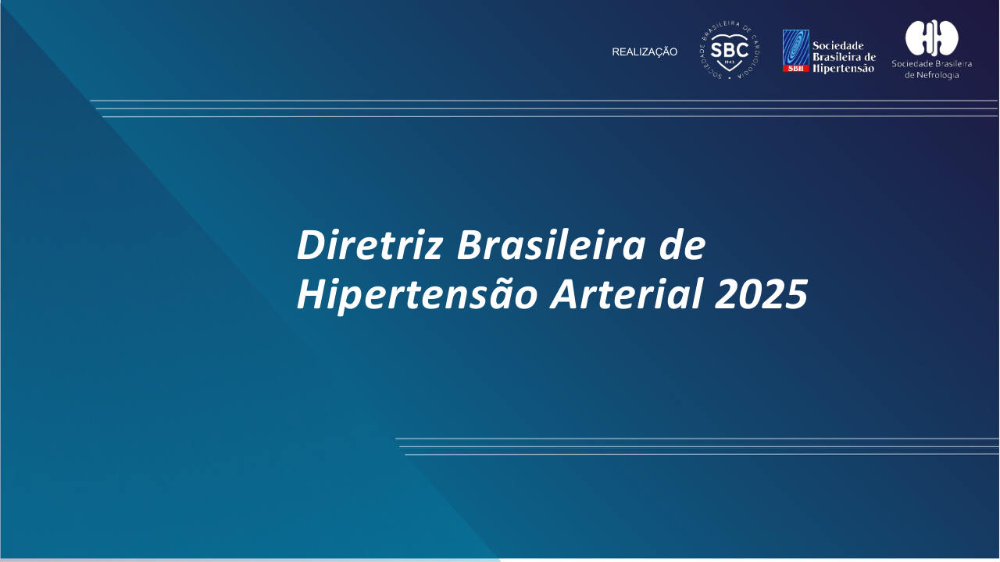

Diretriz Brasileira de Hipertensão Arterial 2025

### Capítulo 1. Introdução

#### Slide 2 — Capítulo 1. Introdução

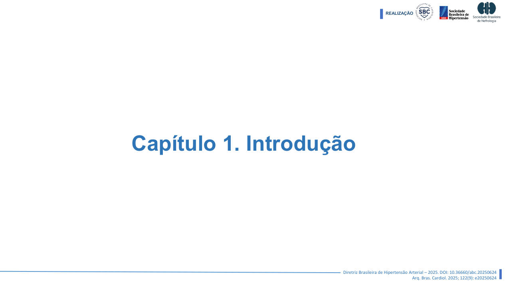

Capítulo 1. Introdução

#### Slide 3 — Figura Central

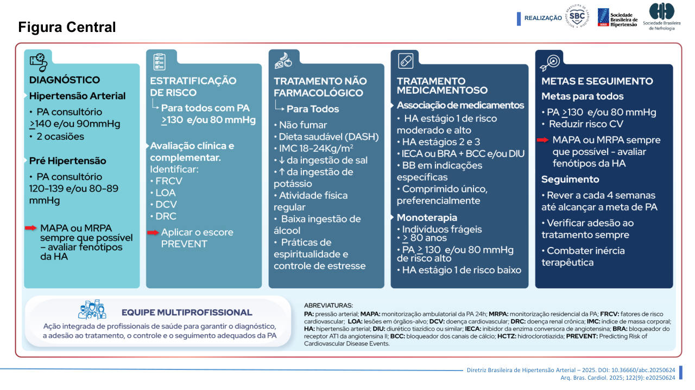

**Conteúdo visual da Figura Central (resumo operacional da diretriz).** Cinco colunas + equipe multiprofissional:

1. **Diagnóstico.** HA: PA em consultório ≥140 e/ou 90 mmHg em 2 ocasiões. Pré-hipertensão: 120–139 e/ou 80–89 mmHg. Recomenda-se MAPA ou MRPA sempre que possível para avaliar fenótipos da HA.
2. **Estratificação de risco.** Indicada para todos com PA ≥130 e/ou 80 mmHg. Avaliação clínica e complementar: FRCV, LOA, DCV, DRC. Aplicar o escore **PREVENT**.
3. **Tratamento não farmacológico (para todos).** Não fumar; dieta saudável (DASH); IMC 18–24 kg/m²; ↓ ingestão de sal; ↑ ingestão de potássio; atividade física regular; baixa ingestão de álcool; práticas de espiritualidade e controle de estresse.
4. **Tratamento medicamentoso.** Associação: HA estágio 1 de risco moderado/alto e HA estágios 2 e 3 — IECA ou BRA + BCC e/ou DIU; BB em indicações específicas; preferencialmente comprimido único. Monoterapia: indivíduos frágeis; idosos >80 anos; PA ≥130 e/ou 80 mmHg de risco alto; HA estágio 1 de risco baixo.
5. **Metas e seguimento.** Meta para todos: PA < 130 e/ou 80 mmHg e reduzir risco CV. Confirmar com MAPA/MRPA sempre que possível. Rever a cada 4 semanas até a meta; verificar adesão em todas as consultas; combater a inércia terapêutica.
6. **Equipe multiprofissional** para diagnóstico, adesão, controle e seguimento.

### Capítulo 2. Epidemiologia, definição e prevenção primária

#### Slide 4 — Capítulo 2.  Epidemiologia, Definição e  Prevenção Primária

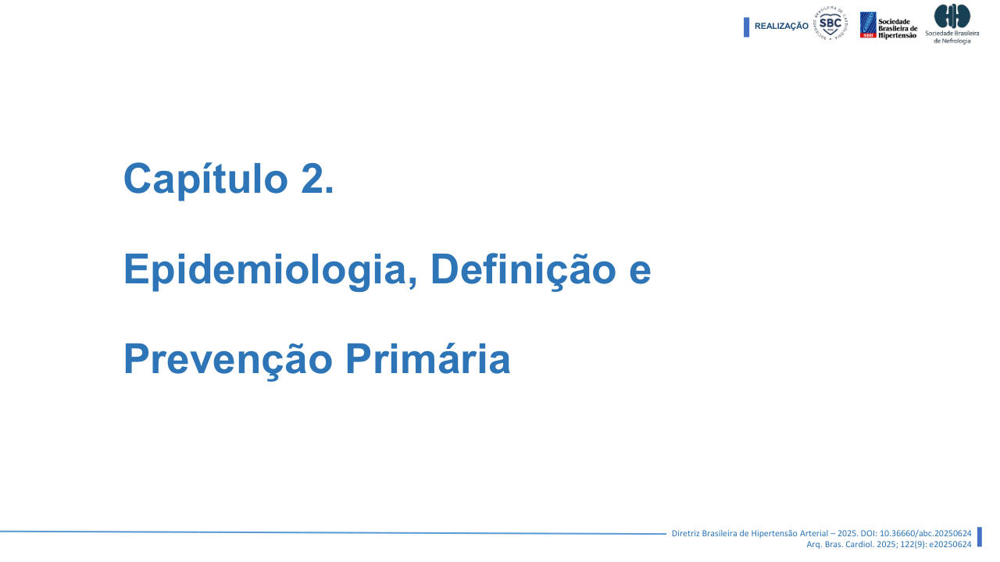

Capítulo 2.

Epidemiologia, Definição e

Prevenção Primária

#### Slide 5 — Figura 2.1 – Número absoluto de mortes pelas doenças cardiovasculares entre 1996 e 2022 (DATASUS).

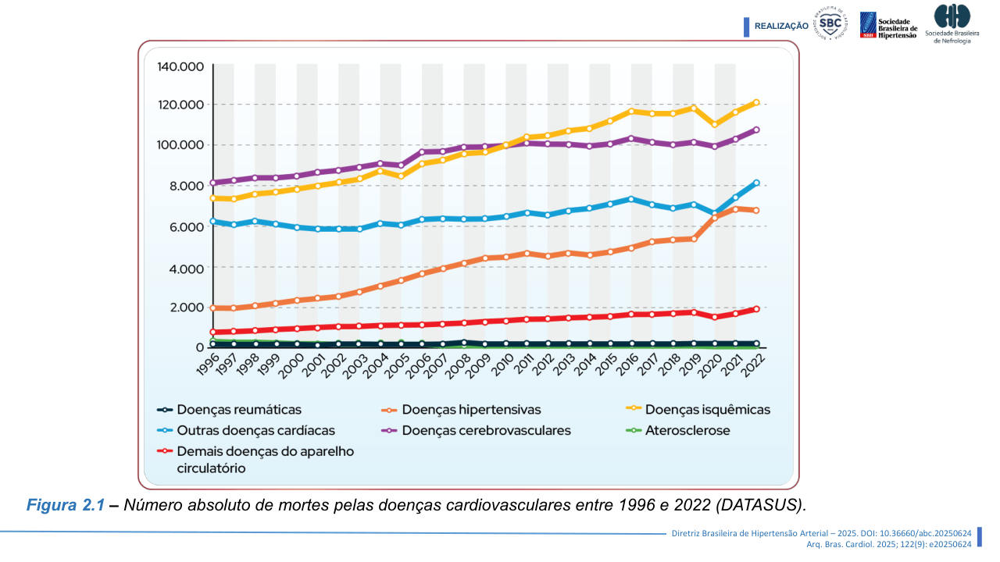

Figura 2.1 – Número absoluto de mortes pelas doenças cardiovasculares entre 1996 e 2022 (DATASUS).

#### Slide 6 — Figura 2.2 – Principais fatores de risco para hipertensão arterial.

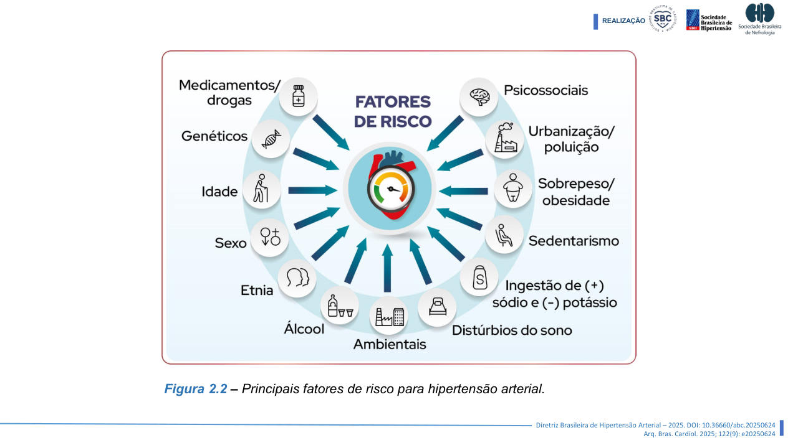

**Conteúdo visual.** Infográfico circular dos fatores de risco que convergem para a HA: medicamentos/drogas; psicossociais; urbanização/poluição; sobrepeso/obesidade; sedentarismo; ingestão de (+) sódio e (−) potássio; distúrbios do sono; ambientais; álcool; etnia; sexo; idade; genéticos.

Figura 2.2 – Principais fatores de risco para hipertensão arterial.

#### Slide 7 — Figura 2.3 – Medidas para prevenção da hipertensão arterial.

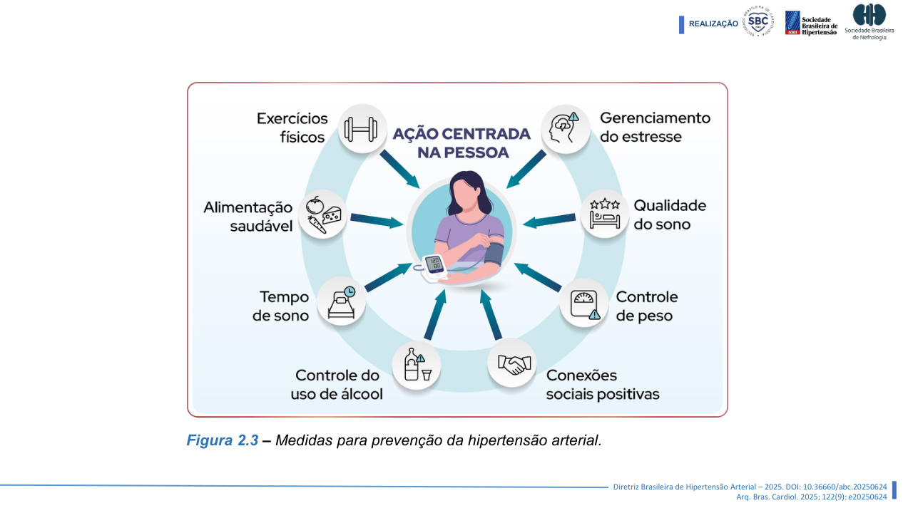

**Conteúdo visual.** Ação centrada na pessoa, com oito medidas de prevenção: exercícios físicos; gerenciamento do estresse; alimentação saudável; qualidade do sono; tempo de sono; controle de peso; controle do uso de álcool; conexões sociais positivas.

Figura 2.3 – Medidas para prevenção da hipertensão arterial.

#### Slide 8 — Mensagens principais

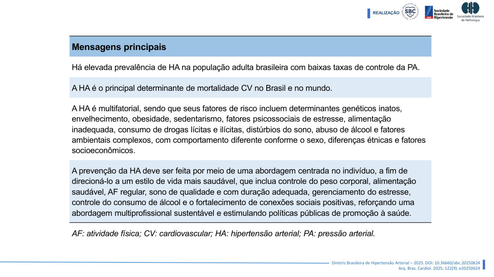

Mensagens principais

Há elevada prevalência de HA na população adulta brasileira com baixas taxas de controle da PA.

A HA é o principal determinante de mortalidade CV no Brasil e no mundo.

A HA é multifatorial, sendo que seus fatores de risco incluem determinantes genéticos inatos, envelhecimento, obesidade, sedentarismo, fatores psicossociais de estresse, alimentação inadequada, consumo de drogas lícitas e ilícitas, distúrbios do sono, abuso de álcool e fatores ambientais complexos, com comportamento diferente conforme o sexo, diferenças étnicas e fatores socioeconômicos.

A prevenção da HA deve ser feita por meio de uma abordagem centrada no indivíduo, a fim de direcioná-lo a um estilo de vida mais saudável, que inclua controle do peso corporal, alimentação saudável, AF regular, sono de qualidade e com duração adequada, gerenciamento do estresse, controle do consumo de álcool e o fortalecimento de conexões sociais positivas, reforçando uma abordagem multiprofissional sustentável e estimulando políticas públicas de promoção à saúde.

AF: atividade física; CV: cardiovascular; HA: hipertensão arterial; PA: pressão arterial.

### Capítulo 3. Medida da pressão arterial, diagnóstico e classificação

#### Slide 9 — Capítulo 3.  Medida da Pressão Arterial,   Diagnóstico e Classificação

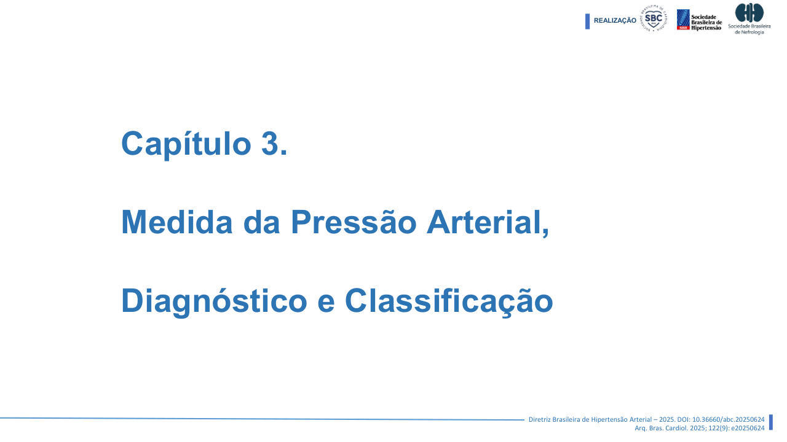

Capítulo 3.

Medida da Pressão Arterial,

Diagnóstico e Classificação

#### Slide 10 — Figura 3.1 – Etapas para a medida da pressão arterial em consultório.

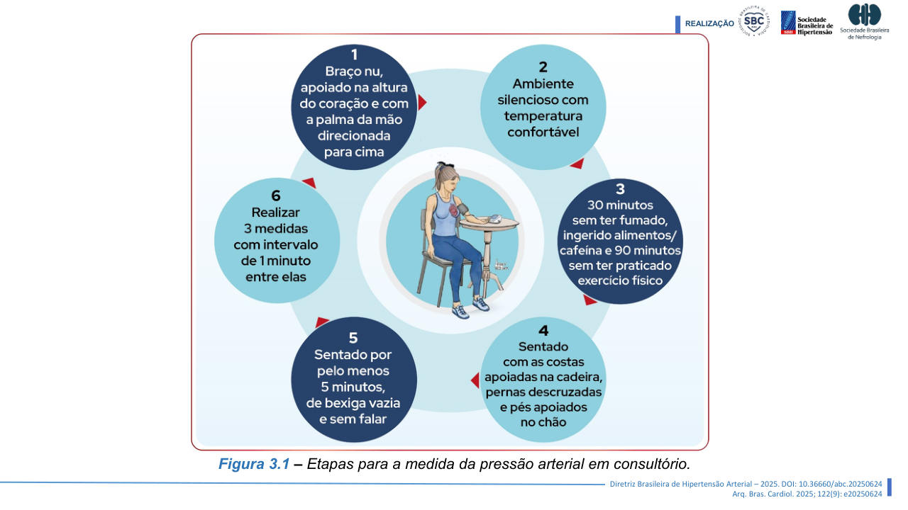

**Conteúdo visual — 6 etapas da medida em consultório:**
1. Braço nu, apoiado na altura do coração, palma da mão para cima.
2. Ambiente silencioso com temperatura confortável.
3. 30 min sem ter fumado nem ingerido alimentos/cafeína e 90 min sem exercício físico.
4. Sentado com as costas apoiadas, pernas descruzadas e pés no chão.
5. Sentado por pelo menos 5 min, de bexiga vazia e sem falar.
6. Realizar 3 medidas com intervalo de 1 min entre elas.

Figura 3.1 – Etapas para a medida da pressão arterial em consultório.

#### Slide 11 — Etapas de medida da pressão arterial

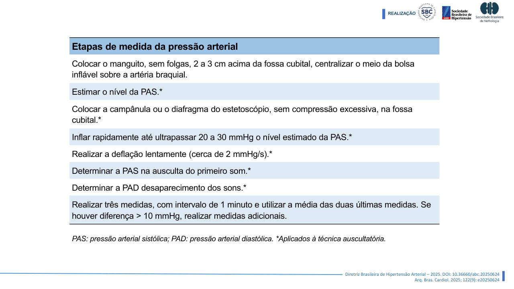

Etapas de medida da pressão arterial

Colocar o manguito, sem folgas, 2 a 3 cm acima da fossa cubital, centralizar o meio da bolsa inflável sobre a artéria braquial.

Estimar o nível da PAS.*

Colocar a campânula ou o diafragma do estetoscópio, sem compressão excessiva, na fossa cubital.*

Inflar rapidamente até ultrapassar 20 a 30 mmHg o nível estimado da PAS.*

Realizar a deflação lentamente (cerca de 2 mmHg/s).*

Determinar a PAS na ausculta do primeiro som.*

Determinar a PAD desaparecimento dos sons.*

Realizar três medidas, com intervalo de 1 minuto e utilizar a média das duas últimas medidas. Se houver diferença > 10 mmHg, realizar medidas adicionais.

PAS: pressão arterial sistólica; PAD: pressão arterial diastólica. *Aplicados à técnica auscultatória.

#### Slide 12 — Quadro 3.2 – Classificação da pressão arterial de acordo com a medida no consultório

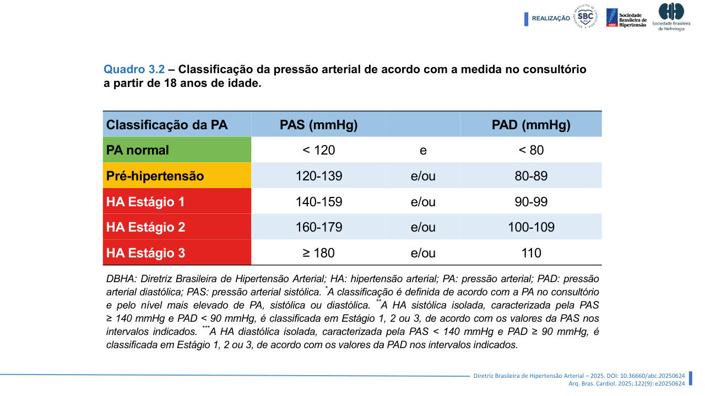

| Classificação da PA | PAS (mmHg) |  | PAD (mmHg) |
| :---- | :---- | :---- | :---- |
| PA normal | < 120 | e | < 80 |
| Pré-hipertensão | 120–139 | e/ou | 80–89 |
| HA Estágio 1 | 140–159 | e/ou | 90–99 |
| HA Estágio 2 | 160–179 | e/ou | 100–109 |
| HA Estágio 3 | ≥ 180 | e/ou | ≥ 110 |

A classificação é definida pela PA no consultório e pelo **nível mais elevado** (PAS ou PAD). HA sistólica isolada (PAS ≥140 e PAD < 90) e HA diastólica isolada (PAS < 140 e PAD ≥90) classificam-se em estágio 1, 2 ou 3 conforme o valor da PAS ou da PAD, respectivamente.

DBHA: Diretriz Brasileira de Hipertensão Arterial; HA: hipertensão arterial; PA: pressão arterial; PAD: pressão arterial diastólica; PAS: pressão arterial sistólica. *A classificação é definida de acordo com a PA no consultório e pelo nível mais elevado de PA, sistólica ou diastólica. **A HA sistólica isolada, caracterizada pela PAS ≥140 mmHg e PAD < 90 mmHg, é classificada em Estágio 1, 2 ou 3, de acordo com os valores da PAS nos intervalos indicados. ***A HA diastólica isolada, caracterizada pela PAS < 140 mmHg e PAD ≥90 mmHg, é classificada em Estágio 1, 2 ou 3, de acordo com os valores da PAD nos intervalos indicados.

#### Slide 13 — Quadro 3.3 – Principais vantagens e desvantagens da medida da pressão arterial

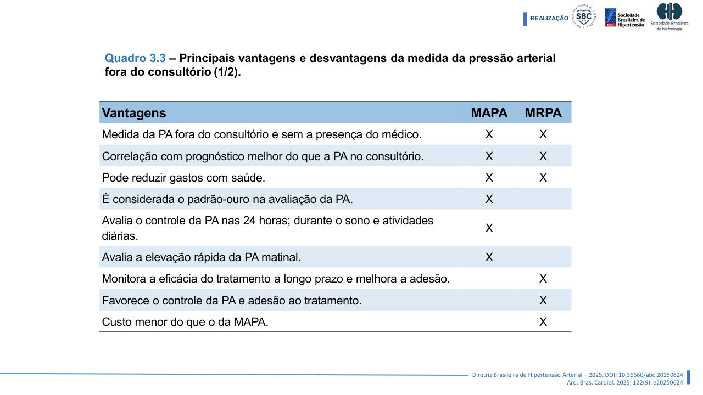

Quadro 3.3 – Principais vantagens e desvantagens da medida da pressão arterial fora do consultório (1/2).

Vantagens MAPA MRPA

Medida da PA fora do consultório e sem a presença do médico. X X

Correlação com prognóstico melhor do que a PA no consultório. X X

Pode reduzir gastos com saúde. X X

É considerada o padrão-ouro na avaliação da PA. X

Avalia o controle da PA nas 24 horas; durante o sono e atividades diárias. X

Avalia a elevação rápida da PA matinal. X

Monitora a eficácia do tratamento a longo prazo e melhora a adesão. X

Favorece o controle da PA e adesão ao tratamento. X

Custo menor do que o da MAPA. X

#### Slide 14 — Quadro 3.3 – Principais vantagens e desvantagens da medida da pressão arterial

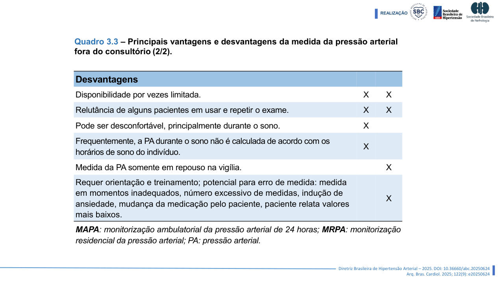

Quadro 3.3 – Principais vantagens e desvantagens da medida da pressão arterial fora do consultório (2/2).

Desvantagens

Disponibilidade por vezes limitada. X X

Relutância de alguns pacientes em usar e repetir o exame. X X

Pode ser desconfortável, principalmente durante o sono. X

Frequentemente, a PA durante o sono não é calculada de acordo com os horários de sono do indivíduo. X

Medida da PA somente em repouso na vigília. X

Requer orientação e treinamento; potencial para erro de medida: medida em momentos inadequados, número excessivo de medidas, indução de ansiedade, mudança da medicação pelo paciente, paciente relata valores mais baixos.

X

MAPA: monitorização ambulatorial da pressão arterial de 24 horas; MRPA: monitorização residencial da pressão arterial; PA: pressão arterial.

#### Slide 15 — Quadro 3.4 – Definição de hipertensão arterial de acordo com a medida da

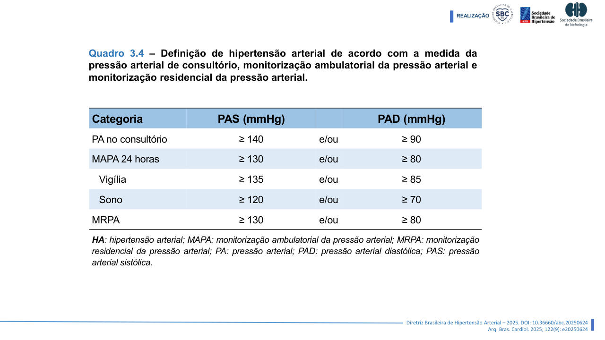

| Categoria | PAS (mmHg) |  | PAD (mmHg) |
| :---- | :---- | :---- | :---- |
| PA no consultório | ≥ 140 | e/ou | ≥ 90 |
| MAPA 24 horas | ≥ 130 | e/ou | ≥ 80 |
| Vigília | ≥ 135 | e/ou | ≥ 85 |
| Sono | ≥ 120 | e/ou | ≥ 70 |
| MRPA | ≥ 130 | e/ou | ≥ 80 |

HA: hipertensão arterial; MAPA: monitorização ambulatorial da pressão arterial; MRPA: monitorização residencial da pressão arterial; PA: pressão arterial; PAD: pressão arterial diastólica; PAS: pressão arterial sistólica.

#### Slide 16 — Quadro 3.5 – Indicações da monitorização ambulatorial da pressão arterial e da

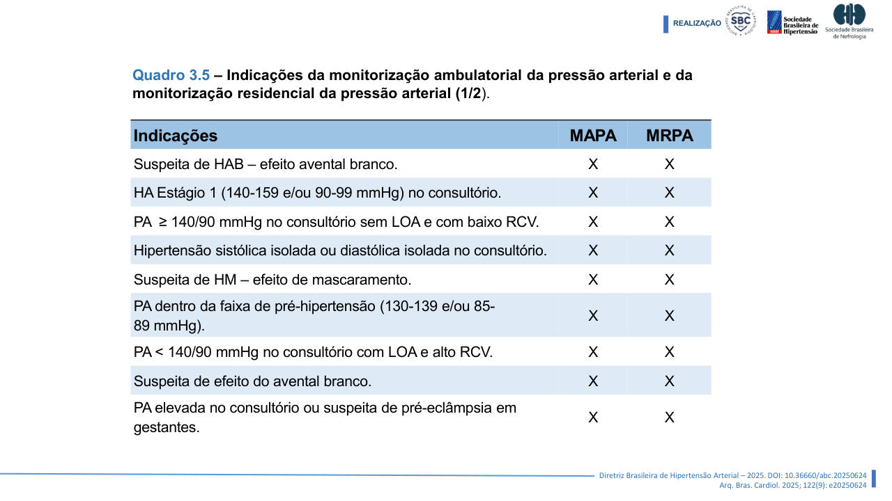

Quadro 3.5 – Indicações da monitorização ambulatorial da pressão arterial e da monitorização residencial da pressão arterial (1/2).

Indicações MAPA MRPA

Suspeita de HAB – efeito avental branco. X X

HA Estágio 1 (140-159 e/ou 90-99 mmHg) no consultório. X X

PA ≥ 140/90 mmHg no consultório sem LOA e com baixo RCV. X X

Hipertensão sistólica isolada ou diastólica isolada no consultório. X X

Suspeita de HM – efeito de mascaramento. X X

PA dentro da faixa de pré-hipertensão (130-139 e/ou 85- 89 mmHg). X X

PA < 140/90 mmHg no consultório com LOA e alto RCV. X X

Suspeita de efeito do avental branco. X X

PA elevada no consultório ou suspeita de pré-eclâmpsia em gestantes. X X

#### Slide 17 — Quadro 3.5 – Indicações da monitorização ambulatorial da pressão arterial e da

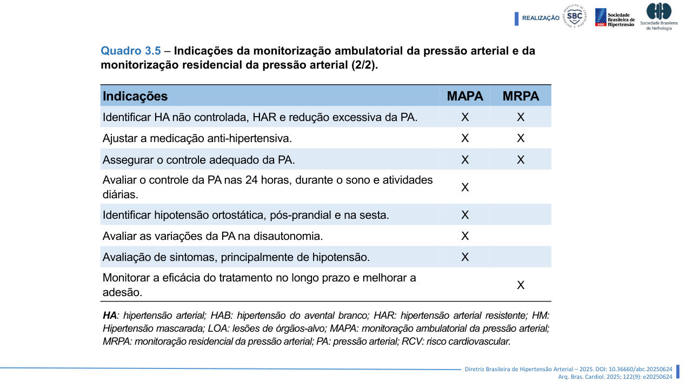

Quadro 3.5 – Indicações da monitorização ambulatorial da pressão arterial e da monitorização residencial da pressão arterial (2/2).

Indicações MAPA MRPA

Identificar HA não controlada, HAR e redução excessiva da PA. X X

Ajustar a medicação anti-hipertensiva. X X

Assegurar o controle adequado da PA. X X

Avaliar o controle da PA nas 24 horas, durante o sono e atividades diárias. X

Identificar hipotensão ortostática, pós-prandial e na sesta. X

Avaliar as variações da PA na disautonomia. X

Avaliação de sintomas, principalmente de hipotensão. X

Monitorar a eficácia do tratamento no longo prazo e melhorar a adesão. X

HA: hipertensão arterial; HAB: hipertensão do avental branco; HAR: hipertensão arterial resistente; HM: Hipertensão mascarada; LOA: lesões de órgãos-alvo; MAPA: monitoração ambulatorial da pressão arterial; MRPA: monitoração residencial da pressão arterial; PA: pressão arterial; RCV: risco cardiovascular.

#### Slide 18 — Figura 3.2 – Prevalências dos fenótipos de hipertensão arterial entre pacientes tratados ou não com

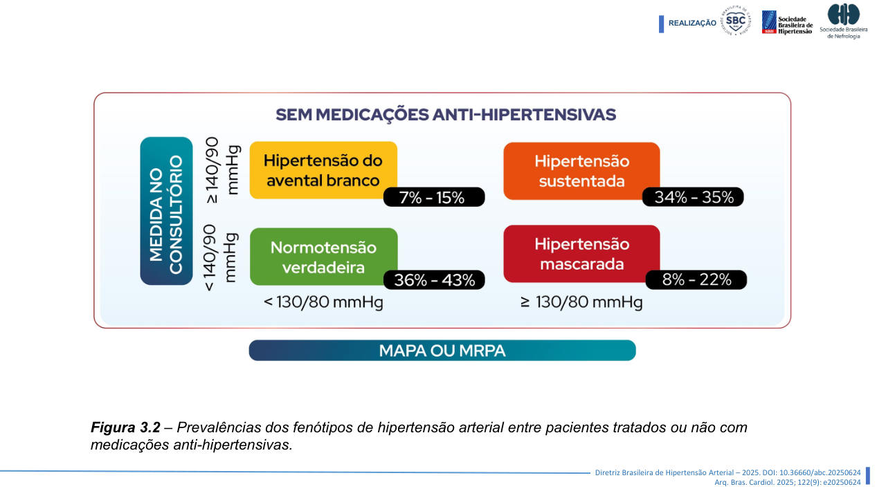

Figura 3.2 – Prevalências dos fenótipos de hipertensão arterial entre pacientes tratados ou não com medicações anti-hipertensivas.

#### Slide 19 — Figura 3.2 – Prevalências dos fenótipos de hipertensão arterial entre pacientes tratados ou não com

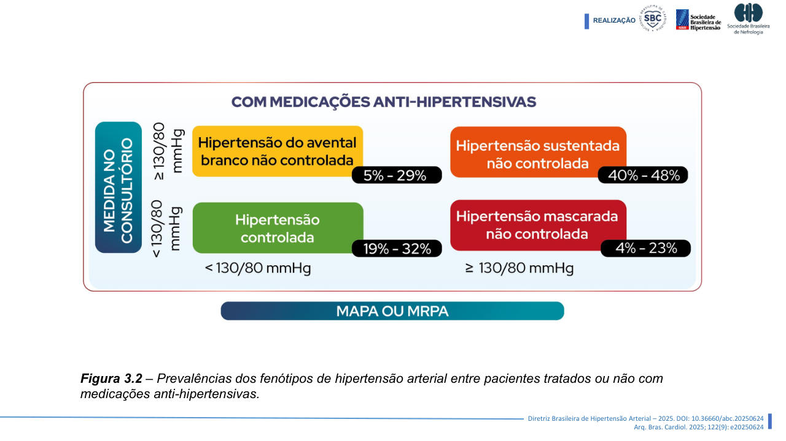

Figura 3.2 – Prevalências dos fenótipos de hipertensão arterial entre pacientes tratados ou não com medicações anti-hipertensivas.

#### Slide 20 — Figura 3.3 – Triagem e diagnóstico de hipertensão arterial.

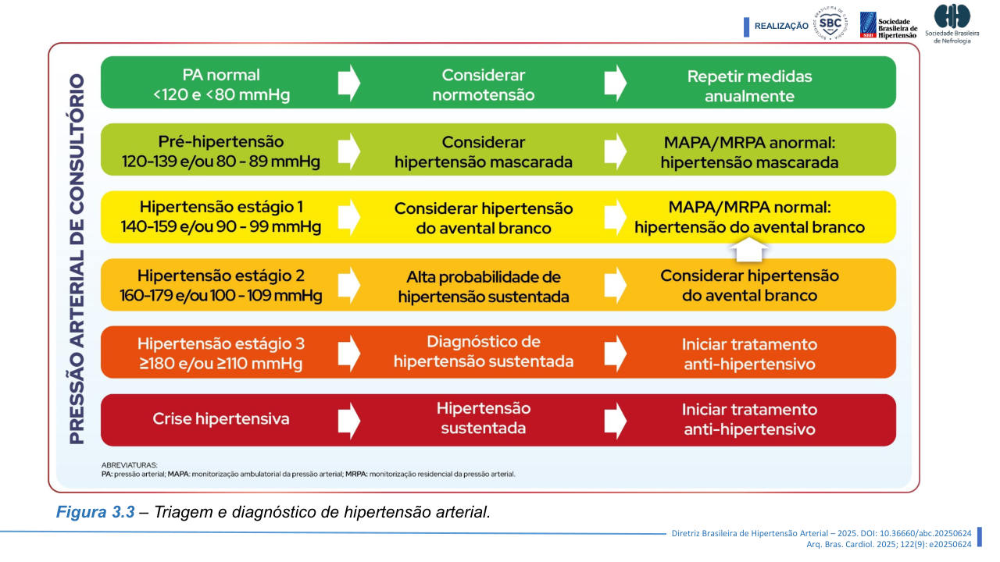

**Conteúdo visual — fluxograma de triagem/diagnóstico (PA de consultório):**
- PA normal (<120 e <80): considerar normotensão → repetir medidas anualmente.
- Pré-hipertensão (120–139 e/ou 80–89): considerar hipertensão mascarada → MAPA/MRPA anormal = hipertensão mascarada.
- HA estágio 1 (140–159 e/ou 90–99): considerar hipertensão do avental branco → MAPA/MRPA normal = hipertensão do avental branco.
- HA estágio 2 (160–179 e/ou 100–109): alta probabilidade de HA sustentada; ainda assim considerar avental branco (MAPA/MRPA).
- HA estágio 3 (≥180 e/ou ≥110): diagnóstico de HA sustentada → iniciar tratamento anti-hipertensivo.
- Crise hipertensiva: HA sustentada → iniciar tratamento anti-hipertensivo.

Figura 3.3 – Triagem e diagnóstico de hipertensão arterial.

#### Slide 21 — Recomendações para medida da pressão arterial, diagnóstico e classificação

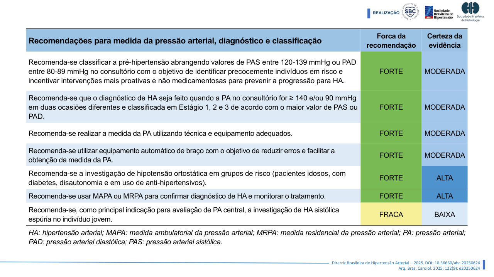

**Recomendações para medida da pressão arterial, diagnóstico e classificação**

| Recomendação | Força | Certeza da evidência |
| :---- | :---- | :---- |
| Recomenda-se classificar a pré-hipertensão abrangendo valores de PAS entre 120-139 mmHg ou PAD entre 80-89 mmHg no consultório com o objetivo de identificar precocemente indivíduos em risco e incentivar intervenções mais proativas e não medicamentosas para prevenir a progressão para HA. | FORTE | MODERADA |
| Recomenda-se que o diagnóstico de HA seja feito quando a PA no consultório for ≥140 e/ou 90 mmHg em duas ocasiões diferentes e classificada em Estágio 1, 2 e 3 de acordo com o maior valor de PAS ou PAD. | FORTE | MODERADA |
| Recomenda-se realizar a medida da PA utilizando técnica e equipamento adequados. | FORTE | MODERADA |
| Recomenda-se utilizar equipamento automático de braço com o objetivo de reduzir erros e facilitar a obtenção da medida da PA. | FORTE | MODERADA |
| Recomenda-se a investigação de hipotensão ortostática em grupos de risco (pacientes idosos, com diabetes, disautonomia e em uso de anti-hipertensivos). | FORTE | ALTA |
| Recomenda-se usar MAPA ou MRPA para confirmar diagnóstico de HA e monitorar o tratamento. | FORTE | ALTA |
| Recomenda-se, como principal indicação para avaliação de PA central, a investigação de HA sistólica espúria no indivíduo jovem. | FRACA | BAIXA |

HA: hipertensão arterial; MAPA: medida ambulatorial da pressão arterial; MRPA: medida residencial da pressão arterial; PA: pressão arterial; PAD: pressão arterial diastólica; PAS: pressão arterial sistólica.

### Capítulo 4. Avaliação clínica e complementar e estratificação de risco cardiovascular

#### Slide 22 — Capítulo 4.  Avaliação Clínica e Complementar e  Estratificação de Risco Cardiovascular

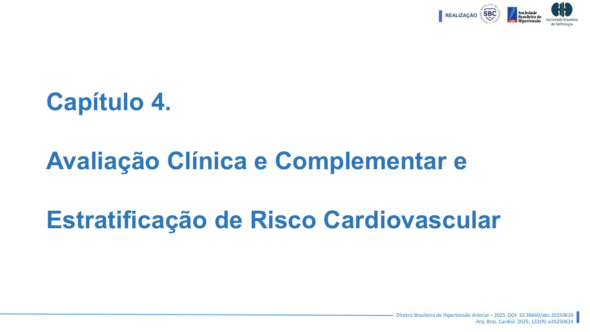

Capítulo 4.

Avaliação Clínica e Complementar e

Estratificação de Risco Cardiovascular

#### Slide 23 — Quadro 4.1 – Principais objetivos da anamnese.

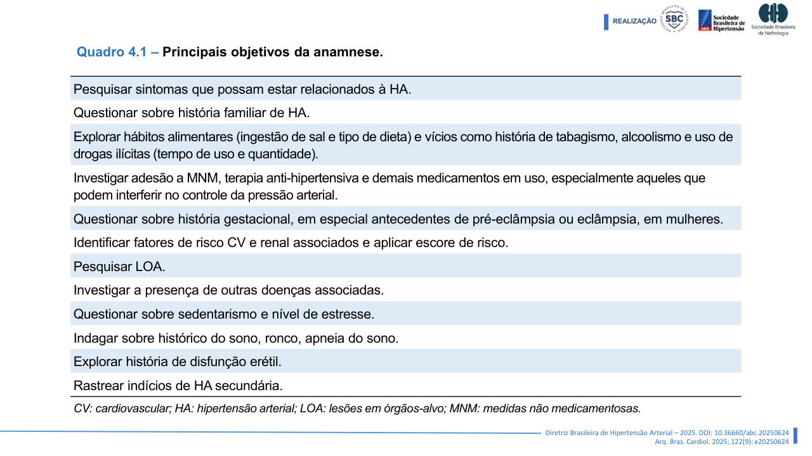

Quadro 4.1 – Principais objetivos da anamnese.

Pesquisar sintomas que possam estar relacionados à HA.

Questionar sobre história familiar de HA.

Explorar hábitos alimentares (ingestão de sal e tipo de dieta) e vícios como história de tabagismo, alcoolismo e uso de drogas ilícitas (tempo de uso e quantidade).

Investigar adesão a MNM, terapia anti-hipertensiva e demais medicamentos em uso, especialmente aqueles que podem interferir no controle da pressão arterial.

Questionar sobre história gestacional, em especial antecedentes de pré-eclâmpsia ou eclâmpsia, em mulheres.

Identificar fatores de risco CV e renal associados e aplicar escore de risco.

Pesquisar LOA.

Investigar a presença de outras doenças associadas.

Questionar sobre sedentarismo e nível de estresse.

Indagar sobre histórico do sono, ronco, apneia do sono.

Explorar história de disfunção erétil.

Rastrear indícios de HA secundária.

CV: cardiovascular; HA: hipertensão arterial; LOA: lesões em órgãos-alvo; MNM: medidas não medicamentosas.

#### Slide 24 — Figura 4.1 – Principais pontos de avaliação do exame físico do paciente com hipertensão arterial.

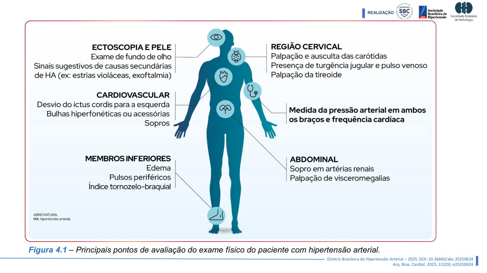

Figura 4.1 – Principais pontos de avaliação do exame físico do paciente com hipertensão arterial.

#### Slide 25 — Quadro 4.2 – Parâmetros antropométricos e do índice tornozelo-braquial. CC: circunferência cintura;

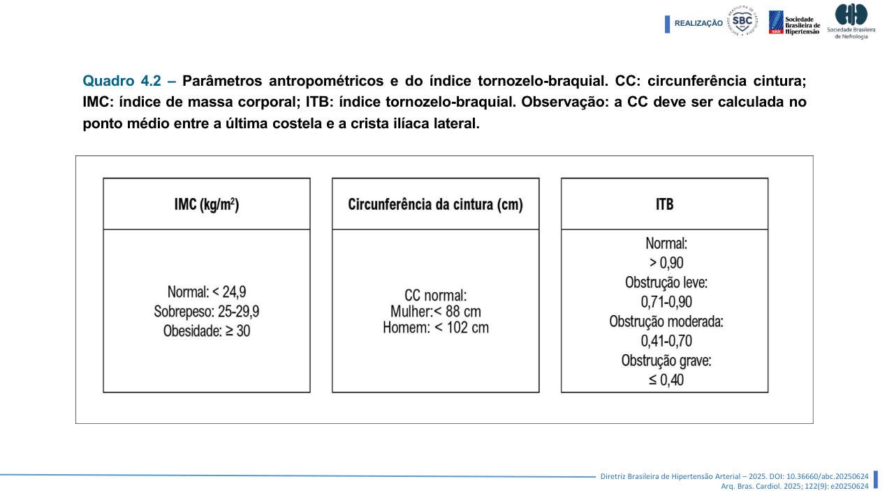

**Conteúdo visual do Quadro 4.2 (três blocos):**
- **IMC (kg/m²):** normal < 24,9; sobrepeso 25–29,9; obesidade ≥30.
- **Circunferência da cintura (cm):** mulher < 88; homem < 102. Medir no ponto médio entre a última costela e a crista ilíaca lateral.
- **ITB:** normal > 0,90; obstrução leve 0,71–0,90; moderada 0,41–0,70; grave ≤ 0,40.

Quadro 4.2 – Parâmetros antropométricos e do índice tornozelo-braquial. CC: circunferência cintura; IMC: índice de massa corporal; ITB: índice tornozelo-braquial. Observação: a CC deve ser calculada no ponto médio entre a última costela e a crista ilíaca lateral.

#### Slide 26 — Quadro 4.3 – Exames complementares de rotina.

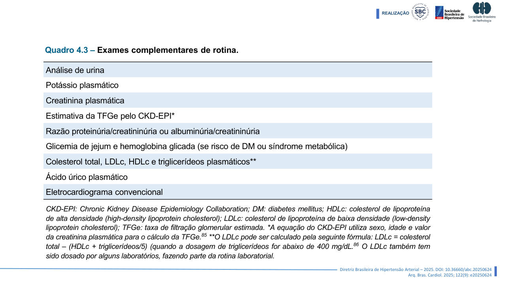

Quadro 4.3 – Exames complementares de rotina.

Análise de urina

Potássio plasmático

Creatinina plasmática

Estimativa da TFGe pelo CKD-EPI*

Razão proteinúria/creatininúria ou albuminúria/creatininúria

Glicemia de jejum e hemoglobina glicada (se risco de DM ou síndrome metabólica)

Colesterol total, LDLc, HDLc e triglicerídeos plasmáticos**

Ácido úrico plasmático

Eletrocardiograma convencional

CKD-EPI: Chronic Kidney Disease Epidemiology Collaboration; DM: diabetes mellitus; HDLc: colesterol de lipoproteína de alta densidade (high-density lipoprotein cholesterol); LDLc: colesterol de lipoproteína de baixa densidade (low-density lipoprotein cholesterol); TFGe: taxa de filtração glomerular estimada. *A equação do CKD-EPI utiliza sexo, idade e valor da creatinina plasmática para o cálculo da TFGe.85 **O LDLc pode ser calculado pela seguinte fórmula: LDLc = colesterol total – (HDLc + triglicerídeos/5) (quando a dosagem de triglicerídeos for abaixo de 400 mg/dL.86 O LDLc também tem sido dosado por alguns laboratórios, fazendo parte da rotina laboratorial.

#### Slide 27 — Quadro 4.4 – Critérios para lesão de órgãos-alvo.

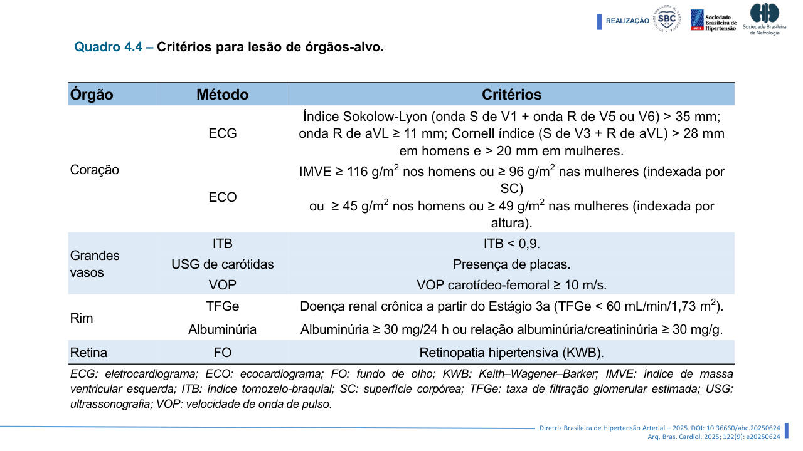

Quadro 4.4 – Critérios para lesão de órgãos-alvo.

Órgão Método Critérios

Índice Sokolow-Lyon (onda S de V1 + onda R de V5 ou V6) > 35 mm; onda R de aVL ≥11 mm; Cornell índice (S de V3 + R de aVL) > 28 mm

ECG

em homens e > 20 mm em mulheres.

Coração

IMVE ≥116 g/m2 nos homens ou ≥96 g/m2 nas mulheres (indexada por

SC) ou ≥45 g/m2 nos homens ou ≥49 g/m2 nas mulheres (indexada por

ECO

altura).

ITB ITB < 0,9.

Grandes vasos

USG de carótidas Presença de placas.

VOP VOP carotídeo-femoral ≥ 10 m/s.

TFGe Doença renal crônica a partir do Estágio 3a (TFGe < 60 mL/min/1,73 m2).

Rim

Albuminúria Albuminúria ≥30 mg/24 h ou relação albuminúria/creatininúria ≥30 mg/g.

Retina FO Retinopatia hipertensiva (KWB).

ECG: eletrocardiograma; ECO: ecocardiograma; FO: fundo de olho; KWB: Keith–Wagener–Barker; IMVE: índice de massa ventricular esquerda; ITB: índice tornozelo-braquial; SC: superfície corpórea; TFGe: taxa de filtração glomerular estimada; USG: ultrassonografia; VOP: velocidade de onda de pulso.

#### Slide 28 — Figura 4.2 – Avaliação e prognóstico da doença renal crônica. Adaptado de KDIGO 2024 Clinical Practice Guideline for the

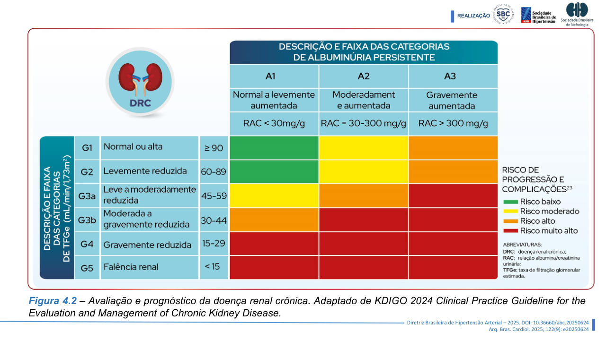

Figura 4.2 – Avaliação e prognóstico da doença renal crônica. Adaptado de KDIGO 2024 Clinical Practice Guideline for the Evaluation and Management of Chronic Kidney Disease.

#### Slide 29 — Quadro 4.5 – Principais causas de hipertensão arterial secundária, não endócrinas e endócrinas, sinais

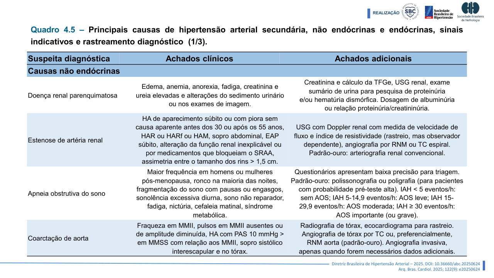

Quadro 4.5 – Principais causas de hipertensão arterial secundária, não endócrinas e endócrinas, sinais indicativos e rastreamento diagnóstico (1/3).

Suspeita diagnóstica Achados clínicos Achados adicionais

Causas não endócrinas

Creatinina e cálculo da TFGe, USG renal, exame

Edema, anemia, anorexia, fadiga, creatinina e ureia elevadas e alterações do sedimento urinário

sumário de urina para pesquisa de proteinúria e/ou hematúria dismórfica. Dosagem de albuminúria

Doença renal parenquimatosa

ou nos exames de imagem.

ou relação proteinúria/creatininúria.

HA de aparecimento súbito ou com piora sem causa aparente antes dos 30 ou após os 55 anos,

USG com Doppler renal com medida de velocidade de fluxo e índice de resistividade (rastreio, mas observador

HAR ou HARf ou HAM, sopro abdominal, EAP súbito, alteração da função renal inexplicável ou

Estenose de artéria renal

dependente), angiografia por RNM ou TC espiral.

por medicamentos que bloqueiam o SRAA, assimetria entre o tamanho dos rins > 1,5 cm.

Padrão-ouro: arteriografia renal convencional.

Maior frequência em homens ou mulheres pós-menopausa, ronco na maioria das noites, fragmentação do sono com pausas ou engasgos, sonolência excessiva diurna, sono não reparador,

Questionários apresentam baixa precisão para triagem. Padrão-ouro: polissonografia ou poligrafia (para pacientes

com probabilidade pré-teste alta). IAH < 5 eventos/h:

Apneia obstrutiva do sono

sem AOS; IAH 5-14,9 eventos/h: AOS leve; IAH 15- 29,9 eventos/h: AOS moderada; IAH ≥30 eventos/h: AOS importante (ou grave).

fadiga, nictúria, cefaleia matinal, síndrome

metabólica.

Fraqueza em MMII, pulsos em MMII ausentes ou de amplitude diminuída, HA com PAS 10 mmHg >

Radiografia de tórax, ecocardiograma para rastreio.

Angiografia de tórax por TC ou, preferencialmente,

Coarctação de aorta

em MMSS com relação aos MMII, sopro sistólico

RNM aorta (padrão-ouro). Angiografia invasiva, apenas quando forem necessários dados adicionais.

interescapular e no tórax.

#### Slide 30 — Quadro 4.5 – Principais causas de hipertensão arterial secundária, não endócrinas e endócrinas, sinais

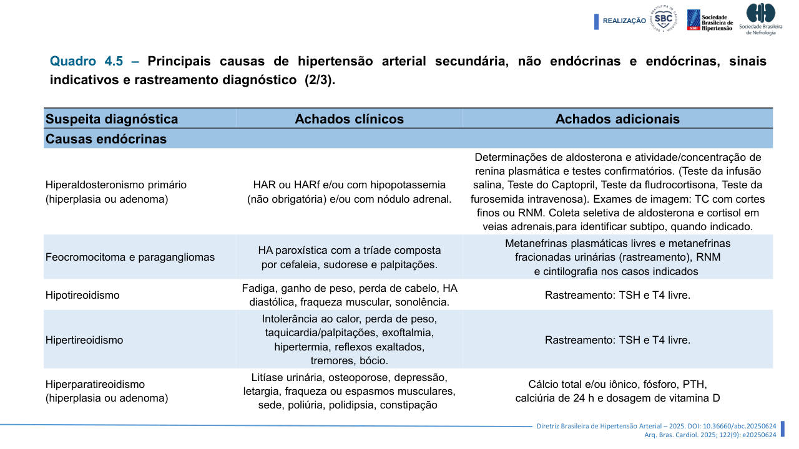

Quadro 4.5 – Principais causas de hipertensão arterial secundária, não endócrinas e endócrinas, sinais indicativos e rastreamento diagnóstico (2/3).

Suspeita diagnóstica Achados clínicos Achados adicionais

Causas endócrinas

Determinações de aldosterona e atividade/concentração de renina plasmática e testes confirmatórios. (Teste da infusão salina, Teste do Captopril, Teste da fludrocortisona, Teste da furosemida intravenosa). Exames de imagem: TC com cortes

Hiperaldosteronismo primário (hiperplasia ou adenoma)

HAR ou HARf e/ou com hipopotassemia (não obrigatória) e/ou com nódulo adrenal.

finos ou RNM. Coleta seletiva de aldosterona e cortisol em

veias adrenais,para identificar subtipo, quando indicado.

Metanefrinas plasmáticas livres e metanefrinas

Feocromocitoma e paragangliomas HA paroxística com a tríade composta

fracionadas urinárias (rastreamento), RNM

por cefaleia, sudorese e palpitações.

e cintilografia nos casos indicados

Hipotireoidismo Fadiga, ganho de peso, perda de cabelo, HA

diastólica, fraqueza muscular, sonolência. Rastreamento: TSH e T4 livre.

Intolerância ao calor, perda de peso,

taquicardia/palpitações, exoftalmia,

Hipertireoidismo

Rastreamento: TSH e T4 livre.

hipertermia, reflexos exaltados,

tremores, bócio.

Litíase urinária, osteoporose, depressão, letargia, fraqueza ou espasmos musculares,

Hiperparatireoidismo (hiperplasia ou adenoma)

Cálcio total e/ou iônico, fósforo, PTH, calciúria de 24 h e dosagem de vitamina D

sede, poliúria, polidipsia, constipação

#### Slide 31 — Quadro 4.5 – Principais causas de hipertensão arterial secundária, não endócrinas e endócrinas, sinais

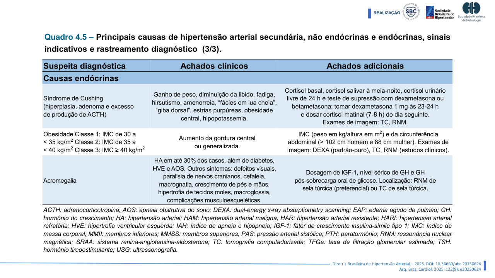

Quadro 4.5 – Principais causas de hipertensão arterial secundária, não endócrinas e endócrinas, sinais indicativos e rastreamento diagnóstico (3/3).

Suspeita diagnóstica Achados clínicos Achados adicionais

Causas endócrinas

Cortisol basal, cortisol salivar à meia-noite, cortisol urinário

Ganho de peso, diminuição da libido, fadiga, hirsutismo, amenorreia, “fácies em lua cheia”,

Síndrome de Cushing (hiperplasia, adenoma e excesso de produção de ACTH)

livre de 24 h e teste de supressão com dexametasona ou

betametasona: tomar dexametasona 1 mg às 23-24 h

“giba dorsal”, estrias purpúreas, obesidade

e dosar cortisol matinal (7-8 h) do dia seguinte.

central, hipopotassemia.

Exames de imagem: TC, RNM.

IMC (peso em kg/altura em m2) e da circunferência abdominal (> 102 cm homem e 88 cm mulher). Exames de imagem: DEXA (padrão-ouro), TC, RNM (estudos clínicos).

Obesidade Classe 1: IMC de 30 a < 35 kg/m2 Classe 2: IMC de 35 a < 40 kg/m2 Classe 3: IMC ≥40 kg/m2

Aumento da gordura central

ou generalizada.

HA em até 30% dos casos, além de diabetes, HVE e AOS. Outros sintomas: defeitos visuais,

Dosagem de IGF-1, nível sérico de GH e GH pós-sobrecarga oral de glicose. Localização: RNM de

paralisia de nervos cranianos, cefaleia, macrognatia, crescimento de pés e mãos, hipertrofia de tecidos moles, macroglossia,

Acromegalia

sela túrcica (preferencial) ou TC de sela túrcica.

complicações musculoesqueléticas.

ACTH: adrenocorticotropina; AOS: apneia obstrutiva do sono; DEXA: dual-energy x-ray absorptiometry scanning; EAP: edema agudo de pulmão; GH: hormônio do crescimento; HA: hipertensão arterial; HAM: hipertensão arterial maligna; HAR: hipertensão arterial resistente; HARf: hipertensão arterial refratária; HVE: hipertrofia ventricular esquerda; IAH: índice de apneia e hipopneia; IGF-1: fator de crescimento insulina-símile tipo 1; IMC: índice de massa corporal; MMII: membros inferiores; MMSS: membros superiores; PAS: pressão arterial sistólica; PTH: paratormônio; RNM: ressonância nuclear magnética; SRAA: sistema renina-angiotensina-aldosterona; TC: tomografia computadorizada; TFGe: taxa de filtração glomerular estimada; TSH: hormônio tireoestimulante; USG: ultrassonografia.

#### Slide 32 — Quadro 4.6 – Classificação do risco cardiovascular de acordo com o nível de pressão arterial, presença de

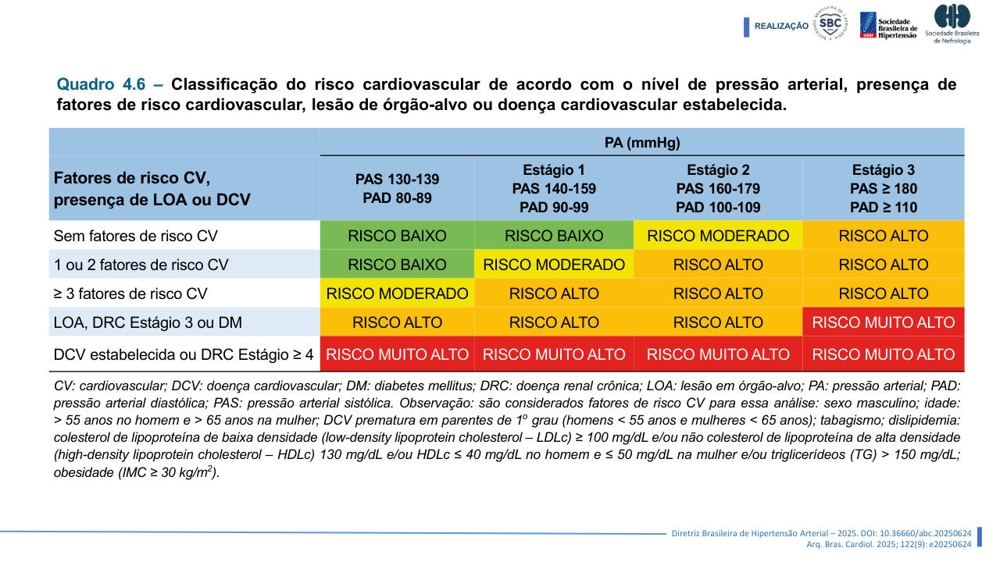

Quadro 4.6 – Classificação do risco cardiovascular de acordo com o nível de pressão arterial, presença de fatores de risco cardiovascular, lesão de órgão-alvo ou doença cardiovascular estabelecida.

PA (mmHg)

Estágio 1 PAS 140-159

Estágio 2 PAS 160-179 PAD 100-109

Estágio 3 PAS ≥180 PAD ≥110

Fatores de risco CV, presença de LOA ou DCV

PAS 130-139

PAD 80-89

PAD 90-99

Sem fatores de risco CV RISCO BAIXO RISCO BAIXO RISCO MODERADO RISCO ALTO

1 ou 2 fatores de risco CV RISCO BAIXO RISCO MODERADO RISCO ALTO RISCO ALTO

≥3 fatores de risco CV RISCO MODERADO RISCO ALTO RISCO ALTO RISCO ALTO

LOA, DRC Estágio 3 ou DM RISCO ALTO RISCO ALTO RISCO ALTO RISCO MUITO ALTO

DCV estabelecida ou DRC Estágio ≥4 RISCO MUITO ALTO RISCO MUITO ALTO RISCO MUITO ALTO RISCO MUITO ALTO

CV: cardiovascular; DCV: doença cardiovascular; DM: diabetes mellitus; DRC: doença renal crônica; LOA: lesão em órgão-alvo; PA: pressão arterial; PAD: pressão arterial diastólica; PAS: pressão arterial sistólica. Observação: são considerados fatores de risco CV para essa análise: sexo masculino; idade: > 55 anos no homem e > 65 anos na mulher; DCV prematura em parentes de 1o grau (homens < 55 anos e mulheres < 65 anos); tabagismo; dislipidemia: colesterol de lipoproteína de baixa densidade (low-density lipoprotein cholesterol – LDLc) ≥100 mg/dL e/ou não colesterol de lipoproteína de alta densidade (high-density lipoprotein cholesterol – HDLc) 130 mg/dL e/ou HDLc ≤40 mg/dL no homem e ≤50 mg/dL na mulher e/ou triglicerídeos (TG) > 150 mg/dL; obesidade (IMC ≥30 kg/m2).

#### Slide 33 — Recomendações para avaliação clínica e complementar, e estratificação de risco cardiovascular

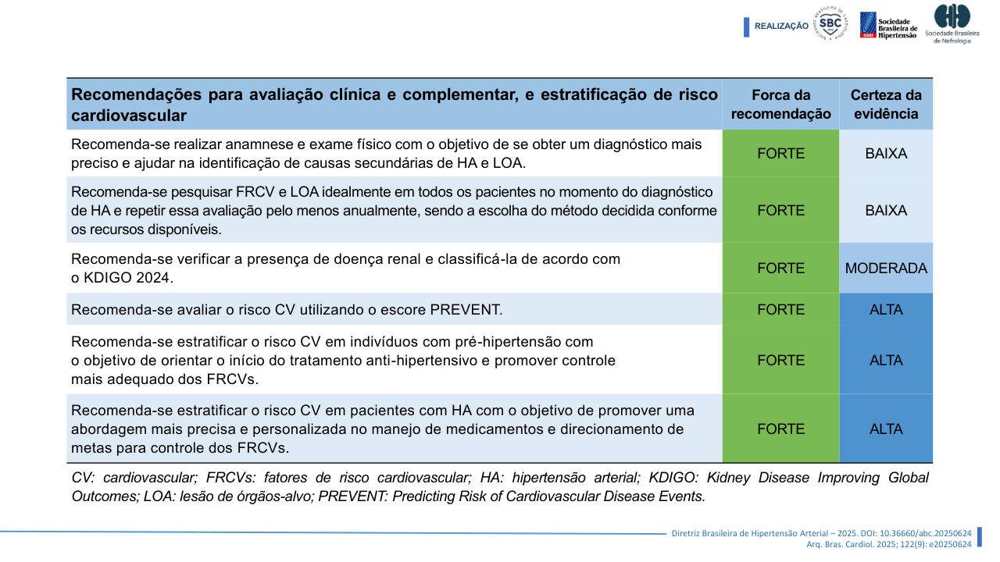

**Recomendações para avaliação clínica e complementar, e estratificação de risco cardiovascular**

| Recomendação | Força | Certeza da evidência |
| :---- | :---- | :---- |
| Recomenda-se realizar anamnese e exame físico com o objetivo de se obter um diagnóstico mais preciso e ajudar na identificação de causas secundárias de HA e LOA. | FORTE | BAIXA |
| Recomenda-se pesquisar FRCV e LOA idealmente em todos os pacientes no momento do diagnóstico de HA e repetir essa avaliação pelo menos anualmente, sendo a escolha do método decidida conforme os recursos disponíveis. | FORTE | BAIXA |
| Recomenda-se verificar a presença de doença renal e classificá-la de acordo com o KDIGO 2024. | FORTE | MODERADA |
| Recomenda-se avaliar o risco CV utilizando o escore PREVENT. | FORTE | ALTA |
| Recomenda-se estratificar o risco CV em indivíduos com pré-hipertensão com o objetivo de orientar o início do tratamento anti-hipertensivo e promover controle mais adequado dos FRCVs. | FORTE | ALTA |
| Recomenda-se estratificar o risco CV em pacientes com HA com o objetivo de promover uma abordagem mais precisa e personalizada no manejo de medicamentos e direcionamento de metas para controle dos FRCVs. | FORTE | ALTA |

CV: cardiovascular; FRCVs: fatores de risco cardiovascular; HA: hipertensão arterial; KDIGO: Kidney Disease Improving Global Outcomes; LOA: lesão de órgãos-alvo; PREVENT: Predicting Risk of Cardiovascular Disease Events.

#### Slide 34 — Figura 4.3 – Estratificação de risco cardiovascular dos indivíduos com pré-hipertensão e hipertensão arterial.

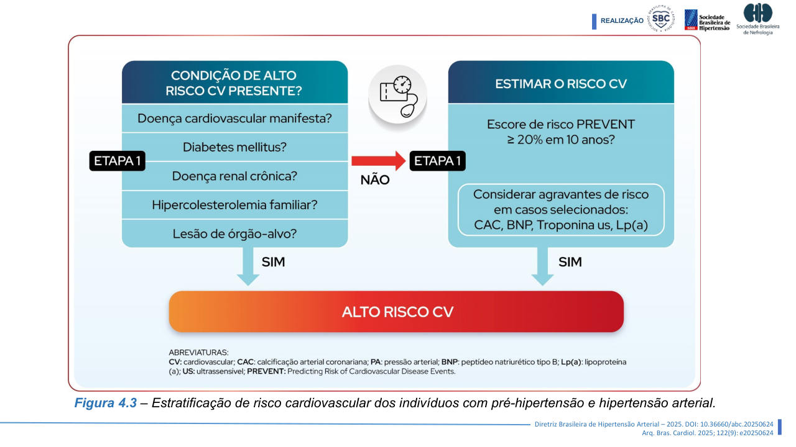

**Conteúdo visual — Figura 4.3 (alto risco CV).** Etapa 1: se houver DCV manifesta, DM, DRC, hipercolesterolemia familiar ou LOA → **alto risco CV**. Se não: estimar o risco pelo escore **PREVENT ≥ 20% em 10 anos** (considerar agravantes em casos selecionados: CAC, BNP, troponina us, Lp(a)) → se sim, **alto risco CV**.

Figura 4.3 – Estratificação de risco cardiovascular dos indivíduos com pré-hipertensão e hipertensão arterial.

### Capítulo 5. Início de tratamento e metas terapêuticas

#### Slide 35 — Capítulo 5.  Início de Tratamento e  Metas Terapêuticas

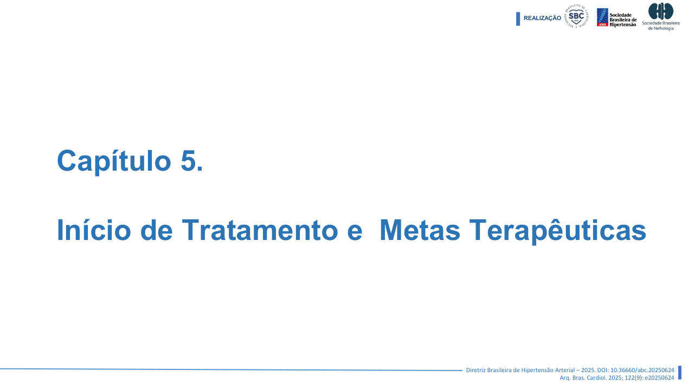

Capítulo 5.

Início de Tratamento e Metas Terapêuticas

#### Slide 36 — Tabela 5.1 – Indicações de medidas não medicamentosas e medicamentosas de acordo com a pressão

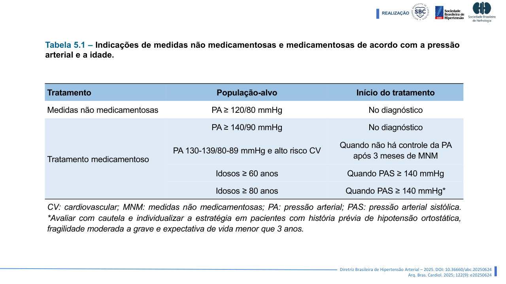

Tabela 5.1 – Indicações de medidas não medicamentosas e medicamentosas de acordo com a pressão arterial e a idade.

Tratamento População-alvo Início do tratamento

Medidas não medicamentosas PA ≥120/80 mmHg No diagnóstico

PA ≥140/90 mmHg No diagnóstico

PA 130-139/80-89 mmHg e alto risco CV Quando não há controle da PA

após 3 meses de MNM

Tratamento medicamentoso

Idosos ≥60 anos Quando PAS ≥140 mmHg

Idosos ≥80 anos Quando PAS ≥140 mmHg*

CV: cardiovascular; MNM: medidas não medicamentosas; PA: pressão arterial; PAS: pressão arterial sistólica. *Avaliar com cautela e individualizar a estratégia em pacientes com história prévia de hipotensão ortostática, fragilidade moderada a grave e expectativa de vida menor que 3 anos.

#### Slide 37 — Figura 5.1 – Início de tratamento e metas de pressão arterial.

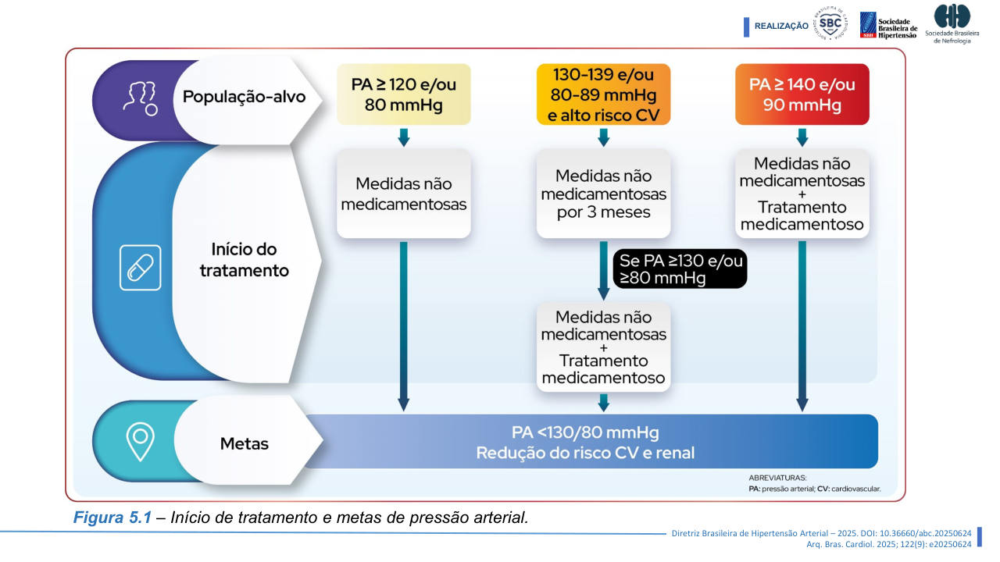

**Conteúdo visual — Figura 5.1:**
- PA ≥120 e/ou 80 mmHg → medidas não medicamentosas.
- 130–139 e/ou 80–89 mmHg **e alto risco CV** → MNM por 3 meses; se PA permanecer ≥130 e/ou ≥80 → MNM + tratamento medicamentoso.
- PA ≥140 e/ou 90 mmHg → MNM + tratamento medicamentoso desde o diagnóstico.
- **Meta única de todos os caminhos:** PA < 130/80 mmHg e redução do risco CV e renal.

Figura 5.1 – Início de tratamento e metas de pressão arterial.

#### Slide 38 — Tabela 5.2 – Metas de pressão arterial na medida ambulatorial da pressão arterial (nas 24 horas, vigília

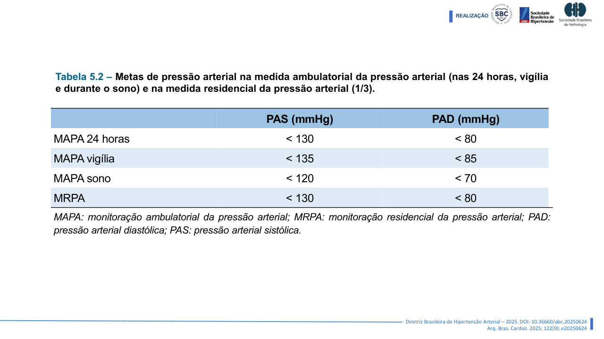

Tabela 5.2 – Metas de pressão arterial na medida ambulatorial da pressão arterial (nas 24 horas, vigília e durante o sono) e na medida residencial da pressão arterial (1/3).

PAS (mmHg) PAD (mmHg)

MAPA 24 horas < 130 < 80

MAPA vigília < 135 < 85

MAPA sono < 120 < 70

MRPA < 130 < 80

MAPA: monitoração ambulatorial da pressão arterial; MRPA: monitoração residencial da pressão arterial; PAD: pressão arterial diastólica; PAS: pressão arterial sistólica.

#### Slide 39 — Tabela 5.2 – Metas de pressão arterial na medida ambulatorial da pressão arterial (nas 24 horas, vigília

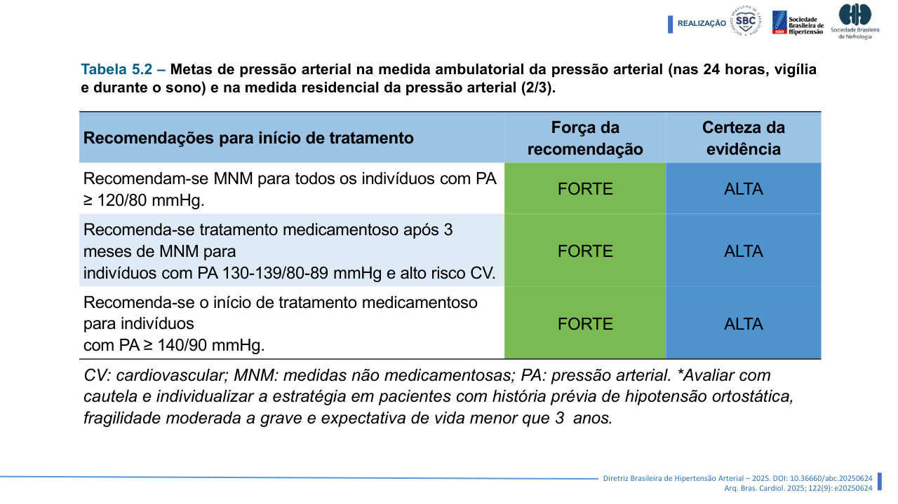

**Tabela 5.2 – Metas de pressão arterial na medida ambulatorial da pressão arterial (nas 24 horas, vigília e durante o sono) e na medida residencial da pressão arterial (2/3).**

| Recomendação | Força | Certeza da evidência |
| :---- | :---- | :---- |
| Recomendam-se MNM para todos os indivíduos com PA ≥120/80 mmHg. | FORTE | ALTA |
| Recomenda-se tratamento medicamentoso após 3 meses de MNM para indivíduos com PA 130-139/80-89 mmHg e alto risco CV. | FORTE | ALTA |
| Recomenda-se o início de tratamento medicamentoso para indivíduos com PA ≥140/90 mmHg. | FORTE | ALTA |

CV: cardiovascular; MNM: medidas não medicamentosas; PA: pressão arterial. *Avaliar com cautela e individualizar a estratégia em pacientes com história prévia de hipotensão ortostática, fragilidade moderada a grave e expectativa de vida menor que 3 anos.

#### Slide 40 — Tabela 5.2 – Metas de pressão arterial na medida ambulatorial da pressão arterial (nas 24 horas, vigília e durante o

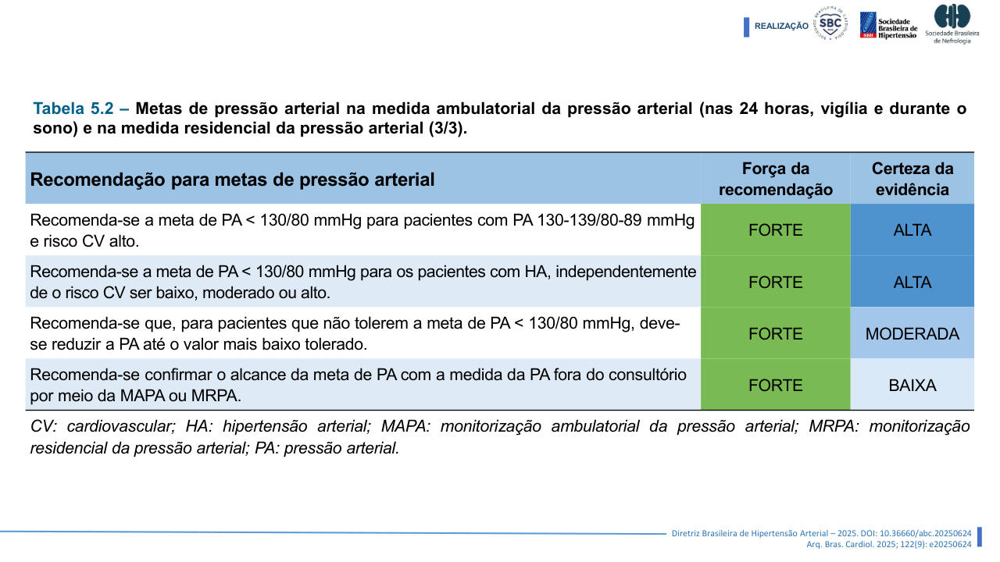

**Tabela 5.2 – Metas de pressão arterial na medida ambulatorial da pressão arterial (nas 24 horas, vigília e durante o sono) e na medida residencial da pressão arterial (3/3).**

| Recomendação | Força | Certeza da evidência |
| :---- | :---- | :---- |
| Recomenda-se a meta de PA < 130/80 mmHg para pacientes com PA 130-139/80-89 mmHg e risco CV alto. | FORTE | ALTA |
| Recomenda-se a meta de PA < 130/80 mmHg para os pacientes com HA, independentemente de o risco CV ser baixo, moderado ou alto. | FORTE | ALTA |
| Recomenda-se que, para pacientes que não tolerem a meta de PA < 130/80 mmHg, deve-se reduzir a PA até o valor mais baixo tolerado. | FORTE | MODERADA |
| Recomenda-se confirmar o alcance da meta de PA com a medida da PA fora do consultório por meio da MAPA ou MRPA. | FORTE | BAIXA |

CV: cardiovascular; HA: hipertensão arterial; MAPA: monitorização ambulatorial da pressão arterial; MRPA: monitorização residencial da pressão arterial; PA: pressão arterial.

#### Slide 41 — Mensagens principais sobre o início do tratamento

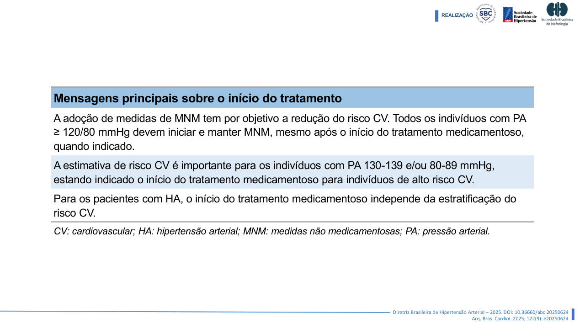

Mensagens principais sobre o início do tratamento

A adoção de medidas de MNM tem por objetivo a redução do risco CV. Todos os indivíduos com PA ≥120/80 mmHg devem iniciar e manter MNM, mesmo após o início do tratamento medicamentoso, quando indicado.

A estimativa de risco CV é importante para os indivíduos com PA 130-139 e/ou 80-89 mmHg, estando indicado o início do tratamento medicamentoso para indivíduos de alto risco CV.

Para os pacientes com HA, o início do tratamento medicamentoso independe da estratificação do risco CV.

CV: cardiovascular; HA: hipertensão arterial; MNM: medidas não medicamentosas; PA: pressão arterial.

#### Slide 42 — Mensagens principais sobre as metas de pressão arterial

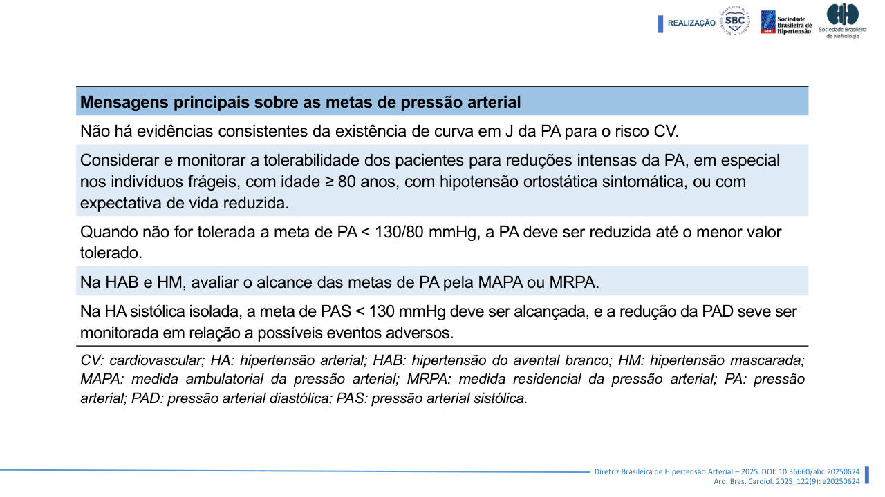

Mensagens principais sobre as metas de pressão arterial

Não há evidências consistentes da existência de curva em J da PA para o risco CV.

Considerar e monitorar a tolerabilidade dos pacientes para reduções intensas da PA, em especial nos indivíduos frágeis, com idade ≥80 anos, com hipotensão ortostática sintomática, ou com expectativa de vida reduzida.

Quando não for tolerada a meta de PA < 130/80 mmHg, a PA deve ser reduzida até o menor valor tolerado.

Na HAB e HM, avaliar o alcance das metas de PA pela MAPA ou MRPA.

Na HA sistólica isolada, a meta de PAS < 130 mmHg deve ser alcançada, e a redução da PAD seve ser monitorada em relação a possíveis eventos adversos.

CV: cardiovascular; HA: hipertensão arterial; HAB: hipertensão do avental branco; HM: hipertensão mascarada; MAPA: medida ambulatorial da pressão arterial; MRPA: medida residencial da pressão arterial; PA: pressão arterial; PAD: pressão arterial diastólica; PAS: pressão arterial sistólica.

### Capítulo 6. Medidas não medicamentosas

#### Slide 43 — 6. Medidas Não Medicamentosas

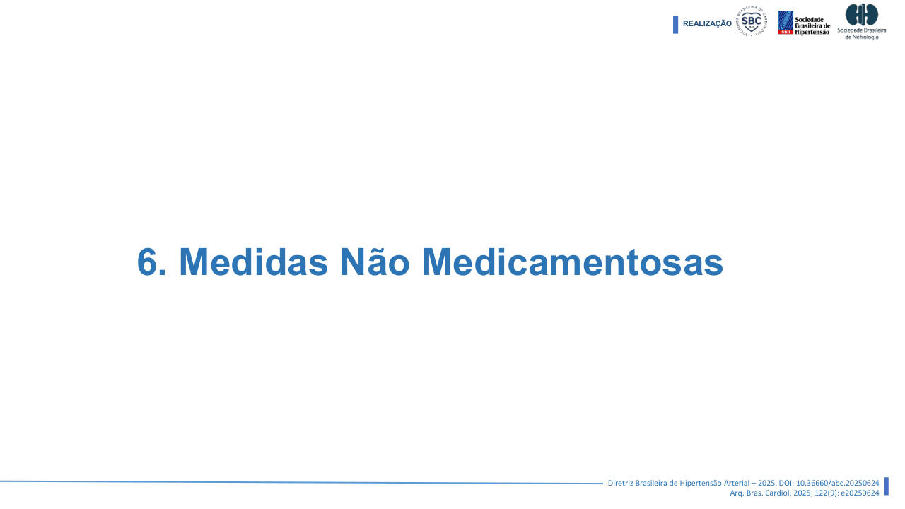

6. Medidas Não Medicamentosas

#### Slide 44 — Tabela 6.1 – Medidas nutricionais para prevenção e tratamento da hipertensão arterial.

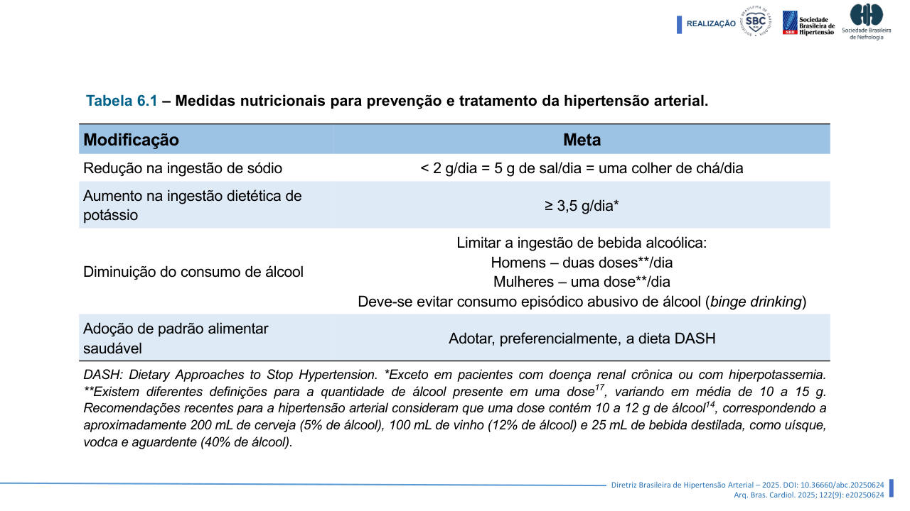

Tabela 6.1 – Medidas nutricionais para prevenção e tratamento da hipertensão arterial.

Modificação Meta

Redução na ingestão de sódio < 2 g/dia = 5 g de sal/dia = uma colher de chá/dia

Aumento na ingestão dietética de potássio ≥ 3,5 g/dia*

Limitar a ingestão de bebida alcoólica:

Homens – duas doses**/dia

Diminuição do consumo de álcool

Mulheres – uma dose**/dia Deve-se evitar consumo episódico abusivo de álcool (binge drinking)

Adoção de padrão alimentar saudável Adotar, preferencialmente, a dieta DASH

DASH: Dietary Approaches to Stop Hypertension. *Exceto em pacientes com doença renal crônica ou com hiperpotassemia. **Existem diferentes definições para a quantidade de álcool presente em uma dose17, variando em média de 10 a 15 g. Recomendações recentes para a hipertensão arterial consideram que uma dose contém 10 a 12 g de álcool14, correspondendo a aproximadamente 200 mL de cerveja (5% de álcool), 100 mL de vinho (12% de álcool) e 25 mL de bebida destilada, como uísque, vodca e aguardente (40% de álcool).

#### Slide 45 — Tabela 6.2 – Redução da pressão arterial sistólica e da pressão arterial diastólica com os diferentes

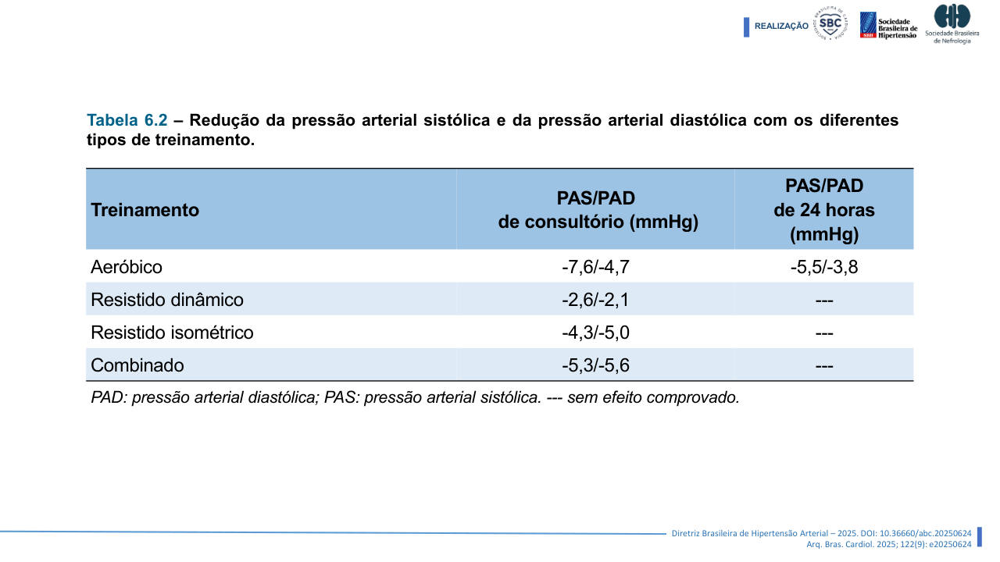

Tabela 6.2 – Redução da pressão arterial sistólica e da pressão arterial diastólica com os diferentes tipos de treinamento.

PAS/PAD de 24 horas

Treinamento PAS/PAD de consultório (mmHg)

(mmHg)

Aeróbico -7,6/-4,7 -5,5/-3,8

Resistido dinâmico -2,6/-2,1 ---

Resistido isométrico -4,3/-5,0 ---

Combinado -5,3/-5,6 ---

PAD: pressão arterial diastólica; PAS: pressão arterial sistólica. --- sem efeito comprovado.

#### Slide 46 — Tabela 6.3 – Orientações para a prescrição de atividade física e exercício físico (1/2).

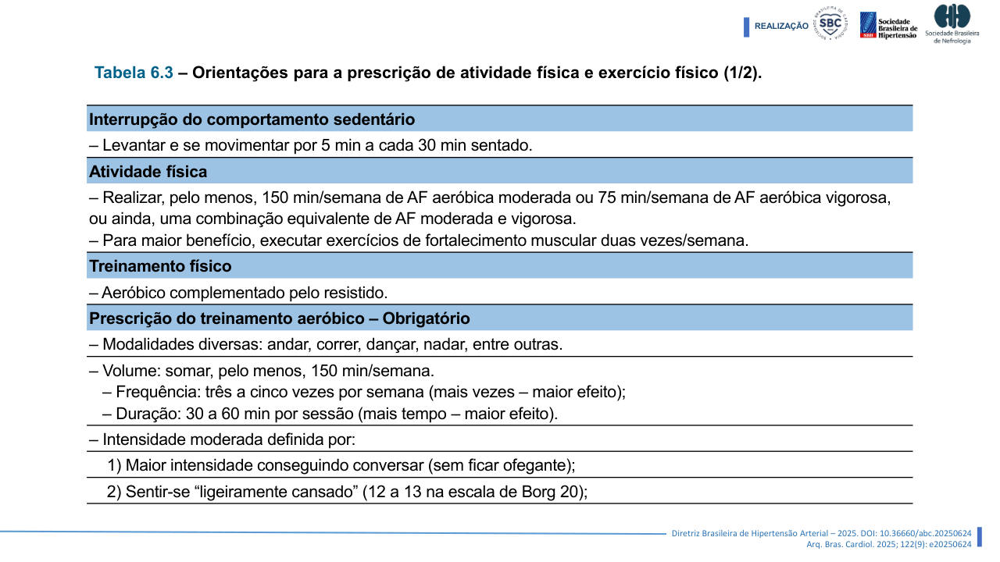

Tabela 6.3 – Orientações para a prescrição de atividade física e exercício físico (1/2).

Interrupção do comportamento sedentário

– Levantar e se movimentar por 5 min a cada 30 min sentado.

Atividade física

– Realizar, pelo menos, 150 min/semana de AF aeróbica moderada ou 75 min/semana de AF aeróbica vigorosa, ou ainda, uma combinação equivalente de AF moderada e vigorosa. – Para maior benefício, executar exercícios de fortalecimento muscular duas vezes/semana.

Treinamento físico

– Aeróbico complementado pelo resistido.

Prescrição do treinamento aeróbico – Obrigatório

– Modalidades diversas: andar, correr, dançar, nadar, entre outras.

– Volume: somar, pelo menos, 150 min/semana. – Frequência: três a cinco vezes por semana (mais vezes – maior efeito); – Duração: 30 a 60 min por sessão (mais tempo – maior efeito).

– Intensidade moderada definida por:

1) Maior intensidade conseguindo conversar (sem ficar ofegante);

2) Sentir-se “ligeiramente cansado” (12 a 13 na escala de Borg 20);

#### Slide 47 — Tabela 6.3 – Orientações para a prescrição de atividade física e exercício físico (2/2).

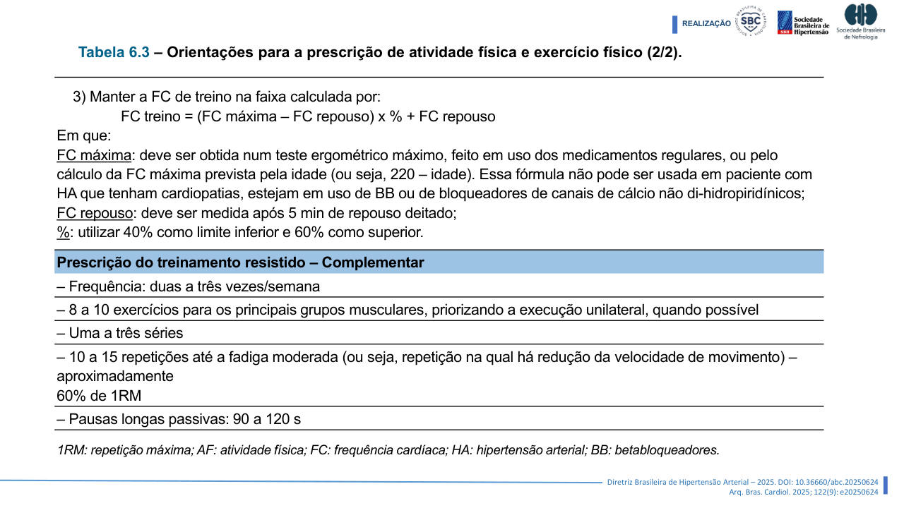

Tabela 6.3 – Orientações para a prescrição de atividade física e exercício físico (2/2).

3) Manter a FC de treino na faixa calculada por: FC treino = (FC máxima – FC repouso) x % + FC repouso Em que: FC máxima: deve ser obtida num teste ergométrico máximo, feito em uso dos medicamentos regulares, ou pelo cálculo da FC máxima prevista pela idade (ou seja, 220 – idade). Essa fórmula não pode ser usada em paciente com HA que tenham cardiopatias, estejam em uso de BB ou de bloqueadores de canais de cálcio não di-hidropiridínicos; FC repouso: deve ser medida após 5 min de repouso deitado; %: utilizar 40% como limite inferior e 60% como superior.

Prescrição do treinamento resistido – Complementar

– Frequência: duas a três vezes/semana

– 8 a 10 exercícios para os principais grupos musculares, priorizando a execução unilateral, quando possível

– Uma a três séries

– 10 a 15 repetições até a fadiga moderada (ou seja, repetição na qual há redução da velocidade de movimento) – aproximadamente 60% de 1RM

– Pausas longas passivas: 90 a 120 s

1RM: repetição máxima; AF: atividade física; FC: frequência cardíaca; HA: hipertensão arterial; BB: betabloqueadores.

#### Slide 48 — Figura 6.1 – Medidas não medicamentosas para a prevenção e o tratamento da hipertensão arterial.

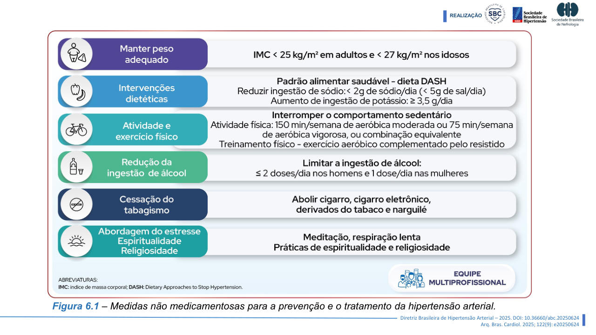

Figura 6.1 – Medidas não medicamentosas para a prevenção e o tratamento da hipertensão arterial.

#### Slide 49 — Recomendações para medidas não medicamentosas de abordagem da PA

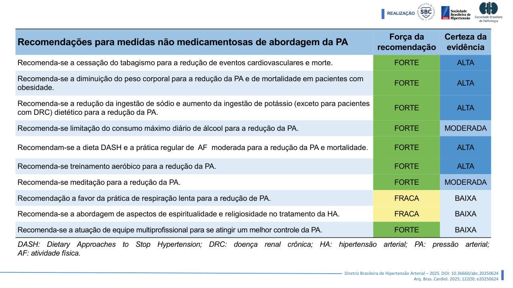

**Recomendações para medidas não medicamentosas de abordagem da PA**

| Recomendação | Força | Certeza da evidência |
| :---- | :---- | :---- |
| Recomenda-se a cessação do tabagismo para a redução de eventos cardiovasculares e morte. | FORTE | ALTA |
| Recomenda-se a diminuição do peso corporal para a redução da PA e de mortalidade em pacientes com obesidade. | FORTE | ALTA |
| Recomenda-se a redução da ingestão de sódio e aumento da ingestão de potássio (exceto para pacientes com DRC) dietético para a redução da PA. | FORTE | ALTA |
| Recomenda-se limitação do consumo máximo diário de álcool para a redução da PA. | FORTE | MODERADA |
| Recomendam-se a dieta DASH e a prática regular de AF moderada para a redução da PA e mortalidade. | FORTE | ALTA |
| Recomenda-se treinamento aeróbico para a redução da PA. | FORTE | ALTA |
| Recomenda-se meditação para a redução da PA. | FORTE | MODERADA |
| Recomendação a favor da prática de respiração lenta para a redução de PA. | FRACA | BAIXA |
| Recomenda-se a abordagem de aspectos de espiritualidade e religiosidade no tratamento da HA. | FRACA | BAIXA |
| Recomenda-se a atuação de equipe multiprofissional para se atingir um melhor controle da PA. | FORTE | BAIXA |

DASH: Dietary Approaches to Stop Hypertension; DRC: doença renal crônica; HA: hipertensão arterial; PA: pressão arterial; AF: atividade física.

### Capítulo 7. Tratamento medicamentoso

#### Slide 50 — Capítulo 7.  Tratamento Medicamentoso

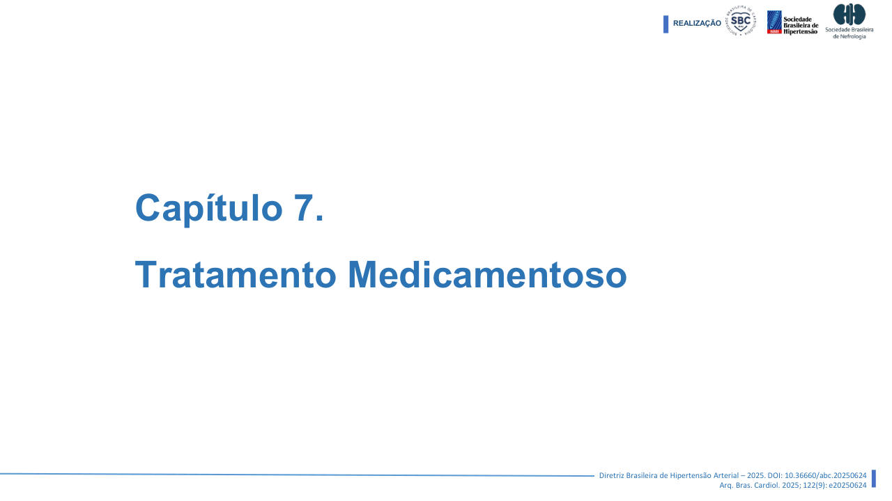

Capítulo 7.

Tratamento Medicamentoso

#### Slide 51 — Figura 7.1 – Benefícios do tratamento medicamentoso da hipertensão arterial.

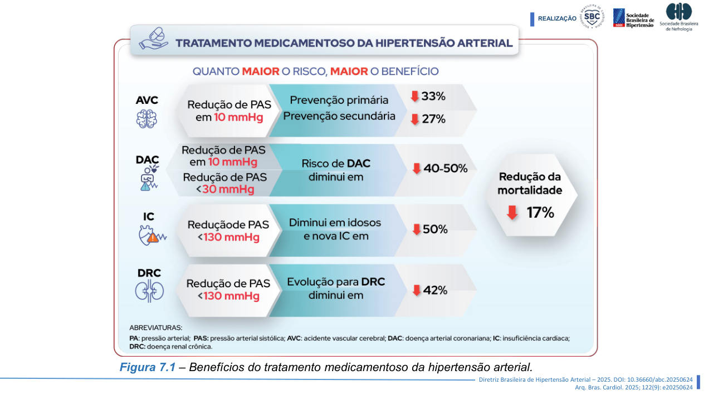

Figura 7.1 – Benefícios do tratamento medicamentoso da hipertensão arterial.

#### Slide 52 — Quadro 7.2 – Diuréticos, suas doses diárias habituais (mg/dia), frequência de tomadas (número de

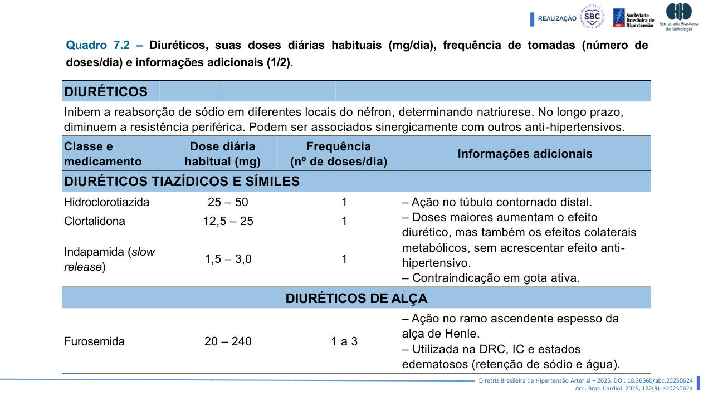

Quadro 7.2 – Diuréticos, suas doses diárias habituais (mg/dia), frequência de tomadas (número de doses/dia) e informações adicionais (1/2).

DIURÉTICOS

Inibem a reabsorção de sódio em diferentes locais do néfron, determinando natriurese. No longo prazo, diminuem a resistência periférica. Podem ser associados sinergicamente com outros anti-hipertensivos.

Classe e medicamento

Dose diária habitual (mg)

Frequência (nº de doses/dia) Informações adicionais

DIURÉTICOS TIAZÍDICOS E SÍMILES

Hidroclorotiazida 25 – 50 1 – Ação no túbulo contornado distal. – Doses maiores aumentam o efeito diurético, mas também os efeitos colaterais metabólicos, sem acrescentar efeito anti- hipertensivo. – Contraindicação em gota ativa.

Clortalidona 12,5 – 25 1

Indapamida (slow release) 1,5 – 3,0 1

DIURÉTICOS DE ALÇA

– Ação no ramo ascendente espesso da alça de Henle. – Utilizada na DRC, IC e estados edematosos (retenção de sódio e água).

Furosemida 20 – 240 1 a 3

#### Slide 53 — Quadro 7.2 – Diuréticos, suas doses diárias habituais (mg/dia), frequência de tomadas (número de

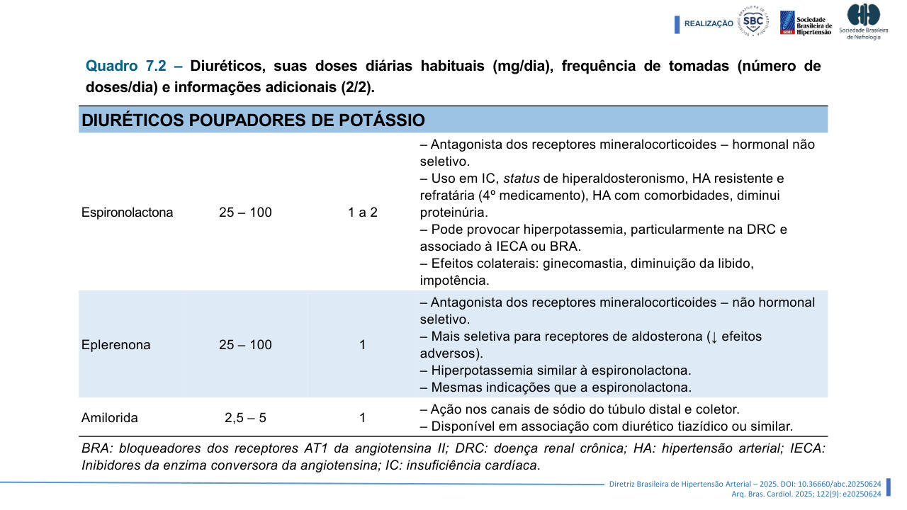

Quadro 7.2 – Diuréticos, suas doses diárias habituais (mg/dia), frequência de tomadas (número de doses/dia) e informações adicionais (2/2).

DIURÉTICOS POUPADORES DE POTÁSSIO

– Antagonista dos receptores mineralocorticoides – hormonal não seletivo. – Uso em IC, status de hiperaldosteronismo, HA resistente e refratária (4º medicamento), HA com comorbidades, diminui proteinúria. – Pode provocar hiperpotassemia, particularmente na DRC e associado à IECA ou BRA. – Efeitos colaterais: ginecomastia, diminuição da libido, impotência.

Espironolactona 25 – 100 1 a 2

– Antagonista dos receptores mineralocorticoides – não hormonal seletivo. – Mais seletiva para receptores de aldosterona (↓ efeitos adversos). – Hiperpotassemia similar à espironolactona. – Mesmas indicações que a espironolactona.

Eplerenona 25 – 100 1

Amilorida 2,5 – 5 1 – Ação nos canais de sódio do túbulo distal e coletor. – Disponível em associação com diurético tiazídico ou similar.

BRA: bloqueadores dos receptores AT1 da angiotensina II; DRC: doença renal crônica; HA: hipertensão arterial; IECA: Inibidores da enzima conversora da angiotensina; IC: insuficiência cardíaca.

#### Slide 54 — Quadro 7.3 – Bloqueadores dos canais de cálcio, suas doses diárias habituais (mg/dia), frequência de

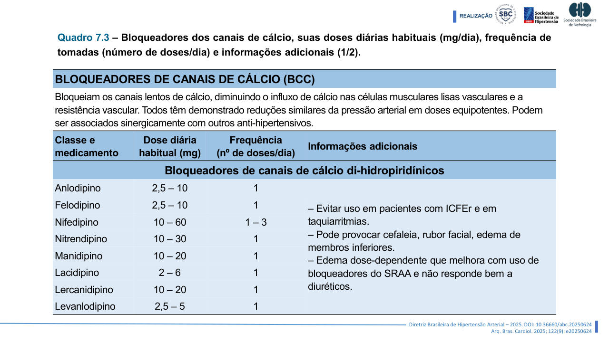

Quadro 7.3 – Bloqueadores dos canais de cálcio, suas doses diárias habituais (mg/dia), frequência de tomadas (número de doses/dia) e informações adicionais (1/2).

BLOQUEADORES DE CANAIS DE CÁLCIO (BCC)

Bloqueiam os canais lentos de cálcio, diminuindo o influxo de cálcio nas células musculares lisas vasculares e a resistência vascular. Todos têm demonstrado reduções similares da pressão arterial em doses equipotentes. Podem ser associados sinergicamente com outros anti-hipertensivos.

Classe e medicamento

Dose diária habitual (mg)

Frequência (nº de doses/dia) Informações adicionais

Bloqueadores de canais de cálcio di-hidropiridínicos

Anlodipino 2,5 – 10 1

Felodipino 2,5 – 10 1

– Evitar uso em pacientes com ICFEr e em taquiarritmias. – Pode provocar cefaleia, rubor facial, edema de membros inferiores. – Edema dose-dependente que melhora com uso de bloqueadores do SRAA e não responde bem a diuréticos.

Nifedipino 10 – 60 1 – 3

Nitrendipino 10 – 30 1

Manidipino 10 – 20 1

Lacidipino 2 – 6 1

Lercanidipino 10 – 20 1

Levanlodipino 2,5 – 5 1

#### Slide 55 — Quadro 7.3 – Bloqueadores dos canais de cálcio, suas doses diárias habituais (mg/dia), frequência de

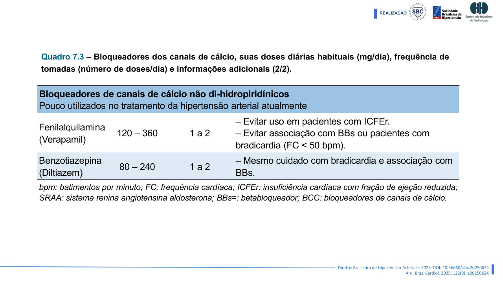

Quadro 7.3 – Bloqueadores dos canais de cálcio, suas doses diárias habituais (mg/dia), frequência de tomadas (número de doses/dia) e informações adicionais (2/2).

Bloqueadores de canais de cálcio não di-hidropiridínicos Pouco utilizados no tratamento da hipertensão arterial atualmente

Fenilalquilamina (Verapamil) 120 – 360 1 a 2 – Evitar uso em pacientes com ICFEr. – Evitar associação com BBs ou pacientes com bradicardia (FC < 50 bpm).

Benzotiazepina (Diltiazem) 80 – 240 1 a 2 – Mesmo cuidado com bradicardia e associação com BBs.

bpm: batimentos por minuto; FC: frequência cardíaca; ICFEr: insuficiência cardíaca com fração de ejeção reduzida; SRAA: sistema renina angiotensina aldosterona; BBs=: betabloqueador; BCC: bloqueadores de canais de cálcio.

#### Slide 56 — Quadro 7.4 – Inibidores da enzima conversora da angiotensina, suas doses diárias habituais (mg/dia),

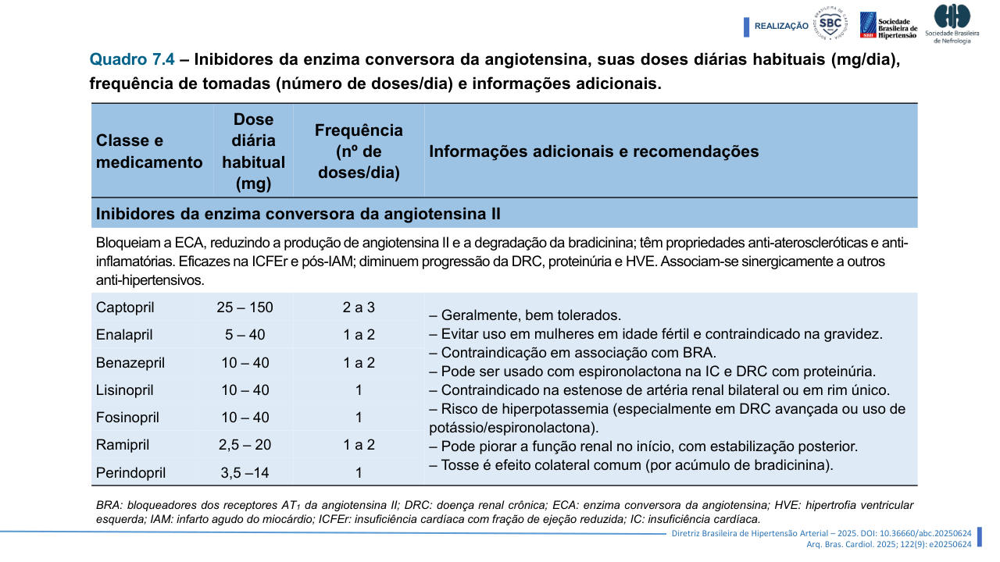

Quadro 7.4 – Inibidores da enzima conversora da angiotensina, suas doses diárias habituais (mg/dia), frequência de tomadas (número de doses/dia) e informações adicionais.

Dose diária habitual

Frequência

Classe e medicamento

(nº de doses/dia)

Informações adicionais e recomendações

(mg)

Inibidores da enzima conversora da angiotensina II

Bloqueiam a ECA, reduzindo a produção de angiotensina II e a degradação da bradicinina; têm propriedades anti-ateroscleróticas e anti- inflamatórias. Eficazes na ICFEr e pós-IAM; diminuem progressão da DRC, proteinúria e HVE. Associam-se sinergicamente a outros anti-hipertensivos.

Captopril 25 – 150 2 a 3 – Geralmente, bem tolerados. – Evitar uso em mulheres em idade fértil e contraindicado na gravidez. – Contraindicação em associação com BRA. – Pode ser usado com espironolactona na IC e DRC com proteinúria. – Contraindicado na estenose de artéria renal bilateral ou em rim único. – Risco de hiperpotassemia (especialmente em DRC avançada ou uso de potássio/espironolactona). – Pode piorar a função renal no início, com estabilização posterior. – Tosse é efeito colateral comum (por acúmulo de bradicinina).

Enalapril 5 – 40 1 a 2

Benazepril 10 – 40 1 a 2

Lisinopril 10 – 40 1

Fosinopril 10 – 40 1

Ramipril 2,5 – 20 1 a 2

Perindopril 3,5 –14 1

BRA: bloqueadores dos receptores AT1 da angiotensina II; DRC: doença renal crônica; ECA: enzima conversora da angiotensina; HVE: hipertrofia ventricular esquerda; IAM: infarto agudo do miocárdio; ICFEr: insuficiência cardíaca com fração de ejeção reduzida; IC: insuficiência cardíaca.

#### Slide 57 — Quadro 7.5 – Bloqueadores dos receptores AT1 da angiotensina II, suas doses diárias habituais

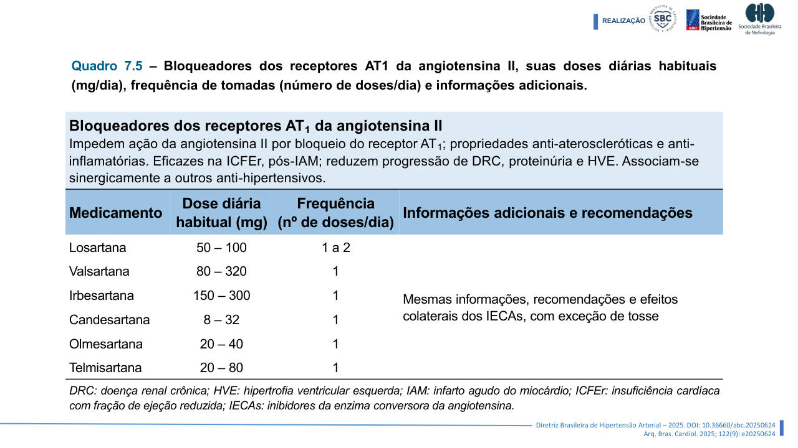

Quadro 7.5 – Bloqueadores dos receptores AT1 da angiotensina II, suas doses diárias habituais (mg/dia), frequência de tomadas (número de doses/dia) e informações adicionais.

Bloqueadores dos receptores AT1 da angiotensina II Impedem ação da angiotensina II por bloqueio do receptor AT1; propriedades anti-ateroscleróticas e anti- inflamatórias. Eficazes na ICFEr, pós-IAM; reduzem progressão de DRC, proteinúria e HVE. Associam-se sinergicamente a outros anti-hipertensivos.

Medicamento Dose diária habitual (mg)

Frequência (nº de doses/dia) Informações adicionais e recomendações

Losartana 50 – 100 1 a 2

Valsartana 80 – 320 1

Irbesartana 150 – 300 1

Mesmas informações, recomendações e efeitos colaterais dos IECAs, com exceção de tosse

Candesartana 8 – 32 1

Olmesartana 20 – 40 1

Telmisartana 20 – 80 1

DRC: doença renal crônica; HVE: hipertrofia ventricular esquerda; IAM: infarto agudo do miocárdio; ICFEr: insuficiência cardíaca com fração de ejeção reduzida; IECAs: inibidores da enzima conversora da angiotensina.

#### Slide 58 — Quadro 7.6 – Betabloqueadores, suas doses diárias habituais (mg/dia), frequência de tomadas

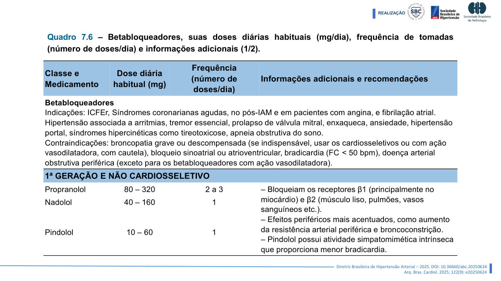

Quadro 7.6 – Betabloqueadores, suas doses diárias habituais (mg/dia), frequência de tomadas (número de doses/dia) e informações adicionais (1/2).

Frequência (número de

Classe e Medicamento

Dose diária habitual (mg)

Informações adicionais e recomendações

doses/dia)

Betabloqueadores Indicações: ICFEr, Síndromes coronarianas agudas, no pós-IAM e em pacientes com angina, e fibrilação atrial. Hipertensão associada a arritmias, tremor essencial, prolapso de válvula mitral, enxaqueca, ansiedade, hipertensão portal, síndromes hipercinéticas como tireotoxicose, apneia obstrutiva do sono. Contraindicações: broncopatia grave ou descompensada (se indispensável, usar os cardiosseletivos ou com ação vasodilatadora, com cautela), bloqueio sinoatrial ou atrioventricular, bradicardia (FC < 50 bpm), doença arterial obstrutiva periférica (exceto para os betabloqueadores com ação vasodilatadora).

1ª GERAÇÃO E NÃO CARDIOSSELETIVO

Propranolol 80 – 320 2 a 3 – Bloqueiam os receptores β1 (principalmente no miocárdio) e β2 (músculo liso, pulmões, vasos sanguíneos etc.). – Efeitos periféricos mais acentuados, como aumento da resistência arterial periférica e broncoconstrição. – Pindolol possui atividade simpatomimética intrínseca que proporciona menor bradicardia.

Nadolol 40 – 160 1

Pindolol 10 – 60 1

#### Slide 59 — Quadro 7.6 – Betabloqueadores, suas doses diárias habituais (mg/dia), frequência de tomadas (número

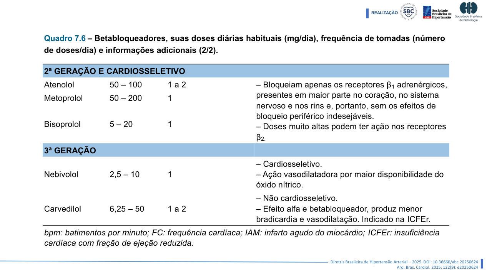

Quadro 7.6 – Betabloqueadores, suas doses diárias habituais (mg/dia), frequência de tomadas (número de doses/dia) e informações adicionais (2/2).

2ª GERAÇÃO E CARDIOSSELETIVO

Atenolol 50 – 100 1 a 2 – Bloqueiam apenas os receptores β1 adrenérgicos, presentes em maior parte no coração, no sistema nervoso e nos rins e, portanto, sem os efeitos de bloqueio periférico indesejáveis. – Doses muito altas podem ter ação nos receptores β2.

Metoprolol 50 – 200 1

Bisoprolol 5 – 20 1

3ª GERAÇÃO

Nebivolol 2,5 – 10 1 – Cardiosseletivo. – Ação vasodilatadora por maior disponibilidade do óxido nítrico.

Carvedilol 6,25 – 50 1 a 2 – Não cardiosseletivo. – Efeito alfa e betabloqueador, produz menor bradicardia e vasodilatação. Indicado na ICFEr.

bpm: batimentos por minuto; FC: frequência cardíaca; IAM: infarto agudo do miocárdio; ICFEr: insuficiência cardíaca com fração de ejeção reduzida.

#### Slide 60 — Figura 7.2 – Octeto do tratamento da hipertensão arterial. Adaptada de Feitosa et al.

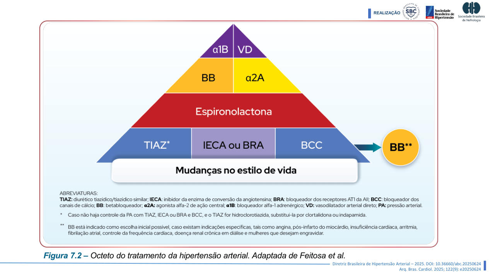

**Conteúdo visual — octeto (pirâmide, de baixo para cima):**
- Base: mudanças no estilo de vida (para todos).
- 1ª linha: TIAZ* + IECA ou BRA + BCC; BB** pode ser escolha inicial se houver indicação específica.
- 4º fármaco: espironolactona.
- Depois: BB e α2A (agonista alfa-2 central).
- Ápice: α1B (alfabloqueador) e VD (vasodilatador arterial direto).
- \* Se não houver controle com TIAZ + IECA/BRA + BCC e o tiazídico for hidroclorotiazida, substituir por clortalidona ou indapamida.
- \*\* BB como escolha inicial possível: angina, pós-IAM, IC, arritmia, FA, controle da FC, DRC em diálise e mulheres que desejam engravidar.

Figura 7.2 – Octeto do tratamento da hipertensão arterial. Adaptada de Feitosa et al.

#### Slide 61 — Quadro 7.7 – Outros medicamentos utilizados no tratamento da hipertensão arterial: simpatolíticos e

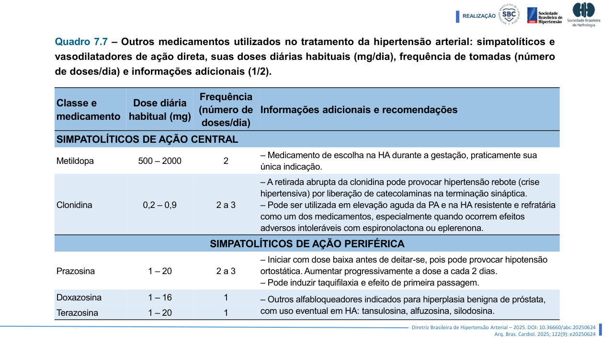

Quadro 7.7 – Outros medicamentos utilizados no tratamento da hipertensão arterial: simpatolíticos e vasodilatadores de ação direta, suas doses diárias habituais (mg/dia), frequência de tomadas (número de doses/dia) e informações adicionais (1/2).

Frequência (número de

Classe e medicamento

Dose diária habitual (mg)

Informações adicionais e recomendações

doses/dia)

SIMPATOLÍTICOS DE AÇÃO CENTRAL

Metildopa 500 – 2000 2 – Medicamento de escolha na HA durante a gestação, praticamente sua única indicação.

– A retirada abrupta da clonidina pode provocar hipertensão rebote (crise hipertensiva) por liberação de catecolaminas na terminação sináptica. – Pode ser utilizada em elevação aguda da PA e na HA resistente e refratária como um dos medicamentos, especialmente quando ocorrem efeitos adversos intoleráveis com espironolactona ou eplerenona.

Clonidina 0,2 – 0,9 2 a 3

SIMPATOLÍTICOS DE AÇÃO PERIFÉRICA

Prazosina 1 – 20 2 a 3 – Iniciar com dose baixa antes de deitar-se, pois pode provocar hipotensão ortostática. Aumentar progressivamente a dose a cada 2 dias. – Pode induzir taquifilaxia e efeito de primeira passagem.

Doxazosina 1 – 16 1 – Outros alfabloqueadores indicados para hiperplasia benigna de próstata, com uso eventual em HA: tansulosina, alfuzosina, silodosina. Terazosina 1 – 20 1

#### Slide 62 — Quadro 7.7 – Outros medicamentos utilizados no tratamento da hipertensão arterial: simpatolíticos e

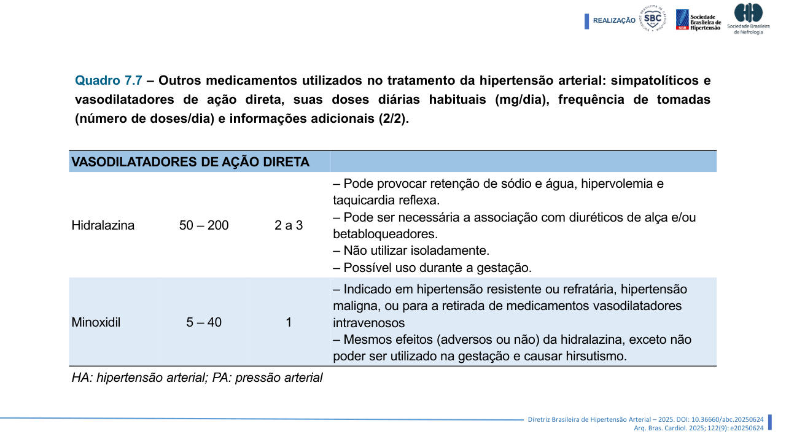

Quadro 7.7 – Outros medicamentos utilizados no tratamento da hipertensão arterial: simpatolíticos e vasodilatadores de ação direta, suas doses diárias habituais (mg/dia), frequência de tomadas (número de doses/dia) e informações adicionais (2/2).

VASODILATADORES DE AÇÃO DIRETA

– Pode provocar retenção de sódio e água, hipervolemia e taquicardia reflexa. – Pode ser necessária a associação com diuréticos de alça e/ou betabloqueadores. – Não utilizar isoladamente. – Possível uso durante a gestação.

Hidralazina 50 – 200 2 a 3

– Indicado em hipertensão resistente ou refratária, hipertensão maligna, ou para a retirada de medicamentos vasodilatadores intravenosos – Mesmos efeitos (adversos ou não) da hidralazina, exceto não poder ser utilizado na gestação e causar hirsutismo.

Minoxidil 5 – 40 1

HA: hipertensão arterial; PA: pressão arterial

#### Slide 63 — Figura 7.3 – Pacientes com indicação inicial para monoterapia.

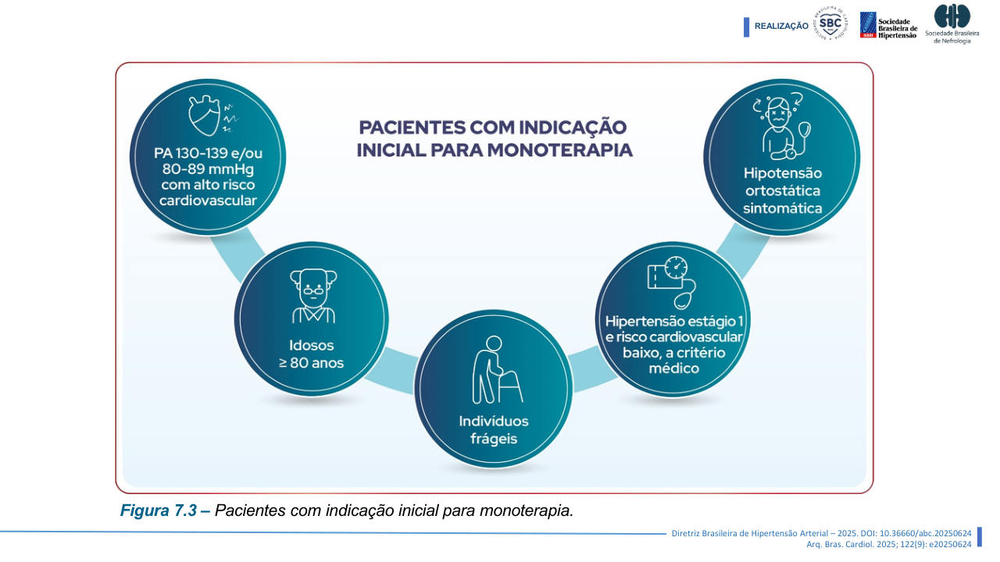

Figura 7.3 – Pacientes com indicação inicial para monoterapia.

#### Slide 64 — Figura 7.4 – Fluxograma do tratamento medicamentoso da hipertensão arterial.

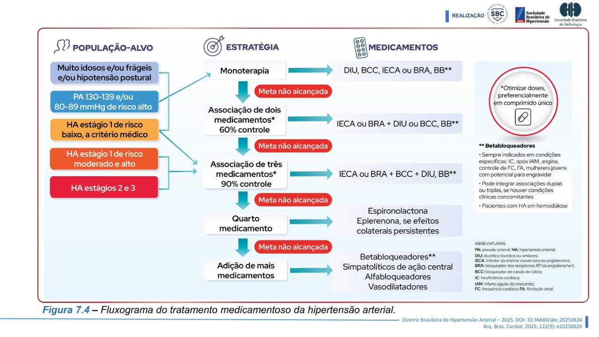

**Conteúdo visual — Figura 7.4 (fluxograma medicamentoso):**
- **Monoterapia** (muito idosos e/ou frágeis e/ou hipotensão postural; PA 130–139 e/ou 80–89 de risco alto; HA estágio 1 de risco baixo a critério médico): DIU, BCC, IECA ou BRA, BB**.
- **Associação de 2** (HA estágio 1 risco moderado/alto; estágios 2 e 3) — controla ~60%: IECA ou BRA + DIU ou BCC; BB**.
- **Associação de 3** — controla ~90%: IECA ou BRA + BCC + DIU; BB**.
- **4º medicamento:** espironolactona (eplerenona se efeitos adversos persistentes).
- **Mais medicamentos:** betabloqueadores**, simpatolíticos de ação central, alfabloqueadores, vasodilatadores.
- \* Otimizar doses, preferencialmente em comprimido único.
- \*\* BB sempre indicado em IC, pós-IAM, angina, controle de FC, FA e mulheres jovens com potencial gestacional; pode integrar dupla/tripla se houver condição concomitante; indicado em hipertensos em hemodiálise.

Figura 7.4 – Fluxograma do tratamento medicamentoso da hipertensão arterial.

#### Slide 65 — Mensagens principais sobre o tratamento da hipertensão arterial

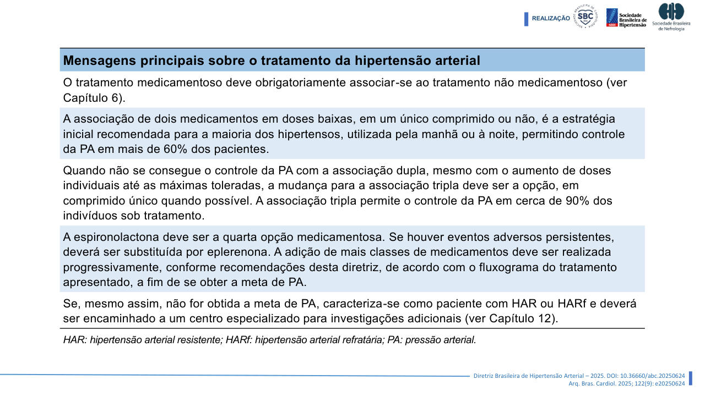

Mensagens principais sobre o tratamento da hipertensão arterial

O tratamento medicamentoso deve obrigatoriamente associar-se ao tratamento não medicamentoso (ver Capítulo 6).

A associação de dois medicamentos em doses baixas, em um único comprimido ou não, é a estratégia inicial recomendada para a maioria dos hipertensos, utilizada pela manhã ou à noite, permitindo controle da PA em mais de 60% dos pacientes.

Quando não se consegue o controle da PA com a associação dupla, mesmo com o aumento de doses individuais até as máximas toleradas, a mudança para a associação tripla deve ser a opção, em comprimido único quando possível. A associação tripla permite o controle da PA em cerca de 90% dos indivíduos sob tratamento.

A espironolactona deve ser a quarta opção medicamentosa. Se houver eventos adversos persistentes, deverá ser substituída por eplerenona. A adição de mais classes de medicamentos deve ser realizada progressivamente, conforme recomendações desta diretriz, de acordo com o fluxograma do tratamento apresentado, a fim de se obter a meta de PA.

Se, mesmo assim, não for obtida a meta de PA, caracteriza-se como paciente com HAR ou HARf e deverá ser encaminhado a um centro especializado para investigações adicionais (ver Capítulo 12).

HAR: hipertensão arterial resistente; HARf: hipertensão arterial refratária; PA: pressão arterial.

#### Slide 66 — Recomendações para o tratamento medicamentoso

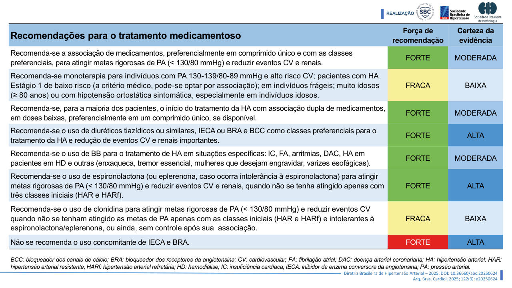

**Recomendações para o tratamento medicamentoso**

| Recomendação | Força | Certeza da evidência |
| :---- | :---- | :---- |
| Recomenda-se a associação de medicamentos, preferencialmente em comprimido único e com as classes preferenciais, para atingir metas rigorosas de PA (< 130/80 mmHg) e reduzir eventos CV e renais. | FORTE | MODERADA |
| Recomenda-se monoterapia para indivíduos com PA 130-139/80-89 mmHg e alto risco CV; pacientes com HA Estágio 1 de baixo risco (a critério médico, pode-se optar por associação); em indivíduos frágeis; muito idosos (≥80 anos) ou com hipotensão ortostática sintomática, especialmente em indivíduos idosos. | FRACA | BAIXA |
| Recomenda-se, para a maioria dos pacientes, o início do tratamento da HA com associação dupla de medicamentos, em doses baixas, preferencialmente em um comprimido único, se disponível. | FORTE | MODERADA |
| Recomenda-se o uso de diuréticos tiazídicos ou similares, IECA ou BRA e BCC como classes preferenciais para o tratamento da HA e redução de eventos CV e renais importantes. | FORTE | ALTA |
| Recomenda-se o uso de BB para o tratamento de HA em situações específicas: IC, FA, arritmias, DAC, HA em pacientes em HD e outras (enxaqueca, tremor essencial, mulheres que desejam engravidar, varizes esofágicas). | FORTE | MODERADA |
| Recomenda-se o uso de espironolactona (ou eplerenona, caso ocorra intolerância à espironolactona) para atingir metas rigorosas de PA (< 130/80 mmHg) e reduzir eventos CV e renais, quando não se tenha atingido apenas com três classes iniciais (HAR e HARf). | FORTE | ALTA |
| Recomenda-se o uso de clonidina para atingir metas rigorosas de PA (< 130/80 mmHg) e reduzir eventos CV quando não se tenham atingido as metas de PA apenas com as classes iniciais (HAR e HARf) e intolerantes à espironolactona/eplerenona, ou ainda, sem controle após sua associação. | FRACA | BAIXA |
| Não se recomenda o uso concomitante de IECA e BRA. | FORTE | ALTA |

BCC: bloqueador dos canais de cálcio; BRA: bloqueador dos receptores da angiotensina; CV: cardiovascular; FA: fibrilação atrial; DAC: doença arterial coronariana; HA: hipertensão arterial; HAR: hipertensão arterial resistente; HARf: hipertensão arterial refratária; HD: hemodiálise; IC: insuficiência cardíaca; IECA: inibidor da enzima conversora da angiotensina; PA: pressão arterial.

### Capítulo 8. Hipertensão arterial e condições clínicas associadas

#### Slide 67 — Capítulo 8.  Hipertensão Arterial e Condições  Clínicas Associadas: Doença Arterial  Coronariana, Doença Renal Crônica, 

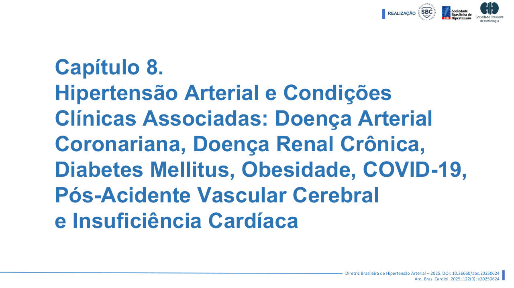

Capítulo 8. Hipertensão Arterial e Condições Clínicas Associadas: Doença Arterial Coronariana, Doença Renal Crônica, Diabetes Mellitus, Obesidade, COVID-19, Pós-Acidente Vascular Cerebral e Insuficiência Cardíaca

#### Slide 68 — Recomendações para o paciente com hipertensão arterial e doença arterial coronariana

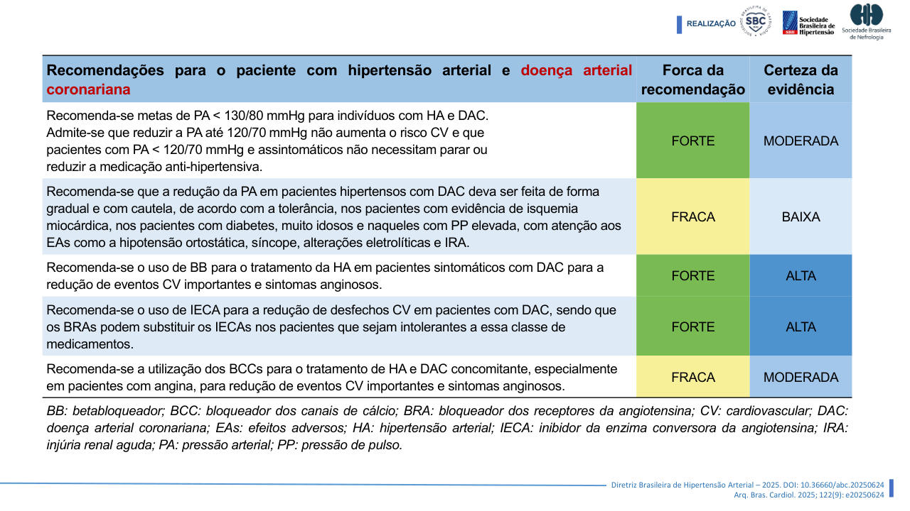

**Recomendações para o paciente com hipertensão arterial e doença arterial coronariana**

| Recomendação | Força | Certeza da evidência |
| :---- | :---- | :---- |
| Recomenda-se metas de PA < 130/80 mmHg para indivíduos com HA e DAC. Admite-se que reduzir a PA até 120/70 mmHg não aumenta o risco CV e que pacientes com PA < 120/70 mmHg e assintomáticos não necessitam parar ou reduzir a medicação anti-hipertensiva. | FORTE | MODERADA |
| Recomenda-se que a redução da PA em pacientes hipertensos com DAC deva ser feita de forma gradual e com cautela, de acordo com a tolerância, nos pacientes com evidência de isquemia miocárdica, nos pacientes com diabetes, muito idosos e naqueles com PP elevada, com atenção aos EAs como a hipotensão ortostática, síncope, alterações eletrolíticas e IRA. | FRACA | BAIXA |
| Recomenda-se o uso de BB para o tratamento da HA em pacientes sintomáticos com DAC para a redução de eventos CV importantes e sintomas anginosos. | FORTE | ALTA |
| Recomenda-se o uso de IECA para a redução de desfechos CV em pacientes com DAC, sendo que os BRAs podem substituir os IECAs nos pacientes que sejam intolerantes a essa classe de medicamentos. | FORTE | ALTA |
| Recomenda-se a utilização dos BCCs para o tratamento de HA e DAC concomitante, especialmente em pacientes com angina, para redução de eventos CV importantes e sintomas anginosos. | FRACA | MODERADA |

BB: betabloqueador; BCC: bloqueador dos canais de cálcio; BRA: bloqueador dos receptores da angiotensina; CV: cardiovascular; DAC: doença arterial coronariana; EAs: efeitos adversos; HA: hipertensão arterial; IECA: inibidor da enzima conversora da angiotensina; IRA: injúria renal aguda; PA: pressão arterial; PP: pressão de pulso.

#### Slide 69 — Mensagens principais sobre hipertensão arterial no paciente com doença arterial coronariana

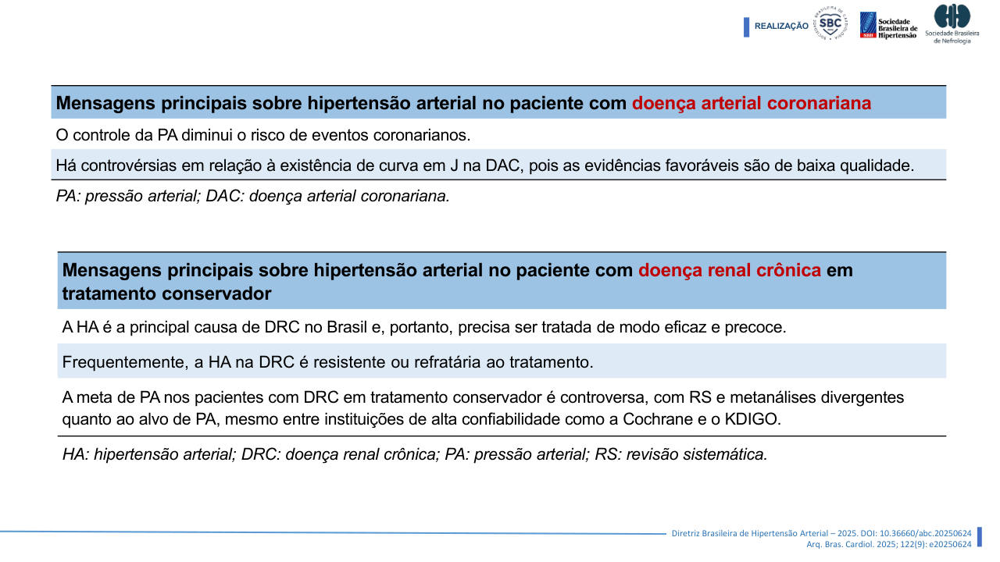

Mensagens principais sobre hipertensão arterial no paciente com doença arterial coronariana

O controle da PA diminui o risco de eventos coronarianos.

Há controvérsias em relação à existência de curva em J na DAC, pois as evidências favoráveis são de baixa qualidade.

PA: pressão arterial; DAC: doença arterial coronariana.

Mensagens principais sobre hipertensão arterial no paciente com doença renal crônica em tratamento conservador

A HA é a principal causa de DRC no Brasil e, portanto, precisa ser tratada de modo eficaz e precoce.

Frequentemente, a HA na DRC é resistente ou refratária ao tratamento.

A meta de PA nos pacientes com DRC em tratamento conservador é controversa, com RS e metanálises divergentes quanto ao alvo de PA, mesmo entre instituições de alta confiabilidade como a Cochrane e o KDIGO.

HA: hipertensão arterial; DRC: doença renal crônica; PA: pressão arterial; RS: revisão sistemática.

#### Slide 70 — Recomendações para o paciente com hipertensão arterial e doença renal crônica em tratamento conservador

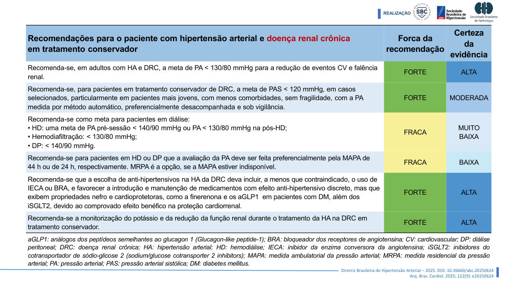

**Certeza**

| Recomendação | Força | Certeza da evidência |
| :---- | :---- | :---- |
| Recomenda-se, em adultos com HA e DRC, a meta de PA < 130/80 mmHg para a redução de eventos CV e falência renal. | FORTE | ALTA |
| Recomenda-se, para pacientes em tratamento conservador de DRC, a meta de PAS < 120 mmHg, em casos selecionados, particularmente em pacientes mais jovens, com menos comorbidades, sem fragilidade, com a PA medida por método automático, preferencialmente desacompanhada e sob vigilância. | FORTE | MODERADA |
| Recomenda-se como meta para pacientes em diálise: • HD: uma meta de PA pré-sessão < 140/90 mmHg ou PA < 130/80 mmHg na pós-HD; • Hemodiafiltração: < 130/80 mmHg; • DP: < 140/90 mmHg. | FRACA | MUITO BAIXA |
| Recomenda-se para pacientes em HD ou DP que a avaliação da PA deve ser feita preferencialmente pela MAPA de 44 h ou de 24 h, respectivamente. MRPA é a opção, se a MAPA estiver indisponível. | FRACA | BAIXA |
| Recomenda-se que a escolha de anti-hipertensivos na HA da DRC deva incluir, a menos que contraindicado, o uso de IECA ou BRA, e favorecer a introdução e manutenção de medicamentos com efeito anti-hipertensivo discreto, mas que exibem propriedades nefro e cardioprotetoras, como a finerenona e os aGLP1 em pacientes com DM, além dos iSGLT2, devido ao comprovado efeito benéfico na proteção cardiorrenal. | FORTE | ALTA |
| Recomenda-se a monitorização do potássio e da redução da função renal durante o tratamento da HA na DRC em tratamento conservador. | FORTE | ALTA |

aGLP1: análogos dos peptídeos semelhantes ao glucagon 1 (Glucagon-like peptide-1); BRA: bloqueador dos receptores de angiotensina; CV: cardiovascular; DP: diálise peritoneal; DRC: doença renal crônica; HA: hipertensão arterial; HD: hemodiálise; IECA: inibidor da enzima conversora da angiotensina; iSGLT2: inibidores do cotransportador de sódio-glicose 2 (sodium/glucose cotransporter 2 inhibitors); MAPA: medida ambulatorial da pressão arterial; MRPA: medida residencial da pressão arterial; PA: pressão arterial; PAS: pressão arterial sistólica; DM: diabetes mellitus.

#### Slide 71 — Mensagens principais sobre hipertensão arterial no paciente com diabetes mellitus

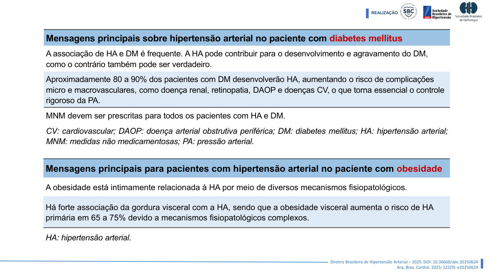

Mensagens principais sobre hipertensão arterial no paciente com diabetes mellitus

A associação de HA e DM é frequente. A HA pode contribuir para o desenvolvimento e agravamento do DM, como o contrário também pode ser verdadeiro.

Aproximadamente 80 a 90% dos pacientes com DM desenvolverão HA, aumentando o risco de complicações micro e macrovasculares, como doença renal, retinopatia, DAOP e doenças CV, o que torna essencial o controle rigoroso da PA.

MNM devem ser prescritas para todos os pacientes com HA e DM.

CV: cardiovascular; DAOP: doença arterial obstrutiva periférica; DM: diabetes mellitus; HA: hipertensão arterial; MNM: medidas não medicamentosas; PA: pressão arterial.

Mensagens principais para pacientes com hipertensão arterial no paciente com obesidade

A obesidade está intimamente relacionada à HA por meio de diversos mecanismos fisiopatológicos.

Há forte associação da gordura visceral com a HA, sendo que a obesidade visceral aumenta o risco de HA primária em 65 a 75% devido a mecanismos fisiopatológicos complexos.

HA: hipertensão arterial.

#### Slide 72 — Recomendações para pacientes com hipertensão arterial e diabetes mellitus

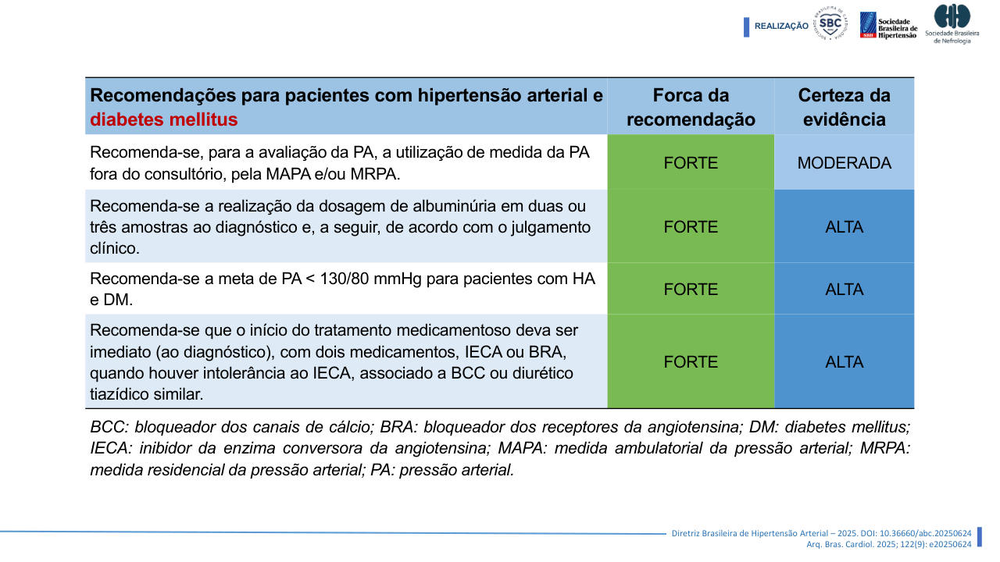

**Recomendações para pacientes com hipertensão arterial e diabetes mellitus**

| Recomendação | Força | Certeza da evidência |
| :---- | :---- | :---- |
| Recomenda-se, para a avaliação da PA, a utilização de medida da PA fora do consultório, pela MAPA e/ou MRPA. | FORTE | MODERADA |
| Recomenda-se a realização da dosagem de albuminúria em duas ou três amostras ao diagnóstico e, a seguir, de acordo com o julgamento clínico. | FORTE | ALTA |
| Recomenda-se a meta de PA < 130/80 mmHg para pacientes com HA e DM. | FORTE | ALTA |
| Recomenda-se que o início do tratamento medicamentoso deva ser imediato (ao diagnóstico), com dois medicamentos, IECA ou BRA, quando houver intolerância ao IECA, associado a BCC ou diurético tiazídico similar. | FORTE | ALTA |

BCC: bloqueador dos canais de cálcio; BRA: bloqueador dos receptores da angiotensina; DM: diabetes mellitus; IECA: inibidor da enzima conversora da angiotensina; MAPA: medida ambulatorial da pressão arterial; MRPA: medida residencial da pressão arterial; PA: pressão arterial.

#### Slide 73 — Recomendações para pacientes com hipertensão arterial e obesidade

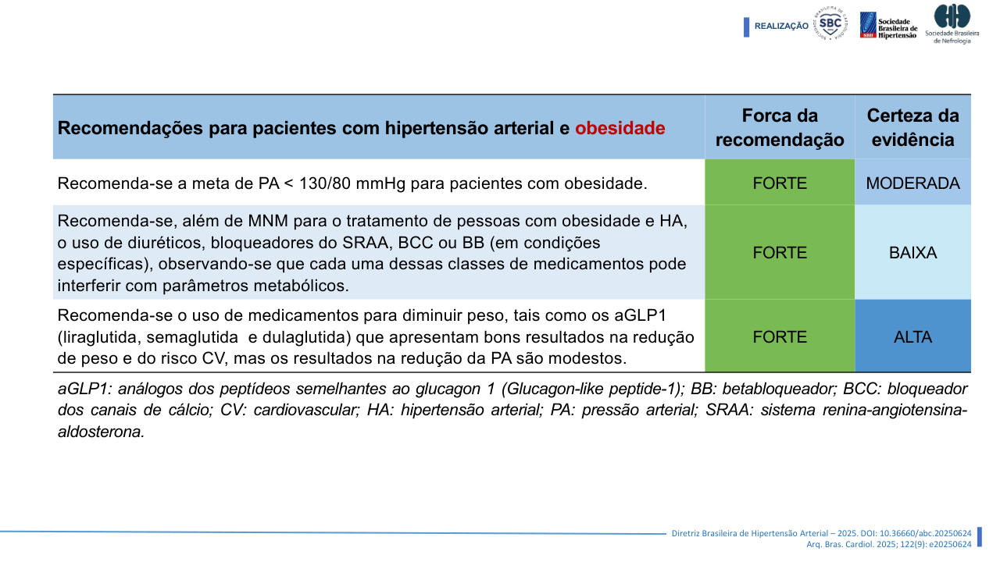

**Recomendações para pacientes com hipertensão arterial e obesidade**

| Recomendação | Força | Certeza da evidência |
| :---- | :---- | :---- |
| Recomenda-se a meta de PA < 130/80 mmHg para pacientes com obesidade. | FORTE | MODERADA |
| Recomenda-se, além de MNM para o tratamento de pessoas com obesidade e HA, o uso de diuréticos, bloqueadores do SRAA, BCC ou BB (em condições específicas), observando-se que cada uma dessas classes de medicamentos pode interferir com parâmetros metabólicos. | FORTE | BAIXA |
| Recomenda-se o uso de medicamentos para diminuir peso, tais como os aGLP1 (liraglutida, semaglutida e dulaglutida) que apresentam bons resultados na redução de peso e do risco CV, mas os resultados na redução da PA são modestos. | FORTE | ALTA |

aGLP1: análogos dos peptídeos semelhantes ao glucagon 1 (Glucagon-like peptide-1); BB: betabloqueador; BCC: bloqueador dos canais de cálcio; CV: cardiovascular; HA: hipertensão arterial; PA: pressão arterial; SRAA: sistema renina-angiotensina- aldosterona.

#### Slide 74 — Quadro 8.1 – Anti-hipertensivos mais utilizados para o tratamento da hipertensão arterial em pacientes

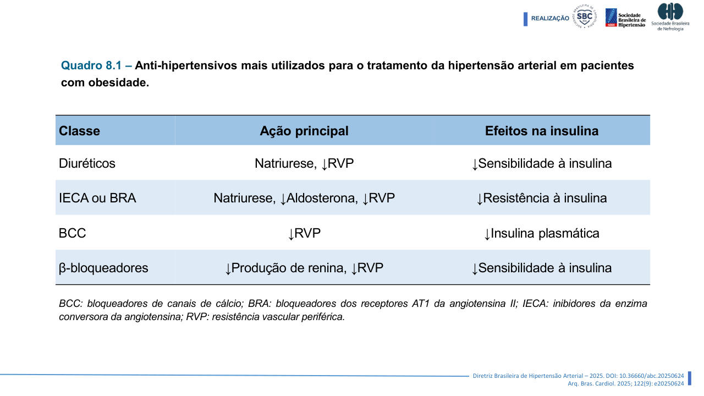

Quadro 8.1 – Anti-hipertensivos mais utilizados para o tratamento da hipertensão arterial em pacientes com obesidade.

Classe Ação principal Efeitos na insulina

Diuréticos Natriurese, ↓RVP ↓Sensibilidade à insulina

IECA ou BRA Natriurese, ↓Aldosterona, ↓RVP ↓Resistência à insulina

BCC ↓RVP ↓Insulina plasmática

β-bloqueadores ↓Produção de renina, ↓RVP ↓Sensibilidade à insulina

BCC: bloqueadores de canais de cálcio; BRA: bloqueadores dos receptores AT1 da angiotensina II; IECA: inibidores da enzima conversora da angiotensina; RVP: resistência vascular periférica.

#### Slide 75 — Mensagens principais sobre pacientes com hipertensão arterial em pacientes com COVID-19

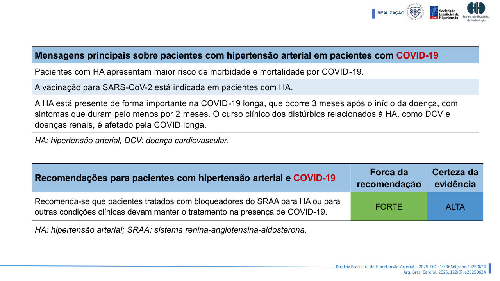

**Mensagens principais sobre pacientes com hipertensão arterial em pacientes com COVID-19**

| Recomendação | Força | Certeza da evidência |
| :---- | :---- | :---- |
| Recomenda-se que pacientes tratados com bloqueadores do SRAA para HA ou para outras condições clínicas devam manter o tratamento na presença de COVID-19. | FORTE | ALTA |

HA: hipertensão arterial; SRAA: sistema renina-angiotensina-aldosterona.

#### Slide 76 — Mensagens principais para pacientes com hipertensão arterial e acidente vascular cerebral e déficit cognitivo

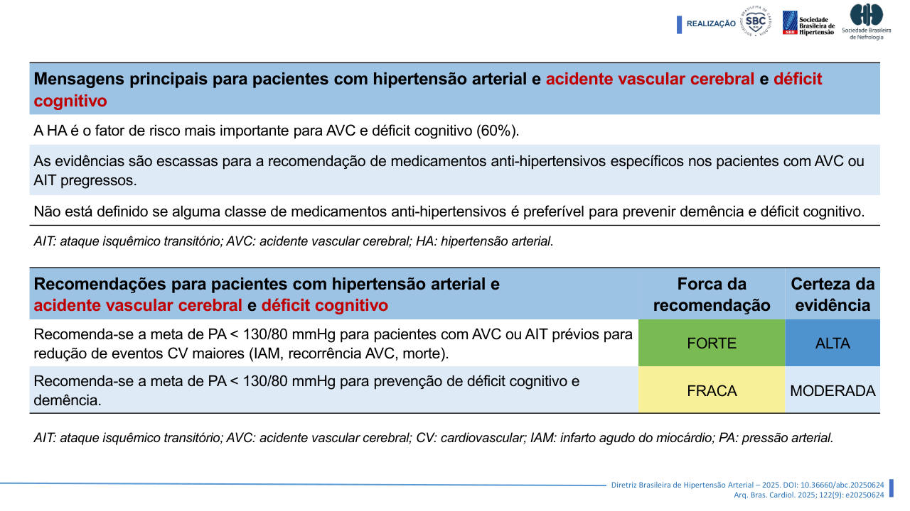

**Mensagens principais para pacientes com hipertensão arterial e acidente vascular cerebral e déficit cognitivo**

| Recomendação | Força | Certeza da evidência |
| :---- | :---- | :---- |
| Recomenda-se a meta de PA < 130/80 mmHg para pacientes com AVC ou AIT prévios para redução de eventos CV maiores (IAM, recorrência AVC, morte). | FORTE | ALTA |
| Recomenda-se a meta de PA < 130/80 mmHg para prevenção de déficit cognitivo e demência. | FRACA | MODERADA |

AIT: ataque isquêmico transitório; AVC: acidente vascular cerebral; CV: cardiovascular; IAM: infarto agudo do miocárdio; PA: pressão arterial.

#### Slide 77 — Mensagens principais sobre hipertensão arterial em pacientes com insuficiência cardíaca

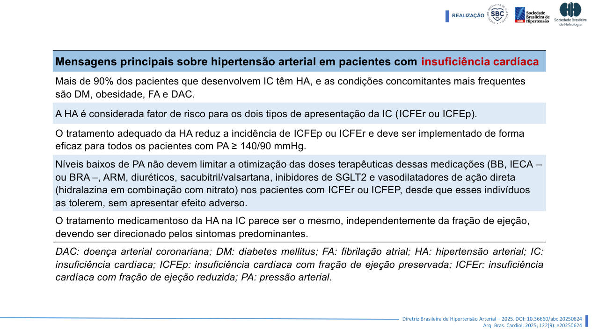

Mensagens principais sobre hipertensão arterial em pacientes com insuficiência cardíaca

Mais de 90% dos pacientes que desenvolvem IC têm HA, e as condições concomitantes mais frequentes são DM, obesidade, FA e DAC.

A HA é considerada fator de risco para os dois tipos de apresentação da IC (ICFEr ou ICFEp).

O tratamento adequado da HA reduz a incidência de ICFEp ou ICFEr e deve ser implementado de forma eficaz para todos os pacientes com PA ≥140/90 mmHg.

Níveis baixos de PA não devem limitar a otimização das doses terapêuticas dessas medicações (BB, IECA – ou BRA –, ARM, diuréticos, sacubitril/valsartana, inibidores de SGLT2 e vasodilatadores de ação direta (hidralazina em combinação com nitrato) nos pacientes com ICFEr ou ICFEP, desde que esses indivíduos as tolerem, sem apresentar efeito adverso.

O tratamento medicamentoso da HA na IC parece ser o mesmo, independentemente da fração de ejeção, devendo ser direcionado pelos sintomas predominantes.

DAC: doença arterial coronariana; DM: diabetes mellitus; FA: fibrilação atrial; HA: hipertensão arterial; IC: insuficiência cardíaca; ICFEp: insuficiência cardíaca com fração de ejeção preservada; ICFEr: insuficiência cardíaca com fração de ejeção reduzida; PA: pressão arterial.

#### Slide 78 — Recomendações para o paciente com hipertensão arterial e insuficiência cardíaca

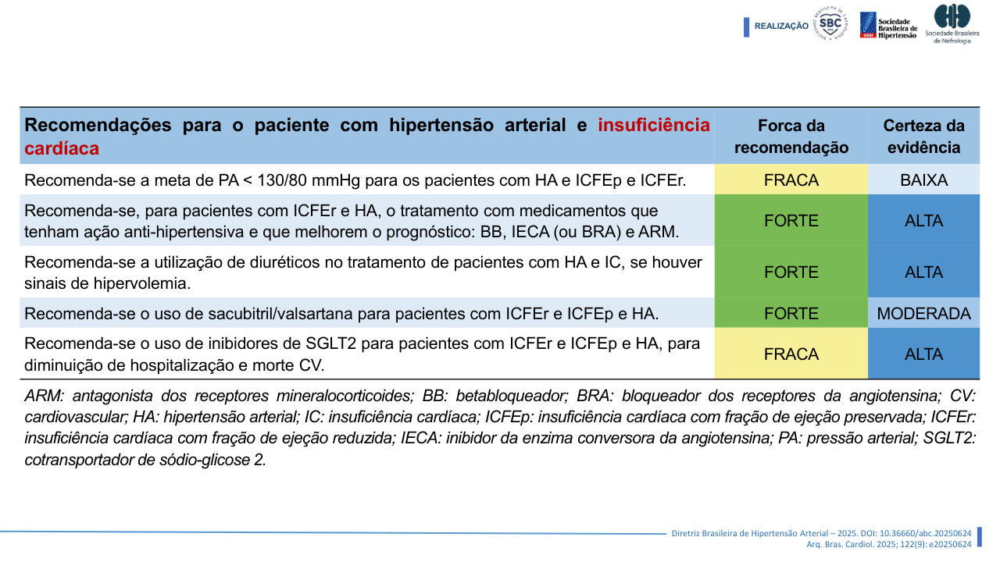

**Recomendações para o paciente com hipertensão arterial e insuficiência cardíaca**

| Recomendação | Força | Certeza da evidência |
| :---- | :---- | :---- |
| Recomenda-se a meta de PA < 130/80 mmHg para os pacientes com HA e ICFEp e ICFEr. | FRACA | BAIXA |
| Recomenda-se, para pacientes com ICFEr e HA, o tratamento com medicamentos que tenham ação anti-hipertensiva e que melhorem o prognóstico: BB, IECA (ou BRA) e ARM. | FORTE | ALTA |
| Recomenda-se a utilização de diuréticos no tratamento de pacientes com HA e IC, se houver sinais de hipervolemia. | FORTE | ALTA |
| Recomenda-se o uso de sacubitril/valsartana para pacientes com ICFEr e ICFEp e HA. | FORTE | MODERADA |
| Recomenda-se o uso de inibidores de SGLT2 para pacientes com ICFEr e ICFEp e HA, para diminuição de hospitalização e morte CV. | FRACA | ALTA |

ARM: antagonista dos receptores mineralocorticoides; BB: betabloqueador; BRA: bloqueador dos receptores da angiotensina; CV: cardiovascular; HA: hipertensão arterial; IC: insuficiência cardíaca; ICFEp: insuficiência cardíaca com fração de ejeção preservada; ICFEr: insuficiência cardíaca com fração de ejeção reduzida; IECA: inibidor da enzima conversora da angiotensina; PA: pressão arterial; SGLT2: cotransportador de sódio-glicose 2.

#### Slide 79 — Figura 8.1 – Meta de pressão arterial única para a hipertensão arterial em situações especiais de alto risco cardiovascular e renal.

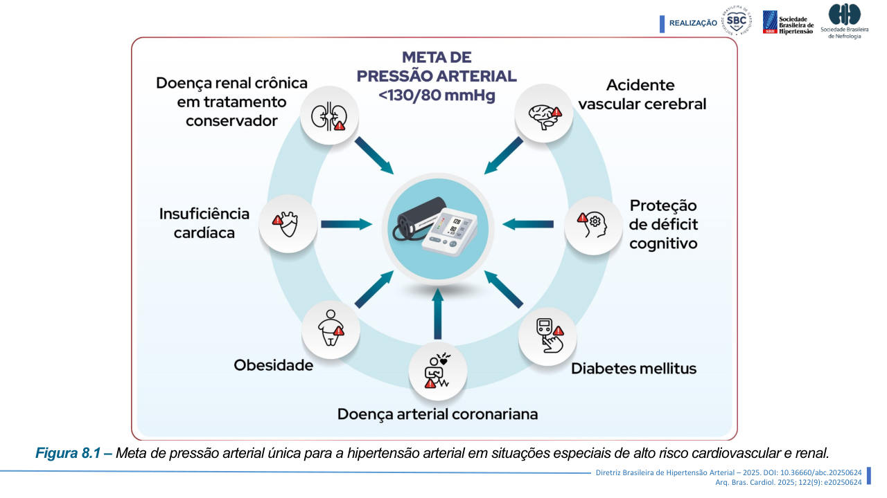

Figura 8.1 – Meta de pressão arterial única para a hipertensão arterial em situações especiais de alto risco cardiovascular e renal.

### Capítulo 9. Hipertensão arterial em idosos, crianças e adolescentes

#### Slide 80 — Capítulo 9.  Hipertensão Arterial em Idosos,  Crianças e Adolescentes

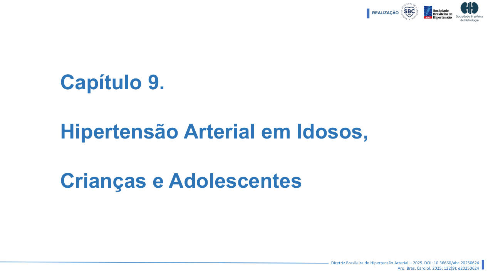

Capítulo 9.

Hipertensão Arterial em Idosos,

Crianças e Adolescentes

#### Slide 81 — Figura 9.1 – Escala clínica de fragilidade.

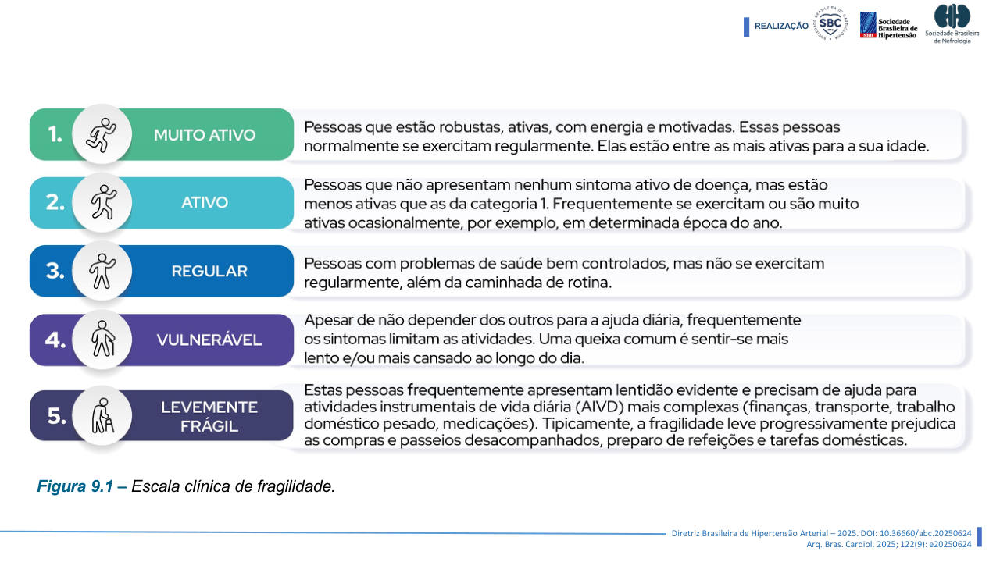

Figura 9.1 – Escala clínica de fragilidade.

#### Slide 82 — Figura 9.1 – Escala clínica de fragilidade.

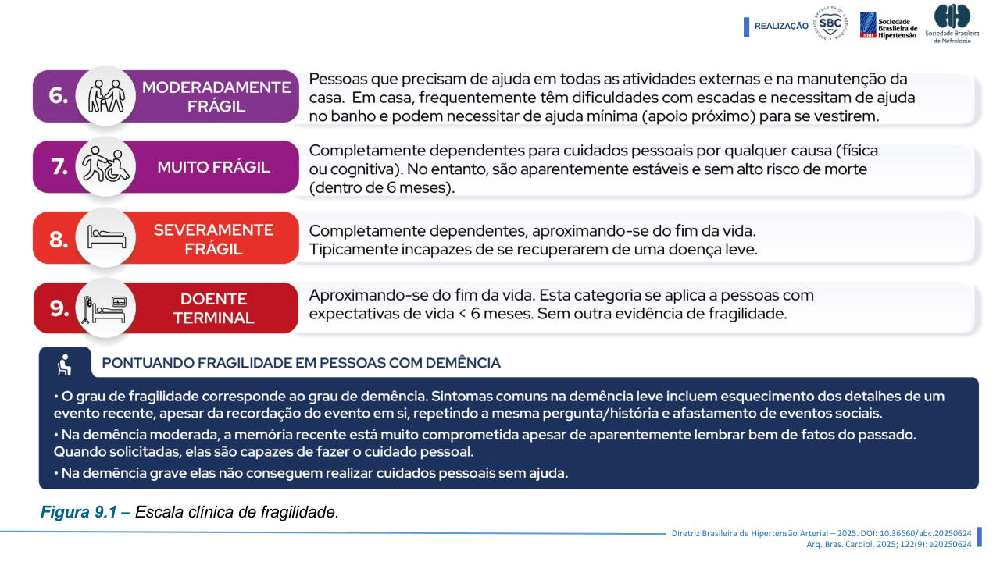

Figura 9.1 – Escala clínica de fragilidade.

#### Slide 83 — Mensagens principais sobre hipertensão arterial no paciente idoso

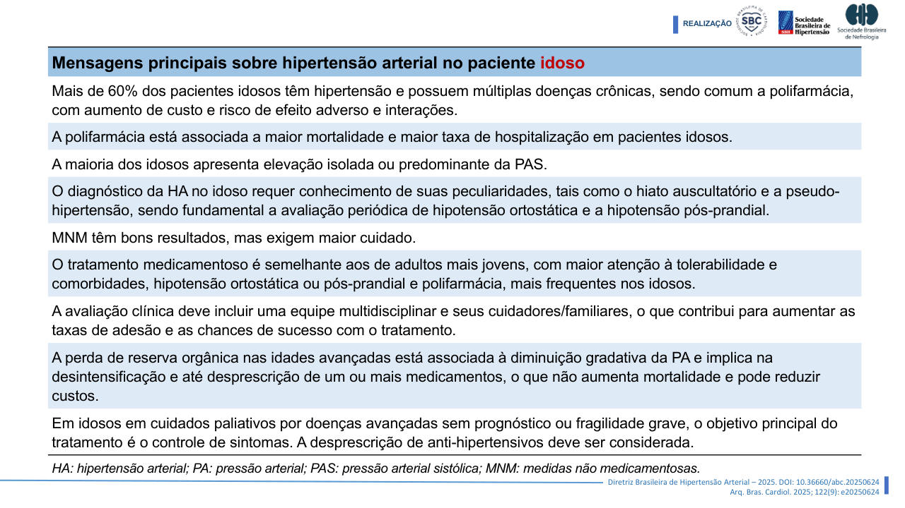

Mensagens principais sobre hipertensão arterial no paciente idoso

Mais de 60% dos pacientes idosos têm hipertensão e possuem múltiplas doenças crônicas, sendo comum a polifarmácia, com aumento de custo e risco de efeito adverso e interações.

A polifarmácia está associada a maior mortalidade e maior taxa de hospitalização em pacientes idosos.

A maioria dos idosos apresenta elevação isolada ou predominante da PAS.

O diagnóstico da HA no idoso requer conhecimento de suas peculiaridades, tais como o hiato auscultatório e a pseudo- hipertensão, sendo fundamental a avaliação periódica de hipotensão ortostática e a hipotensão pós-prandial.

MNM têm bons resultados, mas exigem maior cuidado.

O tratamento medicamentoso é semelhante aos de adultos mais jovens, com maior atenção à tolerabilidade e comorbidades, hipotensão ortostática ou pós-prandial e polifarmácia, mais frequentes nos idosos.

A avaliação clínica deve incluir uma equipe multidisciplinar e seus cuidadores/familiares, o que contribui para aumentar as taxas de adesão e as chances de sucesso com o tratamento.

A perda de reserva orgânica nas idades avançadas está associada à diminuição gradativa da PA e implica na desintensificação e até desprescrição de um ou mais medicamentos, o que não aumenta mortalidade e pode reduzir custos.

Em idosos em cuidados paliativos por doenças avançadas sem prognóstico ou fragilidade grave, o objetivo principal do tratamento é o controle de sintomas. A desprescrição de anti-hipertensivos deve ser considerada.

HA: hipertensão arterial; PA: pressão arterial; PAS: pressão arterial sistólica; MNM: medidas não medicamentosas.

#### Slide 84 — Recomendações para abordagem da HA em pacientes idosos

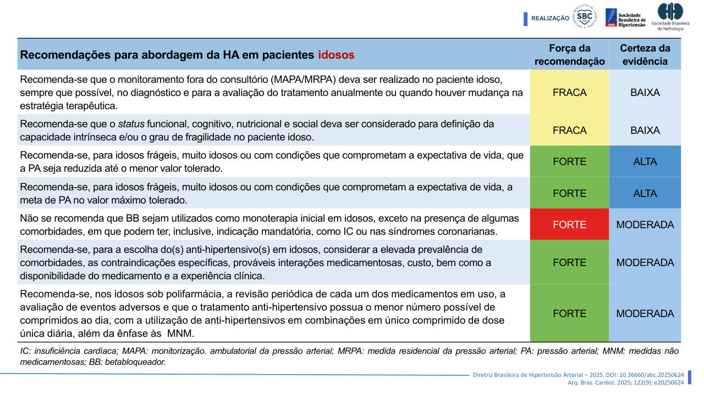

**Recomendações para abordagem da HA em pacientes idosos**

| Recomendação | Força | Certeza da evidência |
| :---- | :---- | :---- |
| Recomenda-se que o monitoramento fora do consultório (MAPA/MRPA) deva ser realizado no paciente idoso, sempre que possível, no diagnóstico e para a avaliação do tratamento anualmente ou quando houver mudança na estratégia terapêutica. | FRACA | BAIXA |
| Recomenda-se que o status funcional, cognitivo, nutricional e social deva ser considerado para definição da capacidade intrínseca e/ou o grau de fragilidade no paciente idoso. | FRACA | BAIXA |
| Recomenda-se, para idosos frágeis, muito idosos ou com condições que comprometam a expectativa de vida, que a PA seja reduzida até o menor valor tolerado. | FORTE | ALTA |
| Recomenda-se, para idosos frágeis, muito idosos ou com condições que comprometam a expectativa de vida, a meta de PA no valor máximo tolerado. | FORTE | ALTA |
| Não se recomenda que BB sejam utilizados como monoterapia inicial em idosos, exceto na presença de algumas comorbidades, em que podem ter, inclusive, indicação mandatória, como IC ou nas síndromes coronarianas. | FORTE | MODERADA |
| Recomenda-se, para a escolha do(s) anti-hipertensivo(s) em idosos, considerar a elevada prevalência de comorbidades, as contraindicações específicas, prováveis interações medicamentosas, custo, bem como a disponibilidade do medicamento e a experiência clínica. | FORTE | MODERADA |
| Recomenda-se, nos idosos sob polifarmácia, a revisão periódica de cada um dos medicamentos em uso, a avaliação de eventos adversos e que o tratamento anti-hipertensivo possua o menor número possível de comprimidos ao dia, com a utilização de anti-hipertensivos em combinações em único comprimido de dose única diária, além da ênfase às MNM. | FORTE | MODERADA |

IC: insuficiência cardíaca; MAPA: monitorização. ambulatorial da pressão arterial; MRPA: medida residencial da pressão arterial; PA: pressão arterial; MNM: medidas não medicamentosas; BB: betabloqueador.

#### Slide 85 — Tabela 9.1 – Definição atualizada da pressão arterial de acordo com a faixa etária. Crianças de 1 a 12 anos de idade Crianças com idade ≥13 anos

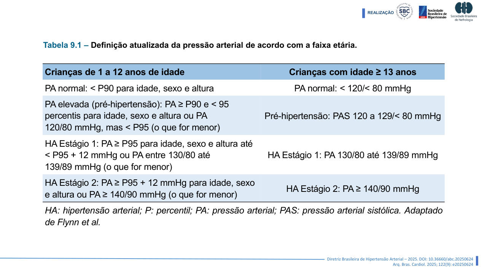

Tabela 9.1 – Definição atualizada da pressão arterial de acordo com a faixa etária.

Crianças de 1 a 12 anos de idade Crianças com idade ≥13 anos

PA normal: < P90 para idade, sexo e altura PA normal: < 120/< 80 mmHg

PA elevada (pré-hipertensão): PA ≥P90 e < 95 percentis para idade, sexo e altura ou PA 120/80 mmHg, mas < P95 (o que for menor) Pré-hipertensão: PAS 120 a 129/< 80 mmHg

HA Estágio 1: PA ≥P95 para idade, sexo e altura até < P95 + 12 mmHg ou PA entre 130/80 até 139/89 mmHg (o que for menor) HA Estágio 1: PA 130/80 até 139/89 mmHg

HA Estágio 2: PA ≥P95 + 12 mmHg para idade, sexo e altura ou PA ≥140/90 mmHg (o que for menor) HA Estágio 2: PA ≥140/90 mmHg

HA: hipertensão arterial; P: percentil; PA: pressão arterial; PAS: pressão arterial sistólica. Adaptado de Flynn et al.

#### Slide 86 — Tabelas 9.2 – Valores de pressão arterial para meninos, de acordo com a idade e o percentil de estatura (1/6).

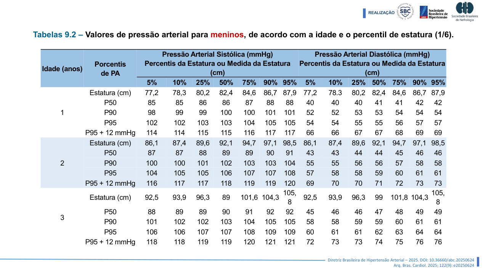

*Tabela percentílica pediátrica (valores de PA por idade, sexo e estatura). Os números estão na imagem acima — a extração automática de colunas deste tipo de tabela não é confiável.*

Tabelas 9.2 – Valores de pressão arterial para meninos, de acordo com a idade e o percentil de estatura (1/6).

#### Slide 87 — Tabelas 9.2 – Valores de pressão arterial para meninos, de acordo com a idade e o percentil de estatura (2/6).

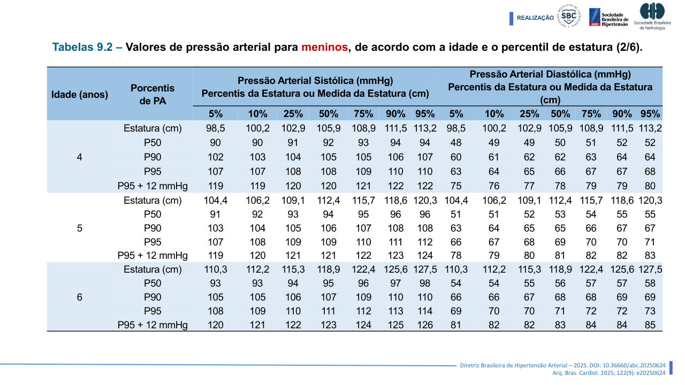

*Tabela percentílica pediátrica (valores de PA por idade, sexo e estatura). Os números estão na imagem acima — a extração automática de colunas deste tipo de tabela não é confiável.*

Tabelas 9.2 – Valores de pressão arterial para meninos, de acordo com a idade e o percentil de estatura (2/6).

#### Slide 88 — Tabelas 9.2 – Valores de pressão arterial para meninos, de acordo com a idade e o percentil de estatura (3/6).

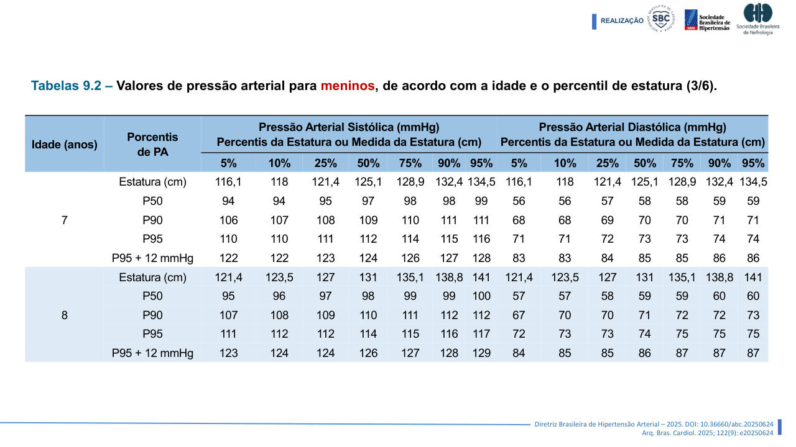

*Tabela percentílica pediátrica (valores de PA por idade, sexo e estatura). Os números estão na imagem acima — a extração automática de colunas deste tipo de tabela não é confiável.*

Tabelas 9.2 – Valores de pressão arterial para meninos, de acordo com a idade e o percentil de estatura (3/6).

#### Slide 89 — Tabelas 9.2 – Valores de pressão arterial para meninos, de acordo com a idade e o percentil de estatura (4/6).

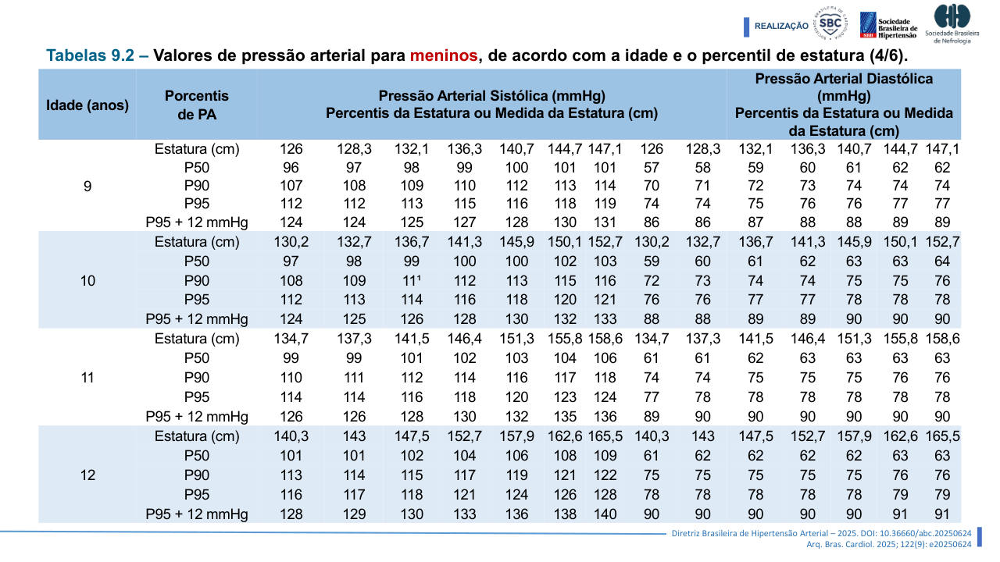

*Tabela percentílica pediátrica (valores de PA por idade, sexo e estatura). Os números estão na imagem acima — a extração automática de colunas deste tipo de tabela não é confiável.*

Tabelas 9.2 – Valores de pressão arterial para meninos, de acordo com a idade e o percentil de estatura (4/6).

#### Slide 90 — Tabelas 9.2 – Valores de pressão arterial para meninos, de acordo com a idade e o percentil de estatura (5/6).

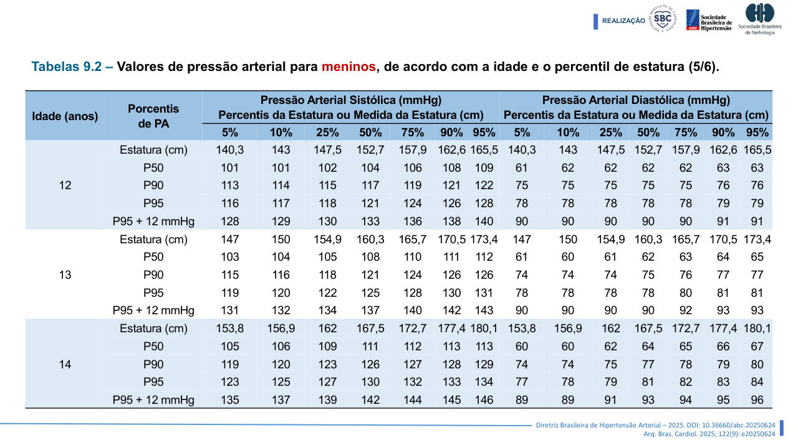

*Tabela percentílica pediátrica (valores de PA por idade, sexo e estatura). Os números estão na imagem acima — a extração automática de colunas deste tipo de tabela não é confiável.*

Tabelas 9.2 – Valores de pressão arterial para meninos, de acordo com a idade e o percentil de estatura (5/6).

#### Slide 91 — Tabelas 9.2 – Valores de pressão arterial para meninos, de acordo com a idade e o percentil de estatura (6/6).

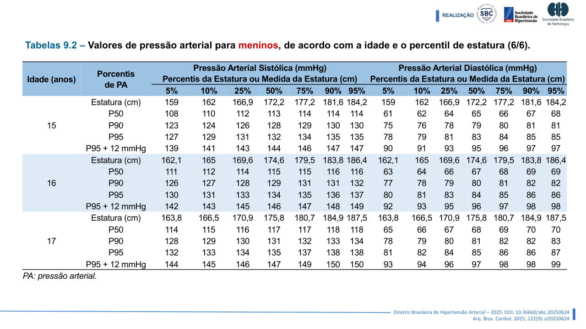

*Tabela percentílica pediátrica (valores de PA por idade, sexo e estatura). Os números estão na imagem acima — a extração automática de colunas deste tipo de tabela não é confiável.*

Tabelas 9.2 – Valores de pressão arterial para meninos, de acordo com a idade e o percentil de estatura (6/6).

#### Slide 92 — Tabelas 9.3 – Valores de pressão arterial para meninas, de acordo com a idade e o percentil de estatura (1/5).

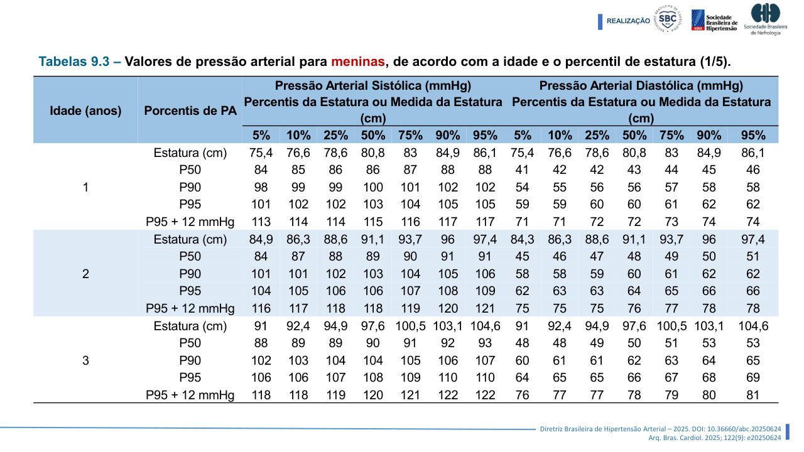

*Tabela percentílica pediátrica (valores de PA por idade, sexo e estatura). Os números estão na imagem acima — a extração automática de colunas deste tipo de tabela não é confiável.*

Tabelas 9.3 – Valores de pressão arterial para meninas, de acordo com a idade e o percentil de estatura (1/5).

#### Slide 93 — Tabelas 9.3 – Valores de pressão arterial para meninas, de acordo com a idade e o percentil de estatura (2/5).

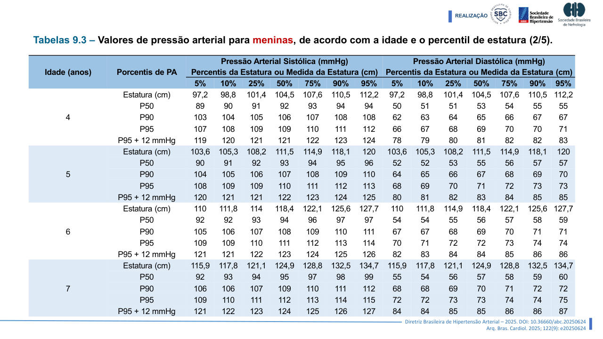

*Tabela percentílica pediátrica (valores de PA por idade, sexo e estatura). Os números estão na imagem acima — a extração automática de colunas deste tipo de tabela não é confiável.*

Tabelas 9.3 – Valores de pressão arterial para meninas, de acordo com a idade e o percentil de estatura (2/5).

#### Slide 94 — Tabelas 9.3 – Valores de pressão arterial para meninas, de acordo com a idade e o percentil de estatura (3/5).

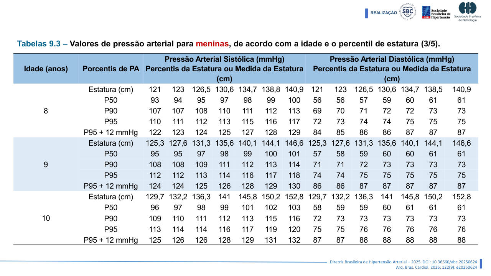

*Tabela percentílica pediátrica (valores de PA por idade, sexo e estatura). Os números estão na imagem acima — a extração automática de colunas deste tipo de tabela não é confiável.*

Tabelas 9.3 – Valores de pressão arterial para meninas, de acordo com a idade e o percentil de estatura (3/5).

#### Slide 95 — Tabelas 9.3 – Valores de pressão arterial para meninas, de acordo com a idade e o percentil de estatura (4/5).

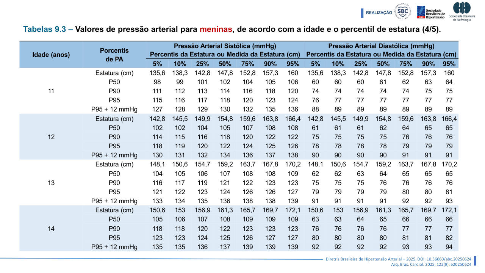

*Tabela percentílica pediátrica (valores de PA por idade, sexo e estatura). Os números estão na imagem acima — a extração automática de colunas deste tipo de tabela não é confiável.*

Tabelas 9.3 – Valores de pressão arterial para meninas, de acordo com a idade e o percentil de estatura (4/5).

#### Slide 96 — Tabelas 9.3 – Valores de pressão arterial para meninas, de acordo com a idade e o percentil de estatura (5/5).

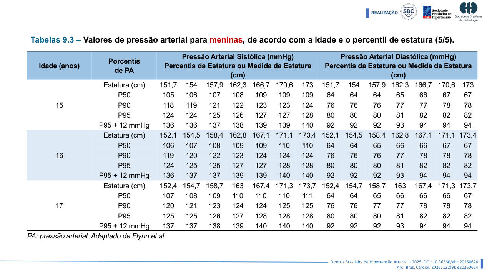

*Tabela percentílica pediátrica (valores de PA por idade, sexo e estatura). Os números estão na imagem acima — a extração automática de colunas deste tipo de tabela não é confiável.*

Tabelas 9.3 – Valores de pressão arterial para meninas, de acordo com a idade e o percentil de estatura (5/5).

#### Slide 97 — Tabelas 9.4 – Valores de pressão arterial no consultório e na medida ambulatorial da pressão arterial

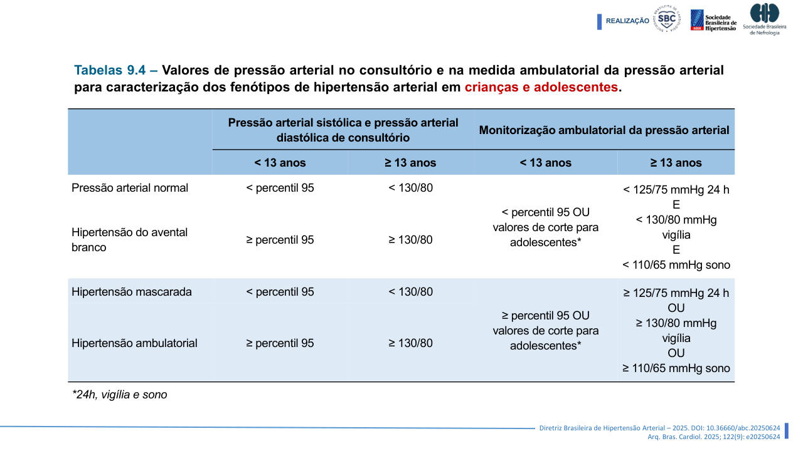

*Tabela percentílica pediátrica (valores de PA por idade, sexo e estatura). Os números estão na imagem acima — a extração automática de colunas deste tipo de tabela não é confiável.*

Tabelas 9.4 – Valores de pressão arterial no consultório e na medida ambulatorial da pressão arterial

#### Slide 98 — Tabelas 9.5 – Valores estimados de pressão arterial sistólica, diastólica e média (em mmHg) após 2 semanas de

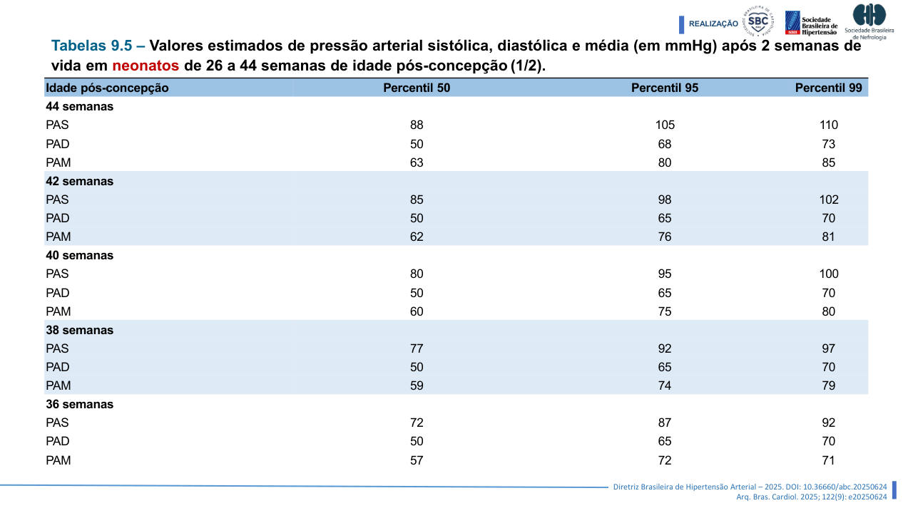

Tabelas 9.5 – Valores estimados de pressão arterial sistólica, diastólica e média (em mmHg) após 2 semanas de vida em neonatos de 26 a 44 semanas de idade pós-concepção (1/2).

Idade pós-concepção Percentil 50 Percentil 95 Percentil 99

44 semanas

PAS 88 105 110

PAD 50 68 73

PAM 63 80 85

42 semanas

PAS 85 98 102

PAD 50 65 70

PAM 62 76 81

40 semanas

PAS 80 95 100

PAD 50 65 70

PAM 60 75 80

38 semanas

PAS 77 92 97

PAD 50 65 70

PAM 59 74 79

36 semanas

PAS 72 87 92

PAD 50 65 70

PAM 57 72 71

#### Slide 99 — Tabelas 9.5 – Valores estimados de pressão arterial sistólica, diastólica e média (em mmHg) após

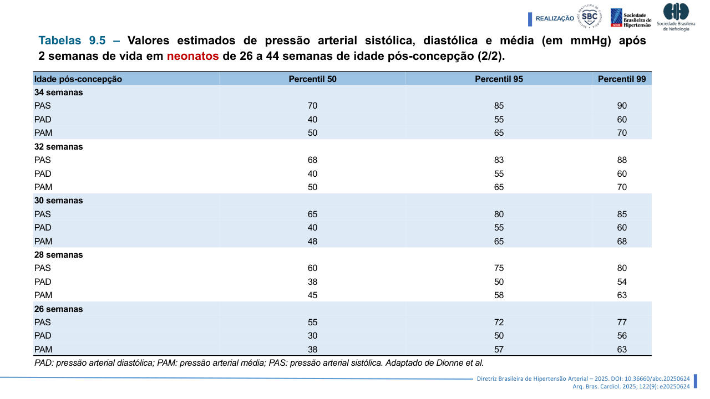

Tabelas 9.5 – Valores estimados de pressão arterial sistólica, diastólica e média (em mmHg) após 2 semanas de vida em neonatos de 26 a 44 semanas de idade pós-concepção (2/2).

Idade pós-concepção Percentil 50 Percentil 95 Percentil 99

34 semanas

PAS 70 85 90

PAD 40 55 60

PAM 50 65 70

32 semanas

PAS 68 83 88

PAD 40 55 60

PAM 50 65 70

30 semanas

PAS 65 80 85

PAD 40 55 60

PAM 48 65 68

28 semanas

PAS 60 75 80

PAD 38 50 54

PAM 45 58 63

26 semanas

PAS 55 72 77

PAD 30 50 56

PAM 38 57 63

PAD: pressão arterial diastólica; PAM: pressão arterial média; PAS: pressão arterial sistólica. Adaptado de Dionne et al.

#### Slide 100 — Mensagens principais sobre hipertensão arterial em crianças e adolescentes

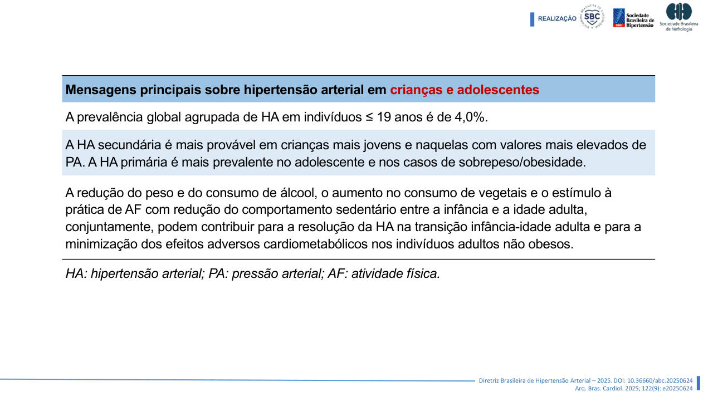

Mensagens principais sobre hipertensão arterial em crianças e adolescentes

A prevalência global agrupada de HA em indivíduos ≤19 anos é de 4,0%.

A HA secundária é mais provável em crianças mais jovens e naquelas com valores mais elevados de PA. A HA primária é mais prevalente no adolescente e nos casos de sobrepeso/obesidade.

A redução do peso e do consumo de álcool, o aumento no consumo de vegetais e o estímulo à prática de AF com redução do comportamento sedentário entre a infância e a idade adulta, conjuntamente, podem contribuir para a resolução da HA na transição infância-idade adulta e para a minimização dos efeitos adversos cardiometabólicos nos indivíduos adultos não obesos.

HA: hipertensão arterial; PA: pressão arterial; AF: atividade física.

#### Slide 101 — Recomendações para abordagem da HA em crianças e adolescentes (1/2)

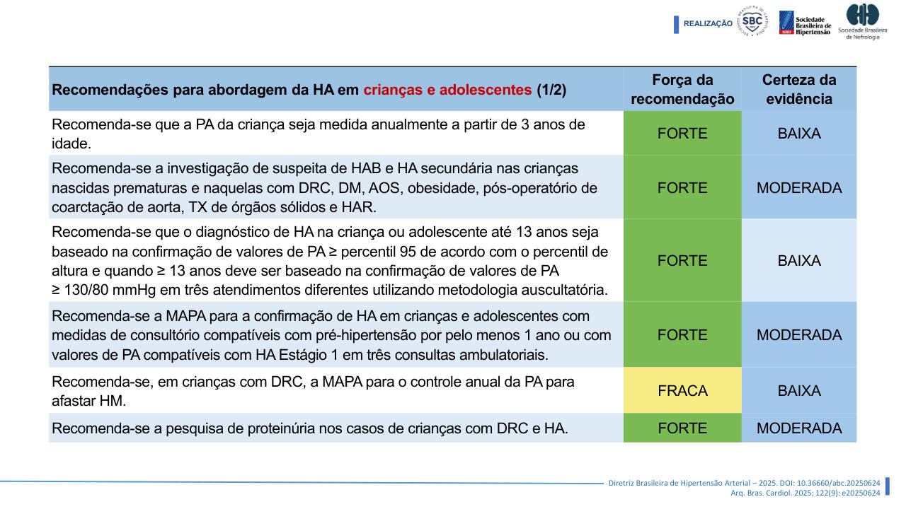

**Recomendações para abordagem da HA em crianças e adolescentes (1/2)**

| Recomendação | Força | Certeza da evidência |
| :---- | :---- | :---- |
| Recomenda-se que a PA da criança seja medida anualmente a partir de 3 anos de idade. | FORTE | BAIXA |
| Recomenda-se a investigação de suspeita de HAB e HA secundária nas crianças nascidas prematuras e naquelas com DRC, DM, AOS, obesidade, pós-operatório de coarctação de aorta, TX de órgãos sólidos e HAR. | FORTE | MODERADA |
| Recomenda-se que o diagnóstico de HA na criança ou adolescente até 13 anos seja baseado na confirmação de valores de PA ≥percentil 95 de acordo com o percentil de altura e quando ≥13 anos deve ser baseado na confirmação de valores de PA ≥130/80 mmHg em três atendimentos diferentes utilizando metodologia auscultatória. | FORTE | BAIXA |
| Recomenda-se a MAPA para a confirmação de HA em crianças e adolescentes com medidas de consultório compatíveis com pré-hipertensão por pelo menos 1 ano ou com valores de PA compatíveis com HA Estágio 1 em três consultas ambulatoriais. | FORTE | MODERADA |
| Recomenda-se, em crianças com DRC, a MAPA para o controle anual da PA para afastar HM. | FRACA | BAIXA |
| Recomenda-se a pesquisa de proteinúria nos casos de crianças com DRC e HA. | FORTE | MODERADA |

#### Slide 102 — Recomendações para abordagem da HA em crianças e adolescentes (2/2)

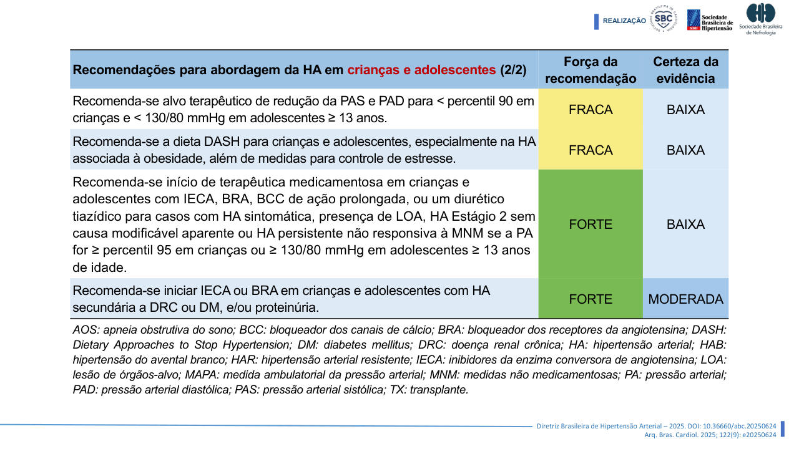

**Recomendações para abordagem da HA em crianças e adolescentes (2/2)**

| Recomendação | Força | Certeza da evidência |
| :---- | :---- | :---- |
| Recomenda-se alvo terapêutico de redução da PAS e PAD para < percentil 90 em crianças e < 130/80 mmHg em adolescentes ≥13 anos. | FRACA | BAIXA |
| Recomenda-se a dieta DASH para crianças e adolescentes, especialmente na HA associada à obesidade, além de medidas para controle de estresse. | FRACA | BAIXA |
| Recomenda-se início de terapêutica medicamentosa em crianças e adolescentes com IECA, BRA, BCC de ação prolongada, ou um diurético tiazídico para casos com HA sintomática, presença de LOA, HA Estágio 2 sem causa modificável aparente ou HA persistente não responsiva à MNM se a PA for ≥percentil 95 em crianças ou ≥130/80 mmHg em adolescentes ≥13 anos de idade. | FORTE | BAIXA |
| Recomenda-se iniciar IECA ou BRA em crianças e adolescentes com HA secundária a DRC ou DM, e/ou proteinúria. | FORTE | MODERADA |

AOS: apneia obstrutiva do sono; BCC: bloqueador dos canais de cálcio; BRA: bloqueador dos receptores da angiotensina; DASH: Dietary Approaches to Stop Hypertension; DM: diabetes mellitus; DRC: doença renal crônica; HA: hipertensão arterial; HAB: hipertensão do avental branco; HAR: hipertensão arterial resistente; IECA: inibidores da enzima conversora de angiotensina; LOA: lesão de órgãos-alvo; MAPA: medida ambulatorial da pressão arterial; MNM: medidas não medicamentosas; PA: pressão arterial; PAD: pressão arterial diastólica; PAS: pressão arterial sistólica; TX: transplante.

### Capítulo 10. Hipertensão arterial em mulheres

#### Slide 103 — Capítulo 10. Hipertensão Arterial em Mulheres

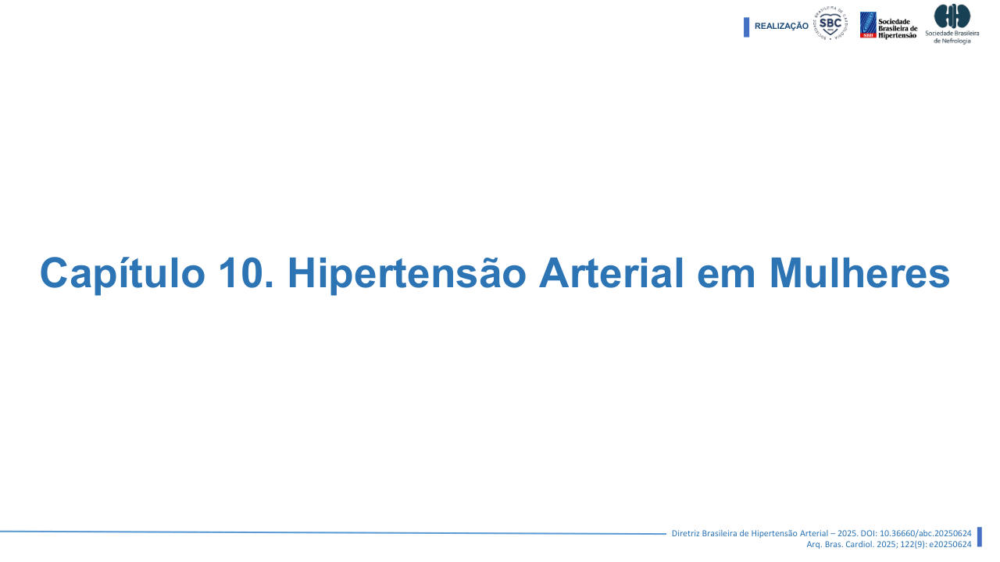

Capítulo 10. Hipertensão Arterial em Mulheres

#### Slide 104 — Quadro 10.1 – Definições e classificação dos distúrbios hipertensivos na gestação (1/3).

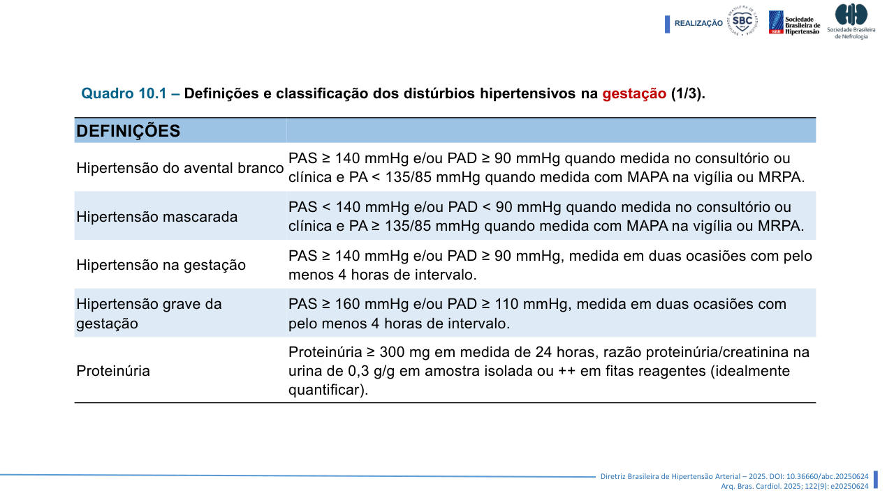

Quadro 10.1 – Definições e classificação dos distúrbios hipertensivos na gestação (1/3).

DEFINIÇÕES

Hipertensão do avental branco PAS ≥140 mmHg e/ou PAD ≥90 mmHg quando medida no consultório ou

clínica e PA < 135/85 mmHg quando medida com MAPA na vigília ou MRPA.

Hipertensão mascarada PAS < 140 mmHg e/ou PAD < 90 mmHg quando medida no consultório ou clínica e PA ≥135/85 mmHg quando medida com MAPA na vigília ou MRPA.

Hipertensão na gestação PAS ≥140 mmHg e/ou PAD ≥90 mmHg, medida em duas ocasiões com pelo menos 4 horas de intervalo.

Hipertensão grave da gestação

PAS ≥160 mmHg e/ou PAD ≥110 mmHg, medida em duas ocasiões com pelo menos 4 horas de intervalo.

Proteinúria ≥300 mg em medida de 24 horas, razão proteinúria/creatinina na urina de 0,3 g/g em amostra isolada ou ++ em fitas reagentes (idealmente quantificar).

Proteinúria

#### Slide 105 — Quadro 10.1 – Definições e classificação dos distúrbios hipertensivos na gestação (2/3).

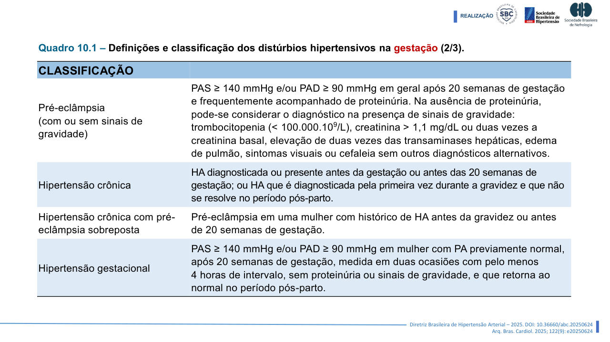

Quadro 10.1 – Definições e classificação dos distúrbios hipertensivos na gestação (2/3).

CLASSIFICAÇÃO

PAS ≥140 mmHg e/ou PAD ≥90 mmHg em geral após 20 semanas de gestação e frequentemente acompanhado de proteinúria. Na ausência de proteinúria, pode-se considerar o diagnóstico na presença de sinais de gravidade: trombocitopenia (< 100.000.109/L), creatinina > 1,1 mg/dL ou duas vezes a creatinina basal, elevação de duas vezes das transaminases hepáticas, edema de pulmão, sintomas visuais ou cefaleia sem outros diagnósticos alternativos.

Pré-eclâmpsia (com ou sem sinais de gravidade)

HA diagnosticada ou presente antes da gestação ou antes das 20 semanas de gestação; ou HA que é diagnosticada pela primeira vez durante a gravidez e que não se resolve no período pós-parto.

Hipertensão crônica

Hipertensão crônica com pré- eclâmpsia sobreposta

Pré-eclâmpsia em uma mulher com histórico de HA antes da gravidez ou antes de 20 semanas de gestação.

PAS ≥140 mmHg e/ou PAD ≥90 mmHg em mulher com PA previamente normal, após 20 semanas de gestação, medida em duas ocasiões com pelo menos 4 horas de intervalo, sem proteinúria ou sinais de gravidade, e que retorna ao normal no período pós-parto.

Hipertensão gestacional

#### Slide 106 — Quadro 10.1 – Definições e classificação dos distúrbios hipertensivos na gestação (3/3).

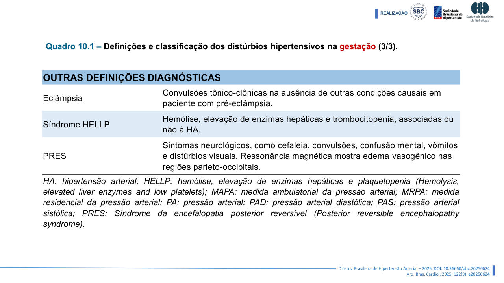

Quadro 10.1 – Definições e classificação dos distúrbios hipertensivos na gestação (3/3).

OUTRAS DEFINIÇÕES DIAGNÓSTICAS

Eclâmpsia Convulsões tônico-clônicas na ausência de outras condições causais em paciente com pré-eclâmpsia.

Síndrome HELLP Hemólise, elevação de enzimas hepáticas e trombocitopenia, associadas ou não à HA.

Sintomas neurológicos, como cefaleia, convulsões, confusão mental, vômitos e distúrbios visuais. Ressonância magnética mostra edema vasogênico nas regiões parieto-occipitais.

PRES

HA: hipertensão arterial; HELLP: hemólise, elevação de enzimas hepáticas e plaquetopenia (Hemolysis, elevated liver enzymes and low platelets); MAPA: medida ambulatorial da pressão arterial; MRPA: medida residencial da pressão arterial; PA: pressão arterial; PAD: pressão arterial diastólica; PAS: pressão arterial sistólica; PRES: Síndrome da encefalopatia posterior reversível (Posterior reversible encephalopathy syndrome).

#### Slide 107 — Quadro 10.2 – Fatores de risco para pré-eclâmpsia.

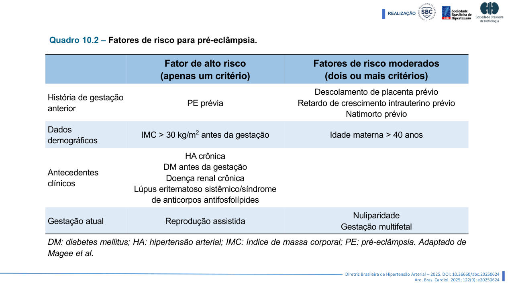

Quadro 10.2 – Fatores de risco para pré-eclâmpsia.

Fator de alto risco (apenas um critério)

Fatores de risco moderados

(dois ou mais critérios)

Descolamento de placenta prévio Retardo de crescimento intrauterino prévio

História de gestação anterior PE prévia

Natimorto prévio

Dados demográficos IMC > 30 kg/m2 antes da gestação Idade materna > 40 anos

HA crônica DM antes da gestação

Antecedentes clínicos

Doença renal crônica Lúpus eritematoso sistêmico/síndrome

de anticorpos antifosfolípides

Gestação atual Reprodução assistida Nuliparidade Gestação multifetal

DM: diabetes mellitus; HA: hipertensão arterial; IMC: índice de massa corporal; PE: pré-eclâmpsia. Adaptado de Magee et al.

#### Slide 108 — Quadro 10.3 – Medicamentos anti-hipertensivos e aleitamento materno (1/2).

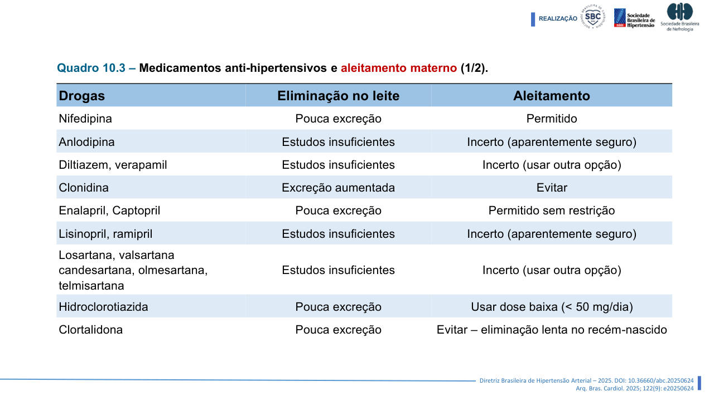

Quadro 10.3 – Medicamentos anti-hipertensivos e aleitamento materno (1/2).

Drogas Eliminação no leite Aleitamento

Nifedipina Pouca excreção Permitido

Anlodipina Estudos insuficientes Incerto (aparentemente seguro)

Diltiazem, verapamil Estudos insuficientes Incerto (usar outra opção)

Clonidina Excreção aumentada Evitar

Enalapril, Captopril Pouca excreção Permitido sem restrição

Lisinopril, ramipril Estudos insuficientes Incerto (aparentemente seguro)

Losartana, valsartana candesartana, olmesartana, telmisartana

Estudos insuficientes Incerto (usar outra opção)

Hidroclorotiazida Pouca excreção Usar dose baixa (< 50 mg/dia)

Clortalidona Pouca excreção Evitar – eliminação lenta no recém-nascido

#### Slide 109 — Quadro 10.3 – Medicamentos anti-hipertensivos e aleitamento materno (2/2).

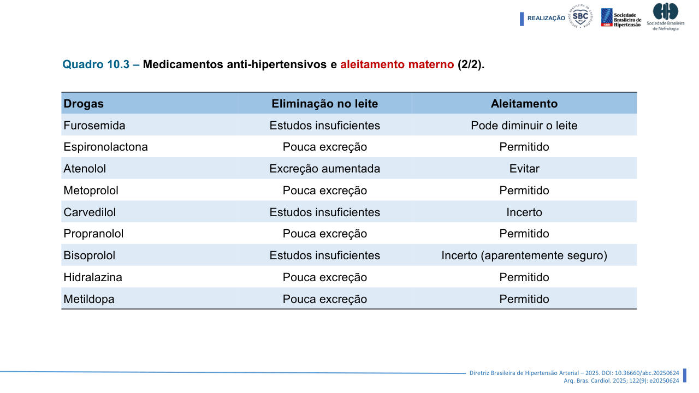

Quadro 10.3 – Medicamentos anti-hipertensivos e aleitamento materno (2/2).

Drogas Eliminação no leite Aleitamento

Furosemida Estudos insuficientes Pode diminuir o leite

Espironolactona Pouca excreção Permitido

Atenolol Excreção aumentada Evitar

Metoprolol Pouca excreção Permitido

Carvedilol Estudos insuficientes Incerto

Propranolol Pouca excreção Permitido

Bisoprolol Estudos insuficientes Incerto (aparentemente seguro)

Hidralazina Pouca excreção Permitido

Metildopa Pouca excreção Permitido

#### Slide 110 — Mensagens principais sobre cuidados com a hipertensão arterial nas mulheres dentro e fora do período gestacional

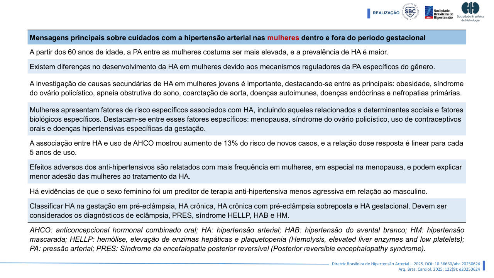

Mensagens principais sobre cuidados com a hipertensão arterial nas mulheres dentro e fora do período gestacional

A partir dos 60 anos de idade, a PA entre as mulheres costuma ser mais elevada, e a prevalência de HA é maior.

Existem diferenças no desenvolvimento da HA em mulheres devido aos mecanismos reguladores da PA específicos do gênero.

A investigação de causas secundárias de HA em mulheres jovens é importante, destacando-se entre as principais: obesidade, síndrome do ovário policístico, apneia obstrutiva do sono, coarctação de aorta, doenças autoimunes, doenças endócrinas e nefropatias primárias.

Mulheres apresentam fatores de risco específicos associados com HA, incluindo aqueles relacionados a determinantes sociais e fatores biológicos específicos. Destacam-se entre esses fatores específicos: menopausa, síndrome do ovário policístico, uso de contraceptivos orais e doenças hipertensivas específicas da gestação.

A associação entre HA e uso de AHCO mostrou aumento de 13% do risco de novos casos, e a relação dose resposta é linear para cada 5 anos de uso.

Efeitos adversos dos anti-hipertensivos são relatados com mais frequência em mulheres, em especial na menopausa, e podem explicar menor adesão das mulheres ao tratamento da HA.

Há evidências de que o sexo feminino foi um preditor de terapia anti-hipertensiva menos agressiva em relação ao masculino.

Classificar HA na gestação em pré-eclâmpsia, HA crônica, HA crônica com pré-eclâmpsia sobreposta e HA gestacional. Devem ser considerados os diagnósticos de eclâmpsia, PRES, síndrome HELLP, HAB e HM.

AHCO: anticoncepcional hormonal combinado oral; HA: hipertensão arterial; HAB: hipertensão do avental branco; HM: hipertensão mascarada; HELLP: hemólise, elevação de enzimas hepáticas e plaquetopenia (Hemolysis, elevated liver enzymes and low platelets); PA: pressão arterial; PRES: Síndrome da encefalopatia posterior reversível (Posterior reversible encephalopathy syndrome).

#### Slide 111 — Recomendações para abordagem da HA em mulheres dentro e fora do período gestacional (1/2)

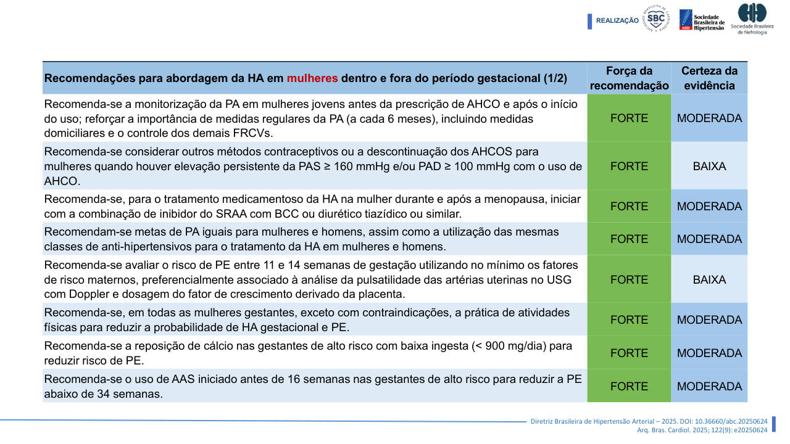

**Recomendações para abordagem da HA em mulheres dentro e fora do período gestacional (1/2)**

| Recomendação | Força | Certeza da evidência |
| :---- | :---- | :---- |
| Recomenda-se a monitorização da PA em mulheres jovens antes da prescrição de AHCO e após o início do uso; reforçar a importância de medidas regulares da PA (a cada 6 meses), incluindo medidas domiciliares e o controle dos demais FRCVs. | FORTE | MODERADA |
| Recomenda-se considerar outros métodos contraceptivos ou a descontinuação dos AHCOS para mulheres quando houver elevação persistente da PAS ≥160 mmHg e/ou PAD ≥100 mmHg com o uso de AHCO. | FORTE | BAIXA |
| Recomenda-se, para o tratamento medicamentoso da HA na mulher durante e após a menopausa, iniciar com a combinação de inibidor do SRAA com BCC ou diurético tiazídico ou similar. | FORTE | MODERADA |
| Recomendam-se metas de PA iguais para mulheres e homens, assim como a utilização das mesmas classes de anti-hipertensivos para o tratamento da HA em mulheres e homens. | FORTE | MODERADA |
| Recomenda-se avaliar o risco de PE entre 11 e 14 semanas de gestação utilizando no mínimo os fatores de risco maternos, preferencialmente associado à análise da pulsatilidade das artérias uterinas no USG com Doppler e dosagem do fator de crescimento derivado da placenta. | FORTE | BAIXA |
| Recomenda-se, em todas as mulheres gestantes, exceto com contraindicações, a prática de atividades físicas para reduzir a probabilidade de HA gestacional e PE. | FORTE | MODERADA |
| Recomenda-se a reposição de cálcio nas gestantes de alto risco com baixa ingesta (< 900 mg/dia) para reduzir risco de PE. | FORTE | MODERADA |
| Recomenda-se o uso de AAS iniciado antes de 16 semanas nas gestantes de alto risco para reduzir a PE abaixo de 34 semanas. | FORTE | MODERADA |

#### Slide 112 — Recomendações para abordagem da HA em mulheres dentro e fora do período gestacional (2/2)

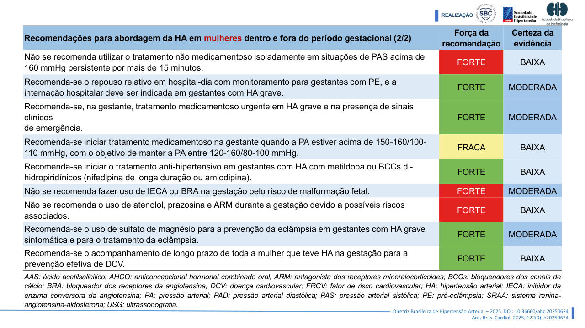

**Recomendações para abordagem da HA em mulheres dentro e fora do período gestacional (2/2)**

| Recomendação | Força | Certeza da evidência |
| :---- | :---- | :---- |
| Não se recomenda utilizar o tratamento não medicamentoso isoladamente em situações de PAS acima de 160 mmHg persistente por mais de 15 minutos. | FORTE | BAIXA |
| Recomenda-se o repouso relativo em hospital-dia com monitoramento para gestantes com PE, e a internação hospitalar deve ser indicada em gestantes com HA grave. | FORTE | MODERADA |
| Recomenda-se, na gestante, tratamento medicamentoso urgente em HA grave e na presença de sinais clínicos de emergência. | FORTE | MODERADA |
| Recomenda-se iniciar tratamento medicamentoso na gestante quando a PA estiver acima de 150-160/100- 110 mmHg, com o objetivo de manter a PA entre 120-160/80-100 mmHg. | FRACA | BAIXA |
| Recomenda-se iniciar o tratamento anti-hipertensivo em gestantes com HA com metildopa ou BCCs di- hidropiridínicos (nifedipina de longa duração ou amlodipina). | FORTE | BAIXA |
| Não se recomenda fazer uso de IECA ou BRA na gestação pelo risco de malformação fetal. | FORTE | MODERADA |
| Não se recomenda o uso de atenolol, prazosina e ARM durante a gestação devido a possíveis riscos associados. | FORTE | BAIXA |
| Recomenda-se o uso de sulfato de magnésio para a prevenção da eclâmpsia em gestantes com HA grave sintomática e para o tratamento da eclâmpsia. | FORTE | MODERADA |
| Recomenda-se o acompanhamento de longo prazo de toda a mulher que teve HA na gestação para a prevenção efetiva de DCV. | FORTE | BAIXA |

AAS: ácido acetilsalicílico; AHCO: anticoncepcional hormonal combinado oral; ARM: antagonista dos receptores mineralocorticoides; BCCs: bloqueadores dos canais de cálcio; BRA: bloqueador dos receptores da angiotensina; DCV: doença cardiovascular; FRCV: fator de risco cardiovascular; HA: hipertensão arterial; IECA: inibidor da enzima conversora da angiotensina; PA: pressão arterial; PAD: pressão arterial diastólica; PAS: pressão arterial sistólica; PE: pré-eclâmpsia; SRAA: sistema renina- angiotensina-aldosterona; USG: ultrassonografia.

### Capítulo 11. Crise hipertensiva

#### Slide 113 — 11. Crise Hipertensiva

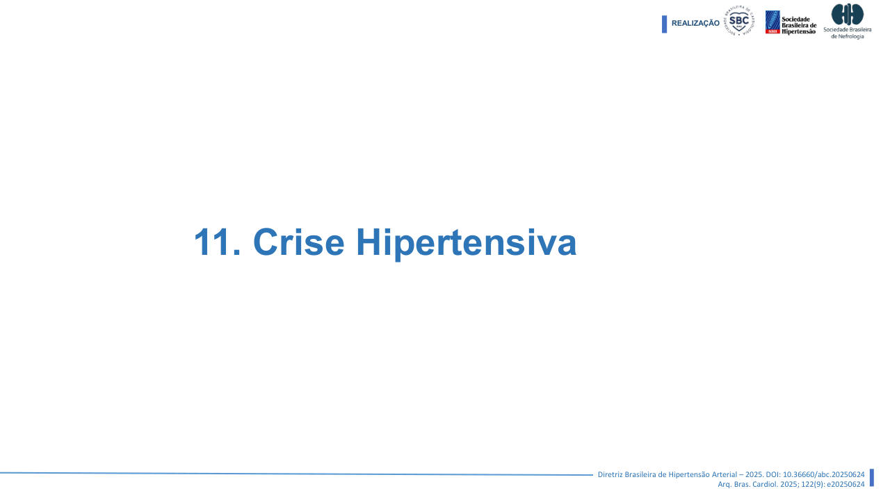

11. Crise Hipertensiva

#### Slide 114 — Quadro 11.1 – Diagnóstico, prognóstico e conduta nas crises hipertensivas.

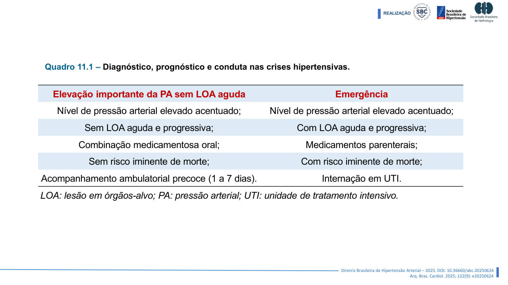

Quadro 11.1 – Diagnóstico, prognóstico e conduta nas crises hipertensivas.

Elevação importante da PA sem LOA aguda Emergência

Nível de pressão arterial elevado acentuado; Nível de pressão arterial elevado acentuado;

Sem LOA aguda e progressiva; Com LOA aguda e progressiva;

Combinação medicamentosa oral; Medicamentos parenterais;

Sem risco iminente de morte; Com risco iminente de morte;

Acompanhamento ambulatorial precoce (1 a 7 dias). Internação em UTI.

LOA: lesão em órgãos-alvo; PA: pressão arterial; UTI: unidade de tratamento intensivo.

#### Slide 115 — EMERGÊNCIAS HIPERTENSIVAS

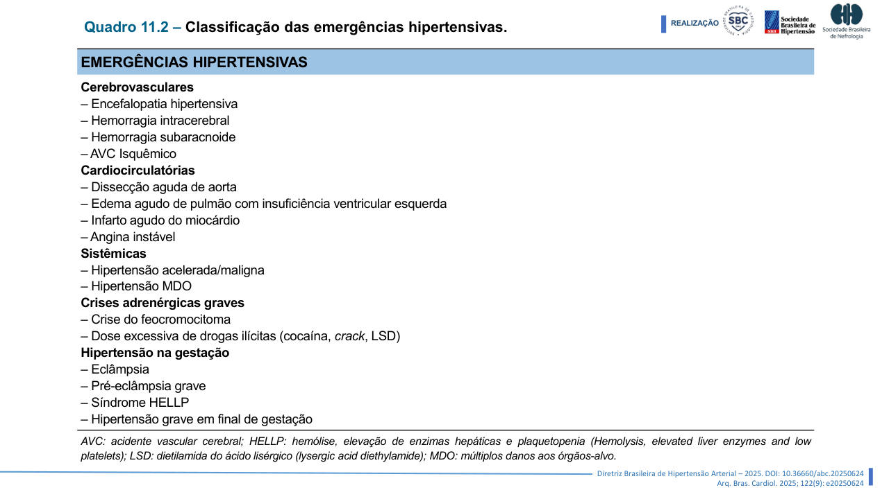

EMERGÊNCIAS HIPERTENSIVAS

Cerebrovasculares – Encefalopatia hipertensiva – Hemorragia intracerebral – Hemorragia subaracnoide – AVC Isquêmico Cardiocirculatórias – Dissecção aguda de aorta – Edema agudo de pulmão com insuficiência ventricular esquerda – Infarto agudo do miocárdio – Angina instável Sistêmicas – Hipertensão acelerada/maligna – Hipertensão MDO Crises adrenérgicas graves – Crise do feocromocitoma – Dose excessiva de drogas ilícitas (cocaína, crack, LSD) Hipertensão na gestação – Eclâmpsia – Pré-eclâmpsia grave – Síndrome HELLP – Hipertensão grave em final de gestação

AVC: acidente vascular cerebral; HELLP: hemólise, elevação de enzimas hepáticas e plaquetopenia (Hemolysis, elevated liver enzymes and low platelets); LSD: dietilamida do ácido lisérgico (lysergic acid diethylamide); MDO: múltiplos danos aos órgãos-alvo.

#### Slide 116 — Quadro 11.3 – Investigação clínico-laboratorial complementar de acordo com as lesões de órgãos-alvo

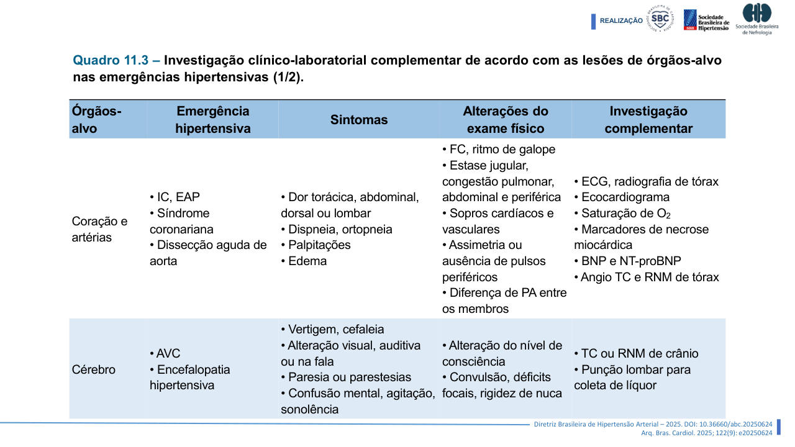

Quadro 11.3 – Investigação clínico-laboratorial complementar de acordo com as lesões de órgãos-alvo nas emergências hipertensivas (1/2).

Órgãos- alvo

Emergência hipertensiva Sintomas Alterações do

Investigação complementar

exame físico

• FC, ritmo de galope • Estase jugular, congestão pulmonar, abdominal e periférica • Sopros cardíacos e vasculares • Assimetria ou ausência de pulsos periféricos • Diferença de PA entre os membros

• ECG, radiografia de tórax • Ecocardiograma • Saturação de O2 • Marcadores de necrose miocárdica • BNP e NT-proBNP • Angio TC e RNM de tórax

• IC, EAP • Síndrome coronariana • Dissecção aguda de aorta

• Dor torácica, abdominal, dorsal ou lombar • Dispneia, ortopneia • Palpitações • Edema

Coração e artérias

• Vertigem, cefaleia • Alteração visual, auditiva ou na fala • Paresia ou parestesias • Confusão mental, agitação, sonolência

• Alteração do nível de consciência • Convulsão, déficits focais, rigidez de nuca

• AVC • Encefalopatia hipertensiva

• TC ou RNM de crânio • Punção lombar para coleta de líquor

Cérebro

#### Slide 117 — Quadro 11.3 – Investigação clínico-laboratorial complementar de acordo com as lesões de órgãos-alvo

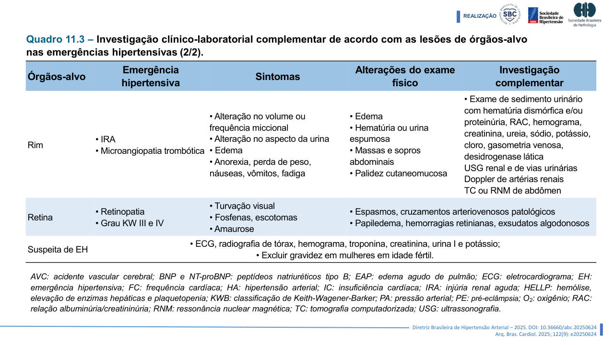

Quadro 11.3 – Investigação clínico-laboratorial complementar de acordo com as lesões de órgãos-alvo nas emergências hipertensivas (2/2).

Órgãos-alvo Emergência hipertensiva Sintomas Alterações do exame

Investigação complementar

físico

• Exame de sedimento urinário com hematúria dismórfica e/ou proteinúria, RAC, hemograma, creatinina, ureia, sódio, potássio, cloro, gasometria venosa, desidrogenase lática USG renal e de vias urinárias Doppler de artérias renais TC ou RNM de abdômen

• Alteração no volume ou frequência miccional • Alteração no aspecto da urina • Edema • Anorexia, perda de peso, náuseas, vômitos, fadiga

• Edema • Hematúria ou urina espumosa • Massas e sopros abdominais • Palidez cutaneomucosa

Rim • IRA • Microangiopatia trombótica

• Turvação visual • Fosfenas, escotomas • Amaurose

Retina • Retinopatia • Grau KW III e IV

• Espasmos, cruzamentos arteriovenosos patológicos • Papiledema, hemorragias retinianas, exsudatos algodonosos

Suspeita de EH • ECG, radiografia de tórax, hemograma, troponina, creatinina, urina I e potássio; • Excluir gravidez em mulheres em idade fértil.

AVC: acidente vascular cerebral; BNP e NT-proBNP: peptídeos natriuréticos tipo B; EAP: edema agudo de pulmão; ECG: eletrocardiograma; EH: emergência hipertensiva; FC: frequência cardíaca; HA: hipertensão arterial; IC: insuficiência cardíaca; IRA: injúria renal aguda; HELLP: hemólise, elevação de enzimas hepáticas e plaquetopenia; KWB: classificação de Keith-Wagener-Barker; PA: pressão arterial; PE: pré-eclâmpsia; O2: oxigênio; RAC: relação albuminúria/creatininúria; RNM: ressonância nuclear magnética; TC: tomografia computadorizada; USG: ultrassonografia.

#### Slide 118 — Figura 11.1 – Fluxograma de atendimento da crise hipertensiva.

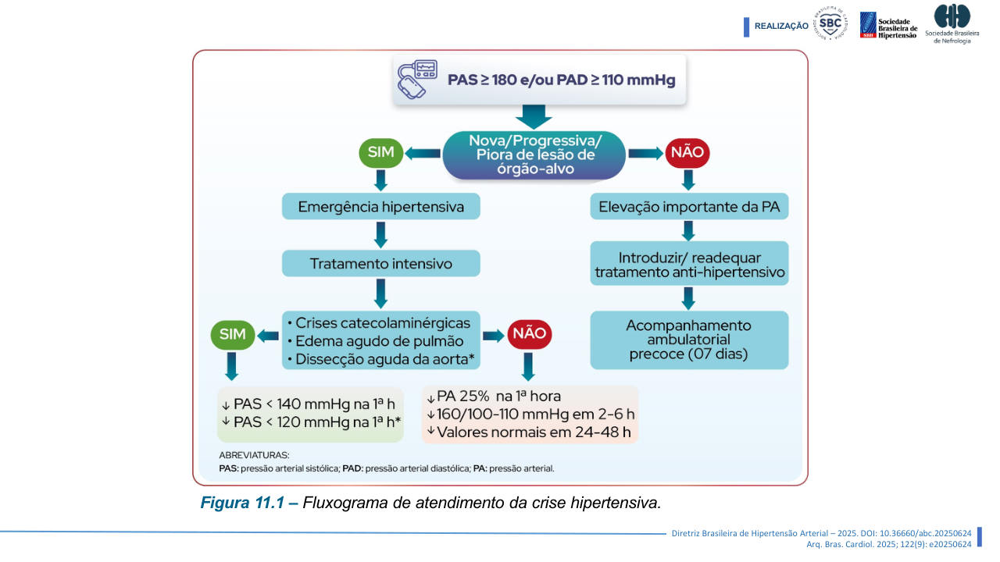

**Conteúdo visual — Figura 11.1:**
- Entrada: PAS ≥180 e/ou PAD ≥110 mmHg.
- Há nova/progressiva/piora de LOA?
  - **Sim → emergência hipertensiva** (tratamento intensivo).
    - Se crises catecolaminérgicas, EAP ou dissecção aguda da aorta: ↓ PAS < 140 mmHg na 1ª h (e < 120 mmHg na 1ª h na dissecção de aorta).
    - Se não: ↓ PA 25% na 1ª hora → 160/100–110 mmHg em 2–6 h → valores normais em 24–48 h.
  - **Não → elevação importante da PA** (sem LOA aguda): introduzir/readequar tratamento anti-hipertensivo e acompanhamento ambulatorial precoce (7 dias).

Figura 11.1 – Fluxograma de atendimento da crise hipertensiva.

#### Slide 119 — Quadro 11.4 – Medicamentos usados por via intravenosa para o tratamento das emergências

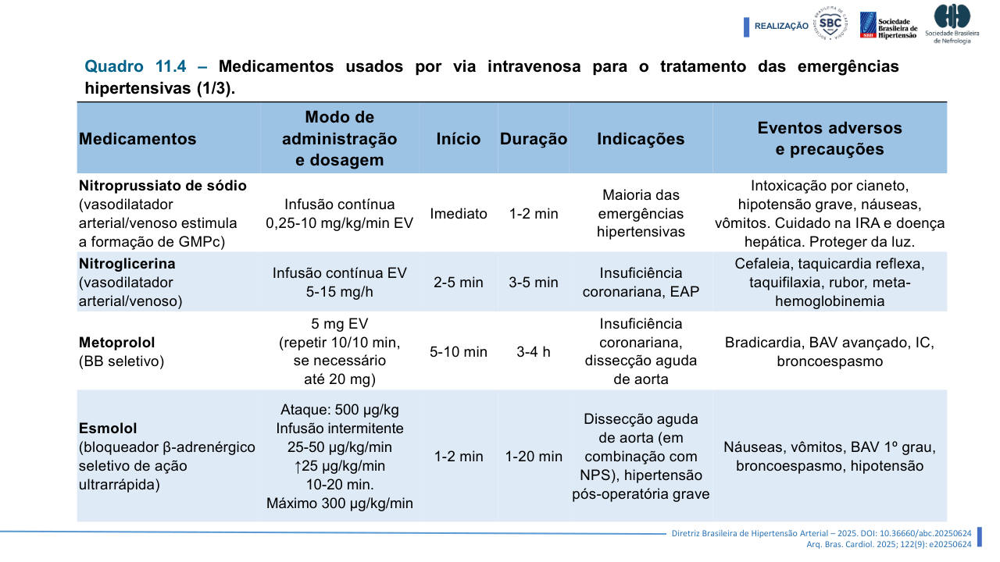

Quadro 11.4 – Medicamentos usados por via intravenosa para o tratamento das emergências hipertensivas (1/3).

Modo de administração

Início Duração Indicações Eventos adversos

Medicamentos

e precauções

e dosagem

Nitroprussiato de sódio (vasodilatador arterial/venoso estimula a formação de GMPc)

Intoxicação por cianeto, hipotensão grave, náuseas, vômitos. Cuidado na IRA e doença

Infusão contínua 0,25-10 mg/kg/min EV Imediato 1-2 min Maioria das emergências hipertensivas

hepática. Proteger da luz.

Nitroglicerina (vasodilatador arterial/venoso)

Cefaleia, taquicardia reflexa,

Infusão contínua EV

5-15 mg/h 2-5 min 3-5 min Insuficiência coronariana, EAP

taquifilaxia, rubor, meta-

hemoglobinemia

5 mg EV (repetir 10/10 min,

Insuficiência coronariana, dissecção aguda

Metoprolol (BB seletivo)

Bradicardia, BAV avançado, IC,

5-10 min 3-4 h

se necessário

broncoespasmo

até 20 mg)

de aorta

Ataque: 500 μg/kg Infusão intermitente

Dissecção aguda

Esmolol (bloqueador β-adrenérgico seletivo de ação ultrarrápida)

de aorta (em combinação com NPS), hipertensão pós-operatória grave

25-50 μg/kg/min ↑25 μg/kg/min

Náuseas, vômitos, BAV 1º grau,

1-2 min 1-20 min

broncoespasmo, hipotensão

10-20 min. Máximo 300 μg/kg/min

#### Slide 120 — Quadro 11.4 – Medicamentos usados por via intravenosa para o tratamento das emergências

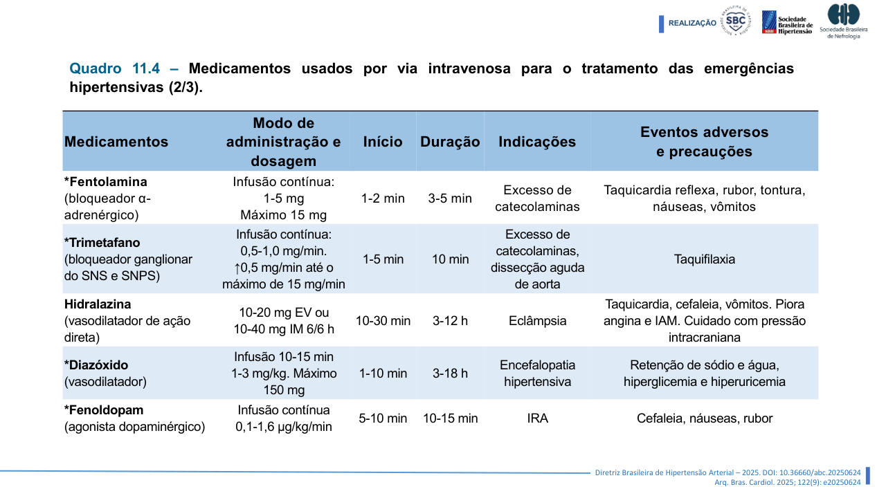

Quadro 11.4 – Medicamentos usados por via intravenosa para o tratamento das emergências hipertensivas (2/3).

Modo de administração e

Início Duração Indicações Eventos adversos

Medicamentos

e precauções

dosagem

*Fentolamina (bloqueador α- adrenérgico)

Infusão contínua:

1-2 min 3-5 min Excesso de catecolaminas

Taquicardia reflexa, rubor, tontura,

1-5 mg Máximo 15 mg

náuseas, vômitos

Infusão contínua:

Excesso de catecolaminas, dissecção aguda

*Trimetafano (bloqueador ganglionar do SNS e SNPS)

0,5-1,0 mg/min. ↑0,5 mg/min até o máximo de 15 mg/min

1-5 min 10 min

Taquifilaxia

de aorta

Hidralazina (vasodilatador de ação direta)

Taquicardia, cefaleia, vômitos. Piora angina e IAM. Cuidado com pressão

10-20 mg EV ou 10-40 mg IM 6/6 h 10-30 min 3-12 h Eclâmpsia

intracraniana

Infusão 10-15 min 1-3 mg/kg. Máximo 150 mg 1-10 min 3-18 h Encefalopatia

*Diazóxido (vasodilatador)

Retenção de sódio e água, hiperglicemia e hiperuricemia

hipertensiva

*Fenoldopam (agonista dopaminérgico)

Infusão contínua 0,1-1,6 μg/kg/min 5-10 min 10-15 min IRA Cefaleia, náuseas, rubor

#### Slide 121 — Quadro 11.4 – Medicamentos usados por via intravenosa para o tratamento das emergências hipertensivas (3/3).

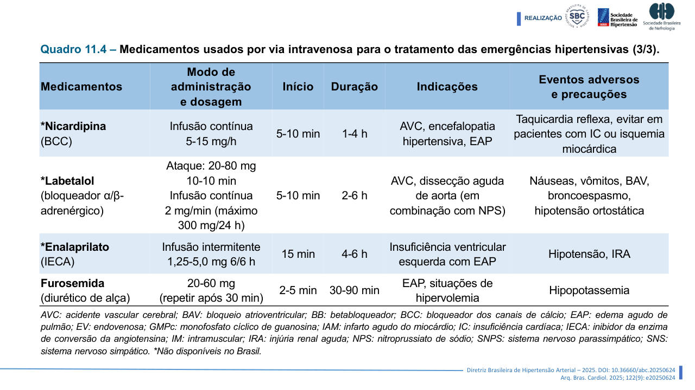

Quadro 11.4 – Medicamentos usados por via intravenosa para o tratamento das emergências hipertensivas (3/3).

Modo de administração

Início Duração Indicações Eventos adversos

Medicamentos

e precauções

e dosagem

Taquicardia reflexa, evitar em pacientes com IC ou isquemia

*Nicardipina (BCC)

Infusão contínua

5-15 mg/h 5-10 min 1-4 h AVC, encefalopatia

hipertensiva, EAP

miocárdica

Ataque: 20-80 mg

*Labetalol (bloqueador α/β- adrenérgico)

10-10 min Infusão contínua 2 mg/min (máximo 300 mg/24 h)

5-10 min 2-6 h AVC, dissecção aguda

Náuseas, vômitos, BAV,

de aorta (em combinação com NPS)

broncoespasmo, hipotensão ortostática

*Enalaprilato (IECA)

Infusão intermitente

1,25-5,0 mg 6/6 h 15 min 4-6 h Insuficiência ventricular

esquerda com EAP Hipotensão, IRA

Furosemida (diurético de alça)

20-60 mg (repetir após 30 min) 2-5 min 30-90 min EAP, situações de

hipervolemia Hipopotassemia

AVC: acidente vascular cerebral; BAV: bloqueio atrioventricular; BB: betabloqueador; BCC: bloqueador dos canais de cálcio; EAP: edema agudo de pulmão; EV: endovenosa; GMPc: monofosfato cíclico de guanosina; IAM: infarto agudo do miocárdio; IC: insuficiência cardíaca; IECA: inibidor da enzima de conversão da angiotensina; IM: intramuscular; IRA: injúria renal aguda; NPS: nitroprussiato de sódio; SNPS: sistema nervoso parassimpático; SNS: sistema nervoso simpático. *Não disponíveis no Brasil.

#### Slide 122 — Mensagens principais sobre cuidados da crise hipertensiva

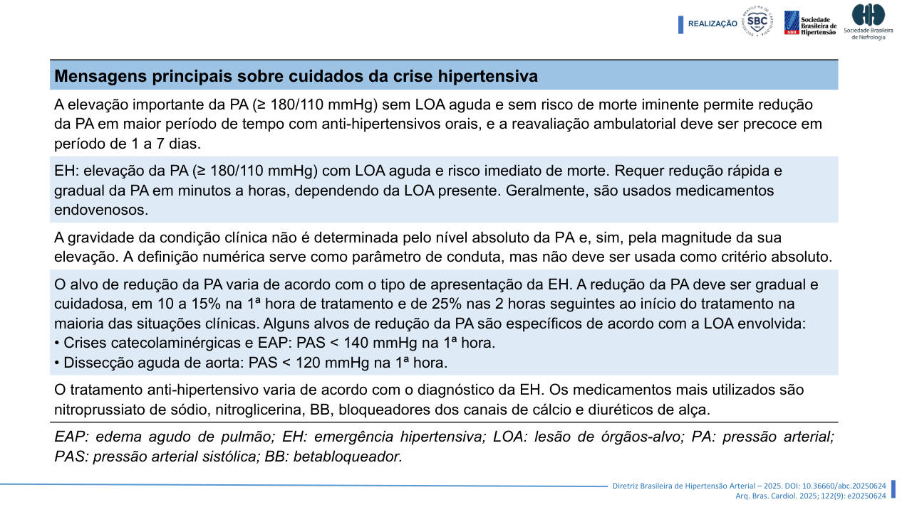

Mensagens principais sobre cuidados da crise hipertensiva

A elevação importante da PA (≥180/110 mmHg) sem LOA aguda e sem risco de morte iminente permite redução da PA em maior período de tempo com anti-hipertensivos orais, e a reavaliação ambulatorial deve ser precoce em período de 1 a 7 dias.

EH: elevação da PA (≥180/110 mmHg) com LOA aguda e risco imediato de morte. Requer redução rápida e gradual da PA em minutos a horas, dependendo da LOA presente. Geralmente, são usados medicamentos endovenosos.

A gravidade da condição clínica não é determinada pelo nível absoluto da PA e, sim, pela magnitude da sua elevação. A definição numérica serve como parâmetro de conduta, mas não deve ser usada como critério absoluto.

O alvo de redução da PA varia de acordo com o tipo de apresentação da EH. A redução da PA deve ser gradual e cuidadosa, em 10 a 15% na 1ª hora de tratamento e de 25% nas 2 horas seguintes ao início do tratamento na maioria das situações clínicas. Alguns alvos de redução da PA são específicos de acordo com a LOA envolvida: • Crises catecolaminérgicas e EAP: PAS < 140 mmHg na 1ª hora. • Dissecção aguda de aorta: PAS < 120 mmHg na 1ª hora.

O tratamento anti-hipertensivo varia de acordo com o diagnóstico da EH. Os medicamentos mais utilizados são nitroprussiato de sódio, nitroglicerina, BB, bloqueadores dos canais de cálcio e diuréticos de alça.

EAP: edema agudo de pulmão; EH: emergência hipertensiva; LOA: lesão de órgãos-alvo; PA: pressão arterial; PAS: pressão arterial sistólica; BB: betabloqueador.

#### Slide 123 — Recomendações principais para as emergências hipertensivas e para elevação importante da pressão arterial sem lesão de órgão-alvo aguda (1/3)

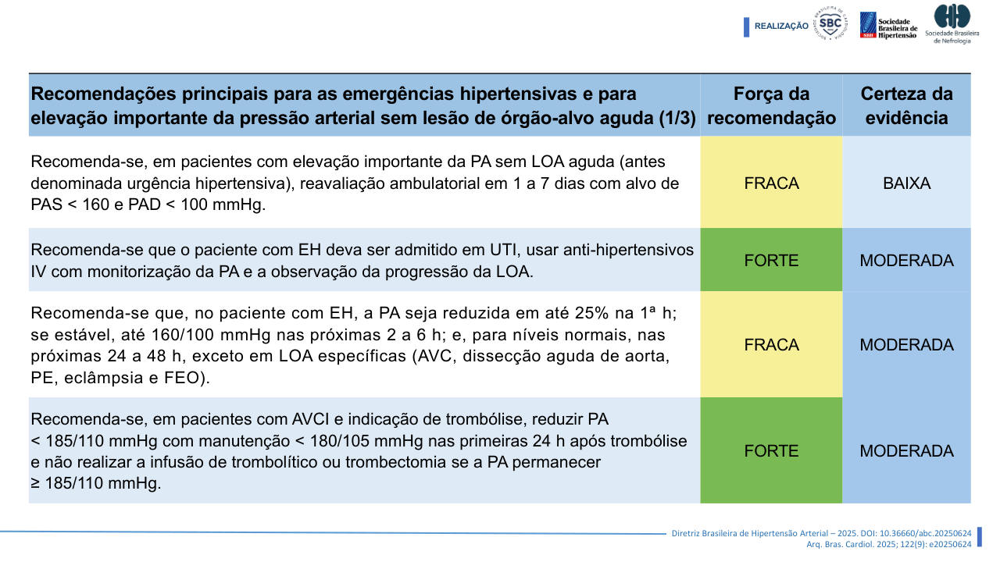

**Recomendações principais para as emergências hipertensivas e para elevação importante da pressão arterial sem lesão de órgão-alvo aguda (1/3)**

| Recomendação | Força | Certeza da evidência |
| :---- | :---- | :---- |
| Recomenda-se, em pacientes com elevação importante da PA sem LOA aguda (antes denominada urgência hipertensiva), reavaliação ambulatorial em 1 a 7 dias com alvo de PAS < 160 e PAD < 100 mmHg. | FRACA | BAIXA |
| Recomenda-se que o paciente com EH deva ser admitido em UTI, usar anti-hipertensivos IV com monitorização da PA e a observação da progressão da LOA. | FORTE | MODERADA |
| Recomenda-se que, no paciente com EH, a PA seja reduzida em até 25% na 1ª h; se estável, até 160/100 mmHg nas próximas 2 a 6 h; e, para níveis normais, nas próximas 24 a 48 h, exceto em LOA específicas (AVC, dissecção aguda de aorta, PE, eclâmpsia e FEO). | FRACA | MODERADA |
| Recomenda-se, em pacientes com AVCI e indicação de trombólise, reduzir PA < 185/110 mmHg com manutenção < 180/105 mmHg nas primeiras 24 h após trombólise e não realizar a infusão de trombolítico ou trombectomia se a PA permanecer ≥185/110 mmHg. | FORTE | MODERADA |

#### Slide 124 — Recomendações principais para as emergências hipertensivas e para elevação importante da pressão arterial sem lesão de órgão-alvo aguda (2/3)

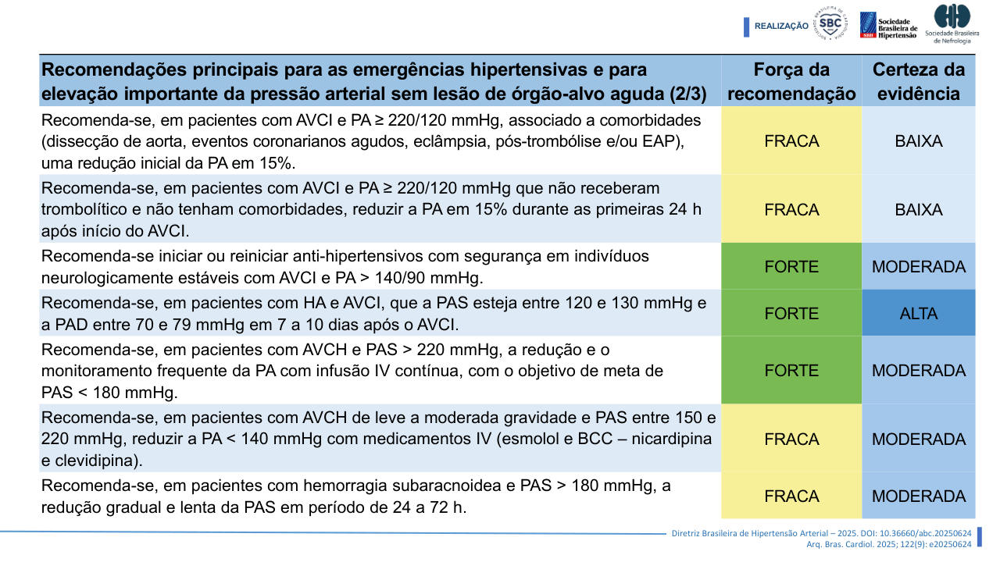

**Recomendações principais para as emergências hipertensivas e para elevação importante da pressão arterial sem lesão de órgão-alvo aguda (2/3)**

| Recomendação | Força | Certeza da evidência |
| :---- | :---- | :---- |
| Recomenda-se, em pacientes com AVCI e PA ≥ 220/120 mmHg, associado a comorbidades (dissecção de aorta, eventos coronarianos agudos, eclâmpsia, pós-trombólise e/ou EAP), uma redução inicial da PA em 15%. | FRACA | BAIXA |
| Recomenda-se, em pacientes com AVCI e PA ≥220/120 mmHg que não receberam trombolítico e não tenham comorbidades, reduzir a PA em 15% durante as primeiras 24 h após início do AVCI. | FRACA | BAIXA |
| Recomenda-se iniciar ou reiniciar anti-hipertensivos com segurança em indivíduos neurologicamente estáveis com AVCI e PA > 140/90 mmHg. | FORTE | MODERADA |
| Recomenda-se, em pacientes com HA e AVCI, que a PAS esteja entre 120 e 130 mmHg e a PAD entre 70 e 79 mmHg em 7 a 10 dias após o AVCI. | FORTE | ALTA |
| Recomenda-se, em pacientes com AVCH e PAS > 220 mmHg, a redução e o monitoramento frequente da PA com infusão IV contínua, com o objetivo de meta de PAS < 180 mmHg. | FORTE | MODERADA |
| Recomenda-se, em pacientes com AVCH de leve a moderada gravidade e PAS entre 150 e 220 mmHg, reduzir a PA < 140 mmHg com medicamentos IV (esmolol e BCC – nicardipina e clevidipina). | FRACA | MODERADA |
| Recomenda-se, em pacientes com hemorragia subaracnoidea e PAS > 180 mmHg, a redução gradual e lenta da PAS em período de 24 a 72 h. | FRACA | MODERADA |

#### Slide 125 — Recomendações principais para as emergências hipertensivas e para elevação importante da pressão arterial sem lesão de órgão-alvo aguda (3/3)

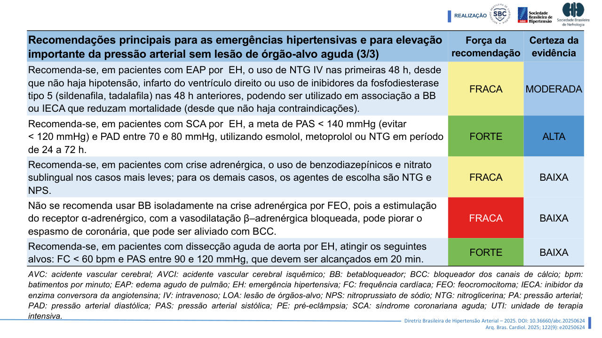

**Recomendações principais para as emergências hipertensivas e para elevação importante da pressão arterial sem lesão de órgão-alvo aguda (3/3)**

| Recomendação | Força | Certeza da evidência |
| :---- | :---- | :---- |
| Recomenda-se, em pacientes com EAP por EH, o uso de NTG IV nas primeiras 48 h, desde que não haja hipotensão, infarto do ventrículo direito ou uso de inibidores da fosfodiesterase tipo 5 (sildenafila, tadalafila) nas 48 h anteriores, podendo ser utilizado em associação a BB ou IECA que reduzam mortalidade (desde que não haja contraindicações). | FRACA | MODERADA |
| Recomenda-se, em pacientes com SCA por EH, a meta de PAS < 140 mmHg (evitar < 120 mmHg) e PAD entre 70 e 80 mmHg, utilizando esmolol, metoprolol ou NTG em período de 24 a 72 h. | FORTE | ALTA |
| Recomenda-se, em pacientes com crise adrenérgica, o uso de benzodiazepínicos e nitrato sublingual nos casos mais leves; para os demais casos, os agentes de escolha são NTG e NPS. | FRACA | BAIXA |
| Não se recomenda usar BB isoladamente na crise adrenérgica por FEO, pois a estimulação do receptor α-adrenérgico, com a vasodilatação β–adrenérgica bloqueada, pode piorar o espasmo de coronária, que pode ser aliviado com BCC. | FRACA | BAIXA |
| Recomenda-se, em pacientes com dissecção aguda de aorta por EH, atingir os seguintes alvos: FC < 60 bpm e PAS entre 90 e 120 mmHg, que devem ser alcançados em 20 min. | FORTE | BAIXA |

AVC: acidente vascular cerebral; AVCI: acidente vascular cerebral isquêmico; BB: betabloqueador; BCC: bloqueador dos canais de cálcio; bpm: batimentos por minuto; EAP: edema agudo de pulmão; EH: emergência hipertensiva; FC: frequência cardíaca; FEO: feocromocitoma; IECA: inibidor da enzima conversora da angiotensina; IV: intravenoso; LOA: lesão de órgãos-alvo; NPS: nitroprussiato de sódio; NTG: nitroglicerina; PA: pressão arterial; PAD: pressão arterial diastólica; PAS: pressão arterial sistólica; PE: pré-eclâmpsia; SCA: síndrome coronariana aguda; UTI: unidade de terapia intensiva.

### Capítulo 12. Hipertensão arterial resistente e refratária

#### Slide 126 — Capítulo 12.  Hipertensão Arterial Resistente e Refratária

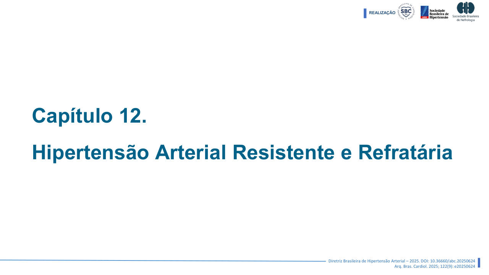

Capítulo 12.

Hipertensão Arterial Resistente e Refratária

#### Slide 127 — Figura 12.1 – Classificação da hipertensão arterial resistente e refratária baseada

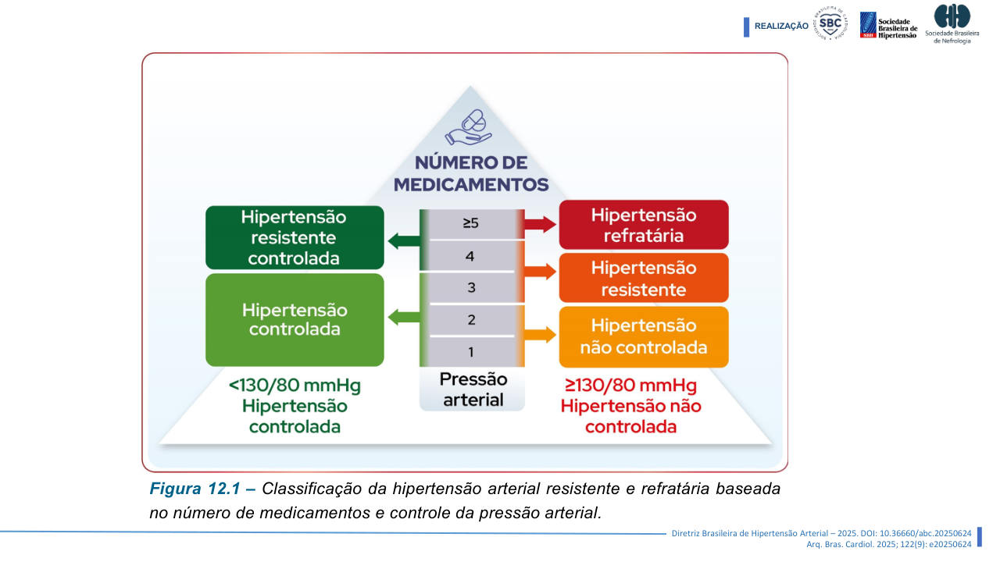

Figura 12.1 – Classificação da hipertensão arterial resistente e refratária baseada no número de medicamentos e controle da pressão arterial.

#### Slide 128 — Figura 12.3 – Causas de pseudorresistência.

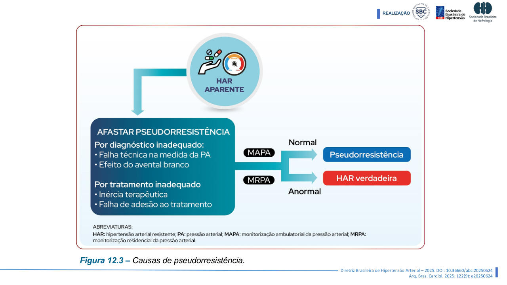

Figura 12.3 – Causas de pseudorresistência.

#### Slide 129 — Figura 12.4 – Abordagem diagnóstica da hipertensão arterial resistente.

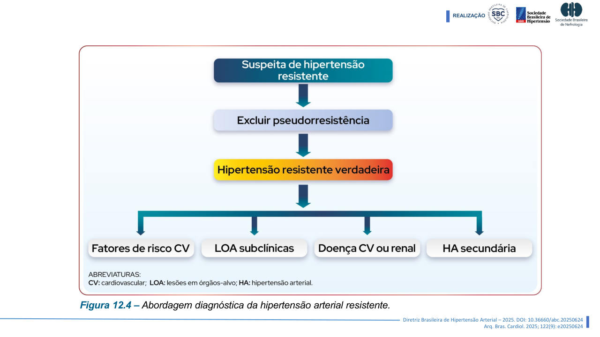

Figura 12.4 – Abordagem diagnóstica da hipertensão arterial resistente.

#### Slide 130 — Figura 12.2 – Fisiopatologia da hipertensão arterial resistente e da hipertensão arterial

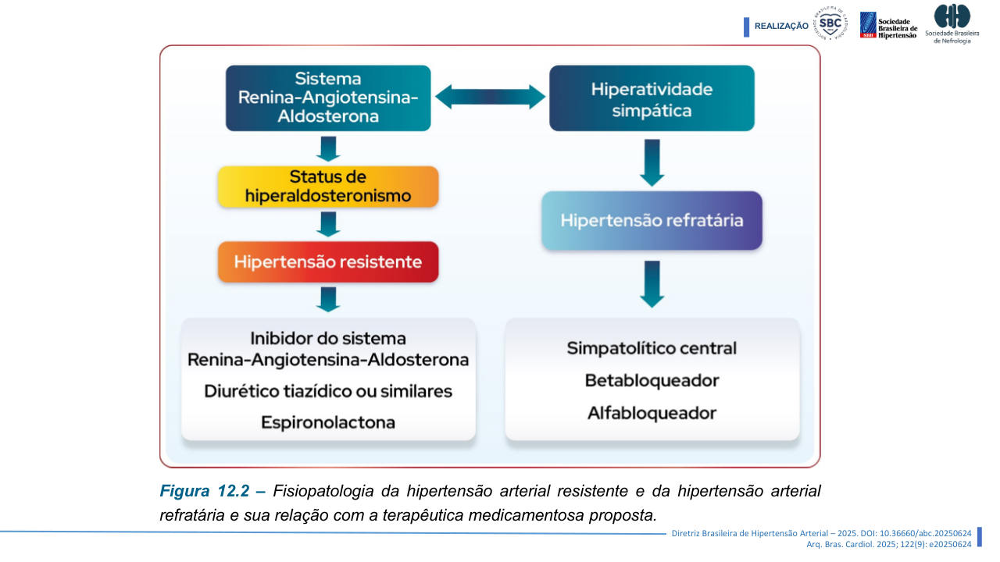

Figura 12.2 – Fisiopatologia da hipertensão arterial resistente e da hipertensão arterial refratária e sua relação com a terapêutica medicamentosa proposta.

#### Slide 131 — Figura 12.5 – Fluxograma do tratamento.

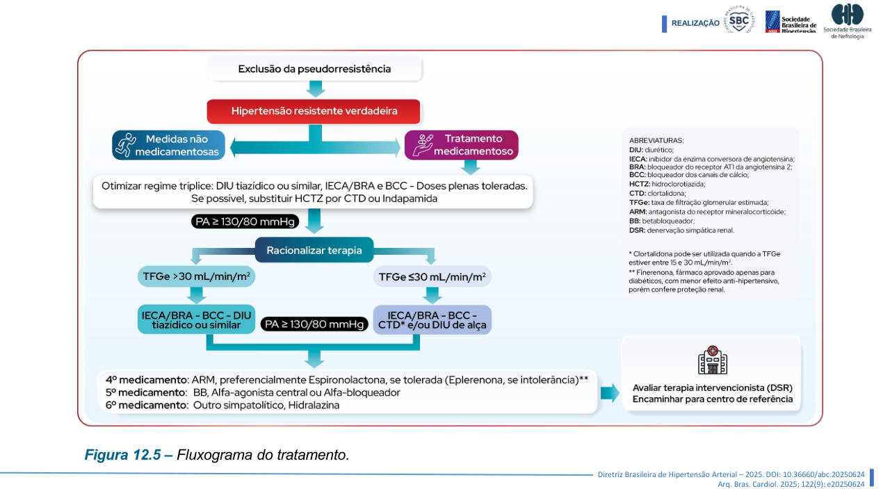

**Conteúdo visual — Figura 12.5:**
1. Excluir pseudorresistência → HA resistente verdadeira.
2. MNM + tratamento medicamentoso.
3. Otimizar tríplice: DIU tiazídico ou similar + IECA/BRA + BCC em doses plenas toleradas; se possível, substituir HCTZ por CTD ou indapamida.
4. Se PA ≥130/80: racionalizar terapia conforme TFGe (>30: IECA/BRA + BCC + DIU tiazídico ou similar; ≤30: IECA/BRA + BCC + CTD* e/ou DIU de alça).
5. 4º: ARM, de preferência espironolactona (eplerenona se intolerância)\*\*.
6. 5º: BB, agonista alfa-2 central ou alfabloqueador.
7. 6º: outro simpatolítico, hidralazina.
8. Avaliar terapia intervencionista (DSR) e encaminhar a centro de referência.
- \* Clortalidona pode ser usada com TFGe entre 15 e 30 mL/min/m².
- \*\* Finerenona: aprovada para diabéticos; menor efeito anti-hipertensivo, proteção renal.

Figura 12.5 – Fluxograma do tratamento.

#### Slide 132 — Mensagens principais sobre hipertensão arterial resistente e refratária

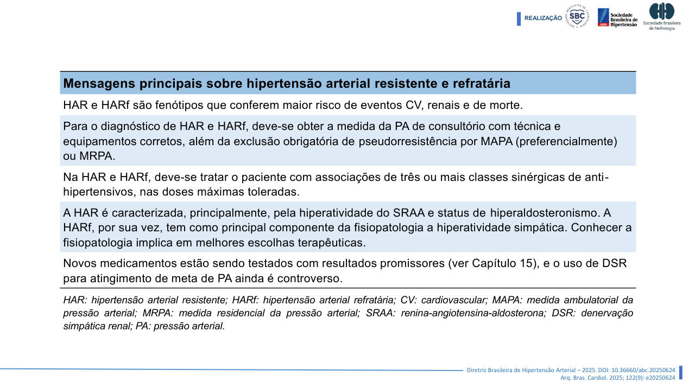

Mensagens principais sobre hipertensão arterial resistente e refratária

HAR e HARf são fenótipos que conferem maior risco de eventos CV, renais e de morte.

Para o diagnóstico de HAR e HARf, deve-se obter a medida da PA de consultório com técnica e equipamentos corretos, além da exclusão obrigatória de pseudorresistência por MAPA (preferencialmente) ou MRPA.

Na HAR e HARf, deve-se tratar o paciente com associações de três ou mais classes sinérgicas de anti- hipertensivos, nas doses máximas toleradas.

A HAR é caracterizada, principalmente, pela hiperatividade do SRAA e status de hiperaldosteronismo. A HARf, por sua vez, tem como principal componente da fisiopatologia a hiperatividade simpática. Conhecer a fisiopatologia implica em melhores escolhas terapêuticas.

Novos medicamentos estão sendo testados com resultados promissores (ver Capítulo 15), e o uso de DSR para atingimento de meta de PA ainda é controverso.

HAR: hipertensão arterial resistente; HARf: hipertensão arterial refratária; CV: cardiovascular; MAPA: medida ambulatorial da pressão arterial; MRPA: medida residencial da pressão arterial; SRAA: renina-angiotensina-aldosterona; DSR: denervação simpática renal; PA: pressão arterial.

#### Slide 133 — Recomendações para abordagem da HA resistente e refratária (1/2)

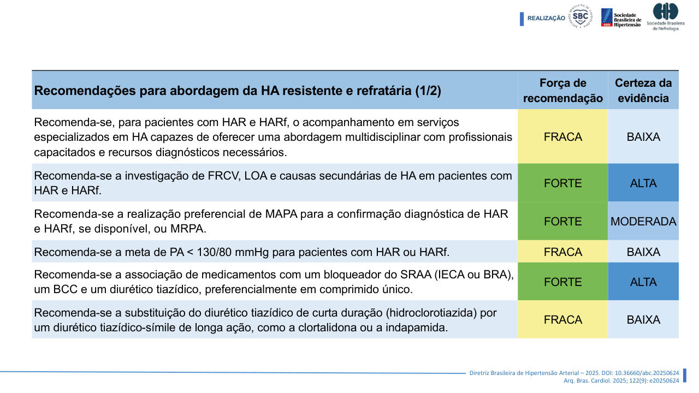

**Recomendações para abordagem da HA resistente e refratária (1/2)**

| Recomendação | Força | Certeza da evidência |
| :---- | :---- | :---- |
| Recomenda-se, para pacientes com HAR e HARf, o acompanhamento em serviços especializados em HA capazes de oferecer uma abordagem multidisciplinar com profissionais capacitados e recursos diagnósticos necessários. | FRACA | BAIXA |
| Recomenda-se a investigação de FRCV, LOA e causas secundárias de HA em pacientes com HAR e HARf. | FORTE | ALTA |
| Recomenda-se a realização preferencial de MAPA para a confirmação diagnóstica de HAR e HARf, se disponível, ou MRPA. | FORTE | MODERADA |
| Recomenda-se a meta de PA < 130/80 mmHg para pacientes com HAR ou HARf. | FRACA | BAIXA |
| Recomenda-se a associação de medicamentos com um bloqueador do SRAA (IECA ou BRA), um BCC e um diurético tiazídico, preferencialmente em comprimido único. | FORTE | ALTA |
| Recomenda-se a substituição do diurético tiazídico de curta duração (hidroclorotiazida) por um diurético tiazídico-símile de longa ação, como a clortalidona ou a indapamida. | FRACA | BAIXA |

#### Slide 134 — Recomendações para abordagem da HA resistente e refratária (2/2)

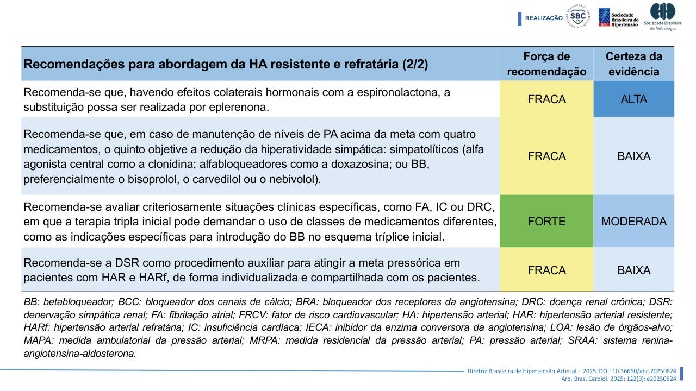

**Recomendações para abordagem da HA resistente e refratária (2/2)**

| Recomendação | Força | Certeza da evidência |
| :---- | :---- | :---- |
| Recomenda-se que, havendo efeitos colaterais hormonais com a espironolactona, a substituição possa ser realizada por eplerenona. | FRACA | ALTA |
| Recomenda-se que, em caso de manutenção de níveis de PA acima da meta com quatro medicamentos, o quinto objetive a redução da hiperatividade simpática: simpatolíticos (alfa agonista central como a clonidina; alfabloqueadores como a doxazosina; ou BB, preferencialmente o bisoprolol, o carvedilol ou o nebivolol). | FRACA | BAIXA |
| Recomenda-se avaliar criteriosamente situações clínicas específicas, como FA, IC ou DRC, em que a terapia tripla inicial pode demandar o uso de classes de medicamentos diferentes, como as indicações específicas para introdução do BB no esquema tríplice inicial. | FORTE | MODERADA |
| Recomenda-se a DSR como procedimento auxiliar para atingir a meta pressórica em pacientes com HAR e HARf, de forma individualizada e compartilhada com os pacientes. | FRACA | BAIXA |

BB: betabloqueador; BCC: bloqueador dos canais de cálcio; BRA: bloqueador dos receptores da angiotensina; DRC: doença renal crônica; DSR: denervação simpática renal; FA: fibrilação atrial; FRCV: fator de risco cardiovascular; HA: hipertensão arterial; HAR: hipertensão arterial resistente; HARf: hipertensão arterial refratária; IC: insuficiência cardíaca; IECA: inibidor da enzima conversora da angiotensina; LOA: lesão de órgãos-alvo; MAPA: medida ambulatorial da pressão arterial; MRPA: medida residencial da pressão arterial; PA: pressão arterial; SRAA: sistema renina- angiotensina-aldosterona.

### Capítulo 13. Adesão ao tratamento anti-hipertensivo

#### Slide 135 — Capítulo 13.  Adesão ao Tratamento Anti-Hipertensivo

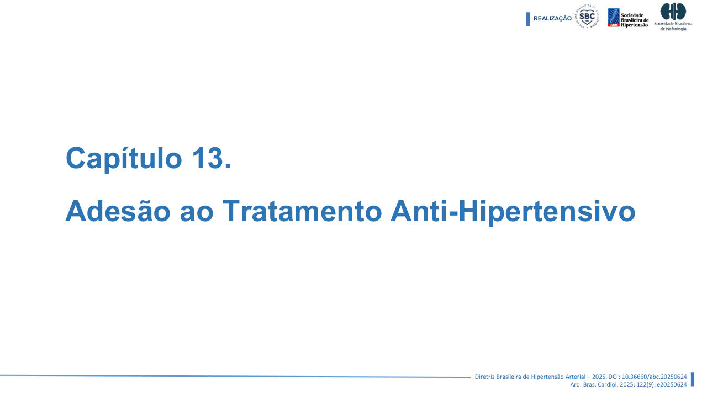

Capítulo 13.

Adesão ao Tratamento Anti-Hipertensivo

#### Slide 136 — Tabela 13.1 – Resultados alcançados na adesão aos medicamentos para hipertensão arterial

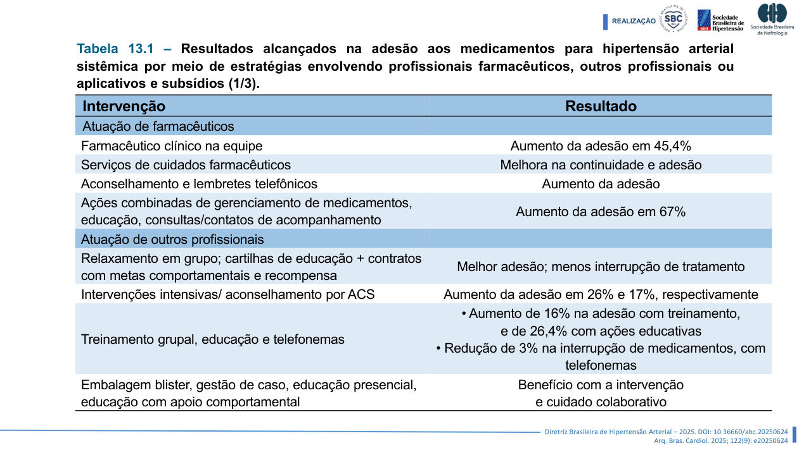

Tabela 13.1 – Resultados alcançados na adesão aos medicamentos para hipertensão arterial sistêmica por meio de estratégias envolvendo profissionais farmacêuticos, outros profissionais ou aplicativos e subsídios (1/3).

Intervenção Resultado Atuação de farmacêuticos Farmacêutico clínico na equipe Aumento da adesão em 45,4% Serviços de cuidados farmacêuticos Melhora na continuidade e adesão Aconselhamento e lembretes telefônicos Aumento da adesão Ações combinadas de gerenciamento de medicamentos, educação, consultas/contatos de acompanhamento Aumento da adesão em 67%

Atuação de outros profissionais Relaxamento em grupo; cartilhas de educação + contratos com metas comportamentais e recompensa Melhor adesão; menos interrupção de tratamento

Intervenções intensivas/ aconselhamento por ACS Aumento da adesão em 26% e 17%, respectivamente

• Aumento de 16% na adesão com treinamento, e de 26,4% com ações educativas • Redução de 3% na interrupção de medicamentos, com telefonemas Embalagem blister, gestão de caso, educação presencial, educação com apoio comportamental

Treinamento grupal, educação e telefonemas

Benefício com a intervenção

e cuidado colaborativo

#### Slide 137 — Tabela 13.1 – Resultados alcançados na adesão aos medicamentos para hipertensão arterial

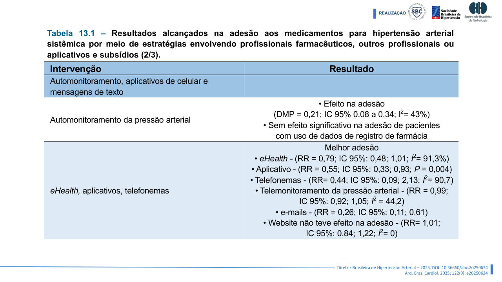

Tabela 13.1 – Resultados alcançados na adesão aos medicamentos para hipertensão arterial sistêmica por meio de estratégias envolvendo profissionais farmacêuticos, outros profissionais ou aplicativos e subsídios (2/3).

Intervenção Resultado Automonitoramento, aplicativos de celular e mensagens de texto

• Efeito na adesão (DMP = 0,21; IC 95% 0,08 a 0,34; I2= 43%) • Sem efeito significativo na adesão de pacientes com uso de dados de registro de farmácia

Automonitoramento da pressão arterial

Melhor adesão • eHealth - (RR = 0,79; IC 95%: 0,48; 1,01; I2= 91,3%) • Aplicativo - (RR = 0,55; IC 95%: 0,33; 0,93; P = 0,004) • Telefonemas - (RR= 0,44; IC 95%: 0,09; 2,13; I2= 90,7) • Telemonitoramento da pressão arterial - (RR = 0,99; IC 95%: 0,92; 1,05; I2 = 44,2) • e-mails - (RR = 0,26; IC 95%: 0,11; 0,61) • Website não teve efeito na adesão - (RR= 1,01; IC 95%: 0,84; 1,22; I2= 0)

eHealth, aplicativos, telefonemas

#### Slide 138 — Tabela 13.1 – Resultados alcançados na adesão aos medicamentos para hipertensão arterial sistêmica

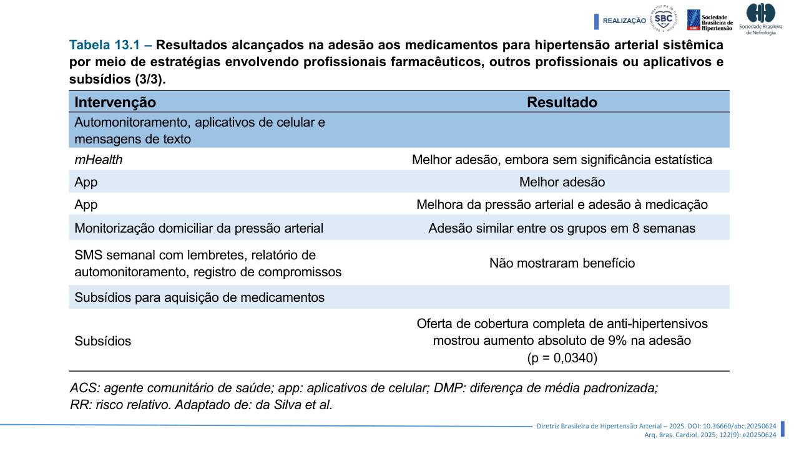

Tabela 13.1 – Resultados alcançados na adesão aos medicamentos para hipertensão arterial sistêmica por meio de estratégias envolvendo profissionais farmacêuticos, outros profissionais ou aplicativos e subsídios (3/3).

Intervenção Resultado Automonitoramento, aplicativos de celular e mensagens de texto

mHealth Melhor adesão, embora sem significância estatística

App Melhor adesão

App Melhora da pressão arterial e adesão à medicação

Monitorização domiciliar da pressão arterial Adesão similar entre os grupos em 8 semanas

SMS semanal com lembretes, relatório de automonitoramento, registro de compromissos Não mostraram benefício

Subsídios para aquisição de medicamentos

Oferta de cobertura completa de anti-hipertensivos

Subsídios

mostrou aumento absoluto de 9% na adesão

(p = 0,0340)

ACS: agente comunitário de saúde; app: aplicativos de celular; DMP: diferença de média padronizada; RR: risco relativo. Adaptado de: da Silva et al.

#### Slide 139 — Mensagens principais sobre adesão na hipertensão arterial

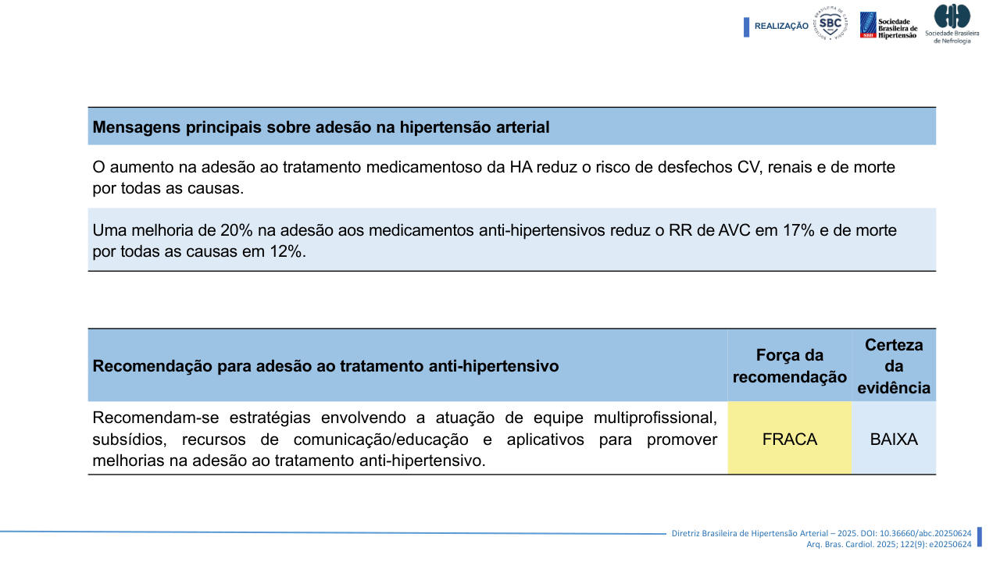

**Mensagens principais sobre adesão na hipertensão arterial**

| Recomendação | Força | Certeza da evidência |
| :---- | :---- | :---- |
| Recomendam-se estratégias envolvendo a atuação de equipe multiprofissional, subsídios, recursos de comunicação/educação e aplicativos para promover melhorias na adesão ao tratamento anti-hipertensivo. | FRACA | BAIXA |

#### Slide 140 — Figura 13.1 – Fatores que influenciam negativamente e positivamente na adesão ao tratamento da hipertensão arterial.

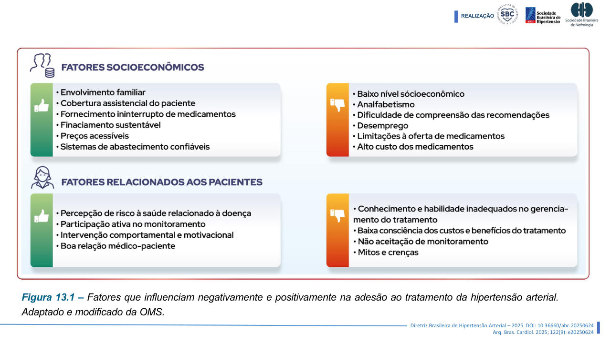

Figura 13.1 – Fatores que influenciam negativamente e positivamente na adesão ao tratamento da hipertensão arterial. Adaptado e modificado da OMS.

#### Slide 141 — Figura 13.1 – Fatores que influenciam negativamente e positivamente na adesão ao tratamento da hipertensão arterial.

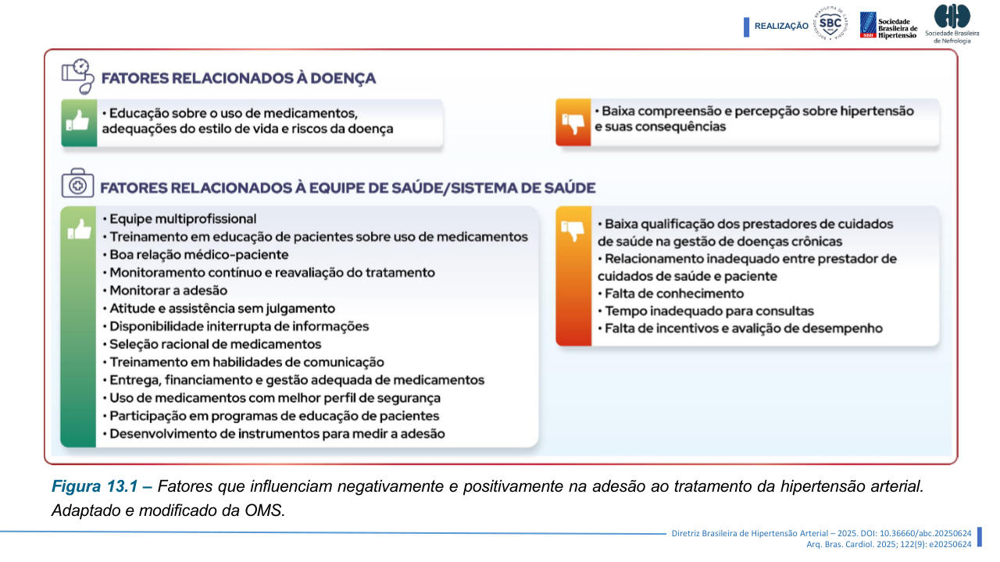

Figura 13.1 – Fatores que influenciam negativamente e positivamente na adesão ao tratamento da hipertensão arterial. Adaptado e modificado da OMS.

### Capítulo 14. Melhores práticas no cuidado às pessoas com hipertensão arterial na APS do SUS

#### Slide 142 — Capítulo 14.  Melhores Práticas no Cuidado às  Pessoas com Hipertensão Arterial na  Atenção Primária à Saúde do Sistema 

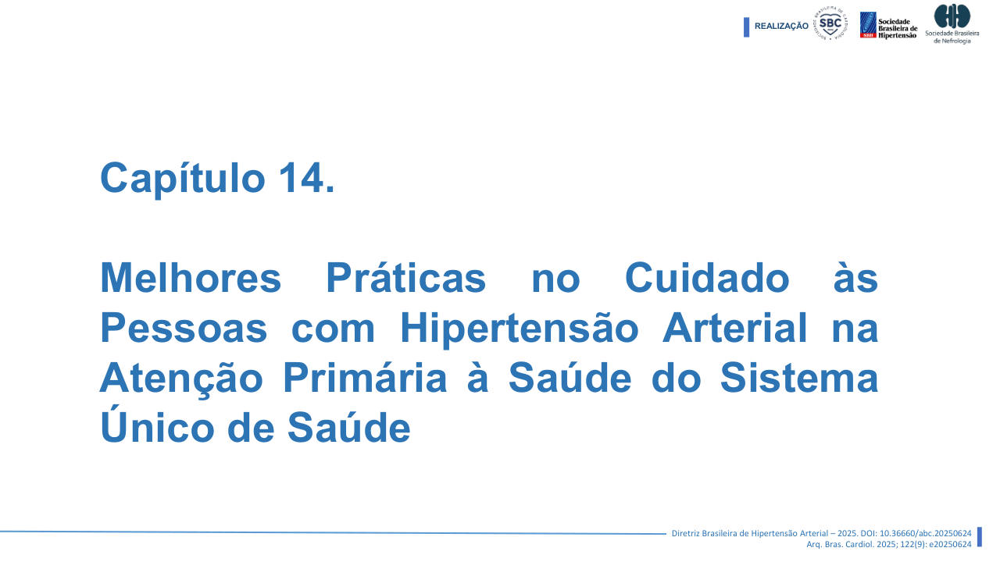

Capítulo 14.

Melhores Práticas no Cuidado às Pessoas com Hipertensão Arterial na Atenção Primária à Saúde do Sistema Único de Saúde

#### Slide 143 — Mensagens principais sobre a atenção primária no SUS e a HA

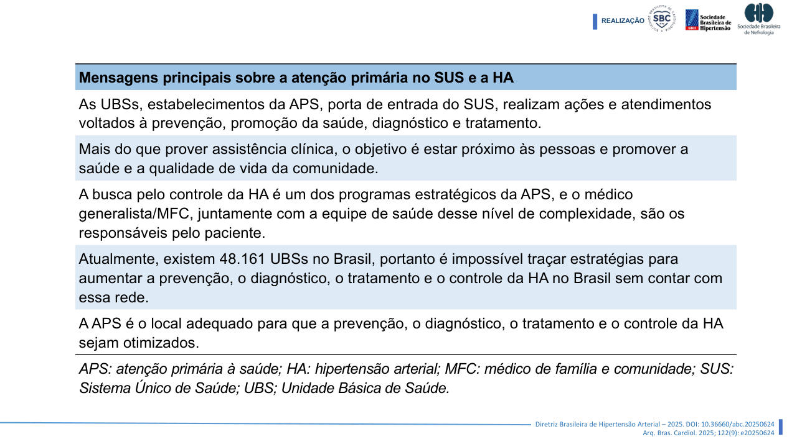

Mensagens principais sobre a atenção primária no SUS e a HA

As UBSs, estabelecimentos da APS, porta de entrada do SUS, realizam ações e atendimentos voltados à prevenção, promoção da saúde, diagnóstico e tratamento.

Mais do que prover assistência clínica, o objetivo é estar próximo às pessoas e promover a saúde e a qualidade de vida da comunidade.

A busca pelo controle da HA é um dos programas estratégicos da APS, e o médico generalista/MFC, juntamente com a equipe de saúde desse nível de complexidade, são os responsáveis pelo paciente.

Atualmente, existem 48.161 UBSs no Brasil, portanto é impossível traçar estratégias para aumentar a prevenção, o diagnóstico, o tratamento e o controle da HA no Brasil sem contar com essa rede.

A APS é o local adequado para que a prevenção, o diagnóstico, o tratamento e o controle da HA sejam otimizados.

APS: atenção primária à saúde; HA: hipertensão arterial; MFC: médico de família e comunidade; SUS: Sistema Único de Saúde; UBS; Unidade Básica de Saúde.

#### Slide 144 — Figura 14.1 – Cuidados indispensáveis para a medida correta da pressão arterial.

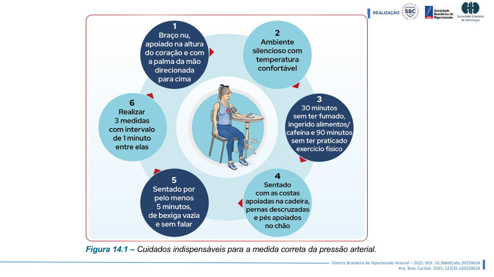

Figura 14.1 – Cuidados indispensáveis para a medida correta da pressão arterial.

#### Slide 145 — Quadro 14.1 – Classificação da pressão arterial de acordo com a medida no consultório a partir de 18

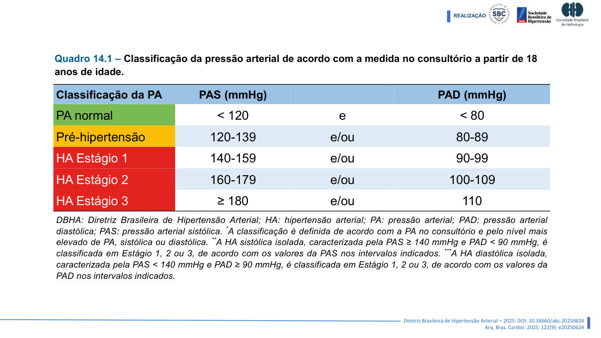

Quadro 14.1 – Classificação da pressão arterial de acordo com a medida no consultório a partir de 18 anos de idade.

Classificação da PA PAS (mmHg) PAD (mmHg)

PA normal < 120 e < 80

Pré-hipertensão 120-139 e/ou 80-89

HA Estágio 1 140-159 e/ou 90-99

HA Estágio 2 160-179 e/ou 100-109

HA Estágio 3 ≥ 180 e/ou 110

DBHA: Diretriz Brasileira de Hipertensão Arterial; HA: hipertensão arterial; PA: pressão arterial; PAD: pressão arterial diastólica; PAS: pressão arterial sistólica. *A classificação é definida de acordo com a PA no consultório e pelo nível mais elevado de PA, sistólica ou diastólica. **A HA sistólica isolada, caracterizada pela PAS ≥140 mmHg e PAD < 90 mmHg, é classificada em Estágio 1, 2 ou 3, de acordo com os valores da PAS nos intervalos indicados. ***A HA diastólica isolada, caracterizada pela PAS < 140 mmHg e PAD ≥90 mmHg, é classificada em Estágio 1, 2 ou 3, de acordo com os valores da PAD nos intervalos indicados.

#### Slide 146 — Recomendações para a medida da pressão arterial

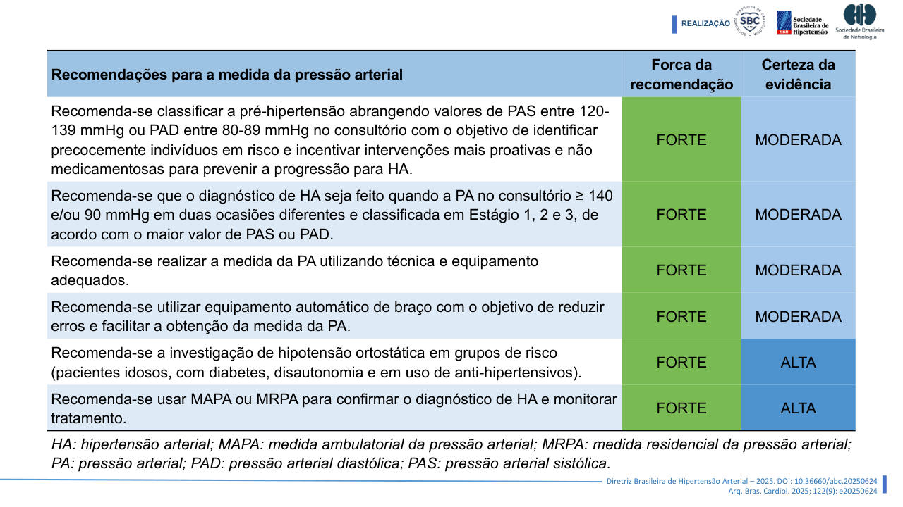

**Recomendações para a medida da pressão arterial**

| Recomendação | Força | Certeza da evidência |
| :---- | :---- | :---- |
| Recomenda-se classificar a pré-hipertensão abrangendo valores de PAS entre 120-139 mmHg ou PAD entre 80-89 mmHg no consultório com o objetivo de identificar precocemente indivíduos em risco e incentivar intervenções mais proativas e não medicamentosas para prevenir a progressão para HA. | FORTE | MODERADA |
| Recomenda-se que o diagnóstico de HA seja feito quando a PA no consultório ≥140 e/ou 90 mmHg em duas ocasiões diferentes e classificada em Estágio 1, 2 e 3, de acordo com o maior valor de PAS ou PAD. | FORTE | MODERADA |
| Recomenda-se realizar a medida da PA utilizando técnica e equipamento adequados. | FORTE | MODERADA |
| Recomenda-se utilizar equipamento automático de braço com o objetivo de reduzir erros e facilitar a obtenção da medida da PA. | FORTE | MODERADA |
| Recomenda-se a investigação de hipotensão ortostática em grupos de risco (pacientes idosos, com diabetes, disautonomia e em uso de anti-hipertensivos). | FORTE | ALTA |
| Recomenda-se usar MAPA ou MRPA para confirmar o diagnóstico de HA e monitorar tratamento. | FORTE | ALTA |

HA: hipertensão arterial; MAPA: medida ambulatorial da pressão arterial; MRPA: medida residencial da pressão arterial; PA: pressão arterial; PAD: pressão arterial diastólica; PAS: pressão arterial sistólica.

#### Slide 147 — Quadro 14.2 – Avaliação clínica inicial da pessoa com hipertensão arterial..

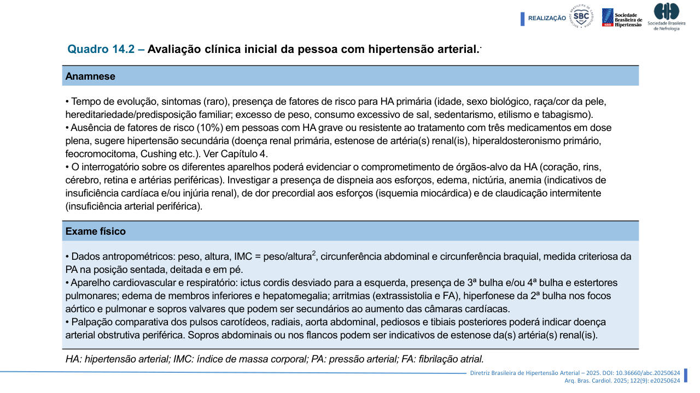

Quadro 14.2 – Avaliação clínica inicial da pessoa com hipertensão arterial..

Anamnese

• Tempo de evolução, sintomas (raro), presença de fatores de risco para HA primária (idade, sexo biológico, raça/cor da pele, hereditariedade/predisposição familiar; excesso de peso, consumo excessivo de sal, sedentarismo, etilismo e tabagismo). • Ausência de fatores de risco (10%) em pessoas com HA grave ou resistente ao tratamento com três medicamentos em dose plena, sugere hipertensão secundária (doença renal primária, estenose de artéria(s) renal(is), hiperaldosteronismo primário, feocromocitoma, Cushing etc.). Ver Capítulo 4. • O interrogatório sobre os diferentes aparelhos poderá evidenciar o comprometimento de órgãos-alvo da HA (coração, rins, cérebro, retina e artérias periféricas). Investigar a presença de dispneia aos esforços, edema, nictúria, anemia (indicativos de insuficiência cardíaca e/ou injúria renal), de dor precordial aos esforços (isquemia miocárdica) e de claudicação intermitente (insuficiência arterial periférica).

Exame físico

• Dados antropométricos: peso, altura, IMC = peso/altura2, circunferência abdominal e circunferência braquial, medida criteriosa da PA na posição sentada, deitada e em pé. • Aparelho cardiovascular e respiratório: ictus cordis desviado para a esquerda, presença de 3ª bulha e/ou 4ª bulha e estertores pulmonares; edema de membros inferiores e hepatomegalia; arritmias (extrassistolia e FA), hiperfonese da 2ª bulha nos focos aórtico e pulmonar e sopros valvares que podem ser secundários ao aumento das câmaras cardíacas. • Palpação comparativa dos pulsos carotídeos, radiais, aorta abdominal, pediosos e tibiais posteriores poderá indicar doença arterial obstrutiva periférica. Sopros abdominais ou nos flancos podem ser indicativos de estenose da(s) artéria(s) renal(is).

HA: hipertensão arterial; IMC: índice de massa corporal; PA: pressão arterial; FA: fibrilação atrial.

#### Slide 148 — Exames complementares

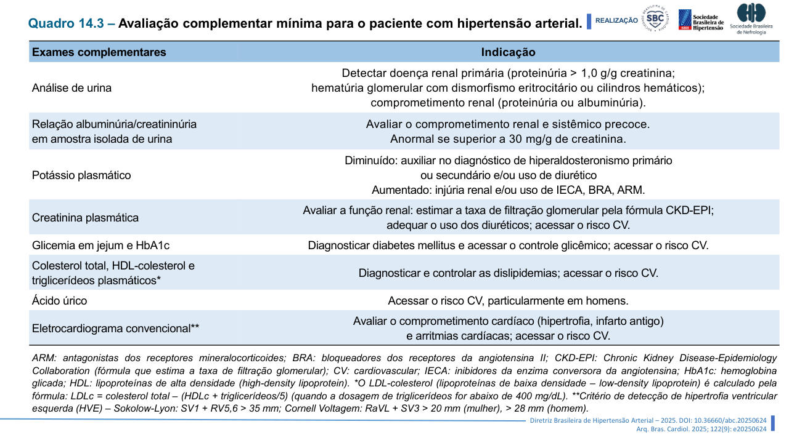

Exames complementares Indicação

Detectar doença renal primária (proteinúria > 1,0 g/g creatinina; hematúria glomerular com dismorfismo eritrocitário ou cilindros hemáticos);

Análise de urina

comprometimento renal (proteinúria ou albuminúria).

Relação albuminúria/creatininúria em amostra isolada de urina

Avaliar o comprometimento renal e sistêmico precoce.

Anormal se superior a 30 mg/g de creatinina.

Diminuído: auxiliar no diagnóstico de hiperaldosteronismo primário

Potássio plasmático

ou secundário e/ou uso de diurético Aumentado: injúria renal e/ou uso de IECA, BRA, ARM.

Creatinina plasmática Avaliar a função renal: estimar a taxa de filtração glomerular pela fórmula CKD-EPI;

adequar o uso dos diuréticos; acessar o risco CV.

Glicemia em jejum e HbA1c Diagnosticar diabetes mellitus e acessar o controle glicêmico; acessar o risco CV.

Colesterol total, HDL-colesterol e triglicerídeos plasmáticos* Diagnosticar e controlar as dislipidemias; acessar o risco CV.

Ácido úrico Acessar o risco CV, particularmente em homens.

Eletrocardiograma convencional** Avaliar o comprometimento cardíaco (hipertrofia, infarto antigo)

e arritmias cardíacas; acessar o risco CV.

ARM: antagonistas dos receptores mineralocorticoides; BRA: bloqueadores dos receptores da angiotensina II; CKD-EPI: Chronic Kidney Disease-Epidemiology Collaboration (fórmula que estima a taxa de filtração glomerular); CV: cardiovascular; IECA: inibidores da enzima conversora da angiotensina; HbA1c: hemoglobina glicada; HDL: lipoproteínas de alta densidade (high-density lipoprotein). *O LDL-colesterol (lipoproteínas de baixa densidade – low-density lipoprotein) é calculado pela fórmula: LDLc = colesterol total – (HDLc + triglicerídeos/5) (quando a dosagem de triglicerídeos for abaixo de 400 mg/dL). **Critério de detecção de hipertrofia ventricular esquerda (HVE) – Sokolow-Lyon: SV1 + RV5,6 > 35 mm; Cornell Voltagem: RaVL + SV3 > 20 mm (mulher), > 28 mm (homem).

#### Slide 149 — Quadro 14.4 – Classificação do risco cardiovascular de acordo com o nível de pressão arterial, presença

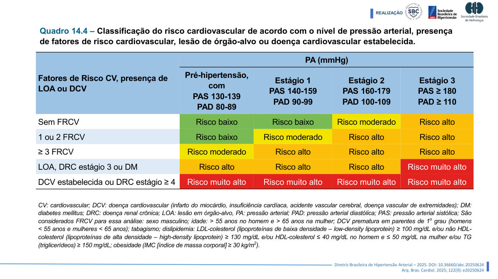

Quadro 14.4 – Classificação do risco cardiovascular de acordo com o nível de pressão arterial, presença de fatores de risco cardiovascular, lesão de órgão-alvo ou doença cardiovascular estabelecida.

PA (mmHg)

Pré-hipertensão,

Fatores de Risco CV, presença de LOA ou DCV

Estágio 1 PAS 140-159

Estágio 2 PAS 160-179 PAD 100-109

Estágio 3 PAS ≥ 180 PAD ≥ 110

com PAS 130-139

PAD 90-99

PAD 80-89

Sem FRCV Risco baixo Risco baixo Risco moderado Risco alto

1 ou 2 FRCV Risco baixo Risco moderado Risco alto Risco alto

≥ 3 FRCV Risco moderado Risco alto Risco alto Risco alto

LOA, DRC estágio 3 ou DM Risco alto Risco alto Risco alto Risco muito alto

DCV estabelecida ou DRC estágio ≥ 4 Risco muito alto Risco muito alto Risco muito alto Risco muito alto

CV: cardiovascular; DCV: doença cardiovascular (infarto do miocárdio, insuficiência cardíaca, acidente vascular cerebral, doença vascular de extremidades); DM: diabetes mellitus; DRC: doença renal crônica; LOA: lesão em órgão-alvo, PA: pressão arterial; PAD: pressão arterial diastólica; PAS: pressão arterial sistólica; São considerados FRCV para essa análise: sexo masculino; idade: > 55 anos no homem e > 65 anos na mulher; DCV prematura em parentes de 1o grau (homens < 55 anos e mulheres < 65 anos); tabagismo; dislipidemia: LDL-colesterol (lipoproteínas de baixa densidade – low-density lipoprotein) ≥100 mg/dL e/ou não HDL- colesterol (lipoproteínas de alta densidade – high-density lipoprotein) ≥ 130 mg/dL e/ou HDL-colesterol ≤40 mg/dL no homem e ≤50 mg/dL na mulher e/ou TG (triglicerídeos) ≥150 mg/dL; obesidade (IMC [índice de massa corporal] ≥30 kg/m2).

#### Slide 150 — Recomendações para avaliação clínica e complementar, e estratificação de risco no indivíduo com pré-hipertensão e com hipertensão arterial

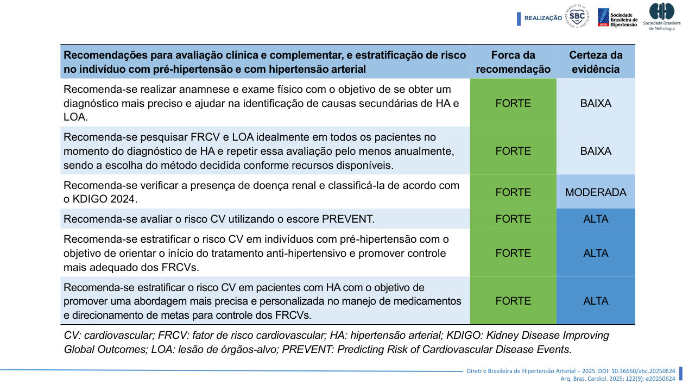

**Recomendações para avaliação clínica e complementar, e estratificação de risco no indivíduo com pré-hipertensão e com hipertensão arterial**

| Recomendação | Força | Certeza da evidência |
| :---- | :---- | :---- |
| Recomenda-se realizar anamnese e exame físico com o objetivo de se obter um diagnóstico mais preciso e ajudar na identificação de causas secundárias de HA e LOA. | FORTE | BAIXA |
| Recomenda-se pesquisar FRCV e LOA idealmente em todos os pacientes no momento do diagnóstico de HA e repetir essa avaliação pelo menos anualmente, sendo a escolha do método decidida conforme recursos disponíveis. | FORTE | BAIXA |
| Recomenda-se verificar a presença de doença renal e classificá-la de acordo com o KDIGO 2024. | FORTE | MODERADA |
| Recomenda-se avaliar o risco CV utilizando o escore PREVENT. | FORTE | ALTA |
| Recomenda-se estratificar o risco CV em indivíduos com pré-hipertensão com o objetivo de orientar o início do tratamento anti-hipertensivo e promover controle mais adequado dos FRCVs. | FORTE | ALTA |
| Recomenda-se estratificar o risco CV em pacientes com HA com o objetivo de promover uma abordagem mais precisa e personalizada no manejo de medicamentos e direcionamento de metas para controle dos FRCVs. | FORTE | ALTA |

CV: cardiovascular; FRCV: fator de risco cardiovascular; HA: hipertensão arterial; KDIGO: Kidney Disease Improving Global Outcomes; LOA: lesão de órgãos-alvo; PREVENT: Predicting Risk of Cardiovascular Disease Events.

#### Slide 151 — Recomendações para as metas da pressão arterial

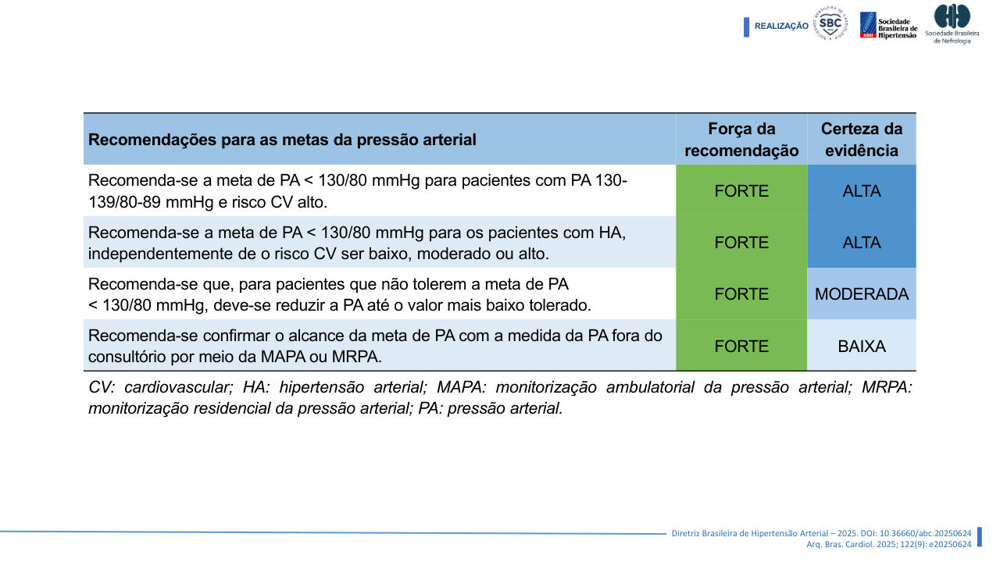

**Recomendações para as metas da pressão arterial**

| Recomendação | Força | Certeza da evidência |
| :---- | :---- | :---- |
| Recomenda-se a meta de PA < 130/80 mmHg para pacientes com PA 130-139/80-89 mmHg e risco CV alto. | FORTE | ALTA |
| Recomenda-se a meta de PA < 130/80 mmHg para os pacientes com HA, independentemente de o risco CV ser baixo, moderado ou alto. | FORTE | ALTA |
| Recomenda-se que, para pacientes que não tolerem a meta de PA < 130/80 mmHg, deve-se reduzir a PA até o valor mais baixo tolerado. | FORTE | MODERADA |
| Recomenda-se confirmar o alcance da meta de PA com a medida da PA fora do consultório por meio da MAPA ou MRPA. | FORTE | BAIXA |

CV: cardiovascular; HA: hipertensão arterial; MAPA: monitorização ambulatorial da pressão arterial; MRPA: monitorização residencial da pressão arterial; PA: pressão arterial.

#### Slide 152 — Quadro 14.5 – Valores normais da pressão arterial e indicações para a MAPA e MRPA..

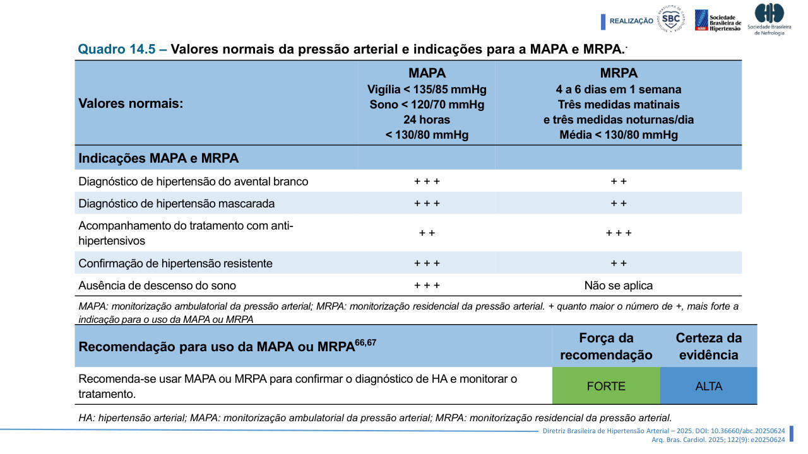

**Quadro 14.5 – Valores normais da pressão arterial e indicações para a MAPA e MRPA..**

| Recomendação | Força | Certeza da evidência |
| :---- | :---- | :---- |
| Recomenda-se usar MAPA ou MRPA para confirmar o diagnóstico de HA e monitorar o tratamento. | FORTE | ALTA |

HA: hipertensão arterial; MAPA: monitorização ambulatorial da pressão arterial; MRPA: monitorização residencial da pressão arterial.

#### Slide 153 — Figura 14.2 – Modelo de atendimento e composição da equipe multiprofissional.

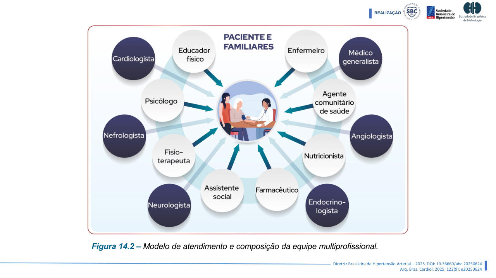

Figura 14.2 – Modelo de atendimento e composição da equipe multiprofissional.

#### Slide 154 — Quadro 14.6 – Efeito das medidas não medicamentosas para o controle da pressão arterial (Capítulo 6). Medida não medicamentosa

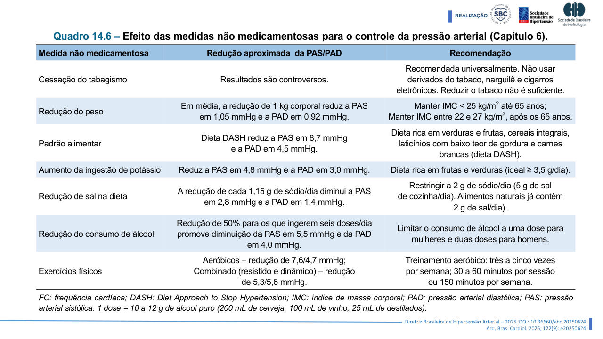

Quadro 14.6 – Efeito das medidas não medicamentosas para o controle da pressão arterial (Capítulo 6).

Medida não medicamentosa Redução aproximada da PAS/PAD Recomendação

Recomendada universalmente. Não usar

Cessação do tabagismo Resultados são controversos.

derivados do tabaco, narguilê e cigarros eletrônicos. Reduzir o tabaco não é suficiente.

Manter IMC < 25 kg/m2 até 65 anos; Manter IMC entre 22 e 27 kg/m2, após os 65 anos.

Redução do peso Em média, a redução de 1 kg corporal reduz a PAS

em 1,05 mmHg e a PAD em 0,92 mmHg.

Dieta rica em verduras e frutas, cereais integrais,

Padrão alimentar Dieta DASH reduz a PAS em 8,7 mmHg

laticínios com baixo teor de gordura e carnes

e a PAD em 4,5 mmHg.

brancas (dieta DASH).

Aumento da ingestão de potássio Reduz a PAS em 4,8 mmHg e a PAD em 3,0 mmHg. Dieta rica em frutas e verduras (ideal ≥3,5 g/dia).

Restringir a 2 g de sódio/dia (5 g de sal de cozinha/dia). Alimentos naturais já contêm

Redução de sal na dieta A redução de cada 1,15 g de sódio/dia diminui a PAS

em 2,8 mmHg e a PAD em 1,4 mmHg.

2 g de sal/dia).

Redução de 50% para os que ingerem seis doses/dia

Limitar o consumo de álcool a uma dose para

Redução do consumo de álcool

promove diminuição da PAS em 5,5 mmHg e da PAD

mulheres e duas doses para homens.

em 4,0 mmHg.

Aeróbicos – redução de 7,6/4,7 mmHg; Combinado (resistido e dinâmico) – redução

Treinamento aeróbico: três a cinco vezes

Exercícios físicos

por semana; 30 a 60 minutos por sessão

de 5,3/5,6 mmHg.

ou 150 minutos por semana.

FC: frequência cardíaca; DASH: Diet Approach to Stop Hypertension; IMC: índice de massa corporal; PAD: pressão arterial diastólica; PAS: pressão arterial sistólica. 1 dose = 10 a 12 g de álcool puro (200 mL de cerveja, 100 mL de vinho, 25 mL de destilados).

#### Slide 155 — Recomendações para as medidas não medicamentosas para redução da PA

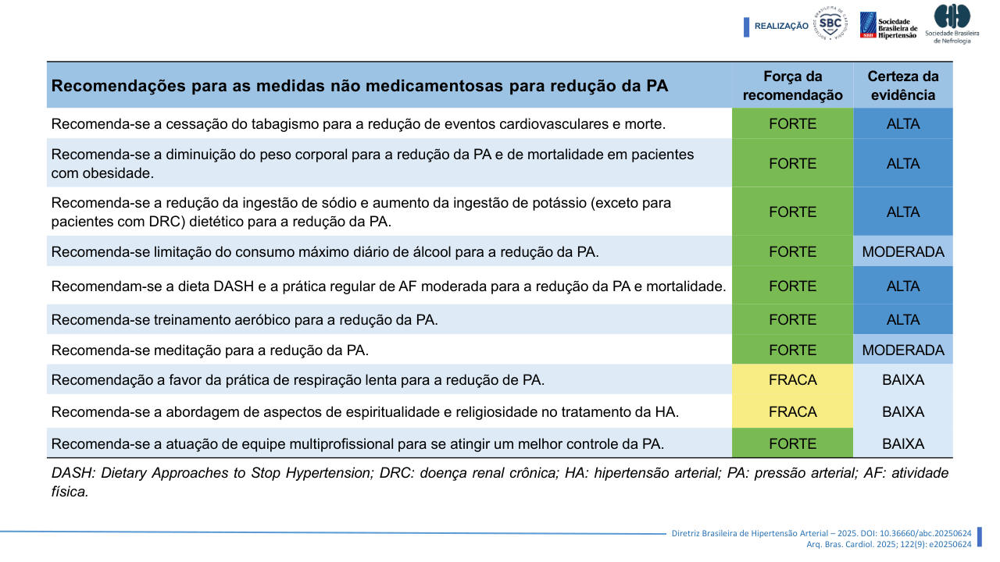

**Recomendações para as medidas não medicamentosas para redução da PA**

| Recomendação | Força | Certeza da evidência |
| :---- | :---- | :---- |
| Recomenda-se a cessação do tabagismo para a redução de eventos cardiovasculares e morte. | FORTE | ALTA |
| Recomenda-se a diminuição do peso corporal para a redução da PA e de mortalidade em pacientes com obesidade. | FORTE | ALTA |
| Recomenda-se a redução da ingestão de sódio e aumento da ingestão de potássio (exceto para pacientes com DRC) dietético para a redução da PA. | FORTE | ALTA |
| Recomenda-se limitação do consumo máximo diário de álcool para a redução da PA. | FORTE | MODERADA |
| Recomendam-se a dieta DASH e a prática regular de AF moderada para a redução da PA e mortalidade. | FORTE | ALTA |
| Recomenda-se treinamento aeróbico para a redução da PA. | FORTE | ALTA |
| Recomenda-se meditação para a redução da PA. | FORTE | MODERADA |
| Recomendação a favor da prática de respiração lenta para a redução de PA. | FRACA | BAIXA |
| Recomenda-se a abordagem de aspectos de espiritualidade e religiosidade no tratamento da HA. | FRACA | BAIXA |
| Recomenda-se a atuação de equipe multiprofissional para se atingir um melhor controle da PA. | FORTE | BAIXA |

DASH: Dietary Approaches to Stop Hypertension; DRC: doença renal crônica; HA: hipertensão arterial; PA: pressão arterial; AF: atividade física.

#### Slide 156 — Quadro 14.7 – Indicações para início do tratamento não medicamentoso e medicamentoso de acordo

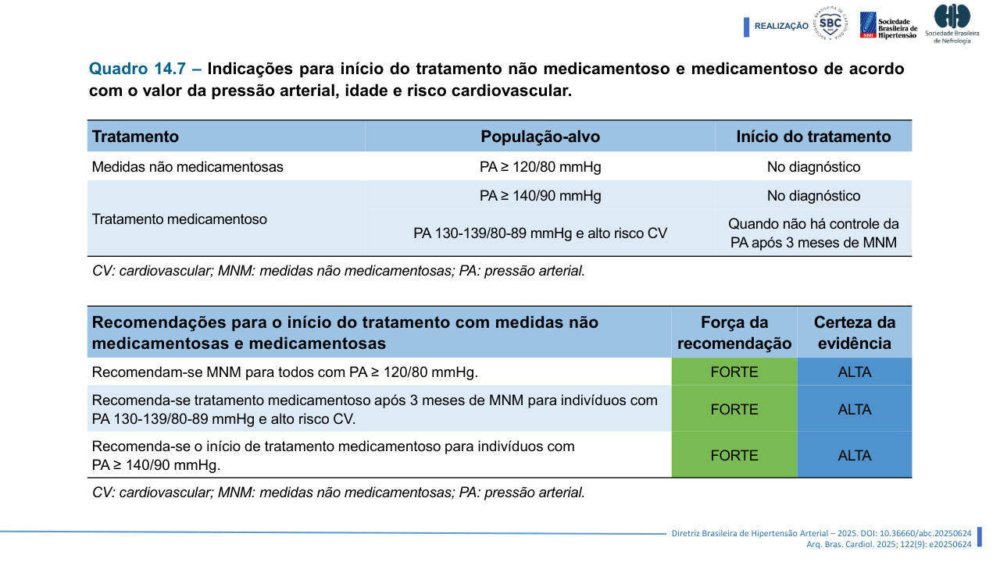

**Quadro 14.7 – Indicações para início do tratamento não medicamentoso e medicamentoso de acordo com o valor da pressão arterial, idade e risco cardiovascular.**

| Recomendação | Força | Certeza da evidência |
| :---- | :---- | :---- |
| Recomendam-se MNM para todos com PA ≥ 120/80 mmHg. | FORTE | ALTA |
| Recomenda-se tratamento medicamentoso após 3 meses de MNM para indivíduos com PA 130-139/80-89 mmHg e alto risco CV. | FORTE | ALTA |
| Recomenda-se o início de tratamento medicamentoso para indivíduos com PA ≥140/90 mmHg. | FORTE | ALTA |

CV: cardiovascular; MNM: medidas não medicamentosas; PA: pressão arterial.

#### Slide 157 — Quadro 14.8 – Classes e medicações disponíveis no Sistema Único de Saúde, no componente básico e no

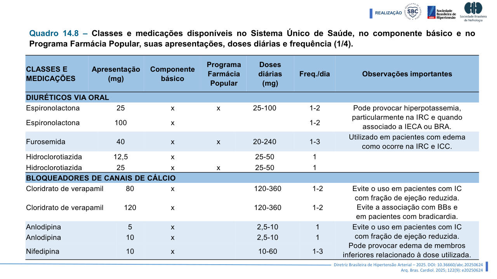

Quadro 14.8 – Classes e medicações disponíveis no Sistema Único de Saúde, no componente básico e no Programa Farmácia Popular, suas apresentações, doses diárias e frequência (1/4).

Programa

Doses diárias

CLASSES E MEDICAÇÕES

Apresentação

Componente

Farmácia

Freq./dia Observações importantes

(mg)

básico

Popular

(mg)

DIURÉTICOS VIA ORAL Espironolactona 25 x x 25-100 1-2 Pode provocar hiperpotassemia, particularmente na IRC e quando

associado a IECA ou BRA. Espironolactona 100 x 1-2

Furosemida 40 x x 20-240 1-3 Utilizado em pacientes com edema

como ocorre na IRC e ICC. Hidroclorotiazida 12,5 x 25-50 1 Hidroclorotiazida 25 x x 25-50 1 BLOQUEADORES DE CANAIS DE CÁLCIO Cloridrato de verapamil 80 x 120-360 1-2 Evite o uso em pacientes com IC

com fração de ejeção reduzida.

Evite a associação com BBs e em pacientes com bradicardia. Cloridrato de verapamil 120 x 120-360 1-2

Anlodipina 5 x 2,5-10 1 Evite o uso em pacientes com IC

com fração de ejeção reduzida. Pode provocar edema de membros inferiores relacionado à dose utilizada.

Anlodipina 10 x 2,5-10 1

Nifedipina 10 x 10-60 1-3

#### Slide 158 — Quadro 14.8 – Classes e medicações disponíveis no Sistema Único de Saúde, no componente básico e no

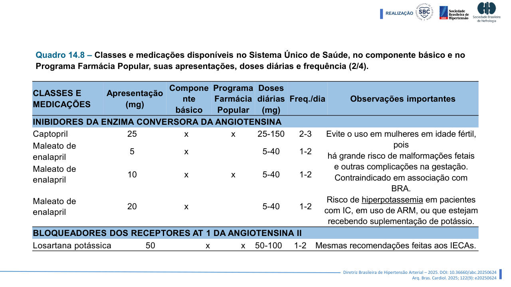

Quadro 14.8 – Classes e medicações disponíveis no Sistema Único de Saúde, no componente básico e no Programa Farmácia Popular, suas apresentações, doses diárias e frequência (2/4).

Compone

Programa

Doses diárias

CLASSES E MEDICAÇÕES

Apresentação

nte básico

Farmácia

Freq./dia Observações importantes

(mg)

Popular

(mg)

INIBIDORES DA ENZIMA CONVERSORA DA ANGIOTENSINA Captopril 25 x x 25-150 2-3 Evite o uso em mulheres em idade fértil,

pois há grande risco de malformações fetais

Maleato de enalapril 5 x 5-40 1-2

e outras complicações na gestação.

Maleato de enalapril 10 x x 5-40 1-2

Contraindicado em associação com

BRA. Risco de hiperpotassemia em pacientes com IC, em uso de ARM, ou que estejam

Maleato de enalapril 20 x 5-40 1-2

recebendo suplementação de potássio.

BLOQUEADORES DOS RECEPTORES AT 1 DA ANGIOTENSINA II Losartana potássica 50 x x 50-100 1-2 Mesmas recomendações feitas aos IECAs.

#### Slide 159 — Quadro 14.8 – Classes e medicações disponíveis no Sistema Único de Saúde, no componente básico e

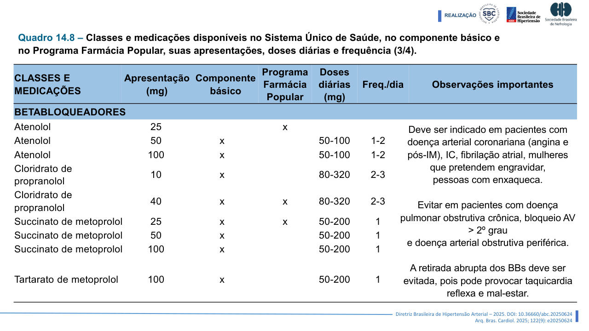

Quadro 14.8 – Classes e medicações disponíveis no Sistema Único de Saúde, no componente básico e no Programa Farmácia Popular, suas apresentações, doses diárias e frequência (3/4).

Programa

Doses diárias

CLASSES E MEDICAÇÕES

Apresentação

Componente

Farmácia

Freq./dia Observações importantes

(mg)

básico

Popular

(mg)

BETABLOQUEADORES

Atenolol 25 x Deve ser indicado em pacientes com doença arterial coronariana (angina e pós-IM), IC, fibrilação atrial, mulheres

Atenolol 50 x 50-100 1-2 Atenolol 100 x 50-100 1-2 Cloridrato de propranolol 10 x 80-320 2-3

que pretendem engravidar,

pessoas com enxaqueca.

Cloridrato de propranolol 40 x x 80-320 2-3

Evitar em pacientes com doença pulmonar obstrutiva crônica, bloqueio AV

Succinato de metoprolol 25 x x 50-200 1 Succinato de metoprolol 50 x 50-200 1 Succinato de metoprolol 100 x 50-200 1

> 2º grau e doença arterial obstrutiva periférica.

A retirada abrupta dos BBs deve ser evitada, pois pode provocar taquicardia

Tartarato de metoprolol 100 x 50-200 1

reflexa e mal-estar.

#### Slide 160 — Quadro 14.8 – Classes e medicações disponíveis no Sistema Único de Saúde, no componente

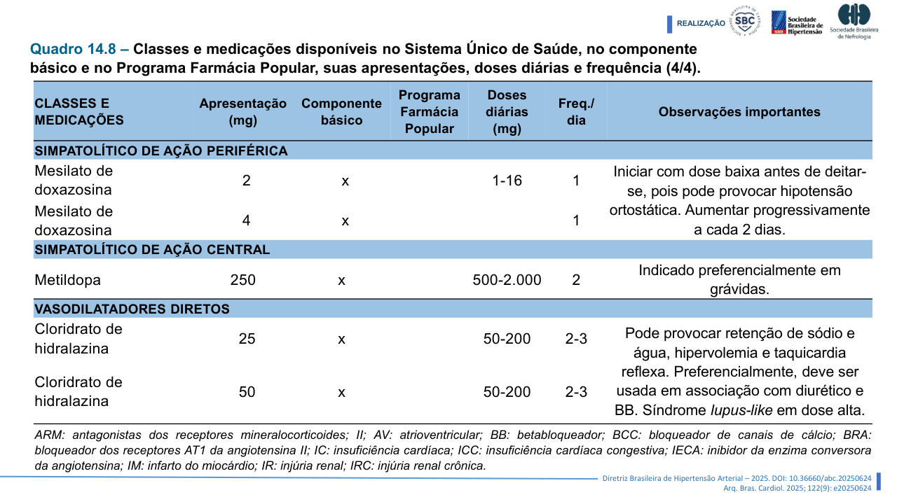

Quadro 14.8 – Classes e medicações disponíveis no Sistema Único de Saúde, no componente básico e no Programa Farmácia Popular, suas apresentações, doses diárias e frequência (4/4).

Programa

Doses diárias

CLASSES E MEDICAÇÕES

Apresentação

Componente

Freq./

Farmácia

dia Observações importantes

(mg)

básico

Popular

(mg)

SIMPATOLÍTICO DE AÇÃO PERIFÉRICA Mesilato de doxazosina 2 x 1-16 1 Iniciar com dose baixa antes de deitar-

se, pois pode provocar hipotensão ortostática. Aumentar progressivamente

a cada 2 dias. Mesilato de doxazosina 4 x 1

SIMPATOLÍTICO DE AÇÃO CENTRAL

Metildopa 250 x 500-2.000 2 Indicado preferencialmente em

grávidas. VASODILATADORES DIRETOS Cloridrato de hidralazina 25 x 50-200 2-3 Pode provocar retenção de sódio e

água, hipervolemia e taquicardia reflexa. Preferencialmente, deve ser usada em associação com diurético e BB. Síndrome lupus-like em dose alta.

Cloridrato de hidralazina 50 x 50-200 2-3

ARM: antagonistas dos receptores mineralocorticoides; II; AV: atrioventricular; BB: betabloqueador; BCC: bloqueador de canais de cálcio; BRA: bloqueador dos receptores AT1 da angiotensina II; IC: insuficiência cardíaca; ICC: insuficiência cardíaca congestiva; IECA: inibidor da enzima conversora da angiotensina; IM: infarto do miocárdio; IR: injúria renal; IRC: injúria renal crônica.

#### Slide 161 — Figura 14.3 – Fluxograma do tratamento medicamentoso da hipertensão arterial.

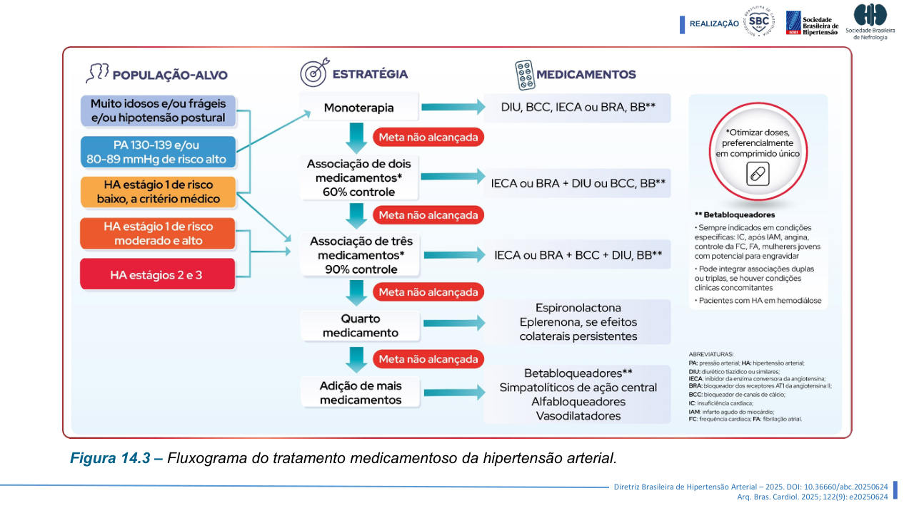

**Conteúdo visual — Figura 14.3.** Mesma lógica da Figura 7.4, aplicada ao contexto do SUS: monoterapia para muito idosos/frágeis/hipotensão postural e HA estágio 1 de baixo risco (a critério médico); associação dupla de início para PA 130–139 e/ou 80–89 de alto risco, HA estágio 1 de risco moderado/alto e estágios 2 e 3; depois tríplice, espironolactona/eplerenona e demais classes. Preferir comprimido único e otimizar doses.

Figura 14.3 – Fluxograma do tratamento medicamentoso da hipertensão arterial.

#### Slide 162 — Recomendação para o tratamento medicamentoso da hipertensão arterial no Sistema

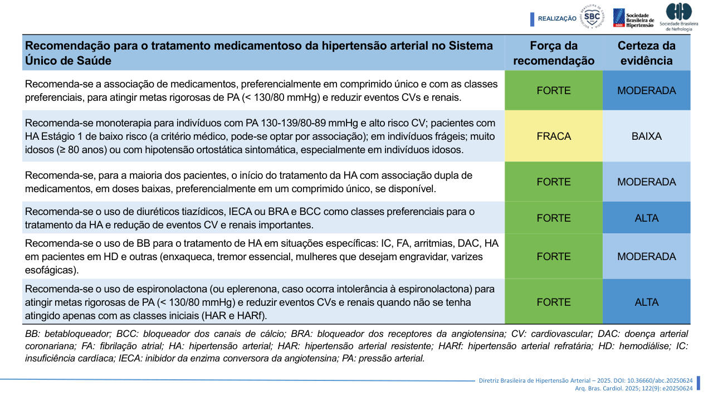

**Recomendação para o tratamento medicamentoso da hipertensão arterial no Sistema Único de Saúde**

| Recomendação | Força | Certeza da evidência |
| :---- | :---- | :---- |
| Recomenda-se a associação de medicamentos, preferencialmente em comprimido único e com as classes preferenciais, para atingir metas rigorosas de PA (< 130/80 mmHg) e reduzir eventos CVs e renais. | FORTE | MODERADA |
| Recomenda-se monoterapia para indivíduos com PA 130-139/80-89 mmHg e alto risco CV; pacientes com HA Estágio 1 de baixo risco (a critério médico, pode-se optar por associação); em indivíduos frágeis; muito idosos (≥80 anos) ou com hipotensão ortostática sintomática, especialmente em indivíduos idosos. | FRACA | BAIXA |
| Recomenda-se, para a maioria dos pacientes, o início do tratamento da HA com associação dupla de medicamentos, em doses baixas, preferencialmente em um comprimido único, se disponível. | FORTE | MODERADA |
| Recomenda-se o uso de diuréticos tiazídicos, IECA ou BRA e BCC como classes preferenciais para o tratamento da HA e redução de eventos CV e renais importantes. | FORTE | ALTA |
| Recomenda-se o uso de BB para o tratamento de HA em situações específicas: IC, FA, arritmias, DAC, HA em pacientes em HD e outras (enxaqueca, tremor essencial, mulheres que desejam engravidar, varizes esofágicas). | FORTE | MODERADA |
| Recomenda-se o uso de espironolactona (ou eplerenona, caso ocorra intolerância à espironolactona) para atingir metas rigorosas de PA (< 130/80 mmHg) e reduzir eventos CVs e renais quando não se tenha atingido apenas com as classes iniciais (HAR e HARf). | FORTE | ALTA |

BB: betabloqueador; BCC: bloqueador dos canais de cálcio; BRA: bloqueador dos receptores da angiotensina; CV: cardiovascular; DAC: doença arterial coronariana; FA: fibrilação atrial; HA: hipertensão arterial; HAR: hipertensão arterial resistente; HARf: hipertensão arterial refratária; HD: hemodiálise; IC: insuficiência cardíaca; IECA: inibidor da enzima conversora da angiotensina; PA: pressão arterial.

#### Slide 163 — Mensagens principais diagnóstico, avaliação clínica e complementar, meta de pressão arterial e tratamento da hipertensão arterial

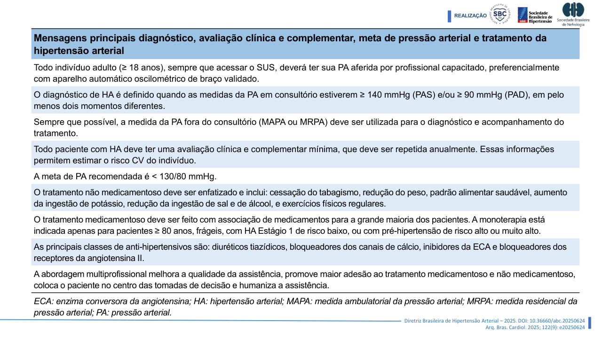

Mensagens principais diagnóstico, avaliação clínica e complementar, meta de pressão arterial e tratamento da hipertensão arterial

Todo indivíduo adulto (≥18 anos), sempre que acessar o SUS, deverá ter sua PA aferida por profissional capacitado, preferencialmente com aparelho automático oscilométrico de braço validado.

O diagnóstico de HA é definido quando as medidas da PA em consultório estiverem ≥140 mmHg (PAS) e/ou ≥90 mmHg (PAD), em pelo menos dois momentos diferentes.

Sempre que possível, a medida da PA fora do consultório (MAPA ou MRPA) deve ser utilizada para o diagnóstico e acompanhamento do tratamento.

Todo paciente com HA deve ter uma avaliação clínica e complementar mínima, que deve ser repetida anualmente. Essas informações permitem estimar o risco CV do indivíduo.

A meta de PA recomendada é < 130/80 mmHg.

O tratamento não medicamentoso deve ser enfatizado e inclui: cessação do tabagismo, redução do peso, padrão alimentar saudável, aumento da ingestão de potássio, redução da ingestão de sal e de álcool, e exercícios físicos regulares.

O tratamento medicamentoso deve ser feito com associação de medicamentos para a grande maioria dos pacientes. A monoterapia está indicada apenas para pacientes ≥80 anos, frágeis, com HA Estágio 1 de risco baixo, ou com pré-hipertensão de risco alto ou muito alto.

As principais classes de anti-hipertensivos são: diuréticos tiazídicos, bloqueadores dos canais de cálcio, inibidores da ECA e bloqueadores dos receptores da angiotensina II.

A abordagem multiprofissional melhora a qualidade da assistência, promove maior adesão ao tratamento medicamentoso e não medicamentoso, coloca o paciente no centro das tomadas de decisão e humaniza a assistência.

ECA: enzima conversora da angiotensina; HA: hipertensão arterial; MAPA: medida ambulatorial da pressão arterial; MRPA: medida residencial da pressão arterial; PA: pressão arterial.

#### Slide 164 — Quadro 14.9 – Condições clínicas que justificam o encaminhamento à especialista(s) – referência.

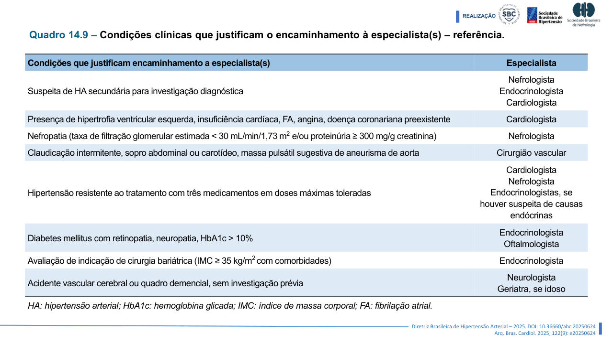

Quadro 14.9 – Condições clínicas que justificam o encaminhamento à especialista(s) – referência.

Condições que justificam encaminhamento a especialista(s) Especialista

Nefrologista Endocrinologista

Suspeita de HA secundária para investigação diagnóstica

Cardiologista

Presença de hipertrofia ventricular esquerda, insuficiência cardíaca, FA, angina, doença coronariana preexistente Cardiologista

Nefropatia (taxa de filtração glomerular estimada < 30 mL/min/1,73 m2 e/ou proteinúria ≥300 mg/g creatinina) Nefrologista

Claudicação intermitente, sopro abdominal ou carotídeo, massa pulsátil sugestiva de aneurisma de aorta Cirurgião vascular

Cardiologista

Nefrologista Endocrinologistas, se houver suspeita de causas

Hipertensão resistente ao tratamento com três medicamentos em doses máximas toleradas

endócrinas

Diabetes mellitus com retinopatia, neuropatia, HbA1c > 10% Endocrinologista

Oftalmologista

Avaliação de indicação de cirurgia bariátrica (IMC ≥35 kg/m2 com comorbidades) Endocrinologista

Acidente vascular cerebral ou quadro demencial, sem investigação prévia Neurologista Geriatra, se idoso

HA: hipertensão arterial; HbA1c: hemoglobina glicada; IMC: índice de massa corporal; FA: fibrilação atrial.

#### Slide 165 — Quadro 14.10 – Elementos essenciais da contrarreferência.

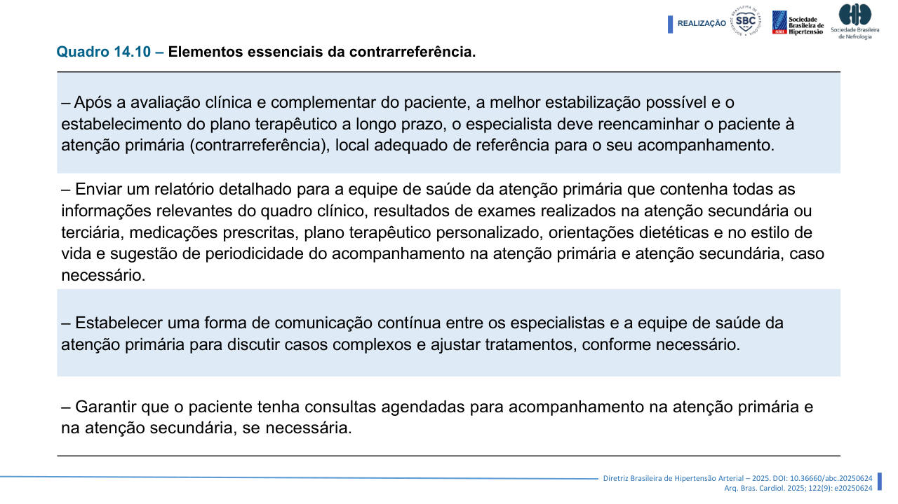

Quadro 14.10 – Elementos essenciais da contrarreferência.

– Após a avaliação clínica e complementar do paciente, a melhor estabilização possível e o estabelecimento do plano terapêutico a longo prazo, o especialista deve reencaminhar o paciente à atenção primária (contrarreferência), local adequado de referência para o seu acompanhamento.

– Enviar um relatório detalhado para a equipe de saúde da atenção primária que contenha todas as informações relevantes do quadro clínico, resultados de exames realizados na atenção secundária ou terciária, medicações prescritas, plano terapêutico personalizado, orientações dietéticas e no estilo de vida e sugestão de periodicidade do acompanhamento na atenção primária e atenção secundária, caso necessário.

– Estabelecer uma forma de comunicação contínua entre os especialistas e a equipe de saúde da atenção primária para discutir casos complexos e ajustar tratamentos, conforme necessário.

– Garantir que o paciente tenha consultas agendadas para acompanhamento na atenção primária e na atenção secundária, se necessária.

#### Slide 166 — Quadro 14.11 – Principais indicações para o uso da telemedicina na atenção primária à saúde do SUS.

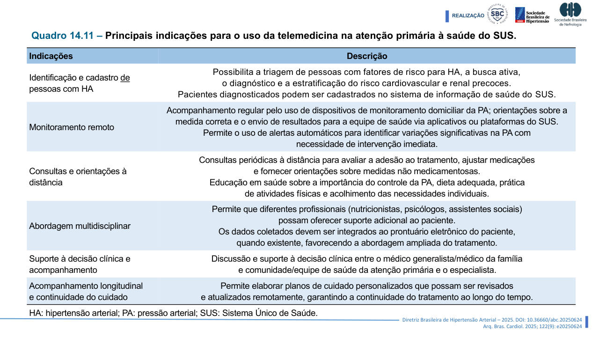

Quadro 14.11 – Principais indicações para o uso da telemedicina na atenção primária à saúde do SUS.

Indicações Descrição

Possibilita a triagem de pessoas com fatores de risco para HA, a busca ativa,

Identificação e cadastro de pessoas com HA

o diagnóstico e a estratificação do risco cardiovascular e renal precoces. Pacientes diagnosticados podem ser cadastrados no sistema de informação de saúde do SUS.

Acompanhamento regular pelo uso de dispositivos de monitoramento domiciliar da PA; orientações sobre a

medida correta e o envio de resultados para a equipe de saúde via aplicativos ou plataformas do SUS.

Monitoramento remoto

Permite o uso de alertas automáticos para identificar variações significativas na PA com

necessidade de intervenção imediata.

Consultas periódicas à distância para avaliar a adesão ao tratamento, ajustar medicações

Consultas e orientações à distância

e fornecer orientações sobre medidas não medicamentosas. Educação em saúde sobre a importância do controle da PA, dieta adequada, prática

de atividades físicas e acolhimento das necessidades individuais.

Permite que diferentes profissionais (nutricionistas, psicólogos, assistentes sociais)

possam oferecer suporte adicional ao paciente. Os dados coletados devem ser integrados ao prontuário eletrônico do paciente,

Abordagem multidisciplinar

quando existente, favorecendo a abordagem ampliada do tratamento.

Suporte à decisão clínica e acompanhamento

Discussão e suporte à decisão clínica entre o médico generalista/médico da família

e comunidade/equipe de saúde da atenção primária e o especialista.

Acompanhamento longitudinal e continuidade do cuidado

Permite elaborar planos de cuidado personalizados que possam ser revisados e atualizados remotamente, garantindo a continuidade do tratamento ao longo do tempo.

HA: hipertensão arterial; PA: pressão arterial; SUS: Sistema Único de Saúde.

#### Slide 167 — Mensagens principais sobre referência e contrarreferência de pacientes com hipertensão arterial e uso da telemedicina

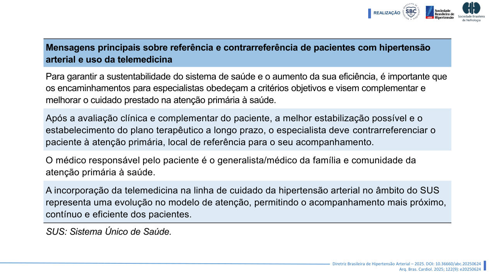

Mensagens principais sobre referência e contrarreferência de pacientes com hipertensão arterial e uso da telemedicina

Para garantir a sustentabilidade do sistema de saúde e o aumento da sua eficiência, é importante que os encaminhamentos para especialistas obedeçam a critérios objetivos e visem complementar e melhorar o cuidado prestado na atenção primária à saúde.

Após a avaliação clínica e complementar do paciente, a melhor estabilização possível e o estabelecimento do plano terapêutico a longo prazo, o especialista deve contrarreferenciar o paciente à atenção primária, local de referência para o seu acompanhamento.

O médico responsável pelo paciente é o generalista/médico da família e comunidade da atenção primária à saúde.

A incorporação da telemedicina na linha de cuidado da hipertensão arterial no âmbito do SUS representa uma evolução no modelo de atenção, permitindo o acompanhamento mais próximo, contínuo e eficiente dos pacientes.

SUS: Sistema Único de Saúde.

### Capítulo 15. Perspectivas

#### Slide 168 — Capítulo 15. Perspectivas

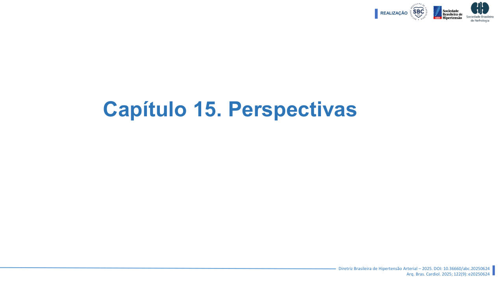

Capítulo 15. Perspectivas

#### Slide 169 — Figura 15.1 – Relação entre componentes do expossoma e hipertensão arterial.

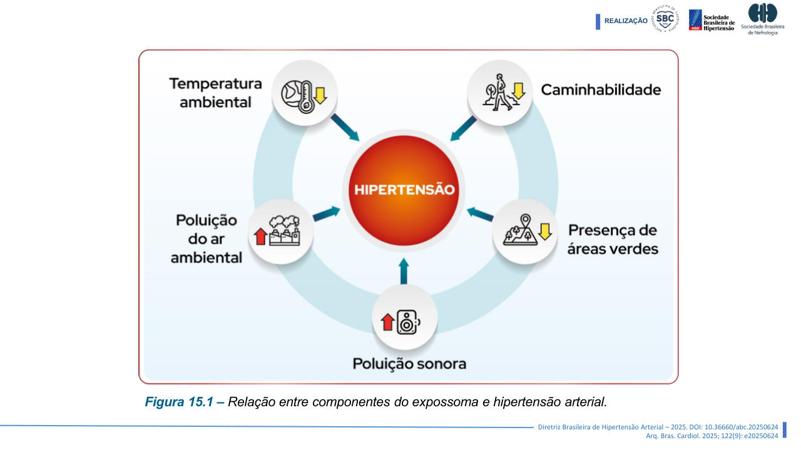

Figura 15.1 – Relação entre componentes do expossoma e hipertensão arterial.

#### Slide 170 — Quadro 15.1 – Principais estudos clínicos randomizados em indivíduos com hipertensão arterial tratados com

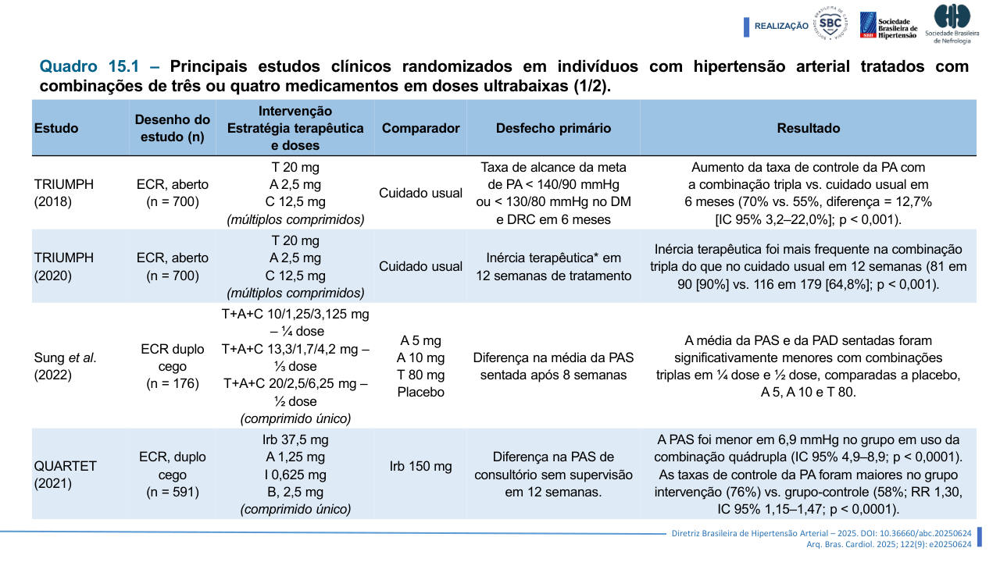

Quadro 15.1 – Principais estudos clínicos randomizados em indivíduos com hipertensão arterial tratados com combinações de três ou quatro medicamentos em doses ultrabaixas (1/2).

Intervenção Estratégia terapêutica

Estudo Desenho do

Comparador Desfecho primário Resultado

estudo (n)

e doses

T 20 mg A 2,5 mg C 12,5 mg (múltiplos comprimidos)

Taxa de alcance da meta

Aumento da taxa de controle da PA com a combinação tripla vs. cuidado usual em 6 meses (70% vs. 55%, diferença = 12,7% [IC 95% 3,2–22,0%]; p < 0,001).

TRIUMPH (2018)

ECR, aberto

de PA < 140/90 mmHg ou < 130/80 mmHg no DM

Cuidado usual

(n = 700)

e DRC em 6 meses

T 20 mg A 2,5 mg C 12,5 mg (múltiplos comprimidos)

Inércia terapêutica foi mais frequente na combinação tripla do que no cuidado usual em 12 semanas (81 em

TRIUMPH (2020)

ECR, aberto

Cuidado usual Inércia terapêutica* em 12 semanas de tratamento

(n = 700)

90 [90%] vs. 116 em 179 [64,8%]; p < 0,001).

T+A+C 10/1,25/3,125 mg

– ¼ dose T+A+C 13,3/1,7/4,2 mg –

A 5 mg A 10 mg T 80 mg Placebo

A média da PAS e da PAD sentadas foram significativamente menores com combinações triplas em ¼ dose e ½ dose, comparadas a placebo,

ECR duplo

Sung et al. (2022)

Diferença na média da PAS

cego (n = 176)

⅓ dose T+A+C 20/2,5/6,25 mg –

sentada após 8 semanas

A 5, A 10 e T 80.

½ dose (comprimido único)

Irb 37,5 mg

A PAS foi menor em 6,9 mmHg no grupo em uso da combinação quádrupla (IC 95% 4,9–8,9; p < 0,0001).

ECR, duplo

A 1,25 mg I 0,625 mg

Irb 150 mg Diferença na PAS de consultório sem supervisão

QUARTET (2021)

cego (n = 591)

As taxas de controle da PA foram maiores no grupo intervenção (76%) vs. grupo-controle (58%; RR 1,30,

B, 2,5 mg (comprimido único)

em 12 semanas.

IC 95% 1,15–1,47; p < 0,0001).

#### Slide 171 — Quadro 15.1 – Principais estudos clínicos randomizados em indivíduos com hipertensão arterial tratados com

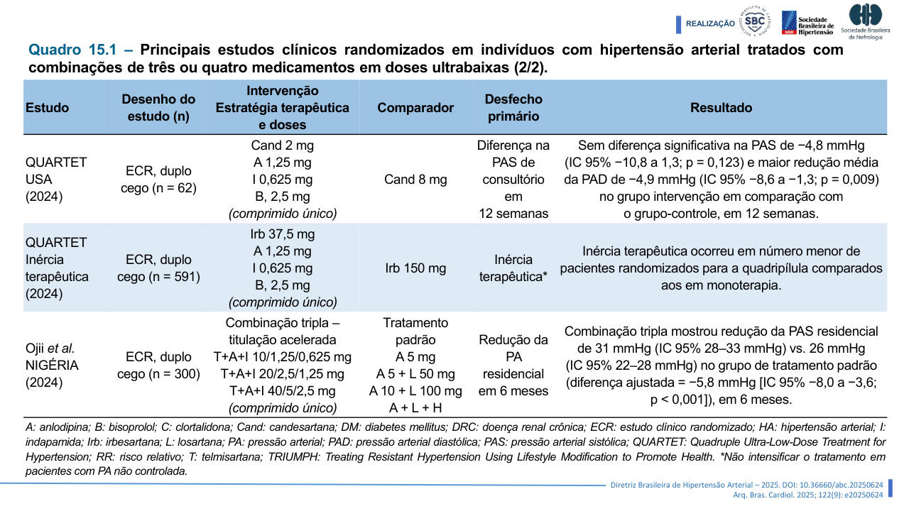

Quadro 15.1 – Principais estudos clínicos randomizados em indivíduos com hipertensão arterial tratados com combinações de três ou quatro medicamentos em doses ultrabaixas (2/2).

Intervenção Estratégia terapêutica

Estudo Desenho do

Comparador Desfecho

primário Resultado

estudo (n)

e doses

Cand 2 mg

Diferença na

Sem diferença significativa na PAS de −4,8 mmHg (IC 95% −10,8 a 1,3; p = 0,123) e maior redução média da PAD de −4,9 mmHg (IC 95% −8,6 a −1,3; p = 0,009)

QUARTET USA (2024)

A 1,25 mg I 0,625 mg

PAS de consultório

ECR, duplo cego (n = 62)

Cand 8 mg

B, 2,5 mg (comprimido único)

em 12 semanas

no grupo intervenção em comparação com

o grupo-controle, em 12 semanas.

Irb 37,5 mg

QUARTET Inércia terapêutica (2024)

A 1,25 mg I 0,625 mg

Inércia terapêutica ocorreu em número menor de pacientes randomizados para a quadripílula comparados

ECR, duplo cego (n = 591)

Irb 150 mg Inércia terapêutica*

B, 2,5 mg (comprimido único)

aos em monoterapia.

Combinação tripla –

Tratamento

Combinação tripla mostrou redução da PAS residencial

titulação acelerada T+A+I 10/1,25/0,625 mg

padrão A 5 mg A 5 + L 50 mg A 10 + L 100 mg

Redução da

Ojii et al. NIGÉRIA (2024)

de 31 mmHg (IC 95% 28–33 mmHg) vs. 26 mmHg (IC 95% 22–28 mmHg) no grupo de tratamento padrão (diferença ajustada = −5,8 mmHg [IC 95% −8,0 a −3,6;

ECR, duplo cego (n = 300)

PA residencial em 6 meses

T+A+I 20/2,5/1,25 mg

T+A+I 40/5/2,5 mg (comprimido único)

p < 0,001]), em 6 meses.

A + L + H

A: anlodipina; B: bisoprolol; C: clortalidona; Cand: candesartana; DM: diabetes mellitus; DRC: doença renal crônica; ECR: estudo clínico randomizado; HA: hipertensão arterial; I: indapamida; Irb: irbesartana; L: losartana; PA: pressão arterial; PAD: pressão arterial diastólica; PAS: pressão arterial sistólica; QUARTET: Quadruple Ultra-Low-Dose Treatment for Hypertension; RR: risco relativo; T: telmisartana; TRIUMPH: Treating Resistant Hypertension Using Lifestyle Modification to Promote Health. *Não intensificar o tratamento em pacientes com PA não controlada.

#### Slide 172 — Quadro 15.2 – Novas estratégias medicamentosas em hipertensão arterial (1/3).

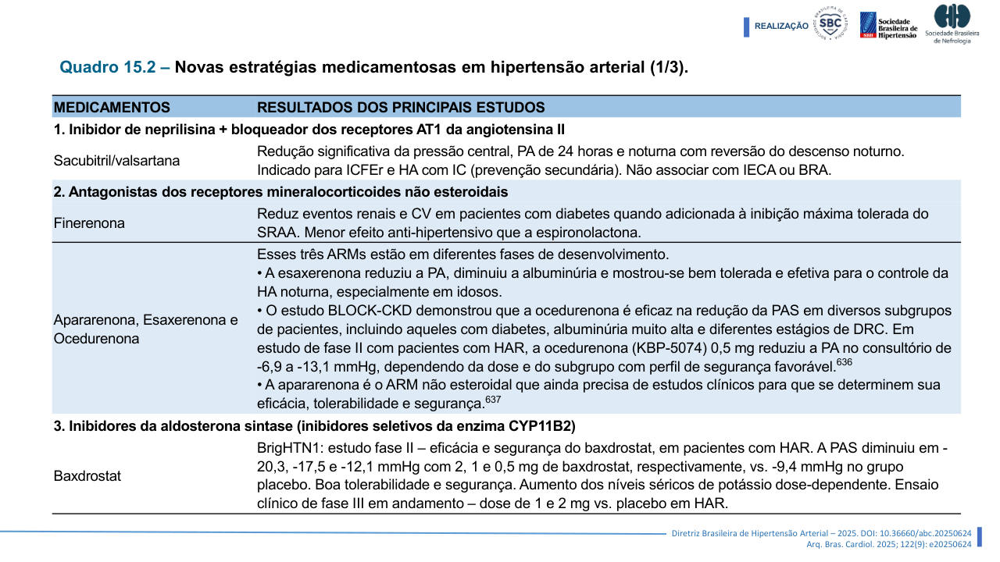

Quadro 15.2 – Novas estratégias medicamentosas em hipertensão arterial (1/3).

MEDICAMENTOS RESULTADOS DOS PRINCIPAIS ESTUDOS 1. Inibidor de neprilisina + bloqueador dos receptores AT1 da angiotensina II

Sacubitril/valsartana Redução significativa da pressão central, PA de 24 horas e noturna com reversão do descenso noturno. Indicado para ICFEr e HA com IC (prevenção secundária). Não associar com IECA ou BRA. 2. Antagonistas dos receptores mineralocorticoides não esteroidais

Finerenona Reduz eventos renais e CV em pacientes com diabetes quando adicionada à inibição máxima tolerada do SRAA. Menor efeito anti-hipertensivo que a espironolactona.

Esses três ARMs estão em diferentes fases de desenvolvimento. • A esaxerenona reduziu a PA, diminuiu a albuminúria e mostrou-se bem tolerada e efetiva para o controle da HA noturna, especialmente em idosos. • O estudo BLOCK-CKD demonstrou que a ocedurenona é eficaz na redução da PAS em diversos subgrupos de pacientes, incluindo aqueles com diabetes, albuminúria muito alta e diferentes estágios de DRC. Em estudo de fase II com pacientes com HAR, a ocedurenona (KBP-5074) 0,5 mg reduziu a PA no consultório de -6,9 a -13,1 mmHg, dependendo da dose e do subgrupo com perfil de segurança favorável.636

Apararenona, Esaxerenona e Ocedurenona

• A apararenona é o ARM não esteroidal que ainda precisa de estudos clínicos para que se determinem sua eficácia, tolerabilidade e segurança.637

3. Inibidores da aldosterona sintase (inibidores seletivos da enzima CYP11B2)

BrigHTN1: estudo fase II – eficácia e segurança do baxdrostat, em pacientes com HAR. A PAS diminuiu em - 20,3, -17,5 e -12,1 mmHg com 2, 1 e 0,5 mg de baxdrostat, respectivamente, vs. -9,4 mmHg no grupo placebo. Boa tolerabilidade e segurança. Aumento dos níveis séricos de potássio dose-dependente. Ensaio clínico de fase III em andamento – dose de 1 e 2 mg vs. placebo em HAR.

Baxdrostat

#### Slide 173 — Quadro 15.2 – Novas estratégias medicamentosas em hipertensão arterial (2/3).

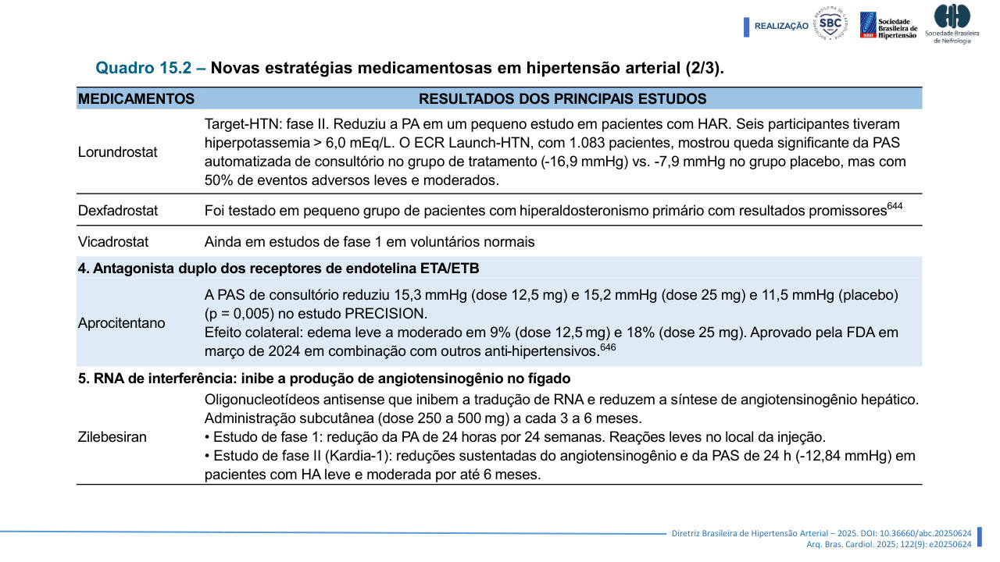

Quadro 15.2 – Novas estratégias medicamentosas em hipertensão arterial (2/3).

MEDICAMENTOS RESULTADOS DOS PRINCIPAIS ESTUDOS

Target-HTN: fase II. Reduziu a PA em um pequeno estudo em pacientes com HAR. Seis participantes tiveram hiperpotassemia > 6,0 mEq/L. O ECR Launch-HTN, com 1.083 pacientes, mostrou queda significante da PAS automatizada de consultório no grupo de tratamento (-16,9 mmHg) vs. -7,9 mmHg no grupo placebo, mas com 50% de eventos adversos leves e moderados.

Lorundrostat

Dexfadrostat Foi testado em pequeno grupo de pacientes com hiperaldosteronismo primário com resultados promissores644

Vicadrostat Ainda em estudos de fase 1 em voluntários normais

4. Antagonista duplo dos receptores de endotelina ETA/ETB

A PAS de consultório reduziu 15,3 mmHg (dose 12,5 mg) e 15,2 mmHg (dose 25 mg) e 11,5 mmHg (placebo) (p = 0,005) no estudo PRECISION. Efeito colateral: edema leve a moderado em 9% (dose 12,5 mg) e 18% (dose 25 mg). Aprovado pela FDA em março de 2024 em combinação com outros anti-hipertensivos.646

Aprocitentano

5. RNA de interferência: inibe a produção de angiotensinogênio no fígado

Oligonucleotídeos antisense que inibem a tradução de RNA e reduzem a síntese de angiotensinogênio hepático. Administração subcutânea (dose 250 a 500 mg) a cada 3 a 6 meses. • Estudo de fase 1: redução da PA de 24 horas por 24 semanas. Reações leves no local da injeção. • Estudo de fase II (Kardia-1): reduções sustentadas do angiotensinogênio e da PAS de 24 h (-12,84 mmHg) em pacientes com HA leve e moderada por até 6 meses.

Zilebesiran

#### Slide 174 — Quadro 15.2 – Novas estratégias medicamentosas em hipertensão arterial (3/3).

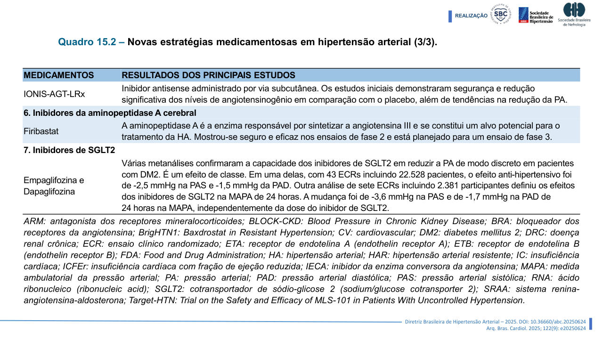

Quadro 15.2 – Novas estratégias medicamentosas em hipertensão arterial (3/3).

MEDICAMENTOS RESULTADOS DOS PRINCIPAIS ESTUDOS

IONIS-AGT-LRx Inibidor antisense administrado por via subcutânea. Os estudos iniciais demonstraram segurança e redução significativa dos níveis de angiotensinogênio em comparação com o placebo, além de tendências na redução da PA. 6. Inibidores da aminopeptidase A cerebral

Firibastat A aminopeptidase A é a enzima responsável por sintetizar a angiotensina III e se constitui um alvo potencial para o tratamento da HA. Mostrou-se seguro e eficaz nos ensaios de fase 2 e está planejado para um ensaio de fase 3. 7. Inibidores de SGLT2

Várias metanálises confirmaram a capacidade dos inibidores de SGLT2 em reduzir a PA de modo discreto em pacientes com DM2. É um efeito de classe. Em uma delas, com 43 ECRs incluindo 22.528 pacientes, o efeito anti-hipertensivo foi de -2,5 mmHg na PAS e -1,5 mmHg da PAD. Outra análise de sete ECRs incluindo 2.381 participantes definiu os efeitos dos inibidores de SGLT2 na MAPA de 24 horas. A mudança foi de -3,6 mmHg na PAS e de -1,7 mmHg na PAD de 24 horas na MAPA, independentemente da dose do inibidor de SGLT2. ARM: antagonista dos receptores mineralocorticoides; BLOCK-CKD: Blood Pressure in Chronic Kidney Disease; BRA: bloqueador dos receptores da angiotensina; BrigHTN1: Baxdrostat in Resistant Hypertension; CV: cardiovascular; DM2: diabetes mellitus 2; DRC: doença renal crônica; ECR: ensaio clínico randomizado; ETA: receptor de endotelina A (endothelin receptor A); ETB: receptor de endotelina B (endothelin receptor B); FDA: Food and Drug Administration; HA: hipertensão arterial; HAR: hipertensão arterial resistente; IC: insuficiência cardíaca; ICFEr: insuficiência cardíaca com fração de ejeção reduzida; IECA: inibidor da enzima conversora da angiotensina; MAPA: medida ambulatorial da pressão arterial; PA: pressão arterial; PAD: pressão arterial diastólica; PAS: pressão arterial sistólica; RNA: ácido ribonucleico (ribonucleic acid); SGLT2: cotransportador de sódio-glicose 2 (sodium/glucose cotransporter 2); SRAA: sistema renina- angiotensina-aldosterona; Target-HTN: Trial on the Safety and Efficacy of MLS-101 in Patients With Uncontrolled Hypertension.

Empaglifozina e Dapaglifozina

## Legislação e referências

Fonte citada pelo edital para este tópico, transcrita acima (kit de slides, 174 slides):

- BRANDÃO, A. A.; RODRIGUES, C. I. S.; BORTOLOTTO, L. A. et al. **Diretriz Brasileira de Hipertensão Arterial – 2025**. *Arq. Bras. Cardiol.*, v. 122, n. 9, e20250624, 2025. DOI: [10.36660/abc.20250624](https://doi.org/10.36660/abc.20250624). Realização: SBC, SBH e SBN. Artigo: <https://www.scielo.br/j/abc/a/BXT7Vk4B9VKQnJFsJhgJ4Hn/?lang=pt>. PDF: <https://abccardiol.org/wp-content/uploads/articles_xml/0066-782X-abc-122-09-e20250624/0066-782X-abc-122-09-e20250624.pdf>.

Trechos já transcritos neste arquivo (não são a fonte do edital para HA, mas entram no mesmo tópico cardiovascular):

- GOODMAN & GILMAN. *As bases farmacológicas da terapêutica*, 12ª ed., 2012, cap. 29 (digoxina e adenosina).

## Questões relacionadas

- **Treino ativo:** [Testes V/F deste tópico](testes/6.02%20Farmacoterapia%20cardiovascular%20%28fun%C3%A7%C3%B5es%20renal%20e%20cardiovascular%29.md) — 20 itens sobre digoxina e adenosina, com gabarito recolhido.

## Recursos

Imagens, esquemas e anexos deste eixo ficam na pasta `recursos/`, ao lado deste arquivo. Para referenciar:

```markdown

```

Os **174 slides** do kit da Diretriz Brasileira de Hipertensão Arterial – 2025 estão em `recursos/sbc-ha-2025/slides/slide-001.jpg` … `slide-174.jpg` e são citados um a um na transcrição acima.

## Controle de revisão

- [ ] 1ª leitura
- [ ] Resumo escrito
- [x] Testes V/F gerados (20 itens — só digoxina e adenosina; o resto do tópico está por transcrever)
- [x] Diretriz Brasileira de Hipertensão Arterial (SBC, 2025) inserida (kit de 174 slides, 07/09/2026)
- [ ] Questões resolvidas
- [ ] Revisão final
